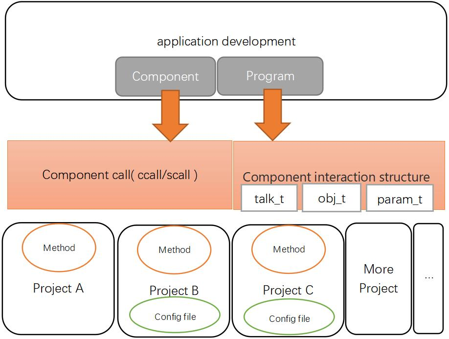

## 调用组件接口

在项目中的程序(组件/可执行程序/共享库)中可基于已有的组件来开发, 通过调用其它组件的接口来完成想要的功能




## 系统中常用的组件及其接口介绍

比如LTE的网络功能对应的组件是ifname@lte组件, 设备基本信息是land@machine, GPS是gnss@nmea, 以及这些组件提供的接口
这部分见[readme](../../readme.md)最后部分的 **组件API** 有列出, 点击对应的链接即可查看到对应的组件接口文档


## 操作项目配置时需要用到的交互结构
 - [项目及组件开发-参数结构param_t](./param_t.md)
 - [项目及组件开发-组件交互结构talk_t](./talk_t.md)
 - [项目及组件开发-寻址结构obj_t/attr_t](./obj_t.md)


## 组件调用API说明

系统中项目的组件提供了各种功能, 比如可以查询设备的各种状态, 比如启用禁用某项功能等, 这种功能通常是组件的 **一次性执行函数** 来实现, 而通过组件调用API可调用到这些组件实现的**一次性执行函数**(也称之为组件接口), 实现与一些项目组件实时交互

此文档描述的函数接口都位于[land/com.h](./include/land/com.h)中, 通过包含[land/skin.h](./include/land/skin.h)即可
```c
#include "land/skin.h"
```


## API头文件中的介绍

[land/com.h](./include/land/com.h)


## 组件调用API示例

- 编写可执行程序获取LTE状态, 并打印LTE获取到的IP地址
```c
    talk_t ret;
    const char *ip;

    /* 获取LTE当前IP地址, 即调用ifname@lte组件的status接口 */
    ret = scall( "ifname@lte", "status", NULL );
    if ( ret == TALK_ECOM )
    {
        printf( "cannot found component ifname@lte\n" );        
    }
    else if ( ret == TALK_EPERM )
    {
        printf( "No permission to access the component ifname@lte\n" );        
    }
    else if ( ret == TALK_EFUNC )
    {
        printf( "cannot found status function in component ifname@lte\n" );        
    }
    else if ( ret == TALK_EJSON )
    {
        printf( "component ifname@lte reeturn wrong format data\n" );        
    }
    else if ( ret > TALK_ECODEMAX )
    {
        /* 在返回的JSON中查询属性为ip的值 */
        ip = json_string( ret, "ip" );
        /* 如果获取到非NULL值可引出来 */
        if ( ip != NULL )
        {
            /* 打引当前LTE的IP地址 */
            printf( "LTE ip address is %s\n", ip );
        }
        /* 释放调用接口返回的值的空间 */
        talk_free( ret );
    }

```
- 编写可执行程序禁用后再启用LTE网络
```c
    talk_t ret;

    /* 禁用LTE网络, 即调用ifname@lte组件的shut接口 */
    ret = scall( "ifname@lte", "shut", NULL );
    /* 注意ifname@lte的shut函数的返回值为tfalse或ttrue, 用于表示成功或是失败, 因此不用释放也不可当作JSON结构操作 */
    if ( ret == ttrue )
    {
        printf( "disable the LTE succeed\n" );
    }
    else
    {
        printf( "disable the LTE failed\n" );
    }
    sleep( 5 );
    /* 启用LTE网络, 即调用ifname@lte组件的setup接口 */
    ret = scall( "ifname@lte", "setup", NULL );
    /* 注意ifname@lte的setup函数的返回值为tfalse或ttrue, 用于表示成功或是失败, 因此不用释放也不可当作JSON结构操作 */
    if ( ret == ttrue )
    {
        printf( "eanble the LTE succeed\n" );
    }
    else
    {
        printf( "enable the LTE failed\n" );
    }
```

- 编写可执行程序查询LTE2是否存在
```c
    boole ret;

    /* 查看ifname@lte2组件是否存在 */
    ret = com_sexist( "ifname@lte2", NULL );
    if ( ret == true )
    {
        printf( "component ifname@lte2 exist\n" );
    }
    /* 查看ifname@lte2组件的status接口是否存在 */
    ret = com_sexist( "ifname@lte2", "status" );
    if ( ret == true )
    {
        printf( "ifname@lte2.status interface exist\n" );
    }
```

- 参考com_calls/com_scall/com_scalls的实现熟悉ccall的用法, 也理解这些函数的调用
```c
void *scall( const char *obj, const char *method, param_t param )
{
    obj_t o;
    void *ret;

    if ( obj == NULL )
    {
        errno = EINVAL;
        return TALK_EINVAL;
    }
    o = obj_create( obj );
    ret = ccall( o, method, param );
    obj_free( o );
    return ret;
}
void *ccallt( obj_t obj, const char *method, talk_t json  )
{
    void *ret;

    if ( json > TALK_ECODEMAX )
    {
		param_t ptmp;
    	ptmp = param_import( NULL, json );
		ret = ccall( obj, method, ptmp );
		ptmp->talk[0] = NULL;
		param_free( ptmp );
    }
    else
    {
		ret = ccall( obj, method, NULL );
    }
    return ret;
}
void *ccall2t( obj_t obj, const char *method, talk_t json, talk_t json2  )
{
	void *ret;

	if ( json > TALK_ECODEMAX )
	{
		param_t ptmp;
		if ( json2 > TALK_ECODEMAX )
		{
			ptmp = param_import2( NULL, json, json2 );
		}
		else
		{
			ptmp = param_import( NULL, json );
		}
		ret = ccall( obj, method, ptmp );
		ptmp->talk[0] = NULL;
		ptmp->talk[1] = NULL;
		param_free( ptmp );
	}
	else
	{
		ret = ccall( obj, method, NULL );
	}
	return ret;
}
void *scallt( const char *obj, const char *method, talk_t json  )
{
	void *ret;

	if ( json > TALK_ECODEMAX )
	{
		param_t ptmp;
    	ptmp = param_import( NULL, json );
		ret = scall( obj, method, ptmp );
		ptmp->talk[0] = NULL;
		param_free( ptmp );
	}
	else
	{
		ret = scall( obj, method, NULL );
	}
	return ret;
}
void *scall2t( const char *obj, const char *method, talk_t json, talk_t json2  )
{
	void *ret;

	if ( json > TALK_ECODEMAX )
	{
		param_t ptmp;
		if ( json2 > TALK_ECODEMAX )
		{
			ptmp = param_import2( NULL, json, json2 );
		}
		else
		{
			ptmp = param_import( NULL, json );
		}
		ret = scall( obj, method, ptmp );
		ptmp->talk[0] = NULL;
		ptmp->talk[1] = NULL;
		param_free( ptmp );
	}
	else
	{
		ret = scall( obj, method, NULL );
	}
	return ret;
}
void *ccalls( obj_t obj, const char *method, const char *paramormat, ... )
{
    void *ret;
    param_t ptmp;
    va_list arglist;
    char options[COM_PARAMLINE_MAX];

    ptmp = NULL;
    if ( paramormat != NULL )
    {
        va_start( arglist, paramormat );
        vsnprintf( options, sizeof(options), paramormat, arglist );
        va_end( arglist );
        ptmp = param_create( options );
    }
    ret = ccall( obj, method, ptmp );
    param_free( ptmp );
    return ret;
}
void *scalls( const char *obj, const char *method,  const char *paramormat, ...  )
{
    void *ret;
    param_t ptmp;
    va_list arglist;
    char options[COM_PARAMLINE_MAX];

    ptmp = NULL;
    if ( paramormat != NULL )
    {
        va_start( arglist, paramormat );
        vsnprintf( options, sizeof(options), paramormat, arglist );
        va_end( arglist );
        ptmp = param_create( options );
    }
    ret = scall( obj, method, ptmp );
    param_free( ptmp );
    return ret;
}
const char *ccall_string( char *buffer, int buflen, obj_t com, const char *method, param_t param )
{
    talk_t v;
    char *str;
    static char string[COM_PARAMLINE_MAX];

    v = ccall( com, method, param );
	if ( v < TALK_ECODEMAX )
	{
		return NULL;
	}
    str = talk2string( v );
    if ( str == NULL )
    {
        json_free( v );
		errno = ENOMSG;
        return NULL;
    }
    json_free( v );
    if ( buffer == NULL || buflen <=0 )
    {
        buffer = string;
        buflen = sizeof(string);
    }
    strncpy( buffer, str, buflen-1 );
    buffer[buflen-1] ='\0';
    efree( str );
    return buffer;
}
const char *scall_string( char *buffer, int buflen, const char *com, const char *method, param_t param )
{
	talk_t v;
	char *str;
	static char string[COM_PARAMLINE_MAX];

	v = scall( com, method, param );
	if ( v < TALK_ECODEMAX )
	{
		return NULL;
	}
	str = talk2string( v );
	if ( str == NULL )
	{
		json_free( v );
		errno = ENOMSG;
        return NULL;
	}
	json_free( v );
	if ( buffer == NULL || buflen <=0 )
	{
		buffer = string;
		buflen = sizeof(string);
	}
	strncpy( buffer, str, buflen-1 );
	buffer[buflen-1] ='\0';
	efree( str );
	return buffer;
}
const char *ccallt_string( char *buffer, int buflen, obj_t com, const char *method, talk_t json )
{
    talk_t v;
    char *str;
    static char string[COM_PARAMLINE_MAX];

    v = ccallt( com, method, json );
	if ( v < TALK_ECODEMAX )
	{
		return NULL;
	}
    str = talk2string( v );
    if ( str == NULL )
    {
        json_free( v );
		errno = ENOMSG;
        return NULL;
    }
    json_free( v );
    if ( buffer == NULL || buflen <=0 )
    {
        buffer = string;
        buflen = sizeof(string);
    }
    strncpy( buffer, str, buflen-1 );
    buffer[buflen-1] ='\0';
    efree( str );
    return buffer;
}
const char *scallt_string( char *buffer, int buflen, const char *com, const char *method, talk_t json )
{
	talk_t v;
	char *str;
	static char string[COM_PARAMLINE_MAX];

	v = scallt( com, method, json );
	if ( v < TALK_ECODEMAX )
	{
		return NULL;
	}
	str = talk2string( v );
	if ( str == NULL )
	{
		json_free( v );
		errno = ENOMSG;
        return NULL;
	}
	json_free( v );
	if ( buffer == NULL || buflen <=0 )
	{
		buffer = string;
		buflen = sizeof(string);
	}
	strncpy( buffer, str, buflen-1 );
	buffer[buflen-1] ='\0';
	efree( str );
	return buffer;
}
const char	 *ccalls_string( char *buffer, int buflen, obj_t com, const char *method, const char *paramormat, ... )
{
	talk_t v;
	char *str;
	param_t ptmp;
	va_list arglist;
	static char options[COM_PARAMLINE_MAX];

	ptmp = NULL;
	if ( paramormat != NULL )
	{
		va_start( arglist, paramormat );
		vsnprintf( options, sizeof(options), paramormat, arglist );
		va_end( arglist );
		ptmp = param_create( options );
	}
	v = ccall( com, method, ptmp );
	if ( v < TALK_ECODEMAX )
	{
		param_free( ptmp );
        return NULL;
	}
	param_free( ptmp );
	str = talk2string( v );
	if ( str == NULL )
	{
		json_free( v );
		errno = ENOMSG;
		return NULL;
	}
	json_free( v );
	if ( buffer == NULL || buflen <=0 )
	{
		buffer = options;
		buflen = sizeof(options);
	}
	strncpy( buffer, str, buflen-1 );
	buffer[buflen-1] ='\0';
	efree( str );
	return buffer;
}
const char	 *scalls_string( char *buffer, int buflen, const char *com, const char *method, const char *paramormat, ... )
{
	talk_t v;
	char *str;
    param_t ptmp;
    va_list arglist;
	static char options[COM_PARAMLINE_MAX];

    ptmp = NULL;
    if ( paramormat != NULL )
    {
        va_start( arglist, paramormat );
        vsnprintf( options, sizeof(options), paramormat, arglist );
        va_end( arglist );
        ptmp = param_create( options );
    }
	v = scall( com, method, ptmp );
	if ( v < TALK_ECODEMAX )
	{
		param_free( ptmp );
		return NULL;
	}
	param_free( ptmp );
	str = talk2string( v );
	if ( str == NULL )
	{
		json_free( v );
		errno = ENOMSG;
		return NULL;
	}
	json_free( v );
	if ( buffer == NULL || buflen <=0 )
	{
		buffer = options;
		buflen = sizeof(options);
	}
	strncpy( buffer, str, buflen-1 );
	buffer[buflen-1] ='\0';
	efree( str );
	return buffer;
}

```


## 通过查询对应的组件接口并编写代码调用对应的组件接口示例

- 示例编写获取当前LTE模块的IMEI号

1. 首先找到LTE模块功能对应的组件, 点击 在[readme](../../readme.md)最后部分的 **组件API** 中的 [LTE Modem](../com/modem/lte.md) 中打开对应LTE模块组件的文档, 在Method下看到:
    **modem@lte为第一个LTE模块**
    **modem@lte2为第二个LTE模块**

2. 在 [LTE Modem](../com/modem/lte.md)  的文档中 **status** 接口返回的JSON的imei属性为LTE模块的IMEI号


3. 基于以上2点, 需要获取第一个LTE模块的IMEI号需要调用modem@lte的status接口来实现, 代码实现:
```c
    talk_t lte_status;
    const char *imei;

    /* 通过scall调用modem@lte组件的status接口 */
    lte_status = scall( "modem@lte", "status", NULL );
    if ( ret == TALK_ECOM )
    {
        printf( "cannot found component modem@lte\n" );        
    }
    else if ( ret == TALK_EPERM )
    {
        printf( "No permission to access the component modem@lte\n" );        
    }
    else if ( ret == TALK_EFUNC )
    {
        printf( "cannot found status function in component modem@lte\n" );        
    }
    else if ( ret == TALK_EJSON )
    {
        printf( "component modem@lte reeturn wrong format data\n" );        
    }
    else if ( ret > TALK_ECODEMAX )
    {
        /* 在返回的JSON中查询imei属性的值 */
        imei = json_string( ret, "imei" );
        /* 如果获取到非NULL值可引出来 */
        if ( imei != NULL )
        {
            /* 打印获取到的IMEI */
            printf( "first LTE modem IMEI is %s\n", imei );
        }
        /* 释放调用接口返回的值的空间 */
        talk_free( ret );
    }


```

