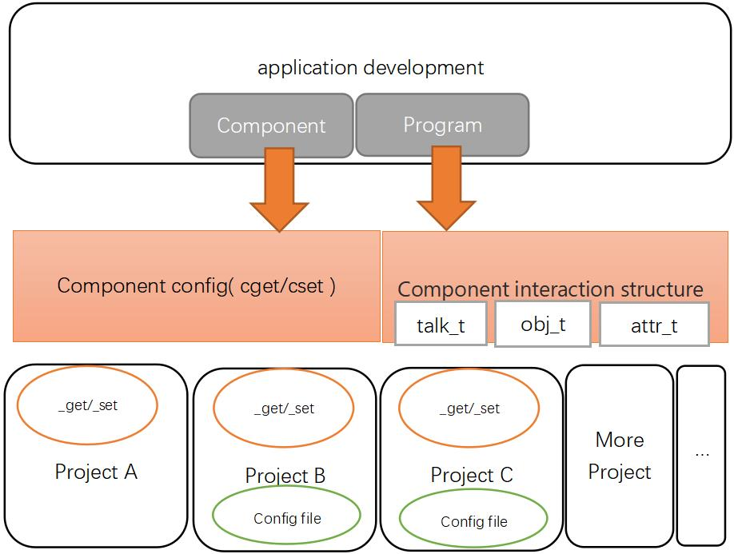

## 管理组件配置

在项目中的程序(组件/可执行程序/共享库)中可基于已有的组件来开发, 通过修改组件配置对组件直接进行管理
***通常组件配置设计用于向用户或管理程序提供管理组件的接口, 普通开发者一般不需要去修改别的组件的配置***




## 系统中常用的组件及其接口介绍

比如LTE的网络功能对应的组件是ifname@lte组件, 设备基本信息是land@machine, GPS是gnss@nmea, 以及这些组件的配置介绍
这部分见[readme](../../readme.md)最后部分的 **组件API** 有列出, 点击对应的链接即可查看到对应的组件接口文档


## 操作项目配置时需要用到的交互结构
 - [项目及组件开发-组件交互结构talk_t](./talk_t.md)
 - [项目及组件开发-寻址结构obj_t/attr_t](./obj_t.md)


## 管理组件配置API说明
系统中项目的组件通常会向外提供组件配置, 组件配置通常是组件的 **_get()/_set()** 函数来实现, 而读写这些组件配置来将会最终调用到组件的这两个函数来完成对组件配置的管理

此文档描述的函数接口都位于[land/com.h](./include/land/com.h)中, 通过包含[land/skin.h](./include/land/skin.h)即可
```c
#include "land/skin.h"
```


## API头文件中的介绍

[land/com.h](./include/land/com.h)


## 组件配置操作API示例

#### 读取组件配置

基于传入参数及返回值的类型不同分为不同的函数, 传入两个参数: 组件名称, 属性路径, 返回: 值

- talk_t sgets( const char *com, const char *attr );
com为组件名称的字符串, attr为属性路径的字符串, 成功返回为值的talk_t结构, 失败返回NULL

示例:
```c
    talk_t ret;
    const char *name;

    /* 获取设备的名称, 即获取land@machine组件配置中name属性的值 */
    ret = sgets( "land@machine", "name" );
    /* 打印转换后的字符串 */
    printf( "machine name is %s\n", x_text(name) );
    /* 释放返回的值的空间 */
    talk_free( ret );
```

- const char    *sgets_string( char *buffer, int buflen, const char *com, const char *attr, ... );
com为组件名称的字符串, attr为属性路径的字符串, 函数返回的是字符串类似的值, 并且如buffer及buflen指出缓存区则还会将字符串的值存入到此缓存区, 失败返回NULL

示例:
```c
    const char *ptr;
    char name[64];
    /* 获取设备的名称, 即获到land@machine组件配置中name属性的值, 并存入name数组中 */
    ptr = sgets_string( name, sizeof(name), "land@machine", "name" );
    printf( "machine name is %s\n", ptr );
```

- 示例了解cgets/sget/sgets/cget_string/cgets_string/sget_string/sgets_string实现
```c
void          *cgets( obj_t com, const char *attr, ... )
{
    void *ret;
	attr_t a;
    va_list arglist;
	char path[PATH_MAX+1];

    a = NULL;
    if ( attr != NULL )
    {
    	path[0] = '\0';
        va_start( arglist, attr );
        vsnprintf( path, sizeof(path), attr, arglist );
        va_end( arglist );
        a = attr_create( path );
    }
    ret = cget( com, a );
    attr_free( a );
    return ret;
}
void          *sget( const char *com, attr_t attr )
{
    void *ret;
	obj_t o;

	o = obj_create( com );
	ret = cget( o, attr );
	obj_free( o );
	return ret;
}
void          *sgets( const char *com, const char *attr, ... )
{
    void *ret;
	attr_t a;
	va_list arglist;
	char path[PATH_MAX+1];

	a = NULL;
	if ( attr != NULL )
	{
		path[0] = '\0';
		va_start( arglist, attr );
		vsnprintf( path, sizeof(path), attr, arglist );
		va_end( arglist );
		a = attr_create( path );
	}
	ret = sget( com, a );
	attr_free( a );
	return ret;
}
const char    *cget_string( char *buffer, int buflen, obj_t com, attr_t attr )
{
    talk_t v;
    char *str;
    static char string[COM_PARAMLINE_MAX];

    v = cget( com, attr );
	if ( v < TALK_ECODEMAX )
	{
		return NULL;
	}
    str = talk2string( v );
    if ( str == NULL )
    {
        json_free( v );
		errno = ENOMSG;
		return NULL;
    }
    json_free( v );
    if ( buffer == NULL || buflen <=0 )
    {
        buffer = string;
        buflen = sizeof(string);
    }
    strncpy( buffer, str, buflen-1 );
    buffer[buflen-1] ='\0';
    efree( str );
    return buffer;
}
const char    *cgets_string( char *buffer, int buflen, obj_t com, const char *attr, ... )
{
	talk_t v;
	char *str;
	static char string[COM_PARAMLINE_MAX];
	attr_t a;
	va_list arglist;
	char path[PATH_MAX+1];

	a = NULL;
	if ( attr != NULL )
	{
		path[0] = '\0';
		va_start( arglist, attr );
		vsnprintf( path, sizeof(path), attr, arglist );
		va_end( arglist );
		a = attr_create( path );
	}
	v = cget( com, a );
	if ( v < TALK_ECODEMAX )
	{
        attr_free( a );
		return NULL;
	}
	attr_free( a );
	str = talk2string( v );
	if ( str == NULL )
	{
		json_free( v );
		errno = ENOMSG;
		return NULL;
	}
	json_free( v );
	if ( buffer == NULL || buflen <=0 )
	{
		buffer = string;
		buflen = sizeof(string);
	}
	strncpy( buffer, str, buflen-1 );
	buffer[buflen-1] ='\0';
	efree( str );
	return buffer;
}
const char    *sget_string( char *buffer, int buflen, const char *com, attr_t attr )
{
	talk_t v;
	char *str;
	static char string[COM_PARAMLINE_MAX];

	v = sget( com, attr );
	if ( v < TALK_ECODEMAX )
	{
		return NULL;
	}
	str = talk2string( v );
	if ( str == NULL )
	{
		json_free( v );
		errno = ENOMSG;
		return NULL;
	}
	json_free( v );
	if ( buffer == NULL || buflen <=0 )
	{
		buffer = string;
		buflen = sizeof(string);
	}
	strncpy( buffer, str, buflen-1 );
	buffer[buflen-1] ='\0';
	efree( str );
	return buffer;
}
const char    *sgets_string( char *buffer, int buflen, const char *com, const char *attr, ... )
{
	talk_t v;
	char *str;
	static char string[COM_PARAMLINE_MAX];
	attr_t a;
	va_list arglist;
	char path[PATH_MAX+1];

	a = NULL;
	if ( attr != NULL )
	{
		path[0] = '\0';
		va_start( arglist, attr );
		vsnprintf( path, sizeof(path), attr, arglist );
		va_end( arglist );
		a = attr_create( path );
	}
	v = sget( com, a );
	if ( v < TALK_ECODEMAX )
	{
		attr_free( a );
		return NULL;
	}
	attr_free( a );
	str = talk2string( v );
	if ( str == NULL )
	{
		json_free( v );
		errno = ENOMSG;
		return NULL;
	}
	json_free( v );
	if ( buffer == NULL || buflen <=0 )
	{
		buffer = string;
		buflen = sizeof(string);
	}
	strncpy( buffer, str, buflen-1 );
	buffer[buflen-1] ='\0';
	efree( str );
	return buffer;
}


```


#### 设置组件配置

设置组件配置函数基于传入参数的类型不同也分为不同的函数, 传入两个参数: 组件名称, 属性路径, 值
以下函数中当属性路径为空即表示设置整个组件的配置, 这时值就必须为一个完整的JSON对象

- boole sset_string( const char *com, const char *value, attr_t attr )
com为组件名称的字符串, value为要设置的值, attr为配置路径的字符串, 成功返回true, 失败返回false

示例:
```c
    /* 设置设备的名称, 即设置land@machine组件配置中name属性的值 */
    if ( ssets_string( "land@machine", "myMachine", "name" ) == true )
    {
        printf( "set the machine name %s succeed\n", "myMachine" );
    }
```

- 示例了解csets/sset/ssets/cset_string/csets_string/sset_string/ssets_string实现 
```c
boole csets( obj_t com, talk_t value, const char *attr, ... )
{
    boole ret;
	attr_t a;
    va_list arglist;
	char path[PATH_MAX+1];

    a = NULL;
    if ( attr != NULL )
    {
    	path[0] = '\0';
        va_start( arglist, attr );
        vsnprintf( path, sizeof(path), attr, arglist );
        va_end( arglist );
        a = attr_create( path );
    }
    ret = cset( com, value, a );
    attr_free( a );
    return ret;
}
boole sset( const char *com, talk_t value, attr_t attr )
{
    boole ret;
    obj_t o;

    o = obj_create( com );
    ret = cset( o, value, attr );
    obj_free( o );
    return ret;
}
boole ssets( const char *com, talk_t value, const char *attr, ... )
{
    boole ret;
	attr_t a;
    va_list arglist;
	char path[PATH_MAX+1];

    a = NULL;
    if ( attr != NULL )
    {
    	path[0] = '\0';
        va_start( arglist, attr );
        vsnprintf( path, sizeof(path), attr, arglist );
        va_end( arglist );
        a = attr_create( path );
    }
    ret = sset( com, value, a );
    attr_free( a );
    return ret;
}
boole cset_string( obj_t com, const char *value, attr_t attr )
{
	boole ret;
	talk_t v;

	v = string2talk( value );
	ret = cset( com, v, attr );
	json_free( v );
	return ret;
}
boole csets_string( obj_t com, const char *value, const char *attr, ... )
{
	boole ret;
	attr_t a;
    va_list arglist;
	char path[PATH_MAX+1];

    a = NULL;
    if ( attr != NULL )
    {
    	path[0] = '\0';
        va_start( arglist, attr );
        vsnprintf( path, sizeof(path), attr, arglist );
        va_end( arglist );
        a = attr_create( path );
    }
	ret = cset_string( com, value, a );
    attr_free( a );
	return ret;
}
boole sset_string( const char *com, const char *value, attr_t attr )
{
	boole ret;
    obj_t o;

    o = obj_create( com );
	ret = cset_string( o, value, attr );
	obj_free( o );
	return ret;
}
boole ssets_string( const char *com, const char *value, const char *attr, ... )
{
	boole ret;
	attr_t a;
    va_list arglist;
	char path[PATH_MAX+1];

    a = NULL;
    if ( attr != NULL )
    {
    	path[0] = '\0';
        va_start( arglist, attr );
        vsnprintf( path, sizeof(path), attr, arglist );
        va_end( arglist );
        a = attr_create( path );
    }
	ret = sset_string( com, value, a );
    attr_free( a );
	return ret;
}

```
