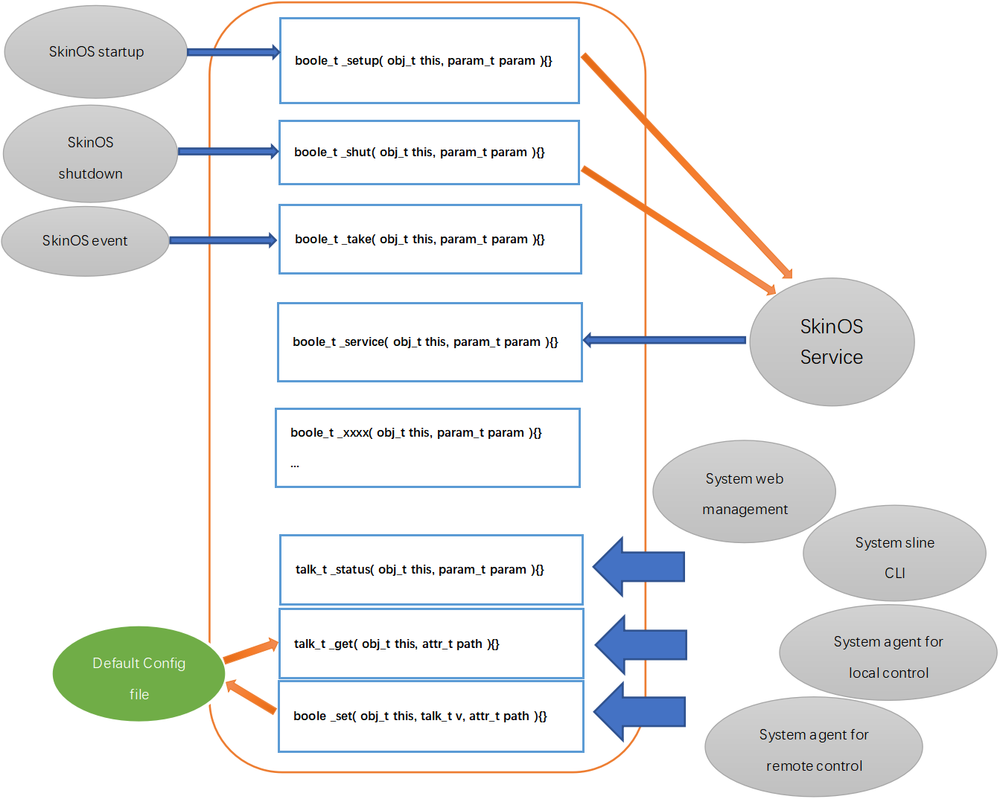
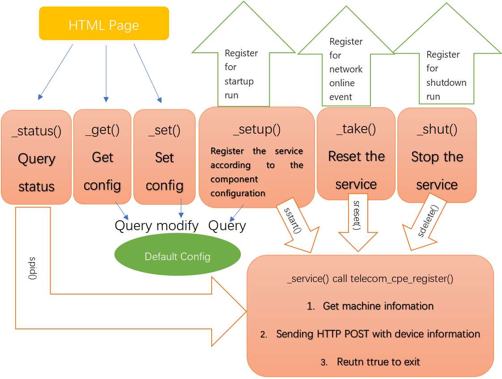

## 创建项目及组件框架

#### 创建项目 
在SkinSDK中开发应用程序需要先创建项目, 在tiger7目录下执行: 
```shell
./tools/prj create 项目名
```
将提示输入项目简介, 输入项目简介后回车即可创建对应的项目
***将在tiger7/project的目录下会创建项目名同名的目录, 并在目录下自动生成了项目描述文件prj.json***


#### 项目内创建组件 
在tiger7目录下执行: 
```shell
./tools/prj add_com 项目名 组件名
```
将提示输入组件简介, 输入组件简介后回车即可在项目内创建对应的组件
***将在项目目录下创建组件同名的目录，并在目录下自动生成组件名同的的.c源代码文件***


## 组件代码需要实现的函数及调用者



**_setup** 函数, 为一次性执行函数(**即执行后必须立即退出**), 用于注册为开机项, 在SkinOS **开机启动** 时运行, 用于初始化组件及相关的功能
**_shut** 函数, 为一次性执行函数(**即执行后必须立即退出**), 用于注册为关机项, 在SkinOS **系统关机** 时执行, 用于关闭组件及相关的功能
**_take** 函数或使用其它名称的函数都可注册为事件处理项, 为一次性执行函数(**即执行后必须立即退出**), 在系统发生指定 **事件发生** 被系统执行

**_service** 函数为永久运行不退出的服务类函数, 用于向系统注册为服务项, 系统将一直保持及运行

**_get** 函数, 为一次性执行函数(**即执行后必须立即退出**), 当组件需要向外提供配置时实现, 相当于查看组件配置的钩子函数, 在 **查询组件配置** 时被调用到
**_set** 函数, 为一次性执行函数(**即执行后必须立即退出**), 当组件需要向外提供配置时实现, 相当于设置组件配置的钩子函数, 在 **设置组件配置** 时被调用到

实现以上函数即可：
- 实现开机启动 **_setup()**
- 实现关机关闭 **_shut()**
- 实现在系统事件发生时更新自身状态 **_take()**
- 向外提供配置，允放其它管理者管理 **_get()/_set()**
- 实现后台持续运行 **_service()**

---

## 示例, 创建项目并开发一个组件

**以下开发一个电信自注册功能的程序来演示如何开发一个完整的项目(即verify项目), 并在项目下编写telecom4g组件来实现电信自注册逻辑, 为其提供默认的配置, 并开发一个状态查询及启用禁用此功能的配置界面供用户管理**



上图给出了项目中telecom4g组件的结构及与项目其它部件及系统之间的关系, 下面我们将一步步完成图中所有函数及部件编写

#### 创建项目 
在编译环境顶层目录下执行: 
```shell
./tools/prj create 项目名
```
将提示输入项目简介, 输入项目简介后回车即可创建对应的项目

###### 示例: 输入./tools/prj create verify回车将提示您输入项目简介， 输入简介后回车创建verify项目
```shell
dimmalex@ubuntu18:~/tiger7$ ./tools/prj create verify
project verify introduction: Multiple verify program             
dimmalex@ubuntu18:~/tiger7$ 
```
执行后无任何提示表示成功
执行成功后在./project目录中多出一个verify的目录, 此目录即为项目目录, verify项目的所有文件都将会在此目录中
```shell
dimmalex@ubuntu18:~/tiger7$ ls ./project/verify/
Makefile  prj.json
dimmalex@ubuntu18:~/tiger7$
```
其中**prj.json**为项目配置文件, 对于其它更详细的介绍可见[ FPK包管理 ](../com/land/fpk.md)中有关prj.inf文件的介绍
**Makefile**为对应产品开发环境的编译说明文件, 它会跟据产品开发环境的不同而不同


#### 项目内创建组件 
在编译环境顶层目录下执行: 
```shell
./tools/prj add_com 项目名 组件名
```
将提示输入组件简介, 输入组件简介后回车即可在项目内创建对应的组件
###### 示例: 输入./tools/prj add_com verify telecom4g 回车将提示您输入组件简介， 输入简介后回车将在verify项目下创建telecom4g组件
```shell
dimmalex@ubuntu18:~/tiger7$ ./tools/prj add_com verify telecom4g
component telecom4g introduction: Telecom 4G CPE register function
dimmalex@ubuntu18:~/tiger7$ 
```
执行后无任何提示表示成功
执行成功后对应的项目目录中多出一个telecom4g的目录, 此目录即为组件目录, 此组件目录下会生成两个文件:
- 一个是后缀为.c结尾的组件同名的C程序, 此文件即为组件的代码文件, 将在这个文件中添加具本的实现代码
- mconfig为编译标识修改文件, 在此文件中可以对编译的CFLAGS及LDCFLAGS做调整, 通常不用修改
```shell
dimmalex@ubuntu18:~/tiger7$ ls ./project/verify/telecom4g
mconfig  telecom4g.c
dimmalex@ubuntu18:~/tiger7$ 
```


#### 编写组件代码实现功能

##### 1. 使用vi打开组件代码文件 
```shell
dimmalex@ubuntu18:~/tiger7$ vi ./project/verify/telecom4g/telecom4g.c 
```

##### 2. 原有组件模板 
1. 创建组件时自动生成的模板, 此模板可能会不定期更新并增加新的信息, 但大至框架不会变化
2. 通常组件模板包括了8个接口:

```c
talk_t _setup( obj_t this, param_t param );     // 为一次性执行函数, 此函数约定用于启动组件时调用, 通常会被注册为启动项, 类似于初始化组件的功能函数
talk_t _shut( obj_t this, param_t param );      // 为一次性执行函数, 此函数约定用于关闭组件时调用, 通常会被注册为关机项, 类似于关闭组件的功能函数
talk_t _service( obj_t this, param_t param );   // 为后台服务函数, 此函数约定用于一直运行的服务函数, 为实现实际的功能, 通常用于向系统服务注册的服务, 不能直接调用, 类似于Linux中的守护进程, 这个函数通常会在_setup函数运行时将其注册为服务项
talk_t _take( obj_t this, param_t param );      // 为一次性执行函数, 此函数约定用于处理事件的函数, 当此组件需要跟据某此事件做出处理时可实现此函数
talk_t _get( obj_t this, attr_t path );         // 为一次性执行函数, 此函数用于获到组件的配置, 在用户或其它程序获到组件配置时此函数会被调用
boole _set( obj_t this, talk_t v, attr_t path );// 为一次性执行函数, 此函数用于设置组件的配置, 在用户或其它程序设置组件配置时会被调用
```

3. 以上函数参数介绍:

```c
obj_t this  ------ 为组件名称的结构化的表示, 用于表示当前组件名称
param_t param ---- 为参数的结构化的表示, 用于表示调用当前接口时的传参信息
attr_t path  ----- 为属性路径的结构化的表示, 用于表示_get查询/_set设置指定的属性路径
talk_t v  -------- 为值的结构化的表示, 用于表示_set设置的值
```

***以上函数都将运行于不同的进程中, 所以函数间不能直接交换数据***, 如需交换数据可使用register.h中的API来交换数据

##### 3. 编辑组件函数 
以下示例我们通过编辑组件的代码来实现 **中国电信的自注册功能** , 此功能的需求在verify项目的doc文件目录下

1. 编写_setup函数, 即setup接口
_setup函数即获取组件配置并跟据配置的status属性决定是否把本组件的_service函数(即service接口)注册为系统服务

```c
talk_t _setup( obj_t this, param_t param )
{
	/* 默认根据组件配置的status属性来决定是否启动_service服务函数 */
	talk_t cfg;
	const char *ptr;
	const char *object;

	/* 获取组件名全称 */
	object = obj_combine(this);
	/* 获取组件配置 */
	cfg = config_get( this, NULL );
	/* 得到组件配置的status属性值 */
	ptr = json_string( cfg, "status" );
	/* 判断值是否为enable */
	if ( ptr != NULL && 0 == strcmp( ptr, "enable") )
	{
		/* 将本组件的_service函数以服务的形式运行. 服务名即为当前的组件全称verify@telecom4g */
		service_start( object, object, "service", NULL );
	}

	/* 释放组件配置 */
	talk_free( cfg );
	/* 退出, 记住一定要运行后立即退出, 如果不退出可能导致整个系统启动卡死在这里 */
    return ttrue;
}
```

2. 编写_shut函数, 即shut接口
_shut函数同样即在关闭组件时停止我们在_setup函数中注册的系统服务

```c
talk_t _shut( obj_t this, param_t param )
{
	const char *object;

	/* 获取组件名全称 */
	object = obj_combine(this);
	/* 停止服务 */
	service_stop( object );
	/* 退出, 记住一定要运行后立即退出, 如果不退出可能导致整个系统启动卡死在这里 */
	return ttrue;
}
```

4. 编写_service函数, 即service接口
我们要在_service函数中实现整个自注册的逻辑
- 在编写_service函数之前我们写一个发起注册的函数:

```c
/* 包含此头文件可调用easy_rtalk_type发起POST请求 */
#include "remotetalk/remotetalk.h"
/* 发起注册 */
boole telecom_cpe_register( const char *remote, const char *encrypt, talk_t lte )
{
	talk_t v;
	talk_t ack;
	const char *ptr;
	char buffer[NAME_MAX];
	talk_t machine_status;

	/* 创建注册用的JSON */
	v = json_create( NULL );
	#if 0
	json_set_string( v, "REGVER", "8.0" );
	json_set_string( v, "UETYPE", "23" );
	json_set_string( v, "MODEL", "ZYY-ES M9" );
	json_set_string( v, "OSVER", "FarmOS6.0" );
	json_set_string( v, "ROM", "8M" );
	json_set_string( v, "RAM", "64M" );
	json_set_string( v, "SWVER", " 4.3.3n" );
	json_set_string( v, "MACID", "4C:BC:98:01:06:98" );
	json_set_string( v, "IMEI1", "863078036821124" );
	json_set_string( v, "SIM1ICCID", "89861120147330291660" );
	json_set_string( v, "SIM1CDMAIMSI", "460115372165490" );
	json_set_string( v, "SIM1CELLID", "219769344" );
	#else
	/* 加入一些指定的属性 */
	json_set_string( v, "REGVER", "8.0" );
	json_set_string( v, "UETYPE", "23" );
	json_set_string( v, "MODEL", "ZYY-ES M9" );
	json_set_string( v, "OSVER", "SkinOS-7.0" );
	json_set_string( v, "ROM", "8M" );
	json_set_string( v, "RAM", "64M" );
	/* 调用land@machine的status接口获取设备信息, 并将version及mac加入到注册JSON中 */
	machine_status = scall( MACHINE_COM, "status", NULL );
	ptr = json_string( machine_status, "version" );
	json_set_string( v, "SWVER", ptr );
	ptr = json_string( machine_status, "mac" );
	json_set_string( v, "MACID", ptr );
	talk_free( machine_status );
	/* 将LTE相关的信息imei, iccid, imsi, cell加入到注册JSON中 */
	ptr = json_string( lte, "imei" );
	json_set_string( v, "IMEI1", ptr );
	ptr = json_string( lte, "iccid" );
	json_set_string( v, "SIM1ICCID", ptr );
	ptr = json_string( lte, "imsi" );
	json_set_string( v, "SIM1LTEIMSI", ptr );
	ptr = json_string( lte, "cell" );
	json_set_string( v, "SIM1CELLID", ptr );
	#endif
	/* 记录时间  */
    if ( system( "date '+%Y-%m-%d %H:%M:%S'>/tmp/.verify_telecom4g_regdate 2>/dev/null" ) == 0 )
    {
        ptr = file2string( "/tmp/.verify_telecom4g_regdate", buffer, sizeof(buffer) );
        if ( ptr != NULL && *ptr != '\0' )
        {
            buffer[ strlen(buffer)-1 ] = '\0';
			json_set_string( v, "REGDATE", buffer );
        }
    }

	/* 使用remotetalk库中的函数发起POST请求, 因此注意在组件的mconfig文件中加入remotetalk的链接, 并且也要加入curl库的链接(因为remotetalk用到了curl库) */
	ack = easy_rtalk_type( remote, "Content-Type:application/encrypted-json", encrypt, v, 30, 30, PROJECT_TMP_DIR"/.verify_telecom4g_cookie" );
	if ( ack == tfalse )
	{
		talk_free( v );
		return false;
	}
	talk_free( v );
	/* 确认注册是否成功 */
	ptr = json_string( ack, "resultCode" );
	if ( ptr == NULL || 0 != strcmp( ptr, "0" ) )
	{
		return false;
	}

	talk_free( v );
	return true;
}
```

- 在_service函数中实现注册的逻辑, 此函数为后台服务函数, 不允许随意退出(**因为如果非正常退出系统会自动再次运行**):

```c
talk_t _service( obj_t this, param_t param )
{
	int i;
	boole r;
	int *iptr;
	talk_t ret;
	talk_t cfg;
	talk_t ifnamest;
	const char *object;
	const char *ifname;
	const char *remote;
	const char *encrypt;
	const char *cur_iccid;
	const char *save_iccid;

	/* 获取组件名全称 */
	object = obj_combine( this );
	/* 查看是否存在默认路由来确定数据业务是否可用 */
	if ( route_info( "0.0.0.0", NULL, NULL, NULL ) == false )
	{
		/* 如数据业务不可用, 休眠10秒后退出, 退出后系统会重新运行此函数 */
		sleep( 10 );
		return tfalse;
	}
	/* 获取组件所有配置 */
	cfg = config_get( this, NULL );
	save_iccid = json_string( cfg, "iccid" );
	/* 获取 读哪一个LTE模块 的信息, 如无配置则默认为第一个LTE模块 */
	ifname = json_string( cfg, "lte" );
	if ( ifname == NULL || *ifname == '\0' )
	{
		ifname = LTE_COM;
	}
	/* 调用LTE模块的status接口来获取它的ICCID */
	ifnamest = scall( ifname, "status", NULL );
	cur_iccid = json_string( ifnamest, "iccid" );
	if ( cur_iccid == NULL || *cur_iccid == '\0' )
	{
		/* 如获到不到LTE的ICCID, 休眠10秒后退出, 退出后系统会重新运行此函数 */
		talk_free( ifnamest );
		sleep( 10 );
		return tfalse;
	}
	if ( save_iccid != NULL && 0 == strcmp( save_iccid, cur_iccid ) )
	{
		/* 不满足上报自注册信息触发条件,      注销系统服务并退出*/
		return terror;
	}

	ret = tfalse;
	/* 发起注册 */
	remote = json_string( cfg, "remote" );
	encrypt = json_string( cfg, "encrypt" );
	r = telecom_cpe_register( remote, encrypt, ifnamest );
	if ( r == false )
	{
		/* 对注册失败做计数 */
		iptr = register_pointer( object, "regfailed" );
		if ( iptr == NULL )
		{
			/* 初始化计数为1 */
			i = 1;
			iptr = register_set( object, "regfailed", &i, sizeof(i), 0 );
		}
		else
		{
			i = *iptr;
			/* 如果注册失败次数超过10次结束本次开机注册 */
			if ( i >= 10 )
			{
				ret = terror;
			}
			else
			{
				/* 计数加1 */
				i++;
				*iptr = i;
				/* 等待一个小时后再发起注册 */
				sleep( 3600 );
			}
		}
	}
	else
	{
		/* 注册成功后记录iccid, 并结束 */
		ret = ttrue;
		config_ssets_string( object, cur_iccid, "iccid" );
	}

	/* 释放空间并退回 */
	talk_free( cfg );
	talk_free( ifnamest );
	return ret;
}
```

5. 编写_status函数, 即status接口
我们要在_status函数中返回当前注册组件的状态, 比如是否已注册过, 注册用的ICCID是多少等信息

```c
talk_t _status( obj_t this, param_t param )
{
	int *iptr;
	talk_t ret;
	talk_t cfg;
	const char *ptr;
	const char *object;

	/* 获取组件名全称 */
	object = obj_combine( this );
	/* 创建返回 JSON */
	ret = json_create( NULL );
	/* 获取组件所有配置 */
	cfg = config_get( this, NULL );
	/* 如果在组件配置中发现有iccid的信息即表示已注册过 */
	ptr = json_string( cfg, "iccid" );
	if ( ptr != NULL && *ptr != '\0' )
	{
		json_set_string( ret, "status", "registered" );
		json_set_string( ret, "iccid", ptr );
	}
	else
	{
		json_set_string( ret, "status", "unregistered" );
		/* 获到注册失败次数 */
		iptr = register_pointer( object, "regfailed" );
		json_set_number( ret, "failed", *iptr );
	}

	/* 释放空间并退回 */
	talk_free( cfg );
    return ret;
}
```

6. 编写_take函数, 即take接口
我们要在_take函数处理上线事件, 当设备一上线我们将立即启动注册服务或重启注册服务, 然后服务会立即检测到已上线而立即发起注册

```c
talk_t _take( obj_t this, param_t param )
{
	const char *event;
	const char *object;

	/* 获取组件名全称 */
	object = obj_combine( this );
	/* 得到事件名称 */
	event = param_string( param, 1 );
	/* 如果事件名称为network/online(即外网连接上线)则立即重启组件的服务 */
	if ( event != NULL && 0 == strcmp( event, "network/online" ) )
	{
		return service_reset( object, object, "service", NULL );
	}
    return tfalse;
}
```

7. 编写_get函数, 即获取组件配置时实际调用的函数
这个函数就是实际的调用配置获到的函数, 并返回这个函数的返回, 模板中的代码即可满足这个需求, 所以我们不需要修改

```c
talk_t _get( obj_t this, path_t path )
{
    talk_t cfg;

    /* gets the configuration parameters for the component */
    cfg = config_get( this, path );

	info( "returns the configuration of the %s", COM_IDPATH );
    return cfg;
}
```

8. 编写_set函数, 即修改组件配置会实际调用的函数
这个函数就是实际的去修改配置参数, 在修改成功后重启这个组件, 模板中现有的代码就满足这个需求, 所以我们不需要修改

```c
boole _set( obj_t this, path_t path, talk_t v )
{
    boole ret;

    /* directly save the set parameters into the flash */
    ret = config_set( this, v, path );
    /* if the flash is successfully saved, the call is called by calling first _shut closing and then calling the _setup to restart the corresponding service */
    if ( ret == true )
    {
		info( "save the configuration of the %s and reset it", COM_IDPATH );
        _shut( this, NULL );
        _setup( this, NULL );
    }
    return ret;
}
```

##### 4. 注册开机启动
在以上的_setup函数(setup接口)中我们实现了启动组件的代码, 但我们还需要在系统启动时自动调用_setup函数, 以实现自启动, 因此需要使用如下命令实现注册开机运行_setup函数(setup接口)

```shell
dimmalex@ubuntu18:~/tiger7$ ./tools/prj add_init verify general verify@telecom4g.setup     
dimmalex@ubuntu18:~/tiger7$ 
```

此指令无任何报错即表示成功注册, 成功注册后我们在verify的prj.json文件中也可以看到对应的注册项

```shell
dimmalex@ubuntu18:~/tiger7$ cat project/verify/prj.json 
{
    "name":"verify",
    "version":"internal",
    "author":"fpk.preset",
    "intro":"Multiple verify program",
    "com":
    {
        "telecom4g":"Telecom 4G CPE register function"
    },
    "init":
    {
        "general":"verify@telecom4g.setup"         // 注册的启动级别: 需要运行的组件接口
    }
}
```

##### 5. 注册关机执行 
在以上的_shut函数(shut接口)中我们实现了关闭组件的代码, 但我们还需要在系统关机时自动调用_shut函数, 以实现关机自动关闭当前组件, 因此需要使用如下命令实现注册关机执行_shut函数(shut接口)

```shell
dimmalex@ubuntu18:~/tiger7$ ./tools/prj add_uninit verify general verify@telecom4g.shut    
dimmalex@ubuntu18:~/tiger7$ 
```

此指令无任何报错即表示成功注册, 成功注册后我们在verify的prj.json文件中也可以看到对应的注册项

```shell
dimmalex@ubuntu18:~/tiger7$ cat project/verify/prj.json 
{
    "name":"verify",
    "version":"internal",
    "author":"fpk.preset",
    "intro":"Multiple verify program",
    "com":
    {
        "telecom4g":"Telecom 4G CPE register function"
    },
    "init":
    {
        "general":"verify@telecom4g.setup"
    },
    "uninit":
    {
        "general":"verify@telecom4g.shut"    // 注册的关机级别: 需要运行的组件接口
    }
}
```

##### 6. 注册事件处理 
在上面的_take函数中我们处理了当接口上线(network/online)事件时需要做的工作, 我们还需要向系统注册这个事件处理, 以便在发生事件时系统会调用到这个_take函数

```shell
dimmalex@ubuntu18:~/tiger7$ ./tools/prj add_joint verify network/online verify@telecom4g.take
dimmalex@ubuntu18:~/tiger7$ 
```

此指令无任何报错即表示成功注册, 成功注册后我们在verify的prj.json文件中也可以看到对应的注册项

```shell
dimmalex@ubuntu18:~/tiger7$ cat project/verify/prj.json 
{
    "name":"verify",
    "version":"internal",
    "author":"fpk.preset",
    "intro":"Multiple verify program",
    "com":
    {
        "telecom4g":"Telecom 4G CPE register function"
    },
    "init":
    {
        "general":"verify@telecom4g.setup"
    },
    "uninit":
    {
        "general":"verify@telecom4g.shut"
    },
    "joint":
    {
        "network/online":"verify@telecom4g.take"    // 注册的事件名称: 需要运行的组件接口
    }
```

##### 7. 修改mconfig加入引用了其它的库的支持 
因调用了remotetalk的库, 而remotetalk的库依赖于libcurl, 因此要加入这两个库的链接支持

```shell
dimmalex@ubuntu18:~/tiger7$ cat project/verify/telecom4g/mconfig 

CFLAGS += -I../
LDFLAGS += -lremotetalk -lcurl

dimmalex@ubuntu18:~/tiger7$ 
```


#### 提供默认的项目配置 
在项目目录下会有组件名同名开头.cfg结尾的配置文件, 此项目配置文件为组件名同名的组件配置, 此配置文件必须为标准的JSON格式(且不支持数字/布尔/数组及注解)
此配置文件为项目配置, 也称之为同名组件的默认配置, 即设备恢复出厂后的同名组件配置即是该配置文件的内容
我们将在此文件中给也组件默认的配置

```shell
dimmalex@ubuntu18:~/tiger7$ cat project/verify/telecom4g.cfg 
{
    "status":"enable",
    "remote":"http://register.vnet.cn:999",
    "encrypt":"base64"
}
```

根据以上的组件配置即表示如下:
- 默认启动该组件 --- "status":"enable"
- 自注册的服务器地址为http://register.vnet.cn:999 --- "remote":"http://register.vnet.cn:999"
- 使用base64加密 --- "encrypt":"base64"

项目配置可以通过config_get/config_set函数来读写, 在以上telecom4g组件示例中: 
- 组件配置管理中的查询接口(_get)的实现即是通过config_get对应的项目配置来完成的
- 组件配置管理中的设置接口(_set)的实现则是通过config_set对应的项目配置来完成的


#### 编写网页界面程序

##### 1. 为项目创建网页界面 
在顶层目录下执行

```shell
./tools/prj add_wui <项目名> <界面ID>
```

将提示输入界面的中英文菜单名, 输入后回车即可在项目内创建对应的界面

###### 示例: 输入./tools/prj add_wui verify telecom4g 回车将提示您输入中英文菜单名， 输入后回车将在verify项目下创建telecom4g的界面

```shell
dimmalex@ubuntu18:~/tiger7$ ./tools/prj add_wui verify telecom4g
web menu title(Chinese): 电信注册
web menu name(English): Telecom Register  
{
    "page":"telecom4g.html",
    "lang":
    {
        "cn":"telecom4g-cn.json",
        "en":"telecom4g-en.json"
    },
    "cn":"电信注册",
    "en":"Telecom Register"
}
dimmalex@ubuntu18:~/tiger7$ 
```

执行后会交互式的询问菜单的中英文名称（在管理网页中的应用菜单下显示的入口名）, 输入后会在verify的项目目录下产生三个文件：
- telecom4g.html   界面文件
- telecom4g-cn.json 中文语言文件
- telecom4g-en.json 英文语言文件
*注：使用中文名称或中文语言时系统一定要设为UTF8的编码, 否则将无法工作*
```shell
dimmalex@ubuntu18:~/tiger7$ ls ./project/verify/*.html ./project/verify/*.json
./project/verify/prj.json  ./project/verify/telecom4g-cn.json  ./project/verify/telecom4g-en.json  ./project/verify/telecom4g.html
dimmalex@ubuntu18:~/tiger7$ 
```

##### 2. 组件HTML界面开发 
修改对应的html界面即可, 接以上示例所生成的telecom4g.html中是一个简单的示例， 包含了获取及设置verify@telecom4g组件配置
修改网页需要有javascript、html的基本知识，并稍了解jquery的用法即可，具体的界面开发后面会写专门的文档来说明

##### 3. 获取组件配置
在html界面中通过 **he.load[ 组件名 ]** 获取组件配置, 并在then后给出获取到组件配置后的初始化函数, 组件名为一个字符串

```javascript
    // 组件配置名称
    var comname = "verify@telecom4g"
    // 从系统获取组件配置并填入界面中
    function load_comcfg()
    {
        // 从系统获取组件配置的调用
        he.load( [ comname ] ).then( function(v){
            // 将获到的配置赋值给存放组件配置的变量
            comcfg = v[0];
            if ( !comcfg )
            {
                comcfg = {};
            }
            // 将组件配置状态填入状态选项
            $('#status').prop( 'checked', able2boole(comcfg.status) );
            // 将组件配置属性值填入属性输入框中
            $('#remote').val( comcfg.remote );
            // 为状态选项绑定函数处理, 实现点选时界面隐藏或显示属性输入框
            $('#status').unbind('change').change(function () {
                // 如果选中
                if ($(this).prop('checked'))
                {
                    // 显示
                    $('#statusSets').show();
                }
                // 否则
                else
                {
                    //隐藏
                    $('#statusSets').hide();
                }
            }).trigger('change');
        });
    }

```

##### 4. 设置组件配置
在html界面中通过**he.save( [ 组件名+"="+JSON.stringify(组件配置) ] )**, 组件名为一个字符串, 组件配置为一个JSON对象

```javascript
    // 从界面得到修改的配置后保存并应用到组件配置中
    function save_comcfg()
    {
        if ( !comcfg )
        {
            comcfg = {};
        }
        // 拷贝一份组件配置
        var comcfgcopy = JSON.parse(JSON.stringify(comcfg));
        // 从状态选项中得到组件状态
        comcfg.status = boole2able( $('#status').prop('checked') );
        if ( comcfg.status == "enable" )
        {
            // 从属性输入框中得到组件属性值
            comcfg.remote = $('#remote').val();
        }
        // 比较拷贝确定组件配置是否有被修改
        if ( ocompare( comcfg, comcfgcopy ) )
        {
            // 如果未修改提示没有修改不需要应用
            page.alert( { message: $.i18n('Settings unchanged') } );
            return;
        }
        // 向系统保存并应用组件配置的调用
        he.save( [ comname+"="+JSON.stringify(comcfg) ] ).then( function(){
            // 提示应用成功
            page.hint2succeed( $.i18n('Modify successfully') );
            // 刷新界面内容
            load_comcfg();
        });
    }
```

##### 5. 调用组件接口查看状态
在html界面中通过**he.bkload( [ 组件名+".status" ] )** 来调用组件名的status接口, 从而可以获取到组件的状态, 当然也可以调用其它的组件接口

```javascript
	function flash_status( )
	{
		/* 以静默的方式在后台获取组件的status接口的返回 */
		he.bkload( [ comname+'.status' ] ).then( function(v){
			comstatus = v[0];                                 // comstatus即为组件的status接口的返回
		});
	}
```

##### 6. 多语言界面支持
多语言的支持主要是通过jquery的$.i18n()来实现

```javascript
    // 得到语言文件转化为JSON对象, 自动跟据系统语言类型变化路径(在prj.json中指名)
    var langjson = base64.decode( page.param( 'lang', location.hash ) );
    // 通过jquery的$.i18n()加载语言文件
    $.i18n().load( page.lang(langjson) ).then( function () {
        // 界面语言初始化
        $.i18n().locale = window.lang; $('body').i18n();
        // 加载组件配置
        load_comcfg();
        /* 绑定刷新按键 */
        $('#refresh').on(ace.click_event, function () {
            location.reload();
        });
        /* 绑定应用按键 */
        $('#apply').on(ace.click_event, function () {
            // 点应用时保存并应用组件配置
            save_comcfg();
        });
    });
```


#### 刷新项目菜单 
执行make menu刷新菜单

```shell
dimmalex@ubuntu18:~/tiger7$ make menu
```


#### 勾选项目 
执行make menuconfig后在 ***Skin system*** 下可以看到对应的 ***verify项目***, 勾选即可

```shell
dimmalex@ubuntu18:~/tiger7$ make menuconfig
```


#### 编译项目 
可单独编译verify项目, 也可以要求编译整个固件(将会把verify的项目编译并打包到固件中)
- 单独编译verify项目
	```shell
	dimmalex@ubuntu18:~/tiger7$ make kernel obj=verify
	```
	单独编译verify项目将会在./build/store目录下生成以项目名开头的fpk软件包
	```shell
	dimmalex@ubuntu18:~/tiger7$ ls build/store/verify*fpk
	build/verify-internal-mt7628.fpk
	dimmalex@ubuntu18:~/tiger7$ 
	```
	此fpk软件包可直接通过网页升级的方式安装到设备上去

- 编译整个固件
	```shell
	dimmalex@ubuntu18:~/tiger7$ make
	```
	将会在./build目录下生成zz后缀的固件升级包
	```shell
	dimmalex@ubuntu18:~/tiger7$ ls build/*.zz
	build/mt7628_r103_std_4.3.3n.zz
	dimmalex@ubuntu18:~/tiger7$ 
	```
	此zz后缀的固件升级包可直接通过网页升级到设备上去

***在编译过程中一定要注意报错信息, 当有出错时将不会生成fpk软件包***


#### 升级到设备上 
通过在设备网页的 ***系统*** 菜单下的 ***软件管理*** 界面中 **软件更新** 后的浏览按键选择 ***fpk软件包*** 升级或选择整个 ***固件*** 升级即可


#### 调试组件

##### 1. 命令行调试组件接口
通过HE终端可以直接调用的到组件的接口, HE终端相关的格式及命令介绍见[终端HE指令使用说明](../use/he_command.md)

- 示例: 调用组件_setup函数的接口

	```shell
	# verify@telecom4g.setup
	#
	```

- 示例: 查看组件配置

	```shell
	# verify@telecom4g
	{
		"status":"enable",
		"remote":"http://register.vnet.cn:999",
		"encrypt":"base64"
	}
	#
	```

- 示例: 修改组件配置

	```shell
	# verify@telecom4g:status=disable
	#
	```

##### 2. 命令行调试组件的服务类接口
- 示例: 查看verify@telecom4g中_setup函数注册的服务是否有运行, 更多有关服务管理的接口见[服务管理组件](../com/land/service.md)

	```shell
	# service.info[ verify@telecom4g ]
	{
		"status":"live",                    // live表示已运行
		"pid":"1572",
		"obj":"verify@telecom4g",
		"op":"service",
		"ontime":"31",
		"cktime":"0",
		"livetime":"18:58:41:2"
	}
	#
	```

##### 3 . 组件使用日志调试

- 示例: 显示当前日志, 即可以当前日志中查询是否有verify@telecom4g组件打印的日志, 更多有关日志管理的接口见[日志管理组件](../com/land/syslog.md)

	```shell
	# log.show
	Dec 30 13:24:37 V520-12CC70 user.warn syslog: modem@lte check simcard failed 3 times
	Dec 30 13:24:38 V520-12CC70 user.warn syslog: modem@lte check simcard failed 4 times
	Dec 30 13:24:39 V520-12CC70 user.warn syslog: modem@lte check simcard failed 5 times
	Dec 30 13:24:40 V520-12CC70 user.warn syslog: modem@lte check simcard failed 6 times
	Dec 30 13:24:40 V520-12CC70 user.info syslog: search the modem device(modem@lte2)
	// 更多日志信息
	#
	`


