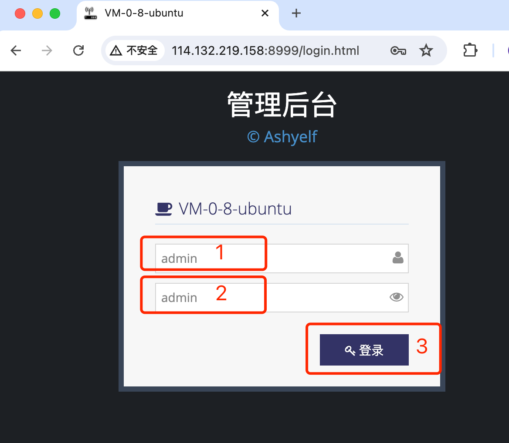
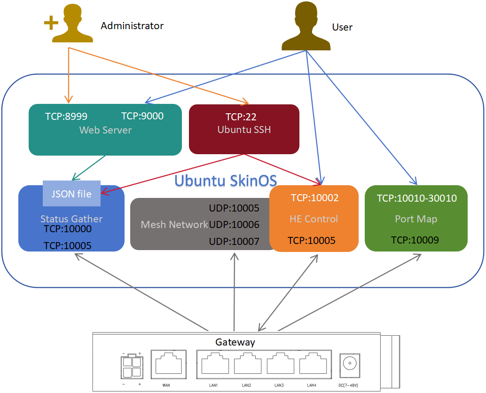
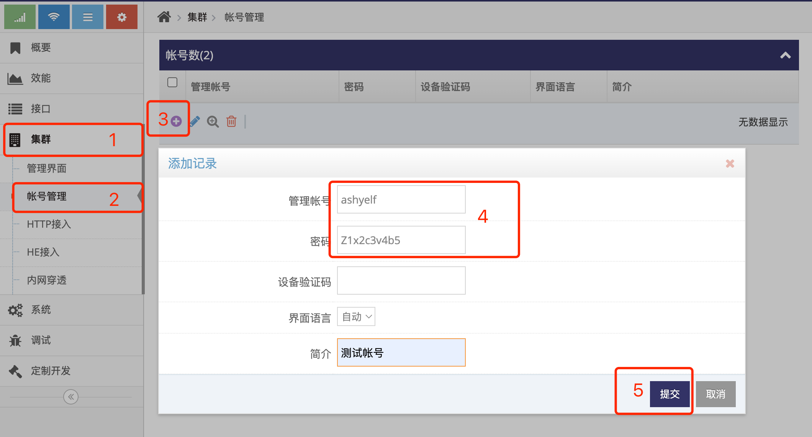

# SkinOS SDK下载与编译

#### 开发环境下载
在Ubuntu下（ 建议使用20.04或22.04 ）执行以下命令下载开发环境( 请先安装git及make )

```shell
git clone https://gitee.com/tiger7/tiger7.git

```

*或者从github上下载*

```shell
git clone https://github.com/skinos7/tiger7.git
```

#### 安装开发工具

```shell
cd tiger7
make ubuntu_preset
```
*此指令会协助安装一些常用的开发工具, 也就是执行以下执行来安装开发要用的工具, 如出现安装异常请跟据Ubuntu当前的环境手动安装*
```
sudo apt-get update
sudo apt-get install vim git subversion pandoc aptitude
sudo apt-get install gcc g++ binutils patch bzip2 flex bison make autoconf gettext texinfo unzip sharutils gawk
sudo apt-get install python2 libtool shtool curl lrzsz zlib1g-dev automake automake1.11
sudo apt-get install lib32z1 libssl-dev device-tree-compiler libevent-dev
sudo snap install ttyd --classic
sudo apt-get install lib32ncurses5
sudo apt-get install libncurses5-dev
sudo apt-get install libncursesw5-dev
```


#### 切换SDK为网关管理平台

```shell
make pid gBOARDID=host-x86-ubuntu
```

#### 下载网关对应的代码及库文件

```shell
make update
```

#### 编译

```shell
make dep
make
```

# 网关管理平台安装与运行


#### 安装网关管理平台

```shell
make local
```
*此命令完成的工作是将 **./build/rootfs/usr/** 下的文件拷贝到系统的 **/usr** 下, 如果执行失败或对Ubuntu系统熟悉也可自行拷贝*

#### 运行网关管理平台

```shell
make start
```
*此命令完成的工作是运行/usr/prj/setup.sh, 也可用户自已直接运行*

#### 登录网关管理平台管理员网页

使用IE访问Ubuntu地址的8999端口即可打开对应的登录界面



- 如能打开些界面表示 **网关管理平台** 安装成功   
- 默认用户名: admin, 默认密码: admin, 点击 **红框3** 即可登录 **网关管理平台管理员界面**   


#### 停止网关管理平台

```shell
make stop
```
*此命令完成的工作是运行/usr/prj/shut.sh, 也可用户自已直接运行*

#### 让网关管理平台开机运行

```shell
make bootup
```
*此命令完成的工作是向/etc/rc.local文件中添加运行/usr/prj/setup.sh的指令, 如果添加失败或对Ubuntu系统熟悉也可自行添加*


# 网关管理平台用到的端口



网关管理平台是一个综合管理平台, 即包含有对网关管理, 还完成自组网内网穿透等功能, 未来还将加入更多的业务服务及向第三方提供接口服务, 因此用到了众多端口

1. 网关接入时要用到的端口

- **TCP端口10000**, **TCP端口10005**, 网关状态接入端口

- **TCP端口10001**, **TCP端口10006**, 网关HE信令接入端口

- **UDP端口10005**, **UDP端口10006** 及 **UDP端口10007** , 网关自组网接入端口

- **TCP端口10009**,  网关内网穿透接入端口

2. 用户管理要用到的端口

- **TCP端口8999**, 管理员WEB界面

- **TCP端口22**, 管理员SSH

- **TCP端口9000**, 用户WEB界面

- **TCP端口10002**, **TCP端口10007**, 用户HE控制指令交互端口

- **TCP端口10010-30010**, 内网穿透后分配的端口, 穿透完成后用户访问这些端口等于访问网关下设备对应的端口

**在Ubuntu上安装完成后防火墙上需要打开以上端口, 否则网关管理平台对应的功能无法使用**


# 将网关接入网关管理平台


#### 1. 登录网关管理平台管理员网页

使用IE访问Ubuntu地址的8999端口即可打开对应的登录界面


- 默认用户名: admin, 默认密码: admin, 点击 **红框3** 即可登录 **网关管理平台管理员界面**   

#### 2. 添加用户

- 点击 **红框1** **集群** 菜单下的 **红框2** **帐号管理** 进入 **帐号管理界面**   



- 点击 **红框3** 的 **加号** 弹出添加记录窗口

- 在 **红框4** 的 **管理帐号** 填写用户名(**只支持英文加数字**)

- 在 **红框4** 的 **密码** 填写密码, 使用用户名及密码可登录用户WEB界面对网关进行管理

- 点击 **红框5** 的 **提交** 即完成用户的添加


#### 3. 设置网关接入网关管理平台

通过登录网关的 **管理界面**(默认网关的IP地址为192.168.8.1, 连上网关后打开浏览器在地址栏输入 http://192.168.8.1 回车即可)

- 点击 **红框1** **网络** 菜单下的 **红框2** **4G双卡**(或4G/5G双卡) 进入 **4G双卡设置界面**(或4G/5G双卡设置界面)

- 点选 **红框3** 启用双卡功能, 设置好后点击 **红框5** 中的应用即可生效


#### 4. 登录网关管理平台用户网页


#### 5. 查看网关列表


#### 6. 查看网关基本管理界面


