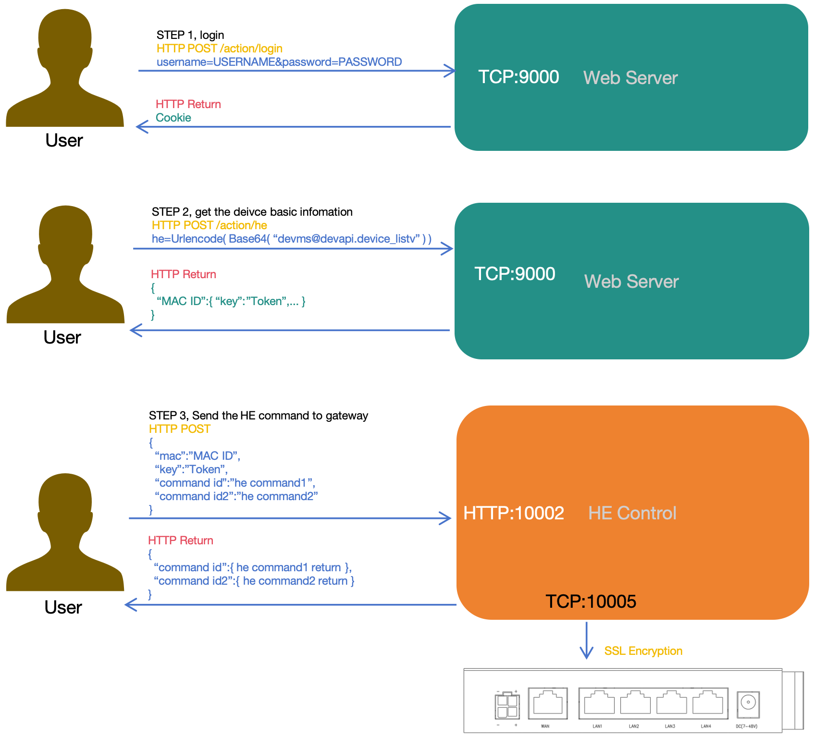

# 网关管理平台结构

**** 

# Web Server的介绍

### 管理员(8999端口)的网页源文件

此端口上的服务器用于对 **网关管理平台** 配置, 如启用或禁用 **网关管理平台** 的一些功能, 为 **网关管理平台** 增删改查帐号等

- **/usr/prj/devms/webs.html**, 用于管理 **网关管理平台--用户界面服务器**
    - 使用 **he.load()** 查询 **devms@webs** 的配置   
    - 使用 **he.save()** 修改 **devms@webs** 的配置   
    - 点击 **[网关管理平台--用户界面服务器](../../com/devms/webs.md)** 可查看其配置介绍   
    - 用户可修改此界面文件定制

- **/usr/prj/devms/user.html**   
    - 使用 **he.load()** 调用 **devms@devport** user_list接口显示当前帐号列表   
    - 使用 **he.load()** 调用 **devms@devport** user_add接口添加帐号   
    - 使用 **he.load()** 调用 **devms@devport** user_delete删除帐号   
    - 点击 **[网关管理平台--网关状态服务器](../../com/devms/devport.md)** 可查看其接口介绍   
    - 用户可修改此界面文件定制

- **/usr/prj/devms/devport.html**   
    - 使用 **he.load()** 查询 **devms@devport** 的配置   
    - 使用 **he.save()** 修改 **devms@devport** 的配置   
    - 点击 **[网关管理平台--网关状态服务器](../../com/devms/devport.md)** 可查看其配置介绍   
    - 用户可修改此界面文件定制

- **/usr/prj/devms/heport.html**   
    - 使用 **he.load()** 查询 **devms@heport** 的配置   
    - 使用 **he.save()** 修改 **devms@heport** 的配置   
    - 点击 **[网关管理平台--HE指令服务器](../../com/devms/heport.md)** 可查看其配置介绍   
    - 用户可修改此界面文件定制

- **/usr/prj/devms/pport.html**   
    - 使用 **he.load()** 查询 **devms@pport** 的配置   
    - 使用 **he.save()** 修改 **devms@pport** 的配置   
    - 点击 **[网关管理平台--内网穿透服务器](../../com/devms/pport.md)** 可查看其配置介绍   
    - 用户可修改此界面文件定制

- **he.load()** 及 **he.save()** 实现在 **/usr/prj/wui/admin/api/he.js** 文件中
    - 此文件的功能是向 **/action/he** 的CGI提交HE的控制指令完成对 **网关管理平台** 的配置   
    - **/action/he** 的CGI的实现通过goahead的HTTP服务器实现的, 通过goahead代码直接调用 **网关管理平台(Ubuntu)** HE命令实现对其管理   
    - 用户可自行安装一个熟悉的服务器, 对应的实现一些CGI, 并通过CGI直接调用HE命令即可   

通过以上界面的代码示列及文件介绍的接口可以完成对 ***网关管理平台** 常用的配置

### 用户(9000端口)的网页源文件   
此端口上的服务器叫 **用户界面服务器**   
此端口上的服务器用于对 **网关管理平台** 上的网关管理, 如列出帐号下所有的网关, 查询网关的状态, 对网关划分网络, 配置网关的内网穿透   

- **/usr/prj/devms/wui/manage/gwlist.html**, 用于列出帐号下所有的网关
    - 使用 **devapi.bkload()** 调用了 **devms@devapi** device_listv接口列出帐号下所有的网关
    - 点击 **[平台设备管理接口](../../com/devms/api_device.md)** 可查看其接口
    - 用户可修改此界面文件定制

- **/usr/prj/devms/wui/manage/gateway.html**, 用于管理指定的网关的基本配置   
    - 使用 **devapi.bkload()** 调用了 **devms@devapi** device_status接口查询指定的网关的所有状态   
    - 使用 **devapi.bkload()** 调用了 **devms@devapi** device_get接口查询指定的网关的所有配置   
    - 使用 **devapi.load()** 调用了 **devms@devapi** map_list接口查询指定的网关的内网穿透的配置   
    - 使用 **devapi.exec()** 调用了 **devms@devapi** map_add接口添加内网穿透规则   
    - 使用 **devapi.exec()** 调用了 **devms@devapi** map_delete接口删除内网穿透规则   
    - 使用 **devapi.exec()** 调用了 **devms@devapi** network_device_delete从指定的自组网删除网关   
    - 使用 **devapi.exec()** 调用了 **devms@devapi** network_device_add将网关加入指定的自组网   
    - 点击 **[平台设备管理接口](../../com/devms/api_device.md)** 可查看其接口   
    - 点击 **[平台内网穿透管理接口](../../com/devms/api_map.md)** 可查看其接口   
    - 点击 **[平台自组网管理接口](../../com/devms/api_network.md)** 可查看其接口   
    - 用户可修改此界面文件定制   

- **/usr/prj/devms/wui/manage/pport.html**   
    - 使用 **devapi.load()** 调用了 **devms@devapi** map_list接口查询内网穿透的配置   
    - 使用 **devapi.exec()** 调用了 **devms@devapi** map_add接口添加内网穿透规则   
    - 使用 **devapi.exec()** 调用了 **devms@devapi** map_delete接口删除内网穿透规则   
    - 点击 **[平台内网穿透管理接口](../../com/devms/api_map.md)** 可查看其接口   
    - 用户可修改此界面文件定制   

- **/usr/prj/devms/wui/manage/netlist.html**   
    - 使用 **devapi.load()** 调用了 **devms@devapi** network_listv接口查询自组网的所有基本信息   
    - 使用 **devapi.exec()** 调用了 **devms@devapi** network_add接口添加自组网   
    - 使用 **devapi.exec()** 调用了 **devms@devapi** network_delete接口删除自组网   
    - 点击 **[平台自组网管理接口](../../com/devms/api_network.md)** 可查看其接口      
    - 用户可修改此界面文件定制   

- **/usr/prj/devms/wui/manage/network.html**   
    - 使用 **devapi.bkload()** 调用了 **devms@devapi** network_view查询自组网基本信息  
    - 使用 **devapi.bkload()** 调用了 **devms@devapi** network_device_listv查询自组网下的网关列表   
    - 使用 **devapi.exec()** 调用了 **devms@devapi** network_device_delete从指定的自组网删除网关   
    - 使用 **devapi.exec()** 调用了 **devms@devapi** network_device_add将网关加入指定的自组网   
    - 点击 **[平台自组网管理接口](../../com/devms/api_network.md)** 可查看其接口      
    - 用户可修改此界面文件定制    

- **/usr/prj/devms/wui/manage/firmware.html**   
    - 使用 **devapi.load()** 调用了 **devms@devapi** firmware_list列出固件列表
    - 使用 **devapi.exec()** 调用了 **devms@devapi** firmware_delete删除指定的固件      
    - 点击 **[平台固件管理接口](../../com/devms/api_firmware.md)** 可查看其接口      
    - 用户可修改此界面文件定制    

- **/usr/prj/devms/wui/manage/upgrade.html**   
    - 使用 **devapi.bkload()** 调用了 **devms@devapi** device_listv接口列出帐号下的网关
    - 使用 **he.exec()** 通过 **HE Control** 直接调用到指定网关的 **agent@remote** upgrade接口来远程升级   
    - 点击 **[平台设备管理接口](../../com/devms/api_device.md)** 可查看其接口       
    - 点击 **[平台固件管理接口](../../com/devms/api_firmware.md)** 可查看其接口      
    - 点击 **[网关HTTP上报管理](../../com/agent/remote.md)** 可查看其接口      
    - 用户可修改此界面文件定制    

- **/usr/prj/devms/wui/manage/settings.html**   
    - 使用 **devapi.load()** 调用了 **devms@devapi** user_get接口获取当前用户的配置   
    - 使用 **devapi.save()** 调用了 **devms@devapi** user_set接口修改当前用户的配置    
    - 点击 **[平台用户管理接口](../../com/devms/api_user.md)** 可查看其接口           
    - 用户可修改此界面文件定制    

通过以上界面的代码示列及文件介绍的接口可以完成 **网关** 及 **帐号** 在 **网关管理平台** 基本的管理

# HE Control的介绍

- 所有的在线网关都必须连接到 **HE Control** 才可实时管理  
- 通过 **HE Control** 配置的数据都直接保存在对应的 **网关** 中   
- **HE Control** 提供的HTTP服务实现远程实时管理指定网关    
    - 此HTTP服务正常监听在 **10002** 端口    
    - 此HTTP服务的 **/he** 文件接受POST一个JSON格式的 **HE指令**, 在此指令中必须给出指定的 **网关macid** 及 **网关Token**     
    - **网关macid** 及 **网关Token** 通过调用 **devms@devapi** device_listv接口获得   

- **HE Control** 提供本地TCP服务实现远程调用指定网关的接口   
    - 此TCP服务正常监听在 **10003** 端口, 并只允许本 **网关管理平台** 内的程序访问
    - 此TCP服务受SON格式的 **HE指令**, 在此指令中必须给出指定的 **网关macid**   

### 用户(9000端口)的网页源文件调用HE Control(10002端口)的流程

用户通过如下流程实现远程调用网关接口   

- 1. 用户通过9000端口登录 **用户界面服务器**
- 2. 成功登录后使用JS函数 **devapi.bkload()** 调用 **devms@devapi** device_listv接口获取其帐号下所有的 **网关macid**及对应的 **网关Token**   
- 3. 通过JS函数向 **HE Control(10002端口)** 的 **/he** POST一个JSON格式的 **HE指令**, 此HE指令只含有两个必要参数 **mac** 及 **key**, 分别对应 **网关macid** 及 **网关Token**

### 用户(9000端口)网页源文件中调用HE Control(10002端口)的介绍

- 通过点击 **红框3** 进入远程实时管理网关的界面

- 其对应的网页源代码位于 **/usr/prj/devms/wui/content** 目录下

- 此目录下的源代码通过向 **HE Control(10002端口)** 的 **/he** POST一个JSON格式的 **HE指令** 来实现对网关的实时管理

### 向HE Control(10002端口)上提交JSON指令格式的介绍

