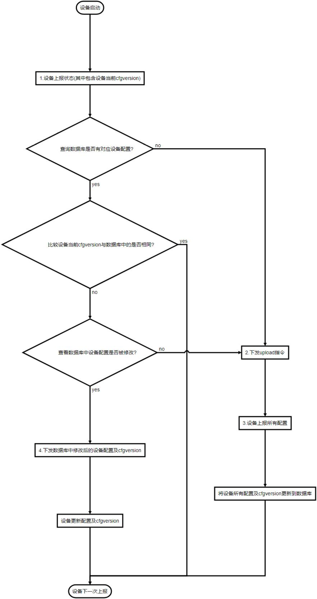
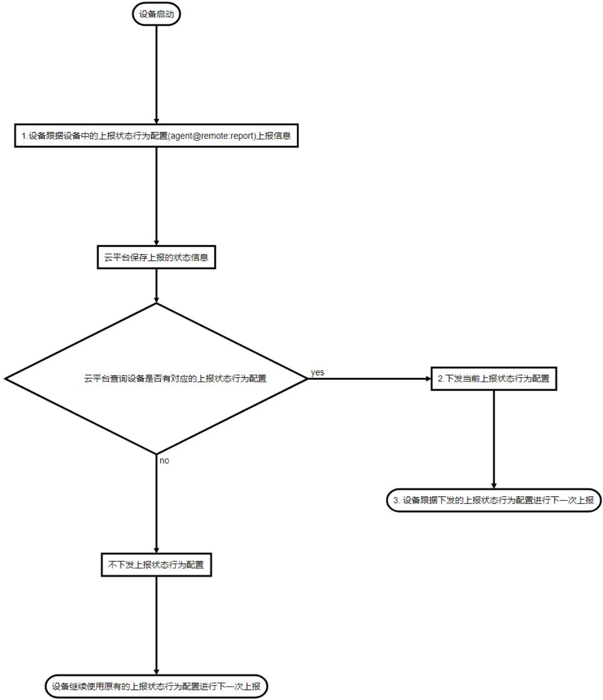
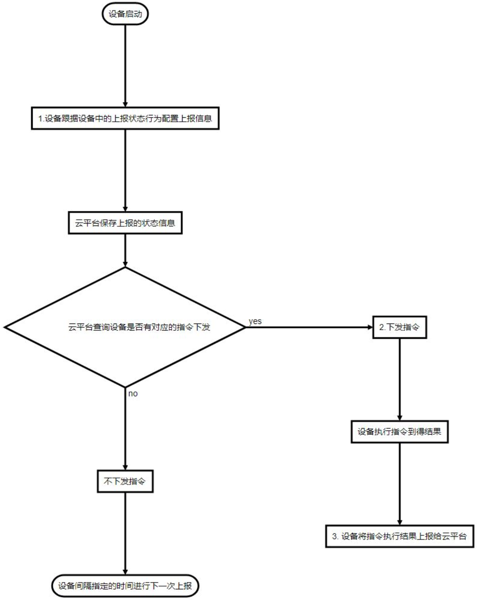

***
# 远程管理协议说明 
设备通过HTTP协议与云平台交互, 接受并处理与云平台的管理协议, 通过此协议云平台可以实现大批量远程管理设备

### **1. 设备与云平台交互的信息**  

设备与云平台之间主要交互这六类信息
- **组件配置**： 
  - 设备所有的配置
  - 双向交互(即云平台可向设备发送配置, 设备也可向云平台发送配置)
- **组件状态**： 
  - 设备所有的状态
  - 单向交互(即设备向云平台发送状态)
- **告警**： 
  - 设备的异常事件
  - 单向交互(即设备向云平台发送告警)
- **消息**： 
  - 设备的常规事件
  - 单向交互(即设备向云平台发送消息)
- **日志**： 
  - 设备日志
  - 单向交互(即设备向云平台发送日志)
- **指令**与**指令执行结果**： 
  - 云平台要求设备进行操作并取得操作结果
  - 双向交互(即云平台可向设备发送指令, 设备向云平台发送指令执行结果)
- **持续性数据**： 
  - 设备可要求云平台协助保存一些持续性易变的数据, 以便设备断电也不失丢
  - 双向交互(即设备向云平台发送数据, 云平台也可向设备发送这类数据)


### **2. 设备与云平台交互机制**

- 设备间隔指定的时间会向云平台发起HTTP POST请求上报一个JSON（这个动作简称为**上报状态行为**）, 这个JSON中包含：
  - **设备的MAC** 
    每个设备的MAC地址都是唯一的， 通过MAC地址唯一标识设备
  - **设备所属管理帐号** 
    每个设备都可设置一个所属的管理帐号, 通过云平台登录对应帐号后即可管理本设备
  - **所属管理帐号验证码(可选)** 
    所属管理帐号可要求设备给出验证码, 当所属管理帐号要求给出验证码时设备必须给出正确的验证码才可以被对应的帐号管理
  - JSON中可能还会跟据上一次的交互情况或设备当前的配置包含以下内容(可跟据实际情况可同时包含): 
    - **组件状态** 
    所有的组件状态都可以上报给云平台, 具体上报哪些组件状态由 **上报状态行为配置** 指定, 而云平台可以在设备POST时返回**上报状态行为配置**给设备来调整设备的**上报状态行为**
    以下两个信息比较重要, 这里介绍下:
      - **设备的基本状态（组件land@machine.status的status接口返回此状态）** 
        通常设备默认会上报此状态, 云平台可以通过下发 **上报状态行为配置** 来动态的调整设备下一次上报的内容及间隔
        - **设备的当前配置版本（属性cfgversion）** 
            在组件land@machine的状态中有一个cfgverion的属性用来表示设备的**当前配置版本**, 通常云平台会为每台接入的设备保存一份当前的配置及设备当前配置版本, 当设备本地的配置被修改后设备的**当前配置版本**（cfgversion）会发生变化， 通过对比设备**当前配置版本**（cfgversion）可判断设备的配置是否被本地修改过 
    - **组件配置** 
    当云平台在上一次的HTTP交互时有下发upload命令时设备就会POST设备所有的组件配置
    - **告警** 
    设备发生的一些异常事件, 由 **上报状态行为配置** 指定是否上报
    - **消息** 
    设备发生的一些普通事件, 由 **上报状态行为配置** 指定是否上报
    - **日志** 
    设备的日志, 由 **上报行为配置** 指定是否上报
    - **指令执行结果** 
    当云平台在上一次的HTTP交互时有下发指令时, 设备执行完后将会把 **指令执行结果** 上报
    - **持续性数据**： 
    设备可向云平台发送需要协助保存的持续性易变数据, 通常是一些流量计数

- 云平台可在设备向云平台POST时返回一个JSON, 通过下发的这个JSON完成控制设备, 在这个JSON时可包含以下信息：
    - **组件配置** 
    当云平台的组件配置发生变化时会向设备返回变化的配置，以方便设备得到最新的配置
    - **上报状态行为配置** 
    当云平台需要改变设备的**上报状态行为**时可以下发新的**上报状态行为配置**
    - **指令** 
    当云平台需要设备执行指令时将下发
    - **持续性数据** 
    当云平台收到设备的要求下发持续性数据时下发


### **3. 配置同步流程图**

云平台通过设备的 **当前配置版本（cfgversion）** 实现与设备之间的配置同步
  - 当设备配置变化时云平台会在设备上报时下发upload指令要求设备上报最新的配置
  - 当云平台配置变化时云平台会在设备上报时下发最新的配置给设备

以下流程图描述设备与云平台之间的交互， 用于说明设备如何与云平台之间来保持设备配置的同步， 开发云平台时请参考此流程图来实现对设备配置的管理


```flow
st=>start: 设备启动
end=>end: 设备下一次上报
post=>operation: 1.设备上报状态(其中包含设备当前cfgversion) 
exsit=>condition: 查询数据库是否有对应设备配置?
upload=>operation: 2.下发upload指令
upload2=>operation: 3.设备上报所有配置
upload3=>operation: 将设备所有配置及cfgversion更新到数据库
compcfg=>condition: 比较设备当前cfgversion与数据库中的是否相同?
ischange=>condition: 查看数据库中设备配置是否被修改?
download=>operation: 4.下发数据库中修改后的设备配置及cfgversion
download2=>operation: 设备更新配置及cfgversion
st->post->exsit
exsit(no,right)->upload->upload2->upload3->end
exsit(yes)->compcfg
compcfg(no)->ischange
compcfg(yes,right)->end
ischange(yes)->download->download2->end
ischange(no)->upload
```

### **4. 配置同步详细协议**

以下给出以上流程图有关1，2，3，4交互的详细协议介绍， 其中：
- 1，2，3步用于当设备内的配置被本地用户修改后， 云平台如何获取到最新的设备配置并更新云端数据库中
- 1，4步用于修改了云端数据库中设备对应的配置时, 云平台如何将这些配置应用到设备中去
1. 设备上报状态(其中包含设备当前cfgversion)  
    设备向云平台发起POST请求，POST的JSON中带有status节点用来表示上报的状态, 如下.
    ```javascript
    POST /dev HTTP/1.1
    Host: lte.wmdevice.com
    Accept: */*
    Content-Type:application/json;charset=UTF-8

    {
        "macid":"00037F12AAD0",        // 设备的MAC地址
        "user":"dimmalex@gmail.com",   // 设备所属的帐号
        "vcode":"123456",              // 设备所属的帐号需要的验证码

        "status":  // 表明为状态的内容
        {
            "land@machine.status":    // 设备基本状态
            {
                "cfgversion":"39",              // 设备当前配置版本
                "mode":"gateway",
                "name":"5228-128870",
                "platform":"smtk2",
                "hardware":"mt7621",
                "custom":"d228",
                "scope":"std",
                "version":"20220814",
                "livetime":"12:44:52:9",
                "current":"11:20:46:09:23:2022",
                "mac":"00:03:7F:12:88:70",
                "macid":"00037F128870",
                "model":"5228",
                "magic":"0E82CEC20232FFFF",
                "gpversion":"v4.3.2"
            }
        }
    }
    ```
    为了直观这里给出的是json对象缩进格式(实际通信中不一定会有缩进)

2. 云平台下发upload指令要求设备上报所有配置 
    当云平台发现设备上报的当前配置版本（cfgversion）与云平台数据库中的不同并且云平台内的设备配置没有被修改过, 那意味着设备的配置被在本地被修改过, 因此将要求下发upload指令要求设备上报最新的配置及配置版本(cfgversion), 内容如下：
    ```javascript
    HTTP/1.1 200 OK
    Server: AP-ApCenter
    Date: Tue Dec 31 17:49:24 2013
    Connection: keep-alive

    {
        "cmd":"upload"    // 要求设备上报所有的配置
    }
    ```
    设备收到后会立即开始另一个POST, 并在这个POST中上报设备所有组件的配置及配置版本

3. 设备上报所有配置 
    设备收到云平台下发的upload指令后将会立即重新连接云平台， 并向云平台上报设备所有的配置(JSON中带有config节点), 以便云平台得到设备最新的配置及配置版本, , 如下：
    ```javascript
    POST /dev HTTP/1.1
    Host: lte.wmdevice.com
    Accept: */*
    Content-Type:application/json;charset=UTF-8

    {
        "macid":"00037F12AAD0",        // 设备的MAC地址
        "user":"dimmalex@gmail.com",   // 设备所属的帐号
        "vcode":"123456",              // 设备所属的帐号需要的验证码

        "config":           /* 上传的配置 */
        {
            "cfgversion": "889";     /* 当前配置版本  */
            "wifi@nssid ":           /* 2.4G WIFI SSID组件配置 */
            {
                "status":"enable",        // 状态, enable为启用, disable为禁用
                "ssid":"SSID text name",  // SSID名
                "isolated":"disable",     // 是否隔离客户端, disable为不隔离, enable为隔离
                "broadcast":"enable",     // 是否广播SSID名, enable为广播, disable为隐藏
                "secure":"disable ",
                                          // 安全方式 disable为禁用, wpapsk为WPA PSK, wpa2psk为WPA2 PSK, wpapskwpa2psk为WPAPSK混合
                "wpa_encrypt":"aes",      // 加密算法, 有AES(aes), TKIP(tkip)及混合(tkipaes)
                "wpa_key":"88888888",     // WPA加密时的密码
                "maxsta":"64"             // 最大客户端数限制
            },
            "wifi@n":           /*2.4G WIFI无线高级组件配置 */
            {
                "country":"cn",            // 国家代码, cn为中国, us为美国, jp为日本, fr为法国, tw为台湾, hk为香港
                "channel":"0",             // 信道, 0表示自动通过CCA选择空闲信道, 可选1-13
            },
            "tui@telnet":            /* Telnet服务器管理组件配置 */
            {
                "status":"enable",          // TELNET服务器的状态， enable为启用, disable为禁用
                "remote":" disable",        //是否允许远程访问, enable为允许, disable为不允许
                "port":"23"                 // TELNET服务器的端口
            },
            "wui@admin":             /* WEB管理服务器组件配置*/
            {
                "status":"enable",          // WEB服务器的状态， enable为启用, disable为禁用
                "remote":"disable",         //是否允许远程访问, enable为允许, disable为不允许
                "port":"80"                 // WEB服务器的端口
            },
            "arch@reggpio":          /*  IO口管理组件配置, */
            {
                //... 略
            },
            "arch@lock":             /* 设备锁定相关的配置 */
            {
                //... 略
            },
            "land@machine":          /* 设备基本信息组件的配置 */
            {
                //... 略
            },
            "land@hosts":            /* Hosts管理组件的配置 */
            {
                //... 略
            },
            "land@syslog":           /* 日志管理组件的配置 */
            {
                //... 略
            },
            "ifname@wan":            /* WAN口管理组件配置 */
            {
                //... 略
            },
            "ifname@wisp":           /* 无线客户端管理组件配置 */
            {
                //... 略
            },
            "ifname@lte":            /* 4G网络管理组件 */
            {
                //... 略
            },
            "ifname@lan":            /* LAN口管理组件 */
            {
                //... 略
            },
            "wifi@assid":            /* 5.8G WIFI SSID组件配置 */
            {
                //... 略
            },
            "wifi@a":           /*5.8G WIFI无线高级组件配置 */
            {
                //... 略
            },
            "client@station":        /* 客户端管理组件 */
            {
                //... 略
            },
            "clock@date":            /* 时间管理组 */
            {
                //... 略
            },
            "clock@restart":         /* 自动重启管理组件 */
            {
                //... 略
            },
            "gnss@nmea":             /* GPS管理组件 */
            {
                //... 略
            }

            // 还有其它更多组件配置未一一给出, 更多的组件的配置可见<终端命令行及组件说明书.doc>
            // …
        }
    }
    ```
    设备上报的是组件的配置, config对象下即是一个个组件的配置, 以上列出的是比较常用的组件名称, 在实际的交互中设备可能会上报更多的组件配置, 对于更多的组件配置见 [更多组件](../)

4. 下发数据库中修改后的设备配置及cfgversion 
    当云平台发现设备上报的配置版本(cfgversion)与云平台上保存的不同并且云平台的配置有被修改过即下发新的配置(JSON中带有config节点), 里面包含被修改过组件最新的配置及配置版本(cfgversion), 每一个组件相应的都在config下会有一个json对象， 此对象内容即为组件最新的配置， 内容如下：
    ```javascript
    HTTP/1.1 200 OK
    Server: AP-ApCenter
    Date: Tue Dec 31 17:49:24 2013
    Connection: keep-alive

    {
        "config":           /* 下发的配置 */
        {
            "cfgversion":"888";            /* 新配置版本 */
            "clock@date":                  /* 时间组件配置  */
            {
                "timezone":"-12至12",                     // <时区> 西12到东12区
                "ntpclient":"enable|disable",             // 是否开启<NTP网络对时>
                "ntpserver":"ntp1.aliyun.com",            // <NTP服务器>, ntpclient为enable时必填
                "ntpserver2":"ntp2.aliyun.com",           // <NTP服务器2>
                "ntpserver3":"ntp3.aliyun.com",           // <NTP服务器3>
                "ntpinterval":"86400"                     // <同步间隔>, 即与NTP服务器同步时间的间隔(秒为单位)
                "current":"01:41:15:01:01:2016",          // <当前时间>  时:分:秒:月:日:年
                "livetime":"01:41:30:0",                  // <运行时长>  时:分:秒:天 （只读)
                "uptime":"6090"                           // <运行时长>  从启动后累计秒数 (只读)
            } 
            "clock@restart":               /* 定时重启组件配置 */
            {
                "mode":"disable",                         // 重启<模式>, 分为:不重启(disable)|最大运行时长(age)|定点重启(point)|空闲时重启(idle)三种重启模式
                "age":"2880",                             // <最大运行时长>, 单位为秒, 模式为 最大运行时长时 有效
                "point_hour":"10"                         // 指定重启的<时>, 模式为 定点重启 时有效
                "point_minute":"10"                       // 指定重启的<分>, 模式为 定点重启 时有效
                "idle_start":"2880",                      // 从这个时长后<开始启动>空间重启机制(秒为单位), 模式为 空闲时重启 有效
                "idle_wireless_time":"40",                // 达到<WIFI空闭时长>即重启(秒为单位), 模式为 空闲时重启 有效
                "idle_age":"3880",                        // 或达到<系统运行最大时长>时立即重启, 模式为 空闲时重启 有效
            },
            "tui@telnet":                  /* Telnet服务器管理组件配置，需要修改设备上的Telnet服务器管理组件配置时下发此对象  */
            {
                "status":"enable",                       // TELNET服务器的状态， enable为启用, disable为禁用
                "remote":"disable",                      //是否允许远程访问, enable为允许, disable为不允许
                "port":"23"                              // TELNET服务器的端口
            } ,
            "wifi@nssid ":                 /*  2.4G WIFI SSID组件配置， 需要修改设备上的2.4G WIFI SSID组件的配置时下发此对象 */
			{
                "status":"enable",                       // 状态, enable为启用, disable为禁用
                "ssid":"SSID text name",                 // SSID名
                "isolated":"disable",                    // 是否隔离客户端, disable为不隔离, enable为隔离
                "broadcast":"enable",                    // 是否广播SSID名, enable为广播, disable为隐藏
                "secure":"disable",                      // 安全方式 disable为禁用, wpapsk为WPA PSK, wpa2psk为WPA2 PSK, wpapskwpa2psk为WPAPSK混合
                "wpa_encrypt":"aes",                     // 加密算法, 有AES(aes), TKIP(tkip)及混合(tkipaes)
                "wpa_key":"88888888",                    // WPA加密时的密码
                "maxsta":"64",                           // 最大客户端数限制
            },
            "wifi@n":                /* 2.4G WIFI无线高级组件配置，需要修改设备上的2.4G WIFI无线高级组件的配置时下发此对象  */
            {
                "country":"cn",                         // 国家代码, cn为中国, us为美国, jp为日本, fr为法国, tw为台湾, hk为香港
                "channel":"0",                          // 信道, 0表示自动通过CCA选择空闲信道, 可选1-13
            }
            // 还有其它更多组件配置未一一给出, 更多的组件的配置见各种组件对应的md文件
            // …
        }
    }
    ```
    设备跟据云平台下发的配置来修改设备当前的配置, config对象下是一个个组件的配置, 通常云平台不需要下发所有的组件配置, 只需要下发修改过的组件配置:
    比如只修改了SSID的话只需在config下包含一个wifi@nssid的组件SSID对应的配置属性即可
    ```json
    {
        "config":           /* 下发的配置 */
        {
            "cfgversion":"888", 
            "wifi@nssid ": 
            {
                "ssid":"new ssid name" 
            },
        },
    }
    ```
    比如只修改了LED灯组件的配置, 比如禁用面板指令灯, 只需在config下包含一个arch@reggpio组件配置对应的属性即可
    ```json
    {
        "config":           /* 下发的配置 */
        {
			"cfgversion":"888", 
            "arch@reggpio":
            {
	            "led":"disable" 
            },
        },
    }
    ```

##### 示例 --- 云平台下发新的SSID相关的配置给设备的过程

1. 云平台对应的设备的配置被修改
    通常云平台的数据库中会有设备对应的配置(如果无在设备上报时要求设备上传其配置), 当数据库中对应设备的配置被修改的同时, 需要同时更新设备对应的cfgversion(可以为一个随时数), 表示设备配置已被修改

2. 设备上报
    当设备在上报状态时, 云平台会查看上报状态中当前设备的cfgversion, 发现其cfgversion与云平台的数据库中设备对应的cfgversion不相同, 并且设备对应的组件配置有被修改的记录

3. 云平台下发配置
    云平台下发数据库中对应设备中被修改的配置, 并连接数据库中设备对应的cfgversion一同下发给设备

4. 设备保存相关的配置
    设备收到最云平台下发的配置后立即应用到设备中, 并将设备中的cfgversion与云平台下发cfgversion为相同值


##### 示例 --- 设备上的SSID被修改后的同步过程

1. 设备配置被修改
2. 设备上报
3. 云平台下发upload指令
4. 设备上传配置
5. 云平台保存相关配置


### **5. 状态监控流程图**

云平台通过修改 **上报状态行为配置** 来指定设备下一次上报时的内容及间隔
  - 云平台会在设备上报时下发 **上报状态行为配置** 来控制设备以后上报的内容及间隔
  - 设备将会保留最后一次的 **上报状态行为配置**， 并以此份配置内容向云平台上报

以下流程图描述设备与云平台之间的有关状态的交互， 用于说明云平台如何控制设备上报状态行为
开发云平台时请参考此流程图来实现对设备上报内容及间隔时间的控制 


```flow
st=>start: 设备启动
end=>end: 设备继续使用原有的上报状态行为配置进行下一次上报
end2=>end: 3. 设备跟据下发的上报状态行为配置进行下一次上报
post=>operation: 1.设备跟据设备中的上报状态行为配置(agent@remote:report)上报信息
save=>operation: 云平台保存上报的状态信息
search=>condition: 云平台查询设备是否有对应的上报状态行为配置
reportmodify=>operation: 2.下发当前上报状态行为配置
noreport=>operation: 不下发上报状态行为配置
st->post->save->search
search(yes,right)->reportmodify->end2
search(no)->noreport->end
```

- 设备上报时会根据 **上报状态行为配置** 来上报, 上报状态行为配置中包括两个重要信息 
  - 上报状态的间隔, 即设备会间隔这个时间进行下一次上报 
  - 上报状态的内容, 即指明设备上报哪些组件的状态 
- 设备重新启动后会从本地读取 **上报状态行为配置** , 并跟据这个配置来上报 
- 设备在与云平台交互过程中, 云平台可在设备POST时下发 **上报状态行为配置** 调整设备的上报 
- 设备在收到云平台的 **上报状态行为配置** 即会跟据这个配置来上报 

### **6. 状态监控详细协议**

以下给出以上流程图有关1，2，3交互的详细协议介绍， 其中：
- 1为设备上报的内容 
- 2为云平台下发新的上报状态行为配置给设备 
- 3为设备跟据新的上报状态行为配置来上报 
1. 设备上报状态, 通常设备重新启动后只会上报基本信息 
    设备向云平台发起POST请求, JSON中带有status节点：
    ```javascript
    POST /dev HTTP/1.1
    Host: lte.wmdevice.com
    Accept: */*
    Content-Type:application/json;charset=UTF-8

    {
        "macid":"00037F12AAD0",        // 设备的MAC地址
        "user":"dimmalex@gmail.com",   // 设备所属的帐号
        "vcode":"123456",              // 设备所属的帐号需要的验证码

        "status":  // 表明为状态的内容
        {
            "land@machine.status":    // 设备基本信息
            {
                "model":"preview",       /* 产品标识 */
                "version":"1.0.7",       /* 软件版本 */
                "livetime":"03:25:02:0", /* 开机时长 时：分：秒：天 */
                "cfgversion":"53612620", /* 配置版本, 空或无此结点表示设备末配置过 */
                "name":"Farm-221130",    /* 系统名称 */
                "mode":"misp"            /* 系统模式: 4G(misp) */
            }
        }
    }
    ```

2. 云平台下发上报状态行为配置 
    当云平台发现设备有对应的上报状态行为配置(通常由客户修改)将会将下发给设备(JSON中带有report节点), 内容如下：
    ```javascript
    HTTP/1.1 200 OK
    Server: AP-ApCenter
    Date: Tue Dec 31 17:49:24 2013
    Connection: keep-alive

    {
        "report":     // 新的上报状态行为配置
        {
            "interval":"10",     // 上报的间隔, 以秒为单位
            "status":           // 上报的状态内容
            {
                "land@machine.status":"",    // 设备基本状态
                "network@frame.status":"",   // 网络状态
                "client@staion.list":""      // 客户端列表
            }
        }
    }
    ```
    设备收到后将跟据其中的interval的时间来进行下一次上报, 并在以context规定的内容上报

3. 设备以新的上报状态行为配置上报 
    ```javascript
    POST /dev HTTP/1.1
    Host: lte.wmdevice.com
    Accept: */*
    Content-Type:application/json;charset=UTF-8

    {
        "macid":"00037F12AAD0",        // 设备的MAC地址
        "user":"dimmalex@gmail.com",   // 设备所属的帐号
        "vcode":"123456",              // 设备所属的帐号需要的验证码

        "status":  // 表明为状态的内容
        {
            "land@machine.status":    // 设备基本信息
            {
                "model":"preview",   /* 产品标识 */
                "version":"1.0.7",     /* 软件版本 */
                "livetime":"03:25:02:0",    /* 开机时长 时：分：秒：天 */
                "cfgversion":"53612620", /* 配置版本, 空或无此结点表示设备末配置过 */
                "name":"Farm-221130",  /* 系统名称 */
                "mode":" misp "      /* 系统模式: 4G(misp) */
            },
            "network@frame.status":
            {
                // 网络相关的状态
            },
            "client@staion.list":
            {
                // 客户端列表
            }

        }
    }
    ```


### **7. 指令执行流程图**

云平台通过 **指令** 调用设备组件的接口来控制设备 
  - 云平台会在设备上报时下发 **指令** 要求设备执行指令 
  - 设备会在执行完指后后将 **指令执行结果** 向云平台上报 
  - 对于重启/恢复出厂等指会设备不会向云平台上报执行的指令结果, 因为这类指令会导致设备立即重启

云平台可在设备POST时下发指令, 设备收到后将会执行下发的指令并将结果返回给云平台


```flow
st=>start: 设备启动
post=>operation: 1.设备跟据设备中的上报状态行为配置上报信息
save=>operation: 云平台保存上报的状态信息
search=>condition: 云平台查询设备是否有对应的指令下发
noreport=>operation: 不下发指令
end=>end: 设备间隔指定的时间进行下一次上报
sendhe=>operation: 2.下发指令
op=>operation: 设备执行指令到得结果
sendret=>operation: 3. 设备将指令执行结果上报给云平台
st->post->save->search
search(yes,right)->sendhe->op->sendret
search(no)->noreport->end
```

### **8. 指令执行详细协议**

以下给出以上流程图有关1，2，3交互的详细协议介绍， 其中：
- 1为设备上报的内容 
- 2为云平台下发指令 
- 3为设备上报指令执行结果 
1. 设备上报状态 
    设备向云平台发起POST请求, JSON中带有status节点：
    ```javascript
    POST /dev HTTP/1.1
    Host: lte.wmdevice.com
    Accept: */*
    Content-Type:application/json;charset=UTF-8

    {
        "macid":"00037F12AAD0",        // 设备的MAC地址
        "user":"dimmalex@gmail.com",   // 设备所属的帐号
        "vcode":"123456",              // 设备所属的帐号需要的验证码

        "status":  // 表明为状态的内容
        {
            "land@machine.status":    // 设备基本信息
            {
                "model":"preview",       /* 产品标识 */
                "version":"1.0.7",       /* 软件版本 */
                "livetime":"03:25:02:0", /* 开机时长 时：分：秒：天 */
                "cfgversion":"53612620", /* 配置版本, 空或无此结点表示设备末配置过 */
                "name":"Farm-221130",    /* 系统名称 */
                "mode":" misp "          /* 系统模式: 4G(misp) */
            }
            // ... 更多其它状态
        }
    }
    ```

2. 云平台下发指令 
    当云平台发现设备有对应的指令要求下发时(通常由客户修改)将会将下发给设备(JSON中带有he节点), 内容如下：
    ```javascript
    HTTP/1.1 200 OK
    Server: AP-ApCenter
    Date: Tue Dec 31 17:49:24 2013
    Connection: keep-alive

    {
        "he":     // 下发指令
        {
            "arch@firmware.http_upgrade":
            {
                "1":"http://www.ss.com/firmware/r100-4.2.1.upgrade",  // 升级的固件地址
                "2":"restart_delay"         // 升级成功后自动重启
            }            
        }
    }
    ```
    设备收到指令后将执行

3. 设备上报指令执行结果 
    ```javascript
    POST /dev HTTP/1.1
    Host: lte.wmdevice.com
    Accept: */*
    Content-Type:application/json;charset=UTF-8

    {
        "macid":"00037F12AAD0",        // 设备的MAC地址
        "user":"dimmalex@gmail.com",   // 设备所属的帐号
        "vcode":"123456",              // 设备所属的帐号需要的验证码

        "he":  // 表明为状态的内容
        {
            "arch@firmware.http_upgrade":    // 设备基本信息
            {
                "1":"http://www.ss.com/firmware/r100-4.2.1.upgrade",  // 升级的固件地址
                "2":"restart_delay",         // 升级成功后自动重启
                "return":"tture"  // ttrue表示执行成功, tfalse表示执行失败, {JSON}表示返回JSON的信息                   
            }
        }
    }
    ```


### **9. 告警、消息、日志上报协议**

设备会在间隔指定的时间上报间隔时间段内的告警、消息、日志，云平台需要保存起来供客户查看

1. 设备上报告警 
    设备向云平台发起POST请求, JSON中带有alert节点：
    ```javascript
    POST /dev HTTP/1.1
    Host: lte.wmdevice.com
    Accept: */*
    Content-Type:application/json;charset=UTF-8

    {
        "macid":"00037F12AAD0",        // 设备的MAC地址
        "user":"dimmalex@gmail.com",   // 设备所属的帐号
        "vcode":"123456",              // 设备所属的帐号需要的验证码

        "alert":  // 表明为告警
        {
            "1560758232:66454":    // 时间戳:ID
            {
                "com":"monitor@load",
                "info":"设备超载运行"
            }，
            "1560758242:66459":    // 时间戳:ID
            {
                "com":"monitor@load",
                "info":"设备超载运行"
            },
            // ...可能存在的更多告警
        }
    }
    ```

2. 设备上报消息 
    设备向云平台发起POST请求, JSON中带有msg节点：
    ```javascript
    POST /dev HTTP/1.1
    Host: lte.wmdevice.com
    Accept: */*
    Content-Type:application/json;charset=UTF-8

    {
        "macid":"00037F12AAD0",        // 设备的MAC地址
        "user":"dimmalex@gmail.com",   // 设备所属的帐号
        "vcode":"123456",              // 设备所属的帐号需要的验证码

        "msg":  // 表明为消息
        {
              "1560758232:66454":          // 时间戳:ID
              {
                  "com":"modem@lte",
                  "info":"4G网络信号差"
              },
              "1560758232:66459":          // 时间戳:ID
              {
                  "com":"modem@sms",      // 对象
                  "info":"10086信息"   // 内容
              },
            // ...可能存在的更多消息
        }
    }
    ```


3. 设备上报日志 
    设备向云平台发起POST请求, JSON中带有mark节点表示日志：
    ```javascript
    POST /dev HTTP/1.1
    Host: lte.wmdevice.com
    Accept: */*
    Content-Type:application/json;charset=UTF-8

    {
        "macid":"00037F12AAD0",        // 设备的MAC地址
        "user":"dimmalex@gmail.com",   // 设备所属的帐号
        "vcode":"123456",              // 设备所属的帐号需要的验证码

        "mark":  // 表明为日志
        {
              "1560758232:66454":          // 时间戳:ID
              {
                "com":"land@auth",
                "info":"用户成功登录"
              },
              "1560758232:66459":          // 时间戳:ID
              {
                "com":"land@config",       // 对象
                "info":"某某组件配置被修改"    // 内容
              },
            // ...可能存在的更多日志
        }
    }
    ```


### **10. 持续性数据保存**

因设备通常无法保存经常修改且又需要在重启后一直保存的信息, 比如使用的流量， 它有两个特点:
 - 实时变化, 几乎每秒钟都在变化
 - 需要永久保存

因此设计了一套通过云平台来实现协助设备保存这种特性的信息， 要实现永久保存信息必须满足以下几个要点：
 - 每次设备与云平台连接后向云平台获到最新的信息
 - 设备得到信息后设备将一直计数
 - 设备每间隔一定的时间向云平台更新此数据, 以防设备突然掉电后失丢数据

基于以上的信息, 我们在设备与云平台之间增加了如下协议
 - 设备会在间隔一定的时间在上报状态时增加一个save属性将数据存放于云平台以方便下一次重启后load
 - 并且设备第一次连上云平台时, 设备会在上报时的talk中的json中增加一个属性load， 云平台在收到此属性后将设备存于云平台上下发给设备

**以下是协议示例向云平台要求保存数据以用于随时加载**

1. 设备上报状态时增加有save属性需要云平台帮助保存 
    ```javascript
    POST /dev HTTP/1.1
    Host: lte.wmdevice.com
    Accept: */*
    Content-Type:application/json;charset=UTF-8

    {
        "macid":"00037F12AAD0",        // 设备的MAC地址
        "user":"dimmalex@gmail.com",   // 设备所属的帐号
        "vcode":"123456",              // 设备所属的帐号需要的验证码

        "status":  // 表明为状态的内容
        {
            "land@machine.status":    // 设备基本信息
            {
                "model":"preview",   /* 产品标识 */
                "version":"1.0.7",     /* 软件版本 */
                "livetime":"03:25:02:0",    /* 开机时长 时：分：秒：天 */
                "cfgversion":"53612620", /* 配置版本, 空或无此结点表示设备末配置过 */
                "name":"Farm-221130",  /* 系统名称 */
                "mode":" misp "      /* 系统模式: 4G(misp) */
            }
        },
        "save":   // 要求云平台帮助保存的数据
        {
            "datausage@use":
            {
                "up":"3232323",
                "down":"3433"
            }
            "client@use":
            {
                "22:32:12:11:32:10":
                {
                    "up":"3232323",
                    "down":"3433"
                }
                "22:32:12:11:32:17":
                {
                    "up":"3232323",
                    "down":"3433"
                }
            }
            // ... 更多其它要保存的数据
        }
    }
2. 云平台收到有save的属性时必须将整个json保存起来， 供设备在未来的某个时间获取 

**以下是协议示例设备从云平台加载曾经保存的数据**

1. 设备上报状态时增加有load属性
    ```javascript
    POST /dev HTTP/1.1
    Host: lte.wmdevice.com
    Accept: */*
    Content-Type:application/json;charset=UTF-8

    {
        "macid":"00037F12AAD0",        // 设备的MAC地址
        "user":"dimmalex@gmail.com",   // 设备所属的帐号
        "vcode":"123456",              // 设备所属的帐号需要的验证码

        "status":  // 表明为状态的内容
        {
            "land@machine.status":    // 设备基本信息
            {
                "model":"preview",   /* 产品标识 */
                "version":"1.0.7",     /* 软件版本 */
                "livetime":"03:25:02:0",    /* 开机时长 时：分：秒：天 */
                "cfgversion":"53612620", /* 配置版本, 空或无此结点表示设备末配置过 */
                "name":"Farm-221130",  /* 系统名称 */
                "mode":" misp "      /* 系统模式: 4G(misp) */
            }
        },
        "load":   // 要求云平台将帮助保存的数据下发给设备
        {
        }
    }
    ```
2. 云平台见到有load属性后将回复帮助设备 
    ```javascript
    HTTP/1.1 200 OK
    Server: AP-ApCenter
    Date: Tue Dec 31 17:49:24 2013
    Connection: keep-alive

    {
        "load":   // 下发以前帮助设备保存的数据
        {
            "datausage@use":
            {
                "up":"3232323",
                "down":"3433"
            }
            "client@use":
            {
                "22:32:12:11:32:10":
                {
                    "up":"3232323",
                    "down":"3433"
                }
                "22:32:12:11:32:17":
                {
                    "up":"3232323",
                    "down":"3433"
                }
            }
            // ... 更多其它要保存的数据
        }
    }
    ```

