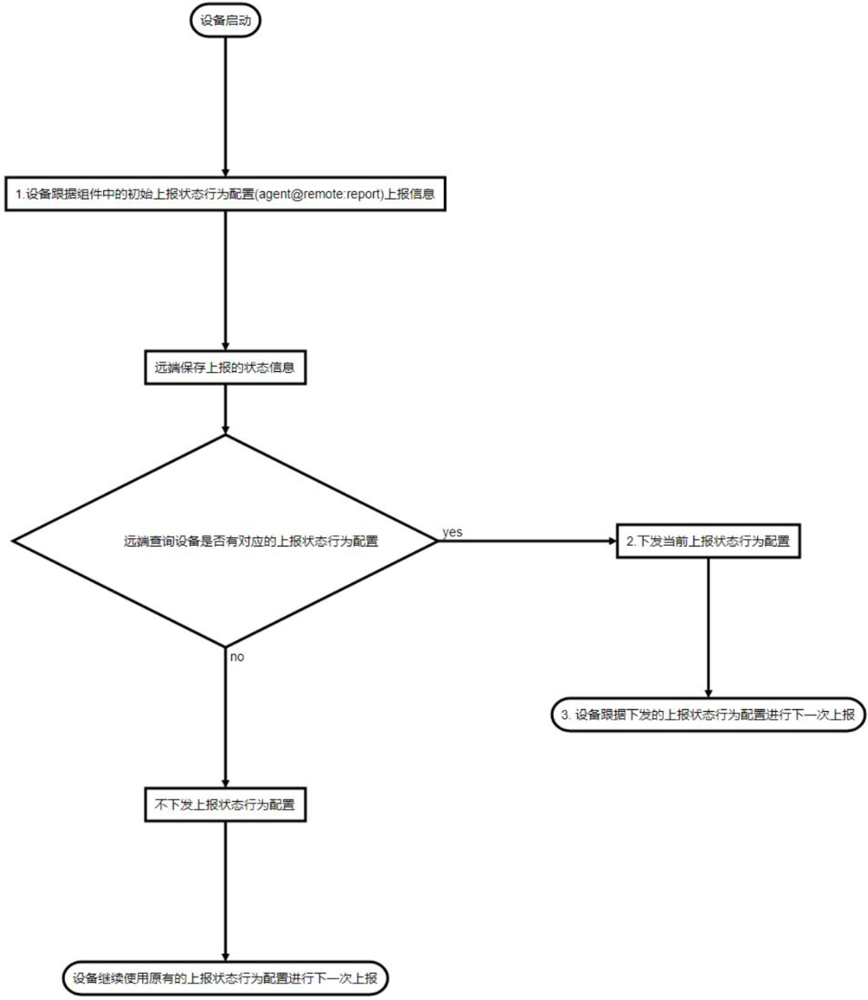
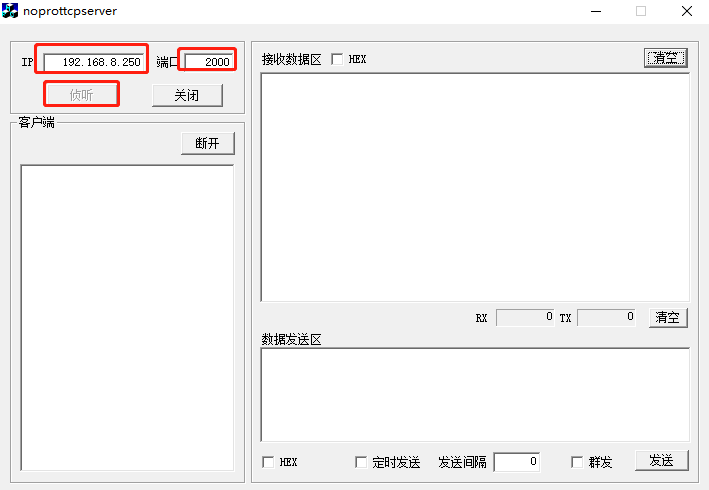
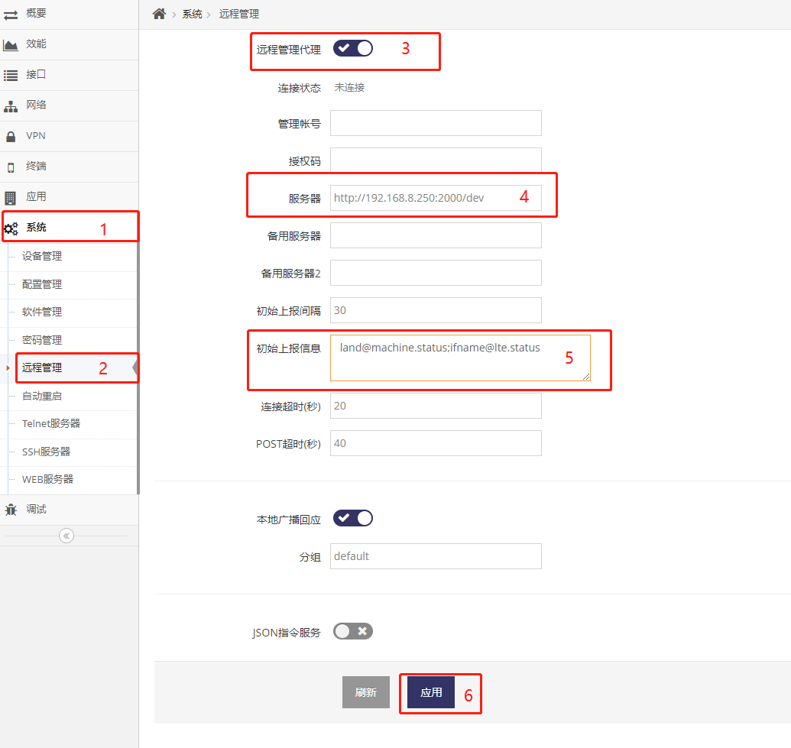
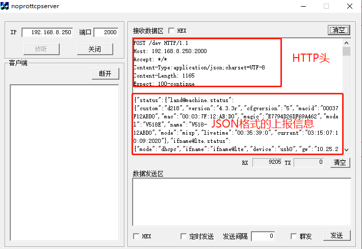

***
# 状态上报协议说明
设备通过agent@remote组件的配置来上报设备的指定状态, 如:
- 设备基本信息
- GPS定位信息
- LTE网络状态
- 客户端列表
- 其它等各种设备状态信息


### **1. 在网页中修改上报内容**

1. 进入**系统**下的**远程管理**页面, 可以看到**远程管理代理**
2. 开启**远程管理代理**即可看到**服务器**, **初始上报信息**内容项了
3. **服务器**, 即设备会向服务器 POST 状态信息
3. 而在**初始上报信息**中填入要上报的设备的哪几项即可, 有多项内容注意要以;号分隔  

- 如要设备只上报 GPS状态信息, 即可在**初始上报信息**中填入如下:
    ```
    uart@gnss.info
    ```
- 如要设备只上报 客户端列表, 即可在**初始上报信息**中填入如下:
    ```
    client@station.list
    ```
- 如要设备上报 设备基本信息,设备基本状态,4G网络状态及GPS状态信息, 即可在**初始上报信息**中填入如下:
    ```
    land@machine;land@machine.status;ifname@lte.status;uart@gnss.info
    ```
- 如要设备上报 设备基本信息,串口状态信息, 即可在**初始上报信息**中填入如下:
    ```
    land@machine;land@machine.status;uart@serial.status
    ```
- 如要设备上报 设备基本信息,4G网络状态, 4G2的网络状态, 客户端列表, 即可在**初始上报信息**中填入如下:
    ```
    land@machine;land@machine.status;ifname@lte.status;ifname@lte2.status;client@station.list
    ```
- 其它更多设备的状态信息请参看组件接口


### **2. 状态监控流程图**

1. 通常如果只需要设备静态的上报指定的信息可以不关注以下流程图
2. 以下流程图是介绍如何让设备动态的上报所需要的信息
3. 设备agent@remote组件的配置中的report下的status属性为 **初始上报信息**, agent@remote组件启动后会读取此配置来上报状态
4. 远端也可以修改 **上报状态行为配置** 来指定设备下一次上报时的内容及间隔
    - 远端会在设备上报时下发 **上报状态行为配置** 来控制设备以后上报的内容及间隔
    - 设备将会保留最后一次的 **上报状态行为配置**，并以此份配置内容向云平台上报
5. 如果不需要复杂的状态上报交互, 可先在设备上配置好初始的 **上报状态行为配置**, 然后远端只需要接收这些状态即可, 如何配置见第1节

以下流程图描述设备与远端之间的有关状态的交互， 用于说明远端如何动态控制设备上报状态行为
开发远端时请参考此流程图来实现对设备上报内容及间隔时间的控制 
    

```flow
st=>start: 设备启动
end=>end: 设备继续使用原有的上报状态行为配置进行下一次上报
end2=>end: 3. 设备跟据下发的上报状态行为配置进行下一次上报
post=>operation: 1.设备跟据组件中的初始上报状态行为配置(agent@remote:report)上报信息
save=>operation: 远端保存上报的状态信息
search=>condition: 远端查询设备是否有对应的上报状态行为配置
reportmodify=>operation: 2.下发当前上报状态行为配置
noreport=>operation: 不下发上报状态行为配置
st->post->save->search
search(yes,right)->reportmodify->end2
search(no)->noreport->end
```

- 设备上报时会根据 **上报状态行为配置** 来上报, 上报状态行为配置中包括两个重要信息 
  - 上报状态的间隔, 即设备会间隔这个时间进行下一次上报 
  - 上报状态的内容, 即指明设备上报哪些组件的状态 
- 设备重新启动后会从agent@remote的组件配置中读取初始 **上报状态行为配置** , 并跟据这个配置来上报 
- 设备在与远端交互过程中, 远端可在设备POST时下发 **上报状态行为配置** 调整设备的上报 
- 设备在收到远端的 **上报状态行为配置** 即会跟据这个配置来上报 


### **3. 状态监控详细协议**

交互协议为标准的HTTP协议, HTTP协议中使用JSON来描述数据
以下给出以上流程图有关1，2，3交互的详细协议介绍， 其中：
- 1为设备上报的内容 
- 2为远端下发新的上报状态行为配置给设备 
- 3为设备跟据新的上报状态行为配置来上报 
1. 设备上报状态, 通常设备重新启动后只会跟据agent@remote组件配置中的初始**上报状态行为配置**来上报, 可通过网页或是终端来配置 
    设备向远端发起POST请求, JSON中带有status节点, status节点下即是设备的状态信息, 以下假设**初始上报信息**为:
    ```
    land@machine;land@machine.status;ifname@lte.status;uart@gnss.info;client@station.list;network@frame.default
    ```
    设备POST如下:
    ```javascript
    POST /dev HTTP/1.1
    Host: lte.wmdevice.com
    Accept: */*
    Content-Type:application/json;charset=UTF-8

    {
        // 属性介绍
        "macid":"设备的MAC地址",                       // 网页上可配置
        "user":"设备所属的帐号",                       // 网页上可配置
        "vcode":"设备所属的帐号需要的验证码(可选)",      // 网页上可配置
        "status":                                     // 表明为状态的内容
        {
            "land@machine":            // 设备基本信息, 网页上可配置是否上报, 具体见land@machine组件接口文档
            {
                // main attributes
                "mode":"equipment operator mode",                // < ap, wisp, nwisp, gateway, dgateway, misp, nmisp, dmisp, mix >
                                                                // ap: access point
                                                                // wisp: 2.4G Wireless Internet Service Provider connection
                                                                // nwisp: 5.8G Wireless Internet Service Provider connection( need the board support 5.8G wirless baseband)
                                                                // gateway: wire WAN gateway
                                                                // dgateway: Dual wire WAN gateway
                                                                // misp: LTE Mobile Internet Service Provider connection( need the board support LTE baseband)
                                                                // nmisp: Next LTE/NR Mobile Internet Service Provider connection( need the board support LTE/NR baseband)
                                                                // dmisp: Dual LTE/NR Mobile Internet Service Provider connection( need the board support two LTE/NR baseba
                                                                // mix: custom mix connection from multiple internet connection
                                                                
                "copyright":"show the logo by designer",         // [ disable, enable  ]
                "name":"equipment name",                         // <string>
                "mac":"equipment MAC address",                   // < MAC address >
                "macid":"equipment MAC identify or serial id",   // < string >
                "language":"equipment language",                 // [ cn, en, jp, ... ], language code in two letter
                // other attributes
                "cfgversion":"equipent configure version",       // [ string ]
                "gpversion":"equipent group configure version"  // [ string ]    
            }
            "land@machine.status":    // 设备状态信息, 网页上可配置是否上报, 具体见land@machine组件接口文档
            {
                "mode":"equipment operator mode",               // < ap, wisp, nwisp, gateway, dgateway, misp, nmisp, dmisp, mix >
                                                                // ap: access point
                                                                // wisp: 2.4G Wireless Internet Service Provider connection
                                                                // nwisp: 5.8G Wireless Internet Service Provider connection( need the board support 5.8G wirless baseba
                                                                // gateway: wire WAN gateway
                                                                // dgateway: Dual wire WAN gateway
                                                                // misp: LTE Mobile Internet Service Provider connection( need the board support LTE baseband)
                                                                // nmisp: Next LTE/NR Mobile Internet Service Provider connection( need the board support LTE/NR baseban
                                                                // dmisp: Dual LTE/NR Mobile Internet Service Provider connection( need the board support two LTE/NR bas
                                                                // mix: custom mix connection from multiple internet connection
                "name":"equipment name",
                "platform":"equipment platform identify",
                "hardware":"equipment hardware identify",
                "custom":"equipment custom identify",
                "scope":"equipment scope identify",
                "version":"equipment version",
                "livetime":"system running time",               // hour:minute:second:day
                "current":"current date",                       // hour:minute:second:month:day:year
                "mac":"equipment MAC address",
                "macid":"equipment MAC identify or serial id",
                "model":"equipment model",
                "magic":"equipment magic identify"
            }
            "ifname@lte.status":      // 4G状态信息, 网页上可配置是否上报, 具体见ifname@lte组件接口文档
            {
                "status":"Current state",        // [ setup, register, ready, nodevice, reset, down, up ]
                                                    // setup for setup the modem
                                                    // register for register the network
                                                    // ready for ready to connect to internet, hint signal/network/simcard all ok
                                                    // nodevice for the corresponding module could not be found
                                                    // reset for reset the modem
                                                    // down for the network is down
                                                    // up for the network is connect succeed
                "mode":"IPV4 address mode",     // [ dhcpc ] for DHCP, [ static ] for manual setting， [ ppp ] for PPP dial
                "netdev":"netdev name",         // [ string ]
                "gw":"gateway ip address",      // [ ip address ]
                "dns":"dns ip address",         // [ ip address ]
                "dns2":"dns2 ip address",       // [ ip address ]
                "ip":"ip address",              // [ ip address ]
                "mask":"network mask",          // [ ip address ]
                "delay":"delay time",           // [ failed, 0-10000 ], failed for icmp failed
                "livetime":"online time",       // hour:minute:second:day
                "rx_bytes":"send bytes",        // [ number ]
                "rx_packets":"send packets",    // [ number ]
                "tx_bytes":"receive bytes",     // [ number ]
                "tx_packets":"receive packets", // [ number ]
                "mac":"MAC address",            // [ MAC address ]
                "method":"IPv6 address mode",   // [ disable ] is not use ipv6, [ manual ] for manual setting， [ automatic ] for DHCPv6, [ slaac ] for Stateless address autoconfiguration
                "addr":"IPv6 address",          // [ IPv6 address ]
                // For LTE/NR baseband Status, the parameters are the same as modem@lte.status
                // ##### For details, see status of modem@lte  #####
                "state":"Current state",        // [ setup, register, ready, connecting, connected reset ]
                                                    // setup for setup the modem
                                                    // register for register the network
                                                    // ready for ready to connect to internet, hint signal/network/simcard all ok
                                                    // connecting for connect to the internet
                                                    // connected for connect internet succeed
                                                    // reset for reset the modem
                "mversion":"Modem version",     // [ string ]
                "imei":"IMEI numer",            // [ string ]
                "imsi":"IMSI number",           // [ string ]
                "iccid":"ICCID number",         // [ number, nosim, pin, puk ]
                                                        // number for iccid
                                                        // nosim for cannot found the simcard
                                                        // pin for the simcard need PIN code
                                                        // puk for the simcard pin error

                "plmn":"MCC and MNC",           // [ number, noreg, dereg ]
                                                        // number for MCC and MNC
                                                        // noreg for cannot register to opeartor
                                                        // unreg for cannot register to opeartor
                                                        // dereg for register to operator be refused
                "netera":"technology Generation",// [ 2G, 3G, 4G, 5G ], Optional
                "nettype":"network type",        // The format varies depending on the module
                                                // 2G usually shows GSM, GPRS, EDGE, CDMA
                                                // 3G usually shows WCDMA, EVDO, TDSCDMA, HSPA, HSDPA, HSUPA
                                                // 4G usually shows LTE, FDD, TDD

                
                "signal":"signal level",         // [ 0, 1, 2, 3 4 ], 0 for no signal, 1 for weakest signal , 4 for strongest signal
                "csq":"CSQ number",              // [ number ]
                "rssi":"signal intensity",       // [ number ], the unit is dBm
                "rsrp":"RSRP value",             // Optional, The format varies depending on the module
                "rsrq":"RSRQ value",             // Optional, The format varies depending on the module
                "sinr":"sinr value",             // Optional, The format varies depending on the module 
                "band":"current band",           // Optional, The format varies depending on the module
                "pcid":"Physical Cell ID",       // [ number ], Optional

                "operator":"operator name",      // [ string ]
                "operator_advise":               // Recommended profile for PLMN
                {
                    "name":"operator name",               
                    "dial":"dial number",                     // [ number ]
                    "cid":"dial CID",                         // [ number ], default is 1
                    "type":"ip address type",                 // [ ipv4, ipv6, ipv4v6 ]
                    "apn":"APN name",                         // [ string ]
                    "user":"user name",                       // [ string ]
                    "passwd":"user password"                  // [ string ]
                }

            }, 
            "uart@gnss.info":      // GPS信息, 网页上可配置是否上报, 具体见uart@gnss组件接口文档
            {
                "step":"step of location",                  // [ setup, search, located ]
                "utc":"UTC date",                           // [ float ]
                "lon":"longitude",                          // [ float ]
                "lat":"latitude",                           // [ float ]
                "longitude":"longitude",                    // [ float ]
                "latitude":"latitude",                      // [ float ]
                "speed":"speed",                            // [ float ]
                "direction":"direction",
                "declination":"declination",
                "elv":"Either altitude height",             // [ float ], the unit is meter
                "inview":"Number of visible satellites",    // [ number ]
                "inuse":"Number of satellites in use"       // [ nubmer ]     
            },
            "client@station.list":   // 客户端列表, 网页上可配置是否上报, 具体见client@station组件接口文档
            {
                ...                  // 客户端
            },
            "network@frame.default":// 设备默认出口网络的状态, 网页上可配置是否上报, 具体见network@frame组件接口文档
                                        // 此状态会跟据当前上网的模式发生变化, 通常就是当前外网连接的状态
            {                           // 在网关模式下即是ifname@wan.status
                "ifname":"ifname object",
                "mode":"current mode",
                "status":"current state",
                "ifdev":"corresponding ifdev object",
                "netdev":"netdev name of linux",
                "ip":"IP address",
                "rx_bytes":"receive bytes",
                "rx_packets":"receive packets",
                "tx_bytes":"tx bytes",
                "tx_packets":"tx packets",
                "mac":"MAC address"
                // ... many other properties show
            }, 
            ...                     // 更多其它状态可查接对应的组件接口文档
        }
    }
    ```

2. 远端下发上报状态行为配置 
    当远端需要修改设备上报状态行为配置(通常由远端的客户修改)将会将下发给设备(JSON中带有report节点), 内容如下：
    ```javascript
    HTTP/1.1 200 OK
    Server: AP-ApCenter
    Date: Tue Dec 31 17:49:24 2013
    Connection: keep-alive

    {
        // 属性介绍
        "report":     // 新的上报状态行为配置
        {
            "interval":"上报的间隔",     // 以秒为单位
            "status":                   // 上报的状态内容
            {
                "组件接口":"",
                "组件接口2":"",
                "组件接口3":""
                ...                    // 其它组件接口
            }
        }

        // 示例
        "report": 
        {
            "interval":"30",     // 上报的间隔为30秒
            "status":            // 重新规定上报的状态内容
            {
                "land@machine":"",         // 要求上报设备基本信息
                "land@machine.status":"",  // 要求上报设备基本状态
                "ifname@lte.status":"",    // 要求上报4G网络状态
                "ifname@wan.status":"",    // 要求上报WAN网络状态
                "ifname@wisp.status":"",   // 要求上报无线WAN网络状态
                "network@frame.default":"",// 要求上报当前默认网络连接状态
                "network@frame.extern":"", // 要求上报所有外网连接网络状态
                "uart@gnss.info":"",       // 要求上报 GPS状态信息
                "uart@serial.status":"",   // 要求上报串口状态(可外接GPS时为外接GPS状态)
                "client@staion.list":""    // 要求上报客户端列表
            }
        }
    }
    ```
    设备收到后将跟据其中的interval的时间来进行下一次上报, 并在以context规定的内容上报

3. 设备以新的上报状态行为配置上报 
    ```javascript
    POST /dev HTTP/1.1
    Host: lte.wmdevice.com
    Accept: */*
    Content-Type:application/json;charset=UTF-8

    {
        // 示例
        "macid":"00037F12AAD0",        // 设备的MAC地址
        "user":"dimmalex@gmail.com",   // 设备所属的帐号
        "vcode":"123456",              // 设备所属的帐号需要的验证码

        "status":  // 表明为状态的内容
        {
            "land@machine":
            {
                // 设备基本信息
            },
            "land@machine.status":
            {
                // 设备基本状态
            },
            "ifname@lte.status":
            {
                // 4G网络状态
            },
            "ifname@wan.status":
            {
                // WAN网络状态
            },
            "ifname@wisp.status":
            {
                // 无线WAN网络状态
            },
            "network@frame.default":
            {
                // 默认网络连接状态
            },
            "network@frame.extern":
            {
                // 所有外网连接网络状态
            },
            "uart@gnss.info":
            {
                // GPS状态信息
            },
            "uart@serial.status":
            {
                // 串口状态(可外接GPS时为外接GPS状态)
            },
            "client@staion.list":
            {
                // 客户端列表
            }
        }
    }
    ```


### **4. 关于上报间隔**

设备向远端发起POST请求后, 会等待远端回复信息, 这个时间叫交互超时(Talk Timeout), 这个时间可以在网页上配置
如果远端不回复数据也不关闭HTTP的连接将导致设备在此等待一个时间, 这样上报间隔会就被拉长, 即变成: POST后等待时间+上报间隔.


### **附. 测试设备上报信息**

通过在电脑上运行TCP服务器， 然后将设备的**管理服务器**的设置为TCP服务器所在的电脑的IP地址, 通过TCP服务器来接收设备上报的数据, 确定设备可以正确的上报指这下的状态信息

- 首先关机电脑上防火墙及所有防火墙软件

- 下载TCP服务器软件， 并在电脑上运行, 下载地址为: ftp://ftp.wmdevice.com/pub/tools/tcp_server.exe
    示例： 
    电脑的IP地址为192.168.8.250， 运行的TCP服务器的端口为2000
    

- 设置设备的管理服务器指向运行的TCP服务器
    

- TCP服务器显示接收到设备上报的数据
    
