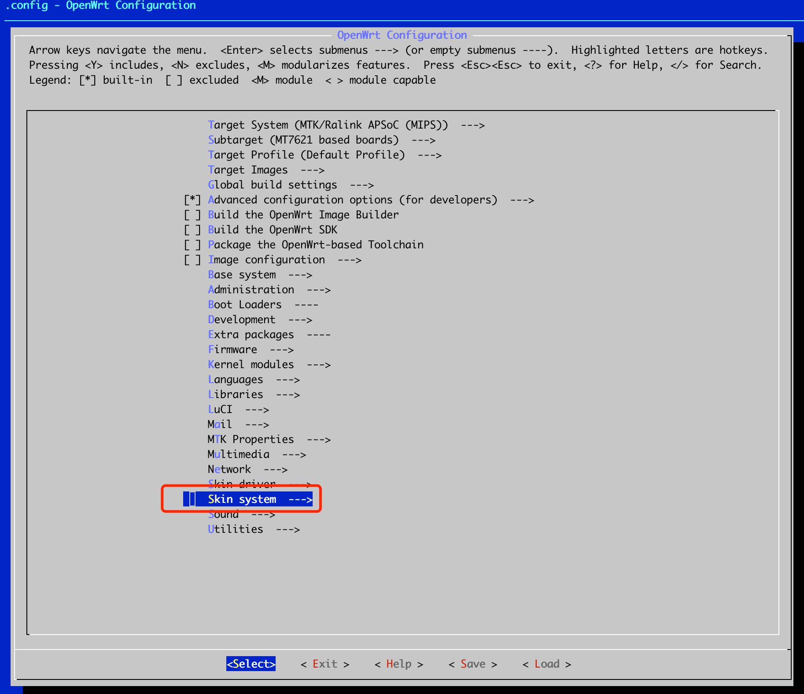
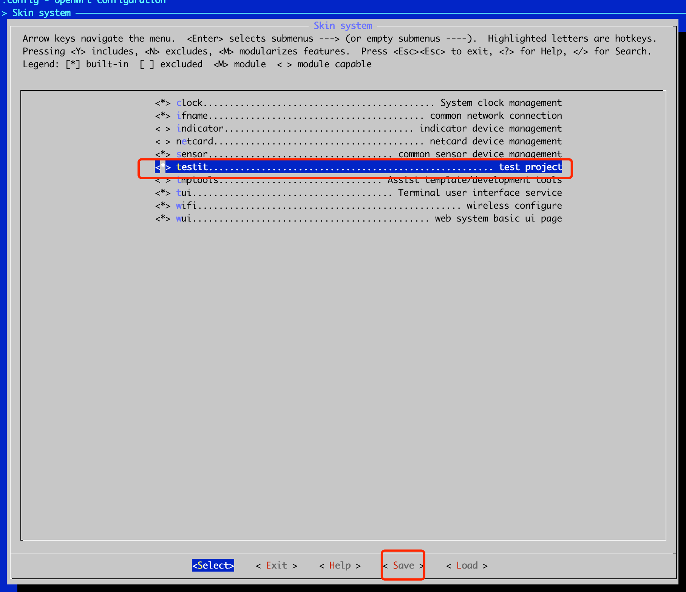
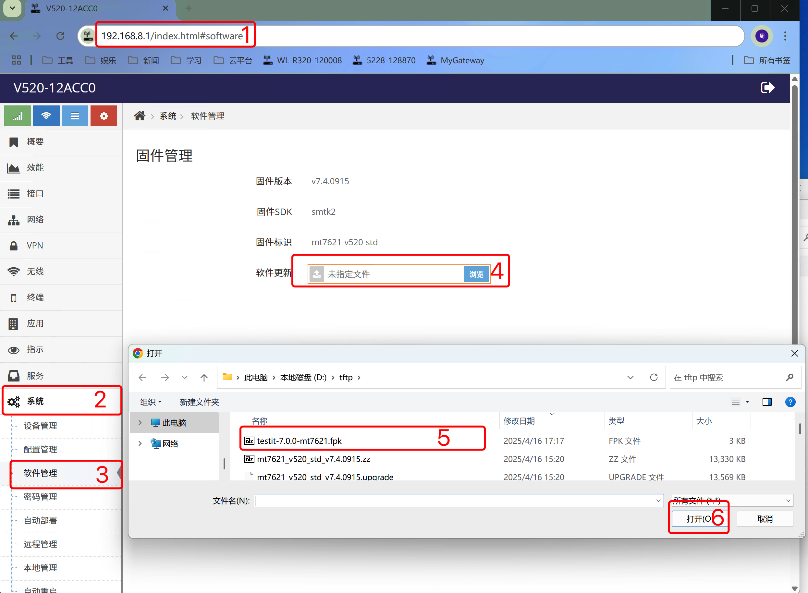

## 创建项目及可执行程序

### 创建项目一并创建可执行程序
在tiger7目录下执行: 
```shell
./config/host/tools/prj add_exe 项目名 可执行程序名
```
提示输入可执行程序简介, 输入简介后回车即可在项目内创建对应的可执行程序代码目录
如对应的项目不存在将先会提示输入项目简介并创建项目
***将在项目目录下创建可执行程序同名的目录，并在目录下生成可执行程序名同名的.c代码文件***


## 示例, 创建项目可执行程序


#### 创建可执行程序

在SDK目录下输入./config/host/tools/prj add_exe testit testbin回车将提示您输入项目简介及可执行程序简介
```shell
ubuntu@VM-0-8-ubuntu:~/tiger7$ ./config/host/tools/prj add_exe testit testbin
project testit introduction: test project
execute program testbin introduction: test binary
The execute program directory project/testit/testbin
ubuntu@VM-0-8-ubuntu:~/tiger7$
```
输入简介后回车将创建testit项目及testbin可执行程序目录, 示例中可执行程序代码位于project/testit/testbin中, 即在~/tiger7/project/testit/testbin


#### 编辑可执行程序源代码文件

创建可执行程时会在project/testit/testbin下创建testbin.c的可执行程序代码模板

输入vi ./project/testit/testbin/testbin.c 即可编辑可执行程序源文件
```c
#include "land/skin.h"

/* main function */
int main( int argc, const char **argv )
{
	info( "the %s of %s has be executed", EXE_ID, PROJECT_ID );
	printf( "the %s of %s has be executed\n", EXE_ID, PROJECT_ID );
	return 0;
}
```
1. 以上代码中包含头文件可以随意更改, 示例给出的头文件为SkinOS通用的头文件, 此头文件包含了libc中常用的头文件
2. 以上main函数中info()为向SkinOS日志系统打印日志, 也可以使用syslog标准的libc函数
3. 模板只是简单的打印当前项目名及可执行程序名


#### 编辑可执行程序mconfig
在project/testit/testbin目录下的mconfig文件可添加编译时的选项
输入vi ./project/testit/testbin/mconfig 即可编辑此文件

```makefile
# Compile-time increment CFLAGS
CFLAGS += -I../

# Compile-time increment LDFLAGS
LDFLAGS +=

# The library file that links to the.a or.so added at compile time
LIBA_ADDIN :=
LIBSO_ADDIN :=
```

1. **CFLAGS** 用于设置 C/C++ 编译器选项的环境变量。它可以用来指定编译过程中的各种选项，如优化级别、警告级别、头文件包含路径等
2. **LDFLAGS** 用于设置链接器选项的环境变量。它可以用来指定链接过程中的各种选项，如库路径、库文件等
3. **LIBA_ADDIN** 用于设置链接一些静态库文件, 如一些.a文件
4. **LIBSO_ADDIN** 用于设置链接共享库文件, 如一些.so文件

如以下示例链接libcurl, libcrypto, libssl及libevent
```makefile
LDFLAGS += -lcurl -lcrypto -lssl -levent
``` 


#### 添加更多的源代码文件
可在./project/testit/testbin目录中添加更多的.c或.h文件, 编译时都一并编译用于生成testbin可执行程序


#### 勾选项目 

因新加了项目需要先刷新menuconfig的菜单
```shell
ubuntu@VM-0-8-ubuntu:~/tiger7$ make menu
```
然后执行make menuconfig后在 ***Skin system*** 下可以看到对应的 ***testit项目***, 勾选即可

```shell
dimmalex@ubuntu18:~/tiger7$ make menuconfig
```




#### 编译项目 
可单独编译testit项目, 也可以要求编译整个固件(将会把testit的项目编译并打包到固件中)
- 单独编译testit项目
	```shell
	ubuntu@VM-0-8-ubuntu:~/tiger7$ make kernel obj=testit
	```
	单独编译testit项目将会在./build/store目录下生成以项目名开头的 **fpk软件包**
	```shell
	ubuntu@VM-0-8-ubuntu:~/tiger7$ ls build/store/testit*
	build/store/testit-7.0.0-mt7621.fpk
	ubuntu@VM-0-8-ubuntu:~/tiger7$ 
	```
	此fpk软件包可直接通过网页升级 (**系统=>软件管理=>软件更新**) 的方式安装到设备中

- 编译整个固件
	```shell
	ubuntu@VM-0-8-ubuntu:~/tiger7$ make
	```
	将会在./build目录下生成zz后缀的 **固件升级包**
	```shell
	ubuntu@VM-0-8-ubuntu:~/tiger7$ ls build/*.zz
	build/mt7621_v520_std_v7.4.0915.zz
	ubuntu@VM-0-8-ubuntu:~/tiger7$ 
	```
	此zz后缀的固件升级包可直接通过网页升级 (**系统=>软件管理=>软件更新**) 到设备中

***在编译过程中一定要注意报错信息, 当有出错时将不会生成fpk软件包, 但因有著多打印可能会出错信息推至控制台最上方***


#### 升级到设备上 

不管是 **fpk软件包** 或是 **固件升级包** 都可通过以下方式升级到设备中

通过在设备网页的 ***系统*** 菜单下的 ***软件管理*** 界面中 **软件更新** 后的浏览按键选择 ***FPK软件包*** 升级或选择整个 ***固件*** 升级即可



***注意: 每次更新FPK软件包都会覆盖掉之前项目同名的软件包***


#### 在运行系统中查询项目安装的位置 

通过SSH或telnet登陆到设备
```shell
dimmalex@HMB:~/tiger7$ telnet 192.168.8.1
Trying 192.168.8.1...
Connected to 192.168.8.1.
Escape character is '^]'.

V520-12ACC0 login: admin
Password:

               EEEEEEEEE   LL           FFFFFFFFF
               EE          LL           FF
               EE          LL           FF
               EEEEEEEEE   LL           FFFFFFFFF
               EE          LL           FF
               EE          LL           FF
        Ashy   EEEEEEEEE   LLLLLLLLLL   FF

 -----------------------------------------------------------
 Command Help
 -----------------------------------------------------------
 @ ----------------------- List all the project
 @? ---------------------- List all the static component
 @@ ---------------------- List all the dynamic component
 <com> ------------------- Show component configure
 <com>:<config> ---------- Get component configure attribute
 <com>:<config>=<value> -- Set component configure attribute
 -----------------------------------------------------------

```

后输入ashy回车即可进入shell模式

```
$ ashy


BusyBox v1.23.2 (2025-04-16 15:17:22 CST) built-in shell (ash)


               EEEEEEEEE   LL           FFFFFFFFF
               EE          LL           FF
               EE          LL           FF
               EEEEEEEEE   LL           FFFFFFFFF
               EE          LL           FF
               EE          LL           FF
        Ashy   EEEEEEEEE   LLLLLLLLLL   FF

 --------------------------------------------------------------
 Command Help
 --------------------------------------------------------------
 hetui ---------------------- Enter to HE terminal
 he @ ----------------------- List all the project
 he @? ---------------------- List all the static component
 he @@ ---------------------- List all the dynamic component
 he <com> ------------------- Show component configure
 he <com>:<config> ---------- Get component configure attribute
 he <com>:<config>=<value> -- Set component configure attribute
 --------------------------------------------------------------
admin@V520-12ACC0:~#
```

输入he @列出运行系统中所有的项目及对应的安装位置
```shell
admin@V520-12ACC0:~# he @
{
    "agent":"/prj/agent/",
    "arch":"/prj/arch/",
    "cambattary":"/prj/cambattary/",
    "certauth":"/prj/certauth/",
    "client":"/prj/client/",
    "clock":"/prj/clock/",
    "ddns":"/prj/ddns/",
    "drouter":"/prj/drouter/",
    "forward":"/prj/forward/",
    "gnss":"/prj/gnss/",
    "ha":"/prj/ha/",
    "ifname":"/prj/ifname/",
    "io":"/prj/io/",
    "ipsec":"/prj/ipsec/",
    "ipsecs":"/prj/ipsecs/",
    "land":"/prj/land/",
    "modem":"/prj/modem/",
    "modemdrv":"/prj/modemdrv/",
    "network":"/prj/network/",
    "ovpn":"/prj/ovpn/",
    "ovpns":"/prj/ovpns/",
    "pdriver":"/prj/pdriver/",
    "portal":"/prj/portal/",
    "sdwan":"/prj/sdwan/",
    "sensor":"/prj/sensor/",
    "snmp":"/prj/snmp/",
    "storage":"/prj/storage/",
    "tui":"/prj/tui/",
    "uart":"/prj/uart/",
    "upnp":"/prj/upnp/",
    "vpn":"/prj/vpn/",
    "webs":"/prj/webs/",
    "wifi":"/prj/wifi/",
    "wui":"/prj/wui/",
    "testit":"/mnt/internal/prj/testit/"
}

```
以上可以看到testit项目位于/mnt/internal/prj/testit/中


#### 在运行系统中执行可执行程序 

进入testit项目目录
```shell
admin@V520-12ACC0:~# cd /mnt/internal/prj/testit/
admin@V520-12ACC0:/tmp/mnt/internal/prj/testit# ls
bin       install   lib       prj.json  testbin
admin@V520-12ACC0:/tmp/mnt/internal/prj/testit#
```

执行testbin

```shell
admin@V520-12ACC0:/tmp/mnt/internal/prj/testit# ./testbin
the testbin of testit has be executed
admin@V520-12ACC0:/tmp/mnt/internal/prj/testit#
```

执行后可看到testbin程序printf的信息

