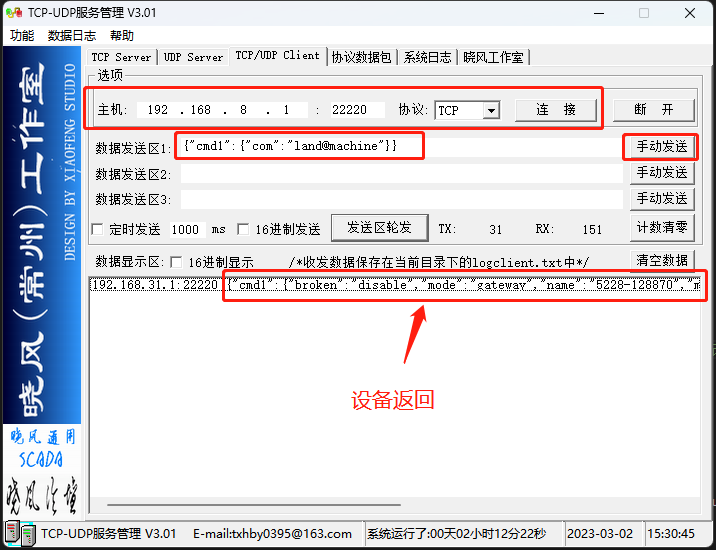

***
# 本地被管理协议说明
设备可接受来自局域网的管理协议, 管理协议通常由批量管理工具或本地的其它设备发出, 通过此协议批量管理工具或其它设备可以实现局域网管理设备


### **1. 协议分类**  

在局域网与设备通信分为三种协议
- **局域网搜索协议(UDP), 用于在局域网内搜索所有的设备**
- **局域网查询协议(UDP), 用于在局域网内搜索所有的设备并查询所有设备的信息**
- **JSON控制协议(TCP), 用于在通过TCP协议修改或查询指定设备的配置及调用指定设备组件的接口**


### **2. 局域网搜索协议**
在局域网通过UDP广播包搜索网内的所有设备
##### 1. 搜索网内设备交互流程


```flow
device=>end: 2. 属于对应 组 的设备向IP为255.255.255.255的UDP端口22222回复MAC及IP及WEB端口: MAC地址|IP地址|管理网页端口|
data=>operation: 1. 管理工具向IP为255.255.255.255的UDP端口22222广播字符串: 组名
client=>start: 开始
client->data->device
```
*注: 所有设备默认都属于default组（可通过网页修改）, 向UDP端口22222广播default即可搜索局域网内所有的设备*

##### 2. 搜索网内的设备交互详解
- 1. 管理工具发送搜索请求
    即向IP为255.255.255.255的UDP端口22222广播组名7个字符default, 所有在网内设备都能收到这个字符串
    ```
    default
    ```
- 2. 设备回复
    所有设备收到default字符串后会向UDP端口22222广播回复自已的MAC地址、IP地址及管理网页的端口, 格式为: 
    ```
    MAC地址|IP地址|管理网页端口
    ```
- 示例: 如设备的MAC为00:03:7F:12:BB:80、IP为192.168.8.1、WEB管理服务器端口为80, 回复数据将为如下32个字符加上十六进制的0x0结尾:
    ```
    00037F12BB80|192.168.8.1|80
    ```
##### 3. 使用Windwos工具测试搜索网内的设备收发包
- 左边为发送工具, 向192.168.8.1的22222端口发送UDP包(广播其实是向255.255.255.255的22222端口发UDP包)
- 右边为接收工具, 在当前PC机(192.168.8.250)上的22222端口上接收设备的回复包

*注意: 因未找到合适的广播工具而用单播工具代替演示, 在实际开发过程中通过向UDP的22222端口广播相同的数据将产生相同的结果*


### **3. 局域网查询协议**
在局域网通过UDP广播包搜索并查询网内的所有设备的信息, 因使用UDP协议所以当交互数据过大时会出现丢包的问题, 不合适做信息量较大的交互

##### 1. 查询网内设备基本信息交互流程


```flow
device=>end: 2. 属于对应 组 的设备向IP为255.255.255.255的UDP端口22222回复: MAC地址|IP地址|指令回复1,指令回复2,指令回复2,...|
data=>operation: 1. 管理工具向IP为255.255.255.255的UDP端口22222广播字符串: 组名,查询指令1,查询指令2,查询指令3,…
client=>start: 开始
client->data->device
```
*注: 所有设备默认都属于default组（可通过网页修改）, 广播default即可搜索局域网内所有的设备*

##### 2. 查询网内设备基本信息交互详解
- 1. 管理工具发送查询请求, 即向IP为255.255.255.255的UDP端口22222广播组名7个字符default加逗号及以逗号间隔的指令, 所有在网内设备都能收到这个字符串
    ```
    default,he查询指令1,he查询指令2,he查询指令3
    ```
- 2. 设备回复, 所有设备收到后会向UDP端口22222广播回复自已的MAC地址、IP地址及指令的执行结果, 格式为: 
    ```
    MAC地址|IP地址|he查询指令1回复,he查询指令2回复,he查询指令3回复
    ```
    以下列举几个常用的he指令, he指令格式介绍见[终端HE指令使用说明](../tui/he_command.md), 具体更多的指令可以参看设备组件对应的md文件:
    ```
    land@machine:model           //  查询设备的型号
    land@machine:version         //  查询设备的软件版本
    land@machine:mode            //  查询设备的工作模式
    ifname@lte.status:imei       //  查询4G的IMEI号
    ifname@lte.status:iccid      //  查询4G的CCID号
    ifname@lte.status:signal     //  查询4G的信号
    ifname@lte.status:rssi       //  查询4G的信号强度
    ifname@lte.status:rsrp       //  查询4G的RSRP
    gnss@nmea.status:step        //  查询GPS状态
    ```

- 示例
    如要查询局域网所有设备的型号及IMEI号将发送如下:
    ```
    default,land@machine:model,ifname@lte.status:imei
    ```
    如MAC为00:03:7F:12:3A:D0（IP为192.168.8.1）型号为A218的设备将回复如下：
    ```
    00037F123AD0|192.168.8.1|A218,862107043556307
    ```
    如MAC为00:03:7F:13:3A:D8（IP为192.168.8.1）型号为V519的设备将回复如下：
    ```
    00037F133AD08|192.168.8.1|V519,86210704355692
    ```    
##### 3. 使用Windwos工具测试查询网内的设备收发包
- 左边为发送工具, 向192.168.8.1的22222端口发送UDP包, 查询局域网内所有设备的型号及CCID号
- 右边为接收工具, 在当前PC机(192.168.8.250)上的22222端口上接收设备的回复包, MAC为88:12:4E:30:91:A0的设备回复自已的型号为A219, CCID号为89860117851138508772

*注意: 因未找到合适的广播工具而用单播工具代替演示, 在实际开发过程中通过向UDP的22222端口广播相同的数据将产生相同的结果*


### **4. JSON控制协议**
通过TCP端口与设备交互JSON指令， 实现对设备的控制, 使用TCP协议交互, 适合交互各种信息

##### 1. 在设备上开启JSON控制协议
默认设备不会响应JSON控制协议, 需要进入管理网页打开此协议

或者通过终端命令行打开此协议
```
# agent@local:json           // 查询json服务器的状态
disable
# agent@local:json=enable    // 修改json服务器的状态为开启
true
# agent@local:json           // 再次查询修改后的配置
enable
# 
```

##### 2. 与设备的交互流程
- 如下图所示

- 交互简介
    每一次的交互都需要建立TCP连接, 然后再发送JSON指令, 设备收到JSON指令将会回复JSON指令的执行结果, 之后将立即关闭TCP连接, 因此, 每一次交互都需要建立一个TCP连接, 也称之为短连接, 为保证指令的完整性, 指令被设计成一个完整的JSON对象, 同样回复信息也是一个完整的JSON对象, 对于设备的操作可以分为三种JSON指令：
	1. 查询配置：用于查询设备当前的配置
	2. 修改配置：用于修改设备的配置
	3. 调用组件接口：用于查看设备的状态等信息

##### 3. JSON指令格式
- 查询组件配置交互格式介绍
    查询组件配置指令格式, 对应的he指令格式为 ***组件名称[:属性/属性/...]***
    ```json
    {
        "cmd1":                    // 指令命名, 用于在JSON中唯一的标识当前指令, 由此可实现在一个交互中多个指令, 设备回复时也以此指令命名标识其回复
        {
            "com":"组件名称",
            "ab":"属性[/属性/…]"   // 可选, 无表示查询所有配置
        }
    }
    ```
    返回值跟据组件的实际配置格式可为：
    1. 一个JSON
        ```json
        {
            "cmd1":{JSON格式的配置内容}
        }
        ```
    2. 一个字符串
        ```json
        {
            "cmd1":"配置内容"
        }
        ```
    3. 空
        ```json
        {
        }
        ```

- 修改组件配置交互格式介绍
    修改组件配置指令格式(值为字符串时), 对应的he指令格式为 ***组件名称[:属性/属性/...]=值***
    ```
    {
        "cmd1":                   // 指令命名, 用于在JSON中唯一的标识当前指令, 即设备回复时也以此指令命名回复
        {
	        "com":"组件名称",
	        "ab":"属性[/属性/…]",  // 可选
	        "op":"=",
	        "v":"值"
        }
    }
    ```
    修改组件配置指令格式(值为JSON), 对应的he指令格式为 ***组件名称[:属性/属性/...]={值}***
    ```json
    {
        "cmd1":                   // 指令命名, 用于在JSON中唯一的标识当前指令, 即设备回复时也以此指令命名回复
        {
	        "com":"组件名称",
	        "ab":"属性[/属性/…]",  // 可选
	        "op":"=",             // =号表示完全覆盖, |表示或修改(只修改JSON格式的值给出的项)
	        "v":{JSON格式的值}
        }
    }
    ```
    修改成功返回值成功是为ttrue, 失败时为tfalse：
    1. 返回ttrue
        ```json
        {
            "cmd1":"ttrue"
        }
        ```json
    2. 返回tfalse
        ```
        {
            "cmd1":"tfalse"
        }
        ```

- 调用组件接口交互格式介绍
    调用组件接口指令格式, 对应的he指令格式为 ***组件名称.接口名称[ 参数1, 参数2, 参数3 ]***
    ```json
    {
        "cmd1":                 // 指令命名, 用于在JSON中唯一的标识当前指令, 即设备回复时也以此指令命名回复
        {
	        "com":"组件名称",
	        "op":"接口名称",
	        "1":"参数1",        // 可选, 参数可为字符串(即引号开头及引号结尾), 也可以为JSON(即{开头}结尾)
	        "2":"参数2",        // 可选, 参数可为字符串(即引号开头及引号结尾), 也可以为JSON(即{开头}结尾)
            "3":"参数3"         // 可选, 参数可为字符串(即引号开头及引号结尾), 也可以为JSON(即{开头}结尾)
        }
    }
    ```
    跟据调用组件接口不同, 返回值可分为以下五种：
    1. 返回ttrue, 通常用于表示操作成功
        ```json
        {
            "cmd1":"ttrue"
        }
        ```
    2. 返回tfalse, 通常用于表示操作失败
        ```json
        {
            "cmd1":"tfalse"
        }
        ```
    3. 返回JSON, 通常表示操作的返回信息
        ```json
        {
            "cmd1":{返回JSON内容}
        }
        ```
    4. 返回字符串, 通常表示操作的返回信息
        ```json
        {
            "cmd1":"返回字符串内容"
        }
        ```
    5. 无返回, 有的接口不返回任何信息
        ```json
        {
            "cmd1":"NULL"
        }
        ```


##### 4. 示例-获取设备基本信息
- 设备基本信息属于land@machine组件的配置, 因此发送查询组件配置指令(在HE终端中的命令行为land@machine), 点击查看[设备基本信息组件](../land/machine.md)介绍
```json
{
    "cmd1":
    {
        "com":"land@machine"
    }
}
```
- 设备返回
```json
{
    "cmd1":
    {
        "platform":"smtk",                   // 平台编号
        "hardware":"mt7628",                 // 芯片编号
        "custom":"d218",                     // 产品编号
        "scope":"std",                       // 定制编号
        "language":"cn",                     // 语言
        "macid":"00037F123310",              // MAC号
        "mac":"00:03:7F:12:33:10",           // MAC地址
        "name":"D218-123310",                // 设备名
        "title":"D218-123310",               // 标识名
        "mode":"misp"                        // 工作模式
                                               //    gateway为网关
                                               //    ap为热点
                                               //    bridge为桥
                                               //    repeater为中继
                                               //    wisp为WISP
                                               //    misp为4G
                                               //    mix为混合模式
    }
}
```
使用TCP客户端工具测试:


##### 5. 示例-获取设备基本状态
- 设备基本状态需要通过land@machine组件的status接口返回, 因此发送调用land@machine组件的status接口指令(在HE终端中的命令行为land@machine.status), 点击查看[设备基本信息组件](../land/machine.md)介绍
```json
{
    "cmd1":
    {
        "com":"land@machine",
        "op":"status"
    }
}
```
- 设备返回
```json
{
    "cmd1":
    {
        "custom":"d218",                     // 产品编号
        "version":"4.3.3d",                  // 版本号
        "macid":"00037F123310",              // MAC号
        "mac":"00:03:7F:12:33:10",           // MAC地址
        "magic":"23571121DF68ACC3",
        "model":"D218",                      // 产品型号
        "name":"D218-123310",                // 设备名
        "mode":"misp",                       // 工作模式
        "livetime":"00:01:18:0",             // 在线时长  时：分：秒：天
        "current":"01:41:15:01:01:2016"      // 当前时间  时:分:秒:月:日:年
    }
}
```

##### 6. 示例-获取4G状态信息
- 4G状态信息通过ifname@lte的status接口返回, 因此发送调用ifname@lte组件的status接口指令(在HE终端中的命令行为ifname@lte.status), 点击查看[4G网络管理组件](../ifname/lte.md)及[4G模块管理组件](../modem/lte.md)介绍
```json
{
    "cmd1":
    {
        "com":"ifname@lte",
        "op":"status"
    }
}
```
- 设备返回
```json
{
    "cmd1":
    {
        "status":"up",                        // up表示已连接, down表示未连接, uping表示连接中
        "mode":"dhcpc",                       // 拨号模式, dhcpc为自动获取, ppp为PPP拨号, static为静态IP
        "ip":"10.99.4.192",                   // IP地址
        "mask":"255.255.255.128",             // 子网掩码
        "gw":"10.99.4.193",                   // 网关
        "dns":"211.136.17.107",               // DNS
        "dns2":"211.136.20.203",              // DNS
        "mac":"76:C7:8C:05:39:F3",            // MAC地址
        "rx_bytes":"6864",                    // 收包字节
        "rx_packets":"65",                    // 收包数
        "tx_bytes":"7296",                    // 发包字节
        "tx_packets":"74",                    // 发包数
        "livetime":"00:04:37:0",              // 在线时长 时:分:秒:天
        "keeplive":"244",                     // 链路时延, 单位为ms 

        // 4G基带状态, 通过modem@lte.status也可以获取到
        "name":"Quectel-EC2X",                // 基带名称
        "step":"dial",                       // 指出当前基带处于哪一个步骤
                                                // found表示发现基带
                                                // setup表示启动基带中
                                                // checksim表示查询SIM卡中
                                                // checknet表示查询网络中
                                                // checksig表示查询信号中
                                                // ready表示基带无异常
                                                // dial表示PDP激活中
                                                // online表示上线
                                                // offline表示离线
                                                // reset表示基带重置
        "error":"nosignal",           // 基带出错时会出现此值
                                        // pin表示要求SIM卡PIN码
                                        // puk表示PIN码出错
                                        // nosim表示无SIM卡
                                        // noreg表示未注册网络
                                        // dereg表示拒绝注册网络
                                        // unreg表示未知网络
                                        // nosignal表示无信息
                                        // nodevice表示无设备
        "imei":"860588045196683",        // IMEI号
        "imsi":"460040187533037",        // IMSI号
        "iccid":"898602B1191790004537",  // ICCID号
        "lac":"2869",                    // 基站位置区编码
        "ci":"33C5083",                  // 基站扇区编号
        "plmn":"46000",                  // MCC+MNC
        "nettype":"TDD LTE",             // 网络类型
        "csq":"15",                      // CSQ
        "rssi":"-85",                    // 信号强度, dBm值
        "signal":"4",                    // 信号格数(1-4格), 1表示一格, 2表示两格, 3表示三格, 4表示四格, 0或空表示无信号
        "operator":"中国电信",            // 运营商名称, UTF8编码
        "livetime":"00:04:37:0"          // 连接时长 时:分:秒:天
    }
}
```


##### 7. 示例-获取第二个4G状态信息(对于双模块设备)
- 第二个4G状态信息通过ifname@lte2的status接口返回, 因此发送调用ifname@lte2组件的status接口指令(在HE终端中的命令行为ifname@lte2.status), 点击查看[4G网络管理组件](../ifname/lte.md)及[4G模块管理组件](../modem/lte.md)介绍
```json
{
    "cmd1":
    {
        "com":"ifname@lte2",
        "op":"status"
    }
}
```
- 设备返回
```json
{
    "cmd1":
    {
        ... // 内容与 6 相同
    }
}
```


##### 8. 示例-获取设备上的客户端信息
- 设备上的客户端信息由client@station组件的list接口返回, 因此发送调用client@station组件的list接口指令(在HE终端中的命令行为client@station.list), 点击查看[客户端管理组件](../client/station.md)介绍
```json
{
    "cmd1":
    {
        "com":"client@station",
        "op":"list"
    }
}
```
- 设备返回
```json
{
    "cmd1":
    {
        "00:E0:4C:68:2A:8B":                           // 客户端MAC地址
        {
            "ip":"192.168.1.250",                        // IP地址
            "device":"lan",                              // 接入的网络接口
            "ifname":"ifname@lan",                       // 接入的网络连接
            "ontime":"25172",                            // 上线时设备的启动秒数
            "livetime":"00:40:25:0"                      // 连接时间
        },
        "FC:87:43:DC:6F:B4":                          // 客户端MAC地址
        {
            "ip":"192.168.1.248",                        // IP地址
            "device":"lan",                              // 接入的网络接口
            "ifname":"ifname@lan",                       // 接入的网络连接
            "ontime":"25186",                            // 上线时设备的启动秒数
            "livetime":"00:40:11:0",                     // 连接时间
            "ifdev":"wifi@assid",                        // 接入的连接设备
            "rssi":"-73",                                // 信号强度, 只有连接设备为热点类设备才有此属性
            "name":"HUAWEI_P30_Pro-9f13d2ee6f",          // 客户端名称
            "tx_bytes":"610528",                         // 发送字节
            "rx_bytes":"1653658"                         // 接收字节
        }
    }
}
```


##### 9. 示例-获取4G自带的GPS信息(对应4G带GPS功能的设备)
- GPS信息由uart@gnss组件的status接口返回, 因此发送调用uart@gnss组件的status接口指令(在HE终端中的命令行为uart@gnss.status), 点击查看[GPS串口管理组件](../uart/gnss.md)介绍
```json
{
    "cmd1":
    {
        "com":"uart@gnss",
        "op":"status"
    }
}
```
- 设备返回
```json
{
    "cmd1":
    {
        "step":"search",       // GPS定位步骤, notty无端口, search搜索信号中, located已定位
        "utc":"",              // nmea的UTC格式
        "lon":"",              // 经度
        "lat":"",              // 纬度
        "speed":"",            // 速度
        "direction":"",        // 方向
        "declination":"",
        "elv":"",              // 海拨高度, 米为单位
        "sat":"",              // 卫星数
        "lac":"2869",                    // 基站位置区编码
        "ci":"33C5083",                  // 基站扇区编号
        "plmn":"46000",                  // MCC+MNC
        "status":"up",         // 连接GPS上报服务器的状态, down为未连接, uping为连接中, up为连接成功
        "serverip":""          // 上报服务器的IP地址
    }
}
```

##### 10. 示例-获取设备LAN口信息
- 设备LAN口信息由ifname@lan组件的status接口返回, 对应的HE指令为ifname@lan.status, 点击查看[LAN口管理组件](../ifname/lan.md)介绍
```json
{
    "cmd1":
    {
        "com":"ifname@lan",
        "op":"status"
    }
}
```
- 设备返回
```json
{
    "cmd1":
    {
        "status":"up",                        // up表示已连接, down表示未连接, uping表示连接中
        "mode":"static",                       // IP模式, dhcpc为自动获取, static为静态IP
        "ip":"192.168.1.1",                   // IP地址
        "mask":"255.255.255.0",               // 子网掩码
        "mac":"76:C7:8C:05:39:F3",            // MAC地址
        "rx_bytes":"6864",                    // 增量收包字节
        "rx_packets":"65",                    // 增量收包数
        "tx_bytes":"7296",                    // 增量发包字节
        "tx_packets":"74",                    // 增量发包数
        "livetime":"00:04:37:0"              // 在线时长 时:分:秒:天
    }
}
```

##### 11. 示例-重启设备
- 对应的HE指令为land@machine.restart_delay, 点击查看[设备基本信息组件](../land/machine.md)介绍
```json
{
    "cmd1":
    {
        "com":"land@machine",
        "op":"restart_delay"
    }
}
```
- 设备返回如下后将会在3至15秒内重启
```json
{
    "cmd1":"ttrue"
}
```


##### 12. 示例-重置设备(恢复出厂设置)
- 对应的HE指令为land@machine.default_delay, 点击查看[设备基本信息组件](../land/machine.md)介绍
```json
{
    "cmd1":
    {
        "com":"land@machine",
        "op":"default_delay"
    }
}
```
- 设备返回如下后将会在3至15秒内重启
```json
{
    "cmd1":"ttrue"
}
```


##### 13. 示例-开启4G的GPS端口
- 4G的GPS是否开启的设置在组件ifname@lte的配置中, 因此发送修改组件配置指令, 即修改ifname@lte组件配置中的gnss/status属性的值(在HE终端中的命令行为ifname@lte:gnss/status=enable), 点击查看[4G网络管理组件](../ifname/lte.md)及[4G模块管理组件](../modem/lte.md)介绍
```json
{
    "cmd1":
    {
        "com":"ifname@lte",
        "ab":"gnss/status",
        "op":"=",
        "v":"enable"
    }
}
```
- 设备返回
```json
{
    "cmd1":"ttrue"
}
```

##### 14. 示例-开启GPS功能
- GPS功能设置在组件uart@gnss的配置中, 因此发送修改组件配置指令, 即修改uart@gnss组件配置中的status属性的值(在HE终端中的命令行为uart@gnss:status=enable), 点击查看[GPS串口管理组件](../uart/gnss.md)介绍
```json
{
    "cmd1":
    {
        "com":"uart@gnss",
        "ab":"status",
        "op":"=",
        "v":"enable"
    }
}
```
- 设备返回
```json
{
    "cmd1":"ttrue"
}
```

##### 15. 示例-修改无线热点(2.4G)的SSID名称
- 无线热点(2.4G)设置在组件wifi@nssid的配置中, 因此发送修改wifi@nssid组件配置中的ssid属性的值(在HE终端中的命令行为wifi@nssid:ssid=NewSSID), 点击查看[无线SSID组件](../arch/nssid.md)介绍
```json
{
    "cmd1":
    {
        "com":"wifi@nssid",
        "ab":"ssid",
        "op":"=",
        "v":"NewSSID"
    }
}
```
- 设备返回
```json
{
    "cmd1":"ttrue"
}
```

##### 16. 示例-同时修改无线热点(2.4G)的SSID名称及密码
- 无线热点(2.4G)设置在组件wifi@nssid的配置中, 同时修改两个及以上的属性需要使用**或操作**(在HE终端中的命令行为wifi@nssid|{"ssid":"NewSSID","secure":"wpapskwpa2psk","wpa_key":"NewPassword"}), 点击查看[无线SSID组件](../arch/nssid.md)介绍, ***注意, 实际发送时不允许包含以下注解***
```json
{
    "cmd1":
    {
        "com":"wifi@nssid",            // 无线热点(2.4G)组件
        "op":"|",                      // 或操作, 即只修改以下给出的属性的值, wifi@nssid组件配置中其它未在v中给出的属性保留原来的值(如果op的值为=号将会删除其它的属性)
        "v":
        {
            "ssid":"NewSSID",          // SSID的名称改为NewSSID
            "secure":"wpapskwpa2psk",  // 安全方式改为WPA自动
            "wpa_key":"NewPassword"    // WPA的密码改为NewPassword
        }
    }
}
```
- 设备返回
```json
{
    "cmd1":"ttrue"
}
```

##### 17. 示例-同时修改无线热点(5.8G)的SSID名称及密码
- 无线热点(5.8G)设置在组件wifi@assid的配置中, 同时修改两个及以上的属性需要使用**或操作**(在HE终端中的命令行为wifi@assid|{"ssid":"NewSSID","secure":"wpapskwpa2psk","wpa_key":"NewPassword"}), 点击查看[无线SSID组件](../arch/nssid.md)介绍
```json
{
    "cmd1":
    {
        "com":"wifi@assid",            // 无线热点(5.8G)组件
        "op":"|",                      // 或操作, 即只修改以下给出的属性的值, wifi@assid组件配置中其它未在v中给出的属性保留原来的值(如果op的值为=号将会删除其它的属性)
        "v":
        {
            "ssid":"NewSSID",          // SSID的名称改为NewSSID
            "secure":"wpapskwpa2psk",  // 安全方式改为WPA自动
            "wpa_key":"NewPassword"    // WPA的密码改为NewPassword
        }
    }
}
```
***注意, 实际发送时不允许包含以下注解***
- 设备返回
```json
{
    "cmd1":"ttrue"
}
```

##### 18. 示例-修改4G网络的拨号APN相关的设置
- 4G网络设置在组件ifname@lte的配置中, 修改APN需要先打开APN自定义, 然后设置APN相关的信息, 整个指令需要修改多项属性值, 点击查看[4G网络管理组件](../ifname/lte.md)及[4G模块管理组件](../modem/lte.md)介绍
```json
{
    "cmd1":
    {
        "com":"ifname@lte",            // 无线热点(5.8G)组件
        "op":"|",                      // 或操作, 即只修改以下给出的属性的值, wifi@assid组件配置中其它未在v中给出的属性保留原来的值(如果op的值为=号将会删除其它的属性)
        "v":
        {
            "operator":"enable",        // 打开APN自定义
            "operator_cfg":             // 自定义APN的信息
            {
                "dial":"*99#",          // 拨号号码
                "apn":"NewAPN",         // APN
                "user":"ctnet",         // 用户名
                "passwd":"234352"       // 密码
            }
        }
    }
}
```
***注意, 实际发送时不允许包含以下注解***
- 设备返回
```json
{
    "cmd1":"ttrue"
}
```

##### 19. 示例-修改设备admin用户的密码
- 用户及密码管理在组件ifname@lte的接口中, 通过调用其modify接口来完成, 点击查看[帐号密码及权限管理组件](../land/auth.md)介绍
```json
{
    "cmd1":
    {
        "com":"land@auth",             // 帐号密码及权限管理组件
        "op":"modify",                 // 调用修改接口
        "1":"",                        // 要修改的域, 空为默认所有域
        "2":"admin",                   // 要修改的用户名
        "3":"admin",                   // 原密码
        "4":"123456"                   // 新密码
    }
}
```
***注意, 实际发送时不允许包含以下注解***
- 设备返回
```json
{
    "cmd1":"ttrue"
}
```


## 对照组件文档使用JSON控制协议管理设备
有两种方式可以查询到所有组件文档, 通过这些组件文档可以管理到设备的每一个功能
- 访问[在线组件文档](../)查看组件文档, 此在线文件会随着开发新的功能动态增加
- 在非定制版本的设备管理网页上打开开发者选项后, 在 **调试** 菜单下会出现 **组件接口** 菜单项, 点击进去后可以查看到所有的组件文档

#### 组件文档要点
- 在[在线组件文档](../)中首先以行的形式列出了系统中常用的项目, 每个项目下包含了组件文档
- 点击项目进入项目中, 会以行的形式列出此项目下所有的组件文档
- 点击组件打开组件文档, 组件文件首先是抬头, 抬头是组件名称介绍, 然后是小括号, 小括号中是组件名, 通过此组件名操作组件
- 组件文档首先是会介绍此组件的功能, 然后就是 **配置**, 配置是JSON格式, 可以在JSON控制协议中查询或修改这些配置
- 组件文档 **配置** 之后通常是介绍此组件的 **接口**, 可以在JSON控制协议中调用这些接口
#### 对照组件文档查询组件配置
在组件文档的抬头中会指出组件名, 比如 [日志管理组件](../land/syslog.md) 的组件名为 **land@syslog**

- 发送JOSN查询指令, 对应的he指令为land@syslog
```json
{
    "cmd1":
    {
        "com":"land@syslog"
    }
}
```
设备将返回如下, cmd1的属性即是land@syslog的配置
```json
{
    "cmd1":
    {
        "status":"enable",               // 开启syslog
        "type":"init|serv|joint|default",// 记录启动项及关机项, 服务, 事件及其它默认类型相关的日志
        "level":"info",                  // 只记录通知级别的日志
        "trace":"enable",                // 记录代码位置及进程ID
        "size":"20",                     // 记录池为20k
        "remote":"192.168.8.100",        // 远程日志服务器地址为192.168.8.100
        "port":"514"                     // 远程日志服务器的端口为514
    }
}
```

- 也可以在发送JOSN指令中查询组件配置中指定的属性, 只需要增加 **ab**属性, 在 **ab** 属性的值中给出指定的属性
```json
{
    "cmd1":
    {
        "com":"land@syslog",
        "ab":"size"
    }
}
```
设备将返回如下, cmd1的属性值即是land@syslog配置下size属性的值
```json
{
    "cmd1":"100"
}
```


#### 对照组件文档修改组件配置
接以上 [日志管理组件](../land/syslog.md) 的组件文档, 在文档的 **配置** 中描述属性可以在JOSN指令协议中修改
- 通过JSON指令协议修改land@syslog的远程日志服务器(remote属性值)为192.168.8.230
    ```json
    {
        "cmd1":
        {
	        "com":"land@syslog",
	        "ab":"remote",
	        "op":"=",
	        "v":"192.168.8.230"
        }
    }
    ```
    设备将返回如下, cmd1的属性值指示是否成功, 成功返厍ttrue, 失败返回tfalse
    ```json
    {
        "cmd1":"ttrue"
    }
    ```

- 通过JSON指令协议同时修改land@syslog的多个属性值, 以下同时修改remote及port两个属性, 并不对其它的属性产生任何影响
    ```json
    {
        "cmd1":
        {
	        "com":"land@syslog",
	        "op":"|",
	        "v":
            {
                "remote":"192.168.8.231",
                "port":"510"
            }
        }
    }
    ```
    设备将返回如下, cmd1的属性值指示是否成功, 成功返厍ttrue, 失败返回tfalse
    ```json
    {
        "cmd1":"ttrue"
    }
    ```
- 通过JSON指令协议修改land@syslog的所有配置, 组件配置都是一个JSON, 如要修改所有的配置必须同样的给出一个JSON
    ```json
    {
        "cmd1":
        {
	        "com":"land@syslog",
	        "op":"=",
	        "v":
            {
                "status":"enable",
                "location":"memory",
                "type":"arch|land|default",
                "level":"info",
                "trace":"disable",
                "size":"110",
                "remote":"",
                "port":"514"
            }
        }
    }
    ```
    设备将返回如下, cmd1的属性值指示是否成功, 成功返厍ttrue, 失败返回tfalse
    ```json
    {
        "cmd1":"ttrue"
    }
    ```
#### 对照组件文档调用组件接口
接以上 [日志管理组件](../land/syslog.md) 的组件文档, 在文档的 **接口** 中描述接口都可以在JSON指令协议中调用
- 在JSON指令协议中调用组件land@syslog的clear接口清除日志
    ```json
    {
        "cmd1":
        {
	        "com":"land@syslog",
	        "op":"clear"
        }
    }
    ```
    设备将返回如下, cmd1的属性值指示是否成功, 成功返厍ttrue, 失败返回tfalse
    ```json
    {
        "cmd1":"ttrue"
    }
    ```


## 测试版的协议判断(未对接过旧版本的JSON控制协议的不需要了解)
在形成标准版的JSON指令协议之前我们曾发布过测试版的JSON指令协议
对于已开发过测试版本的JSON指令协议的管理工具想要支持当前标准版本时, 而需要首先判断设备是否支持标准版本, 可以通过发送如果JSON指令来判断:  
```json
{
    "cmd1":
    {
        "com":"land@machine"
    }
}
```

- 对于测试版本的设备将只会返回一对大括号, 收到一对大括号即表示为测试版本的JSON指令协议, 即按原测试版本的JSON指令协议管理 
```json
{
}
```

- 而对于标准版本的设备将会返回对应的设备基本信息, 即可按标准版本的JSON指令协议来管理 
```json
{
    "cmd1":
    {
        "custom":"d218",
        "version":"4.3.3d",
        "macid":"00037F123310",
        "mac":"00:03:7F:12:33:10",
        "magic":"23571121DF68ACC3",
        "model":"D218",
        "name":"D218-123310",
        "mode":"misp", 
        "livetime":"00:01:18:0",
        "current":"01:41:15:01:01:2016"
    }        
}
```


