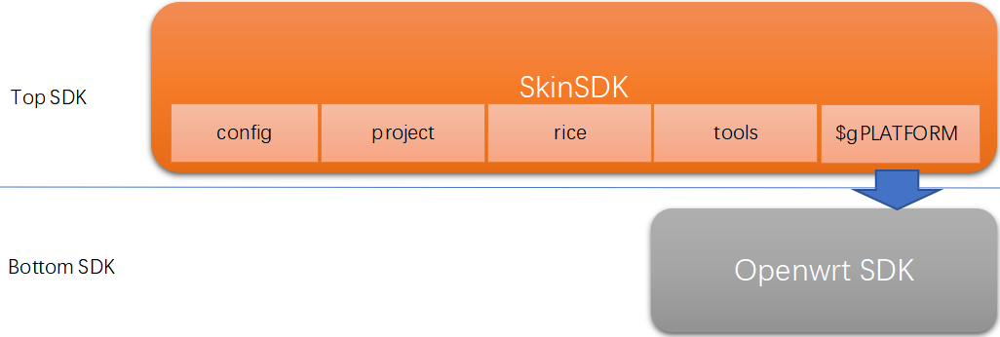
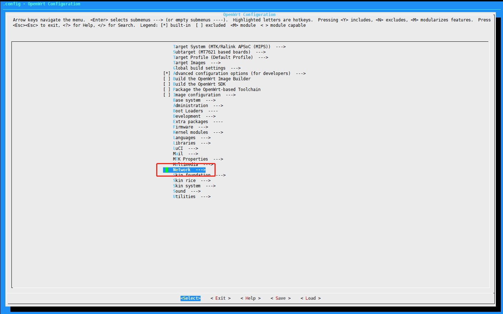
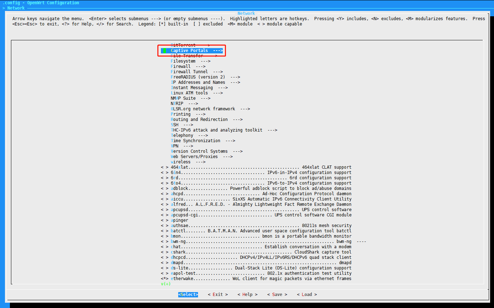
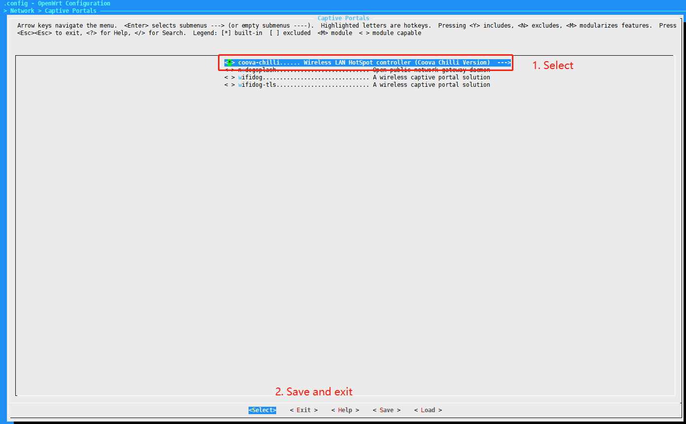
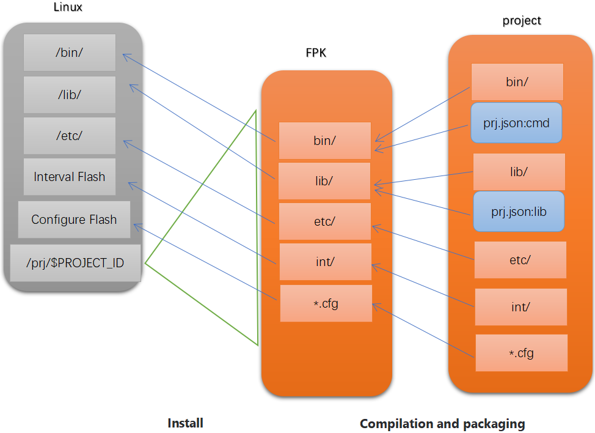
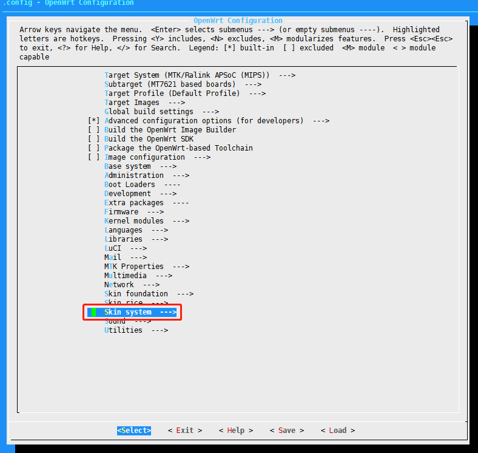
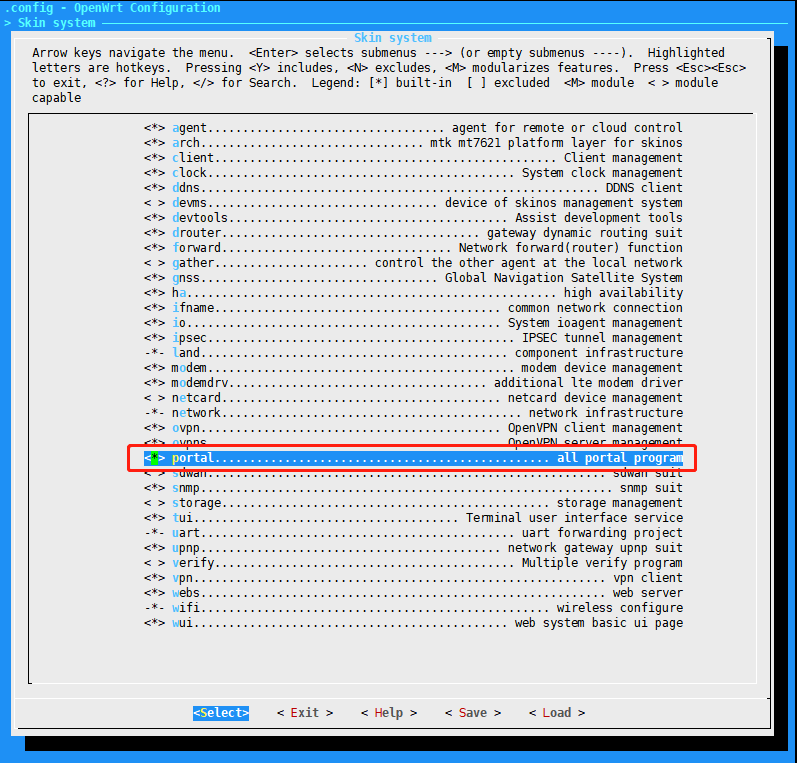
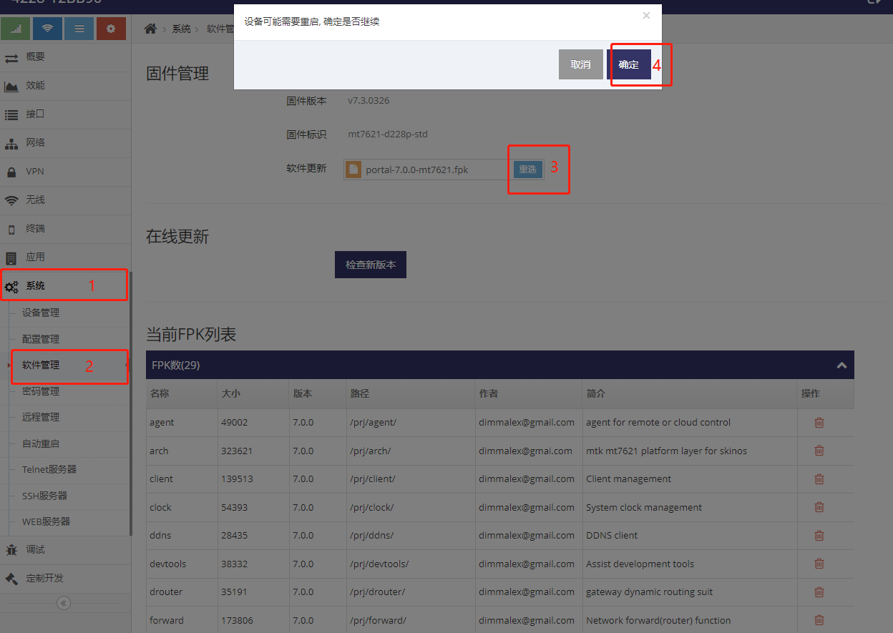
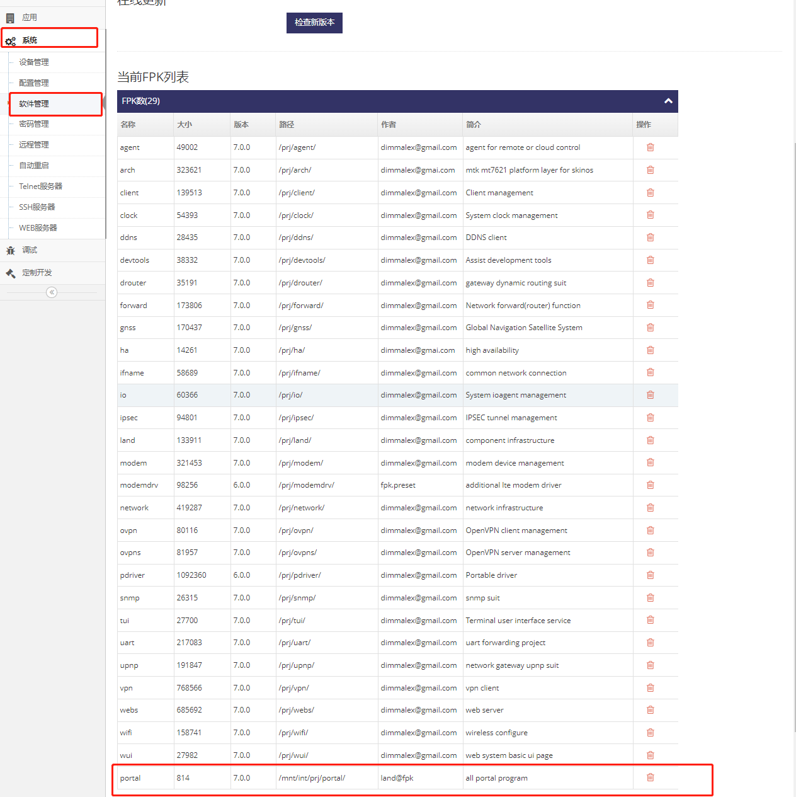

## SkinSDK与Openwrt的SDK的关系



**Top SDK**, 即SkinSDK, 目录tiger7即是SkinSDK

**Bottom SDK**, 通过 **$gPLATFORM**的值确定, 在R600(3218/5218)的产品中此值为mtk2, 即目录tiger7/mtk2, mtk2为一个Openwrt的SDK


## 移植Bottom SDK中已存在的Openwrt应用
以下示例移植coova-chilli到SkinOS中
#### 1. 勾选coova-chilli应用
```shell
dimmalex@HMS:~/tiger7$ make menuconfig
```




#### 2. 编译出coova-chilli应用
```shell
dimmalex@HMS:~/tiger7$ make
```

#### 3. 创建项目
执行以下指令创建portal项目
```shell
dimmalex@HMS:~/tiger7$ ./tools/prj create portal
project portal introduction: all portal program
dimmalex@HMS:~/tiger7$ 
```
指令完成后在对应的project目录下可查看到portal项目及对应的基本的文件
```shell
dimmalex@HMS:~/tiger7$ ls project/portal/
Makefile  prj.json
dimmalex@HMS:~/tiger7$ cat project/portal/prj.json 
{
    "name":"portal",
    "version":"7.0.0",
    "author":"land@fpk",
    "intro":"all portal program"
}
dimmalex@HMS:~/tiger7$ 
```

#### 3. 拷贝编译好的coova-chilli必要的文件到项目中

以下是项目打包成FPK安装包及安装到Linux的过程图示



基于以上打包及安装流程, 因此需要执行操作将coova-chilli相关的执行文件及资源文件打包到项目中

```shell
dimmalex@HMS:~/tiger7/project/portal$ mkdir etc
dimmalex@HMS:~/tiger7/project/portal$ cp -r ~/tiger7/mtk2/build_dir/target-mipsel_24kec+dsp_glibc-2.19/root-ramips/etc/chilli ./etc
dimmalex@HMS:~/tiger7/project/portal$ cp -r ~/tiger7/mtk2/build_dir/target-mipsel_24kec+dsp_glibc-2.19/root-ramips/etc/chilli.conf ./etc
dimmalex@HMS:~/tiger7/project/portal$ mkdir bin
dimmalex@HMS:~/tiger7/project/portal$ cp -r ~/tiger7/mtk2/build_dir/target-mipsel_24kec+dsp_glibc-2.19/root-ramips/usr/sbin/chilli* ./bin
dimmalex@HMS:~/tiger7/project/portal$ mkdir lib
dimmalex@HMS:~/tiger7/project/portal$ cp -r ~/tiger7/mtk2/build_dir/target-mipsel_24kec+dsp_glibc-2.19/root-ramips/usr/lib/libchill* ./lib
```
将启动脚本拷贝到项目目录中
```shell
dimmalex@HMS:~/tiger7/project/portal$ cp -r ~/tiger7/mtk2/build_dir/target-mipsel_24kec+dsp_glibc-2.19/coova-chilli-1.6/conf/chilli chilli.sh
```


#### 4. 设计coova-chilli需要的JSON格式的配置文件, 此步骤需要对coova-chilli配置文件及JSON文件格式熟悉
基于coova-chilli的配置, 为其设计一份JSON格式的配置文件， 以下是我们针对coova-chilli设计的JSON格式的配置
```json
// Attributes introduction
{
    "status":"start at system startup",                      // [ "disable", "enable" ]

    "local":"Specifies the local interface to work with",    // [ "ifname@lan", "ifname@lan2", ... ], all the local ifname
    "extern":"Specifies the extern interface to work with",  // [ "ifname@lte", "ifname@wan", "ifname@wisp", ... ], all the extern ifname

    "network":"down link work network",                      // [ network address ], coova-chilli default option "HS_NETWORK"
    "netmask":"down link work netmask",                      // [ netmask address ], coova-chilli option "HS_NETMASK"
    "dns":"DNS address",                                     // [ ip address ], coova-chilli option "HS_DNS1"
    "dns2":"backup DNS address",                             // [ ip adress ], coova-chilli option "HS_DNS2"

    "uam_listen":"down link UMA listen address",             // [ ip address ], coova-chilli option "HS_UAMLISTEN"
    "uam_port":"down link UMA port",                         // [ number ], coova-chilli option "HS_UAMPORT"
    "uam_uiport":"down link UMA port",                       // [ number ], coova-chilli option "HS_UAMUIPORT"    
    "uam_secret":"UMA secret",                               // [ string ], coova-chilli option "HS_UAMSECRET"    
    "uam_aliasname":"UMA aliasname",                         // [ string ], coova-chilli option "HS_UAMALIASNAME"    
    "uam_server":"UMA Portal address",                       // [ ip address ], coova-chilli option "HS_UAMSERVER"
    "uam_format":"UMA Portal address",                       // [ ip address ], coova-chilli option "HS_UAMFORMAT"
    "uam_homepage":"UMA Portal address",                     // [ ip address ], coova-chilli option "HS_UAMHOMEPAGE"
    "uam_service":"UMA Portal auth",                         // [ ip address ], coova-chilli option "HS_UAMSERVICE"

    "uam_allowed":"UMA allowed address list",                // [ ip address, ip address, ... ], Multiple are separated by semicolons, coova-chilli option "HS_UAMALLOW"
    "uam_domains":"UMA allowed address list",                // [ domain name, domain name, ... ], Multiple are separated by semicolons, coova-chilli option "HS_UAMDOMAINS"

    "radius_server":"Radius server",                         // [ ip address ], coova-chilli option "HS_RADIUS"
    "radius_server2":"backup Radius server",                 // [ ip address ], coova-chilli option "HS_RADIUS2"
    "radius_nasid":"Radius NAS identify",                    // [ string ], coova-chilli option "HS_NASID"
    "radius_secret":"Radius server secret",                  // [ string ], coova-chilli option "HS_RADSECRET"
    "radius_authport":"Radius auth port",                    // [ nubmer ], coova-chilli option "HS_RADAUTH"
    "radius_acctport":"Radius Accounting port",              // [ nubmer ], coova-chilli option "HS_RADACCT"

    "www_dir":"local webpage directory",                     // [ pathname ], coova-chilli option "HS_WWWDIR" 
    "local_options":"local.conf custom options"              // [ string ], Multiple are separated by semicolons, The priority is higher than the value of the above parameter, write to "/etc/chilli/local.conf"
}
```
并在项目目录给出chilli组件同名的.cfg文件， 此文件将会是组件chilli的默认配置( 即在设备恢复出厂chilli组件配置即是这个文件 )
```shell
dimmalex@HMS:~/tiger7/project/portal$ cat chilli.cfg 
{
    "status":"disable",
    "local":"ifname@lan",

    "network":"10.1.0.0",
    "netmask":"255.255.255.0",
    "dns":"",
    "dns2":"",

    "uam_listen":"10.1.0.1",
    "uam_port":"3990",
    "uam_uiport":"4990",
    "uam_secret":"",
    "uam_aliasname":"chilli",
    "uam_format":"",

    "uam_allowed":"",
    "uam_domains":"",

    "radius_server":"",
    "radius_server2":"",
    "radius_nasid":"nas01",
    "radius_secret":"",
    "radius_authport":"1812",
    "radius_acctport":"1813",

    "local_options":""
}
dimmalex@HMS:~/tiger7/project/portal$ 
```


#### 5. 创建项目组件实现对coova-chilli的启动、关机及配置管理

##### 输入./tools/prj add_com portal chilli 回车将提示输入组件简介， 输入简介后回车将在portal项目下创建chilli组件

```shell
dimmalex@ubuntu18:~/tiger7$ ./tools/prj add_com portal chilli
component chilli introduction: Manage coova-chilli
dimmalex@ubuntu18:~/tiger7$ 
```
执行成功后对应的项目目录中多出一个chilli的目录, 此目录即为组件目录, 此组件目录下会生成两个文件:
- 一个是后缀为.c结尾组件同名的C程序, 此文件即为组件的代码文件
- mconfig为编译标识修改文件, 在此文件中可以对编译的CFLAGS及LDCFLAGS做调整, 通常不用修改
```shell
dimmalex@ubuntu18:~/tiger7$ ls ./project/portal/chilli
mconfig  chilli.c
dimmalex@ubuntu18:~/tiger7$ 
```

##### 使用vi打开组件代码文件 
```shell
dimmalex@ubuntu18:~/tiger7$ vi ./project/portal/chilli/chilli.c 
```

##### 原有组件代码模板 
1. 创建组件时自动生成的模板代码chilli.c
2. chilli.c包括了6个接口, 通过实现以下6个接口函数来实现组件的功能:

```c
talk_t _setup( obj_t this, param_t param );     // 为一次性执行函数, 此函数约定用于启动组件时调用, 通常会被注册为启动项, 类似于初始化组件的功能函数
talk_t _shut( obj_t this, param_t param );      // 为一次性执行函数, 此函数约定用于关闭组件时调用, 通常会被注册为关机项, 类似于关闭组件的功能函数
talk_t _service( obj_t this, param_t param );   // 为后台服务函数, 此函数约定用于一直运行的服务函数, 为实现实际的功能, 通常用于向系统服务注册的服务, 类似于Linux中的守护进程
talk_t _take( obj_t this, param_t param );      // 为一次性执行函数, 此函数约定用于处理事件的函数, 当此组件需要跟据某此事件做出处理时可实现此函数
talk_t _get( obj_t this, attr_t path );         // 为一次性执行函数, 此函数用于获到组件的配置, 在用户或其它程序获到组件配置时此函数会被调用
boole _set( obj_t this, talk_t v, attr_t path );// 为一次性执行函数, 此函数用于设置组件的配置, 在用户或其它程序设置组件配置时会被调用
```

- ***一次性执行函数*** 表示执行后需要立即退出
- ***后台服务函数*** 表示一直运行
- 以上函数都将运行于不同的进程中, 函数间不能直接通过全局变量交换数据, 如需交换数据可使用Linux进程间通信或SkinOS的register.h中的API来交换数据

3. 以上函数参数介绍:

```c
obj_t this    /* 为组件名称的结构化的表示, 用于表示当前组件名称 */
param_t param /* 为参数的结构化的表示, 用于表示调用当前接口时的传参信息 */
attr_t path   /* 为属性路径的结构化的表示, 用于表示_get查询/_set设置指定的属性路径 */
talk_t v      /* 为值的结构化的表示, 用于表示_set设置的值 */
```
4. 以上函数参数头文件:
[land/path.h](./include/land/path.h)
[land/param.h](./include/land/param.h)
[land/talk.h](./include/land/talk.h)


##### 编辑组件函数 

以下示例我们通过编辑组件的代码来实现对coova-chilli的管理

1. 实现_setup函数, 即setup接口( 命令行通过 portal@chilli.setup可执行 )实现跟据组件配置选择性开机启动coova-chilli
_setup函数的实现逻辑为获取组件配置并跟据配置的status属性决定是否把本组件的_service函数(即service接口)注册为系统服务

```c
/* usually used to initialize or deploy the component, is also usually registered in the project information file to be called at startup
 * This function can be called by the user at the he terminal, portal@chilli.setup to call this function */
boole_t _setup( obj_t this, param_t param )
{
	talk_t cfg;
	const char *ptr;
	const char *object;

	/* get the current component full name */
	object = obj_combine(this);
	/* get the current component configure */
	cfg = config_get( this, NULL );
	/* get attribute "status" of component configure */
	ptr = json_string( cfg, "status" );
	/* compare the value need be "enable" */
	if ( ptr != NULL && 0 == strcmp( ptr, "enable") )
	{
		/* start the service "portal@chilli", the service use the "service" interface( "_service" function ) of current component */
		sstart( object, "service", NULL, object );
	}

	/* free the component configure */
	talk_free( cfg );
	/* exit with ttrue, Be sure to exit immediately after running, if not exit may cause the entire system boot pause here */
    return ttrue;
}
```

2. 编写_shut函数, 即shut接口
_shut函数同样即在关闭组件时停止我们在_setup函数中注册的系统服务(portal@chilli)

```c
/* Typically used to shut down or exit this component, this method is called when the system shuts down, which can be registered in the project information file
 * This function can be called by the user at the he terminal, portal@chilli.shut to call this function */
boole_t _shut( obj_t this, param_t param )
{
	const char *object;

	/* get the current component full name */
	object = obj_combine(this);
	/* stop the service "portal@chilli" */
	sdelete( object );
	/* exit with ttrue, Be sure to exit immediately after running, if not exit may cause the entire system shutdown pause here */
	return ttrue;
}
```

4. 编写_service函数, 即service接口, 我们要在_service函数中实现将组件chilli的配置转换成coova-chilli的配置并运行coova-chilli
- 在编写_service函数之前我们写一个将组件chilli的配置转换成coova-chilli的配置
```c
#define CHILLI_WORK_DIR "/etc/chilli"
#define CHILLI_DEFAULT_FILE CHILLI_WORK_DIR"/defaults"
#define CHILLI_CONFIG_FILE "/etc/chilli.conf"
#define CHILLI_LOCAL_FILE "/etc/chilli/local.conf"
const char *json2default2conf( talk_t cfg, const char *lan_ifname, const char *lan_netdev, const char *wan_ifname, const char *wan_netdev, const char *dns, const char *dns2 )
{
	FILE *local_fp;
	FILE *default_fp;
	const char *ptr;
	char defaultfile[PATH_MAX];
	static char mainfile[PATH_MAX];

    /* create coova-chilli work directory */
    if ( access( CHILLI_WORK_DIR, R_OK ) != 0 )
    {
        if ( mkdir( CHILLI_WORK_DIR, REGULAR_DIR_MODE ) != 0 )
        {
            return NULL;
        }
    }
	/* open coova-chilli default file */
	snprintf( defaultfile, sizeof(defaultfile), CHILLI_DEFAULT_FILE );
	if ( NULL == ( default_fp = fopen( defaultfile, "w+" ) ) )
	{
		faulting( "open the file(%s) error", defaultfile );
		return NULL;
	}

	/* write extern netdev to coova-chilli default file */
	if ( wan_netdev != NULL && *wan_netdev != '\0' )
	{
		fprintf( default_fp, "HS_WANIF=%s\n", wan_netdev );
	}
	/* write local netdev to coova-chilli default file */
	fprintf( default_fp, "HS_LANIF=%s\n", lan_netdev );

	/* get and write network to default file */
	ptr = json_get_string( cfg, "network" );
	if ( ptr == NULL || *ptr == '\0' )
	{
		ptr = "10.1.0.0";
	}
	fprintf( default_fp, "HS_NETWORK=%s\n", ptr );
	ptr = json_get_string( cfg, "netmask" );
	if ( ptr == NULL || *ptr == '\0' )
	{
		ptr = "255.255.255.0";
	}
	fprintf( default_fp, "HS_NETMASK=%s\n", ptr );
	/* get and write the dns to default file */
	fprintf( default_fp, "HS_DNS1=%s\n", dns );
	fprintf( default_fp, "HS_DNS2=%s\n", dns2 );

	/* get and write listen ip address and port to coova-chilli default file */
	ptr = json_get_string( cfg, "uam_listen" );
	if ( ptr == NULL || *ptr == '\0' )
	{
		ptr = "10.1.0.1";
	}
	fprintf( default_fp, "HS_UAMLISTEN=%s\n", ptr );
	ptr = json_get_string( cfg, "uam_port" );
	if ( ptr != NULL && *ptr != '\0' )
	{
		fprintf( default_fp, "HS_UAMPORT=%s\n", ptr );
	}
	ptr = json_get_string( cfg, "uam_uiport" );
	if ( ptr != NULL && *ptr != '\0' )
	{
		fprintf( default_fp, "HS_UAMUIPORT=%s\n", ptr );
	}
	/* UAM other configure */
	ptr = json_get_string( cfg, "uam_secret" );
	if ( ptr != NULL && *ptr != '\0' )
	{
		fprintf( default_fp, "HS_UAMSECRET=%s\n", ptr );
	}
	ptr = json_get_string( cfg, "uam_aliasname" );
	if ( ptr != NULL && *ptr != '\0' )
	{
		fprintf( default_fp, "HS_UAMALIASNAME=%s\n", ptr );
	}
	ptr = json_get_string( cfg, "uam_server" );
	if ( ptr != NULL && *ptr != '\0' )
	{
		fprintf( default_fp, "HS_UAMSERVER=%s\n", ptr );
	}	
	ptr = json_get_string( cfg, "uam_format" );
	if ( ptr != NULL && *ptr != '\0' )
	{
		fprintf( default_fp, "HS_UAMFORMAT=%s\n", ptr );
	}
	ptr = json_get_string( cfg, "uam_homepage" );
	if ( ptr != NULL && *ptr != '\0' )
	{
		fprintf( default_fp, "HS_UAMHOMEPAGE=%s\n", ptr );
	}
	ptr = json_get_string( cfg, "uam_service" );
	if ( ptr != NULL && *ptr != '\0' )
	{
		fprintf( default_fp, "HS_UAMSERVICE=%s\n", ptr );
	}
	ptr = json_get_string( cfg, "uam_domains" );
	if ( ptr != NULL && *ptr != '\0' )
	{
		fprintf( default_fp, "HS_UAMDOMAINS=\"%s\"\n", ptr );
	}
	ptr = json_get_string( cfg, "uam_allowed" );
	if ( ptr != NULL && *ptr != '\0' )
	{
		fprintf( default_fp, "HS_UAMALLOW=%s\n", ptr );
	}

	/* get and write radius infomation to coova-chilli default file */
	ptr = json_get_string( cfg, "radius_server" );
	if ( ptr != NULL && *ptr != '\0' )
	{
		fprintf( default_fp, "HS_RADIUS=%s\n", ptr );
	}
	ptr = json_get_string( cfg, "radius_server2" );
	if ( ptr != NULL && *ptr != '\0' )
	{
		fprintf( default_fp, "HS_RADIUS2=%s\n", ptr );
	}
	ptr = json_get_string( cfg, "radius_nasid" );
	if ( ptr != NULL && *ptr != '\0' )
	{
		fprintf( default_fp, "HS_NASID=%s\n", ptr );
	}
	
	ptr = json_get_string( cfg, "radius_secret" );
	if ( ptr != NULL && *ptr != '\0' )
	{
		fprintf( default_fp, "HS_RADSECRET=%s\n", ptr );
	}
	ptr = json_get_string( cfg, "radius_authport" );
	if ( ptr != NULL && *ptr != '\0' )
	{
		fprintf( default_fp, "HS_RADAUTH=%s\n", ptr );
	}
	ptr = json_get_string( cfg, "radius_acctport" );
	if ( ptr != NULL && *ptr != '\0' )
	{
		fprintf( default_fp, "HS_RADACCT=%s\n", ptr );
	}

	fprintf( default_fp, "HS_MODE=hotspot\n" );
	fprintf( default_fp, "HS_TYPE=chillispot\n" );
	/* get and write WWW webpage directory to coova-chilli default file */
	ptr = json_get_string( cfg, "www_dir" );
	if ( ptr == NULL || *ptr == '\0' )
	{
		ptr = "/etc/chilli/www";
	}
	fprintf( default_fp, "HS_WWWDIR=%s\n", ptr );
	/* write other coova-chilli default file */
	fprintf( default_fp, "HS_WWWBIN=/etc/chilli/wwwsh\n" );
	fprintf( default_fp, "HS_PROVIDER=Coova\n" );
	fprintf( default_fp, "HS_PROVIDER_LINK=http://www.coova.org/\n" );
	fprintf( default_fp, "HS_LOC_NAME=\"My HotSpot\"\n" );
	fclose( default_fp );

	/* Convert /etc/chilli/default into a coova-chilli configuration */
	ptr = project_shell_path( NULL, 0, PROJECT_ID, "chilli.sh" );
	shell( "%s start", ptr );

	/* get and write custom local option directly */
	unlink( CHILLI_LOCAL_FILE );
    ptr =json_string( cfg, "local_options" );
    if ( ptr != NULL && *ptr != '\0' )
    {
		if ( NULL != ( local_fp = fopen( CHILLI_LOCAL_FILE, "w+" ) ) )
		{
			char *tok;
			char *tokkey;
			char buffer[LINE_MAX];
	        memset( buffer, 0, sizeof(buffer) );
	        strncpy( buffer, ptr, sizeof(buffer)-1 );
	        tokkey = tok = buffer;
	        while( tokkey != NULL && *tok != '\0' )
	        {
	            tokkey = strstr( tok, ";" );
	            if ( tokkey != NULL )
	            {
	                *tokkey = '\0';
	            }
	            fprintf( local_fp, "%s\n", tok  );
	            tok = tokkey+1;
	        }
			fclose( local_fp );
		}
    }
    else
    {
		local_fp = fopen( CHILLI_LOCAL_FILE, "w+" );
		fclose( local_fp );
    }

	/* return the main configure path of coova-chilli */
	snprintf( mainfile, sizeof(mainfile), CHILLI_CONFIG_FILE );
	return mainfile;
}
```
在上面的 **json2default2conf()** 函数中我们执行了项目目录下的 **chilli.sh** 脚本(拷贝于coova-chilli下的conf目录下), 此脚本在原始的coova-chilli代码中是用来转换配置并启动coova-chilli的, 我们只需要用到其将转换配置, 因此我们需要在此脚本中注释掉启动coova-chilli的部分
```shell
start() {
    echo -n $"Starting $prog: "

    check_required

    /sbin/modprobe tun >/dev/null 2>&1
    echo 1 > /proc/sys/net/ipv4/ip_forward

    [ -e /dev/net/tun ] || {
        (cd /dev; mkdir net; cd net; mknod tun c 10 200)
    }

    writeconfig
    radiusconfig

    # comment by dimmalex for disable start the coova-chilli    
    #test ${HS_ADMINTERVAL:-0} -gt 0 && {
    #    (crontab -l 2>&- | grep -v $0
    #    echo "*/$HS_ADMINTERVAL * * * * $0 radconfig") | crontab - 2>&-
    #}
    #
    #test ${HS_LANIF_KEEPADDR:-0} -eq 0 && ip address add 0.0.0.0 dev $HS_LANIF
    #
    #daemon -- $exec -c $CONFIG
    #retval=$?
    #echo
    #[ $retval -eq 0 ] && touch $lockfile
    #return $retval
}

stop() {
    echo -n $"Stopping $prog: "

    # comment by dimmalex for disable start the coova-chilli    
    #crontab -l 2>&- | grep -v $0 | crontab -

    killproc $prog
    retval=$?
    echo
    [ $retval -eq 0 ] && rm -f $lockfile
    [ $retval -eq 0 ] && rm -f $PIDFILE
    [ $retval -eq 0 ] && rm -f $RUN_D/$IPCFILE
    [ $retval -eq 0 ] && rm -f $CMDSOCK
    [ $retval -eq 0 ] && /bin/rm -f /var/run/chilli.*.cfg.bin
    return $retval
}

```

- 然后在_service函数中运行coova-chilli

```c
boole_t _service( obj_t this, param_t param )
{
    talk_t cfg;
	const char *ptr;
	const char *dns;
	const char *dns2;
	const char *file;
	const char *extern_ifname;
	const char *local_ifname;
    char local_ip[NAME_MAX];
    char local_netdev[NAME_MAX];
    char extern_ip[NAME_MAX];
    char extern_netdev[NAME_MAX];

	/* get the current component configure */
    cfg = config_get( this, NULL );
    if ( cfg == NULL )
    {
		/* when it return with terror, the system will not restart it */
        return terror;
    }
    memset( extern_ip, 0, sizeof(extern_ip) );
    memset( extern_netdev, 0, sizeof(extern_netdev) );
    /* get the "extern" ifname from component configure, then the extern ifname can be specified in the configuration */
    extern_ifname = json_string( cfg, "extern" );
    if ( extern_ifname != NULL && *extern_ifname != '\0' )
    { 
    	/* get the netdev of extern ifname */
        ptr = scall_string( extern_netdev, sizeof(extern_netdev), extern_ifname, "netdev", NULL );
        if ( ptr == NULL )
        {
            warn( "no extern interface for chilli" );
            sleep( 5 );
			goto quit;
		}
    	/* get the ip address of extern ifname */
		if ( netdev_info( ptr, extern_ip, sizeof(extern_ip), NULL, 0, NULL, 0, NULL, 0 ) != 0 )
		{
            warn( "no extern ip address for chilli" );
            sleep( 5 );
			goto quit;
		}
    }
    else
    {
    	/* If not specified "extern" at the configure, the system default extern ifname is used */
        if ( gateway_info( NULL, extern_netdev ) == false )
        {
			warn( "no gateway route for chilli" );
			sleep( 5 );
			goto quit;
		}
    	/* get the ip address of default extern ifname */
        if ( netdev_info( extern_netdev, extern_ip, sizeof(extern_ip), NULL, 0, NULL, 0, NULL, 0 ) != 0 )
        {
			warn( "no gateway ip address for chilli" );
			sleep( 5 );
			goto quit;
        }
    }

    memset( local_ip, 0, sizeof(local_ip) );
    memset( local_netdev, 0, sizeof(local_netdev) );
    /* get the "local" ifname from component configure, then The local ifname can be specified in the configuration */
    local_ifname = json_string( cfg, "local" );
    if ( local_ifname == NULL || *local_ifname == '\0' )
    { 
    	/* If not specified "local" at the configure , ifname "ifname@lan" is used */
    	local_ifname = LAN_COM;
	}
	/* get the netdev of lcoal ifname */
    ptr = scall_string( local_netdev, sizeof(local_netdev), local_ifname, "netdev", NULL );
    if ( ptr == NULL )
    {
		warn( "no local interface for chilli" );
		sleep( 5 );
		goto quit;
    }
	/* get the ip address of local ifname */
    if ( netdev_info( ptr, local_ip, sizeof(local_ip), NULL, 0, NULL, 0, NULL, 0 ) != 0 )
    {
		warn( "no local ip address for chilli" );
		sleep( 5 );
		goto quit;
    }

    /* get the "dns" from component configure, then The "dns" can be specified in the configuration */
	dns = json_get_string( cfg, "dns" );
	if ( dns != NULL && *dns != '\0' )
	{
		dns2 = json_get_string( cfg, "dns2" );
	}
	else
	{
    	/* If not specified "dns" at the configure , open DNS is used */
		dns = "208.67.222.222";
		dns2 = "208.67.220.220";
	}

	/* Convert component configure(JSON) into coova-chilli configure */
	file = json2default2conf( cfg, local_ifname, local_netdev, extern_ifname, extern_netdev, dns, dns2 );

	/* exec(run) the chilli */
	execlp( "chilli", "chilli", "-c", file, "-f", (char*)0 );
	faulting( "execlp the chilli error" );

quit:
	/* free the component configure */
	talk_free( cfg );
	/* when it return with false, the system will restart it */
    return tfalse;
}
```

5. 编写_status函数, 即status接口
我们要在_status函数中返回当前coova-chilli的服务是否运行, 如果已运行返回已运行

```c
/* Typically used to get the component status
 * This function can be called by the user at the he terminal, portal@chilli.status to call this function */
talk_t _status( obj_t this, param_t param )
{
	talk_t ret;
	const char *object;

	/* get the current component full name */
	object = obj_combine(this);

	ret = json_create(NULL);
	/* stop the service "portal@chilli" */
	if ( spid( object ) > 0 )
	{
		json_set_string( ret, "status", "up" );
	}
	else
	{
		json_set_string( ret, "status", "down" );
	}
	/* exit with json */
	return ret;
}
```

6. 编写_take函数, 即take接口
我们要在_take函数处理外部接口上线事件, 当设备外部接口一上线我们将立即重启注册_setup中注册的服务

```c
/* Typically used for event process */
boole_t _take( obj_t this, param_t param )
{
    talk_t cfg;
    const char *event;
	const char *object;
	const char *ifname;
	talk_t event_param;
	const char *extern_ifname;

	/* get the joint event name */
	event = param_string( param, 1 );
	if ( event == NULL || 0 != strcmp( event, "network/online" ) )
	{
		return ttrue;
	}
	/* get the information that the joint event carries */
	event_param = param_talk( param, 2 );
	/* get the current component full name */
	object = obj_combine(this);
	/* get the current component configure */
	cfg = config_get( this, NULL );
    /* get the "extern" ifname from component configure */
    extern_ifname = json_string( cfg, "extern" );
    if ( extern_ifname != NULL && *extern_ifname != '\0' )
	{
		/* Exit if the current event ifname is not "extern" */
    	ifname = json_string( event_param, "ifname" );
		if ( ifname == NULL || 0 != strcmp( extern_ifname, ifname ) )
		{
			talk_free( cfg );
			return ttrue;
		}
	}

	/* reset the service "portal@chilli" */
	sreset( NULL, NULL, NULL, object );

	/* free the component configure */
    talk_free( cfg );
    return ttrue;
}
```

7. 编写_get函数, 在获取组件配置时会被调用
这个函数获到实际的配置并返回, 模板中的代码即可满足这个需求, 所以我们不需要修改

```c
talk_t _get( obj_t this, attr_t path )
{
    talk_t cfg;

    /* gets the configuration parameters for the component */
    cfg = config_get( this, path );

	info( "returns the configuration of the %s", COM_IDPATH );
    return cfg;
}
```

8. 编写_set函数, 在修改组件配置会被调用
这个函数修改实际的配置并返回, 在修改成功后重启这个组件, 模板中现有的代码就满足这个需求, 所以我们不需要修改

```c
boole _set( obj_t this, path_t path, talk_t v )
boole _set( obj_t this, talk_t v, attr_t path )
{
    boole ret;

    /* directly save the set parameters into the flash */
    ret = config_set( this, v, path );
    /* if the flash is successfully saved, the call is called by calling first _shut closing and then calling the _setup to restart the corresponding service */
    if ( ret == true )
    {
		info( "save the configuration of the %s and reset it", COM_IDPATH );
        _shut( this, NULL );
        _setup( this, NULL );
    }
    return ret;
}
```

9. 修改mconfig加入引用了其它的库的支持 
如有调用其它的库可在此添加编译选项, 在此组件中未调用其它的库, 因此不需要改动

```shell
dimmalex@ubuntu18:~/tiger7$ cat project/portal/chilli/mconfig 

# Compile-time increment CFLAGS
CFLAGS += -I../

# Compile-time increment LDFLAGS
LDFLAGS +=

# The library file that links to the.a or.so added at compile time
LIBA_ADDIN :=
LIBSO_ADDIN :=

dimmalex@ubuntu18:~/tiger7$ 
```


#### 5. 注册开机启动
在以上的_setup函数(setup接口)中我们实现了启动组件的代码, 还需要使用如下命令实现注册开机运行_setup函数(setup接口)

```shell
dimmalex@ubuntu18:~/tiger7$ ./tools/prj add_init portal general portal@chilli.setup     
dimmalex@ubuntu18:~/tiger7$ 
```

成功注册后我们在portal的prj.json文件中也可以看到对应的注册项
```shell
dimmalex@ubuntu18:~/tiger7$ cat project/portal/prj.json 
{
    "name":"portal",
    "version":"7.0.0",
    "author":"land@fpk",
    "intro":"all portal program",
    "com":
    {
        "chilli":"Manage coova-chilli"
    },
    "init":
    {
        "general":"portal@chilli.setup"
    }
}
```

#### 6. 注册关机执行 
在以上的_shut函数(shut接口)中我们实现了关闭组件的代码, 还需要使用如下命令实现注册关机执行_shut函数(shut接口)

```shell
dimmalex@ubuntu18:~/tiger7$ ./tools/prj add_uninit portal general portal@chilli.shut    
dimmalex@ubuntu18:~/tiger7$ 
```

成功注册后我们在portal的prj.json文件中也可以看到对应的注册项

```shell
dimmalex@ubuntu18:~/tiger7$ cat project/portal/prj.json 
{
    "name":"portal",
    "version":"7.0.0",
    "author":"land@fpk",
    "intro":"all portal program",
    "com":
    {
        "chilli":"Manage coova-chilli"
    },
    "init":
    {
        "general":"portal@chilli.setup"
    },
    "uninit":
    {
        "general":"portal@chilli.shut"
    }
}
```

#### 7. 注册事件处理 
在上面的_take函数中我们处理了当接口上线(network/online)事件时需要做的工作, 我们还需要向系统注册这个事件处理, 在发生事件时系统会调用到这个_take函数

```shell
dimmalex@ubuntu18:~/tiger7$ ./tools/prj add_joint portal network/online portal@chilli.take
dimmalex@ubuntu18:~/tiger7$ 
```

成功注册后我们在portal的prj.json文件中也可以看到对应的注册项
```shell
dimmalex@ubuntu18:~/tiger7$ cat project/portal/prj.json 
{
    "name":"portal",
    "version":"7.0.0",
    "author":"land@fpk",
    "intro":"all portal program",
    "com":
    {
        "chilli":"Manage coova-chilli"
    },
    "init":
    {
        "general":"portal@chilli.setup"
    },
    "uninit":
    {
        "general":"portal@chilli.shut"
    },
    "joint":
    {
        "network/online":"portal@chilli.take"
    }
}
```


#### 8. 编写网页界面管理

##### 1. 为项目创建网页界面 
在顶层目录下执行

```shell
./tools/prj add_wui <project name> <webpage identify>
```

将提示输入界面的中英文菜单名, 输入后回车即可在项目内创建对应的界面

###### 示例: 输入./tools/prj add_wui portal chilli 回车将提示您输入中英文菜单名， 输入后回车将在portal项目下创建chilli的界面

```shell
dimmalex@ubuntu18:~/tiger7$ ./tools/prj add_wui portal chilli
web menu title(Chinese): Portal管理
web menu name(English): Portal management  
{
    "page":"chilli.html",
    "lang":
    {
        "cn":"chilli-cn.json",
        "en":"chilli-en.json"
    },
    "cn":"Portal管理",
    "en":"Portal management"
}
dimmalex@ubuntu18:~/tiger7$ 
```

完成后会在portal的项目目录下产生三个文件：
- chilli.html   界面文件
- chilli-cn.json 中文语言文件
- chilli-en.json 英文语言文件
*注：使用中文名称或中文语言时系统一定要设为UTF8的编码, 否则将无法工作*
```shell
dimmalex@ubuntu18:~/tiger7$ ls ./project/portal/*chilli*.html ./project/portal/*chilli*.json
./project/portal/chilli-cn.json  ./project/portal/chilli-en.json  ./project/portal/chilli.html
dimmalex@ubuntu18:~/tiger7$ 
```

##### 2. 组件HTML界面开发 
修改对应的chilli.html界面文件即可, 接以上示例所生成的chilli.html中是一个简单的示例， 包含了获取及设置portal@chilli组件配置
修改网页需要有javascript、html的基本知识，并稍了解jquery的用法即可, 以下先修改HTML部分加入coova chilli相关的input box
```

```
##### 3. 组件HTML界面中获取组件配置
在html界面中通过 **he.load( [ 组件名 ] )** 获取组件配置, 并在then后给出获取到组件配置后的初始化函数, 组件名为一个字符串

```javascript
    // Component full name
    var comname = "portal@chilli"
    // Component configure
    var comcfg;

    // Get the component configuration from the system and fill it into the html
    function load_comcfg()
    {
        // Get the component configure from the system
        he.load( [ comname, "network@frame.list[local]", "network@frame.list[extern]" ] ).then( function(v){
            // Get the component configure and stored to "comcfg"
            comcfg = v[0];
            if ( !comcfg )
            {
                comcfg = {};
            }
            /* init the local ifname list */
            var ifnum = 0;
            var ifselect = "";
            for ( var interface in v[1] )
            {
                ifnum++;
                ifselect += ('<option value="' + interface + '">' + $.i18n( interface ) + '</option>');
            }
            $("#local").html( ifselect );
            /* init the extern ifname list */
            ifnum = 0;
            ifselect = ('<option value="">' + $.i18n( "Default Gateway" ) + '</option>');
            for ( var interface in v[2] )
            {
                ifnum++;
                ifselect += ('<option value="' + interface + '">' + $.i18n( interface ) + '</option>');
            }
            $("#extern").html( ifselect );

            // load the attribute "status"
            $('#status').prop( 'checked', able2boole(comcfg.status) );
            $('#local').val(comcfg.local || '');
            $('#extern').val(comcfg.extern || '');

            $('#network').val(comcfg.network || '');
            $('#netmask').val(comcfg.netmask || '');
            $('#dns').val(comcfg.dns || '');
            $('#dns2').val(comcfg.dns2 || '');

            $('#uam_listen').val(comcfg.uam_listen || '');
            $('#uam_port').val(comcfg.uam_port || '');
            $('#uam_uiport').val(comcfg.uam_uiport || '');
            $('#uam_secret').val(comcfg.uam_secret || '');

            $('#uam_format').val(comcfg.uam_format || '');
            $('#uam_aliasname').val(comcfg.uam_aliasname || '');

            $('#radius_server').val(comcfg.radius_server || '');
            $('#radius_server2').val(comcfg.radius_server2 || '');
            $('#radius_nasid').val(comcfg.radius_nasid || '');
            $('#radius_secret').val(comcfg.radius_secret || '');
            $('#radius_authport').val(comcfg.radius_authport || '');
            $('#radius_acctport').val(comcfg.radius_acctport || '');

            $('#uam_domains').val(comcfg.uam_domains || '');
            $('#uam_allowed').val(comcfg.uam_allowed || '');
            $('#local_options').val(comcfg.local_options || '');

            // Bind function handling for status options to hide or display property input box when clicked
            $('#status').unbind('change').change(function () {
                // if select
                if ($(this).prop('checked'))
                {
                    // shopw
                    $('#statusSets').show();
                }
                // else
                else
                {
                    // hide
                    $('#statusSets').hide();
                }
            }).trigger('change');
        });
    }
```

##### 4. 设置组件配置
在html界面中通过**he.save( [ 组件名+"="+JSON.stringify(组件配置) ] )**, 组件名为一个字符串, 组件配置为一个JSON对象

```javascript
    // Save the modified configure that from html and apply it to the component configuration
    function save_comcfg()
    {
        if ( !comcfg )
        {
            comcfg = {};
        }
        // copy a component configure
        var comcfgcopy = JSON.parse(JSON.stringify(comcfg));
        // get the attribute "status"
        comcfg.status = boole2able( $('#status').prop('checked') );
        if ( comcfg.status == "enable" )
        {
            comcfg.local = $('#local').val();
            comcfg.extern = $('#extern').val();

            comcfg.network = $('#network').val();
            comcfg.netmask = $('#netmask').val();
            comcfg.dns = $('#dns').val();
            comcfg.dns2 = $('#dns2').val();

            comcfg.uam_listen = $('#uam_listen').val();
            comcfg.uam_port = $('#uam_port').val();
            comcfg.uam_uiport = $('#uam_uiport').val();
            comcfg.uam_secret = $('#uam_secret').val();

            comcfg.uam_format = $('#uam_format').val();
            comcfg.uam_aliasname = $('#uam_aliasname').val();

            comcfg.radius_server = $('#radius_server').val();
            comcfg.radius_server2 = $('#radius_server2').val();
            comcfg.radius_secret = $('#radius_secret').val();
            comcfg.radius_authport = $('#radius_authport').val();
            comcfg.radius_acctport = $('#radius_acctport').val();
            comcfg.radius_nasid = $('#radius_nasid').val();

            comcfg.uam_allowed = $('#uam_allowed').val();
            comcfg.uam_domains = $('#uam_domains').val();
            comcfg.local_options = $('#local_options').val();
        }
        // Compare copies to determine if component configure have been modified
        if ( ocompare( comcfg, comcfgcopy ) )
        {
            // If no modification message no modification does not need to apply
            page.alert( { message: $.i18n('Settings unchanged') } );
            return;
        }
        // Save the component configure
        he.save( [ comname+"="+JSON.stringify(comcfg) ] ).then( function(){
            // hint succeed
            page.hint2succeed( $.i18n('Modify successfully') );
            // flash the page
            load_comcfg();
        });
    }
```


##### 6. 多语言界面支持
多语言的支持主要是通过jquery的$.i18n()来实现

```javascript
    // Load the language file
    $.i18n().load( page.lang(langjson) ).then( function () {
        // HTML language initialization
        $.i18n().locale = window.lang; $('body').i18n();
        // load the component configure
        load_comcfg();
        /* Bind refresh button */
        $('#refresh').on(ace.click_event, function () {
            location.reload();
        });
        /* Bind apply button */
        $('#apply').on(ace.click_event, function () {
            // Save and apply the component configuration when you click apply
            save_comcfg();
        });
    });

```


#### 9. 刷新项目菜单 
执行make menu刷新菜单

```shell
dimmalex@ubuntu18:~/tiger7$ make menu
```

#### 10. 勾选项目 
执行make menuconfig后在 ***Skin system*** 下可以看到对应的 ***portal项目***, 勾选即可

```
dimmalex@HMS:~/tiger7$ make menuconfig
```




#### 11. 编译成FPK安装包

编译portal项目
```
dimmalex@HMS:~/tiger7$ make obj=portal
```
等待编译成功将会在tiger7/build/store目录下生成portal开头的.fpk安装包
```
dimmalex@HMS:~/tiger7$ ls build/store/port*
build/store/portal-7.0.0-mt7628.fpk
dimmalex@HMS:~/tiger7$ 
```

#### 12. 升级到产品中
将portal-7.0.0-mt7628.fpk升级包安装到产品上


升级后可以在对应的软件列表中查看到



#### 13. 编译整个固件

```shell
dimmalex@ubuntu18:~/tiger7$ make
```
将会在./build目录下生成zz后缀的固件升级包
```shell
dimmalex@ubuntu18:~/tiger7$ ls build/*.zz
build/mt7628_r600_std_v7.3.0326.zz
dimmalex@ubuntu18:~/tiger7$ 
```
此zz后缀的固件升级包可直接通过网页升级到设备上去

***在编译过程中一定要注意报错信息, 当有出错时将不会生成fpk软件包***


#### 14. 升级到设备上 
通过在设备网页的 ***系统*** 菜单下的 ***软件管理*** 界面中 **软件更新** 后的浏览按键选择 ***FPK软件包*** 升级或选择整个 ***固件*** 升级即可


#### 15. 调试组件

##### 1. 命令行调试组件接口
通过HE终端可以直接调用的到组件的接口, HE终端相关的格式及命令介绍见[终端HE指令使用说明](../use/he_command.md)

- 示例: 调用组件_setup函数的接口

	```shell
	# portal@chilli.setup
	#
	```

- 示例: 查看组件配置

	```shell
	# portal@chilli
    {
        "status":"disable",
        "local":"ifname@lan",

        "network":"10.1.0.0",
        "netmask":"255.255.255.0",
        "dns":"",
        "dns2":"",

        "uam_listen":"10.1.0.1",
        "uam_port":"3990",
        "uam_uiport":"4990",
        "uam_secret":"",
        "uam_aliasname":"chilli",
        "uam_format":"",

        "uam_allowed":"",
        "uam_domains":"",

        "radius_server":"",
        "radius_server2":"",
        "radius_nasid":"nas01",
        "radius_secret":"",
        "radius_authport":"1812",
        "radius_acctport":"1813",

        "local_options":""
    }
	#
	```

- 示例: 修改组件配置

	```shell
	# portal@chilli:uam_format=http://www.google.com
	#
	```

##### 2. 命令行调试组件的服务类接口
- 示例: 查看portal@chilli中_setup函数注册的服务是否有运行, 更多有关服务管理的接口见[服务管理组件](../com/land/service.md)

	```shell
	# service.info[ portal@chilli ]
	{
		"status":"live",                    // live表示已运行
		"pid":"1572",
		"obj":"portal@chilli",
		"op":"service",
		"ontime":"31",
		"cktime":"0",
		"livetime":"18:58:41:2"
	}
	#
	```

##### 3 . 组件使用日志调试

- 示例: 显示当前日志, 即可以当前日志中查询是否有portal@chilli组件打印的日志, 更多有关日志管理的接口见[日志管理组件](../com/land/syslog.md)

	```shell
	# log.show
	Dec 30 13:24:37 V520-12CC70 user.warn syslog: modem@lte check simcard failed 3 times
	Dec 30 13:24:38 V520-12CC70 user.warn syslog: modem@lte check simcard failed 4 times
	Dec 30 13:24:39 V520-12CC70 user.warn syslog: modem@lte check simcard failed 5 times
	Dec 30 13:24:40 V520-12CC70 user.warn syslog: modem@lte check simcard failed 6 times
	Dec 30 13:24:40 V520-12CC70 user.info syslog: search the modem device(modem@lte2)
	// 更多日志信息
	#
	`


---

## 开发中可能用到的API

- ##### [调用组件接口](./call_component.md)
	在程序中调用其它组件或自身的接口

- ##### [管理组件配置](./component_config.md)
	在程序中查询及修改其它组件的配置

- ##### [直接操作配置](./project_config.md)
	在程序中查询修改配置

- ##### [获取项目信息](./project_info.md)
	在程序中获取项目相关的信息

- ##### [系统服务](./system_service.md)
	在程序中通过系统服务API注册服务函数, 使服务函数可以一直运行

- ##### [组件寄存器API](./register.md)
	专门为组件设计的一种信息存储及交互方式， 相当于可以实时改变的环境变量

- ##### [日志服务](./syslog.md)
	用于程序记录日志


## 移植SkinSDK中不存在的Openwrt应用

需要首先将Openwrt应用的整个源代码目录拷贝到**Bottom SDK**(Openwrt的SDK)的对应的目录下即可
之后通过make menu更新菜单
```
dimmalex@HMS:~/tiger7$ make menu
```
然后与之上介绍的相同


