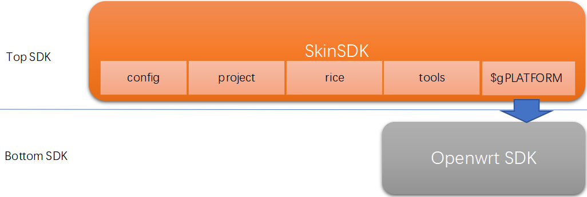
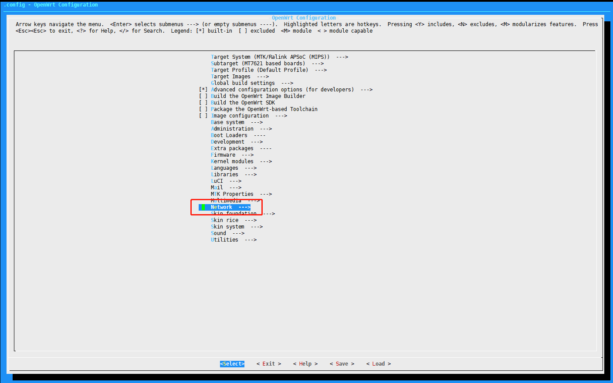
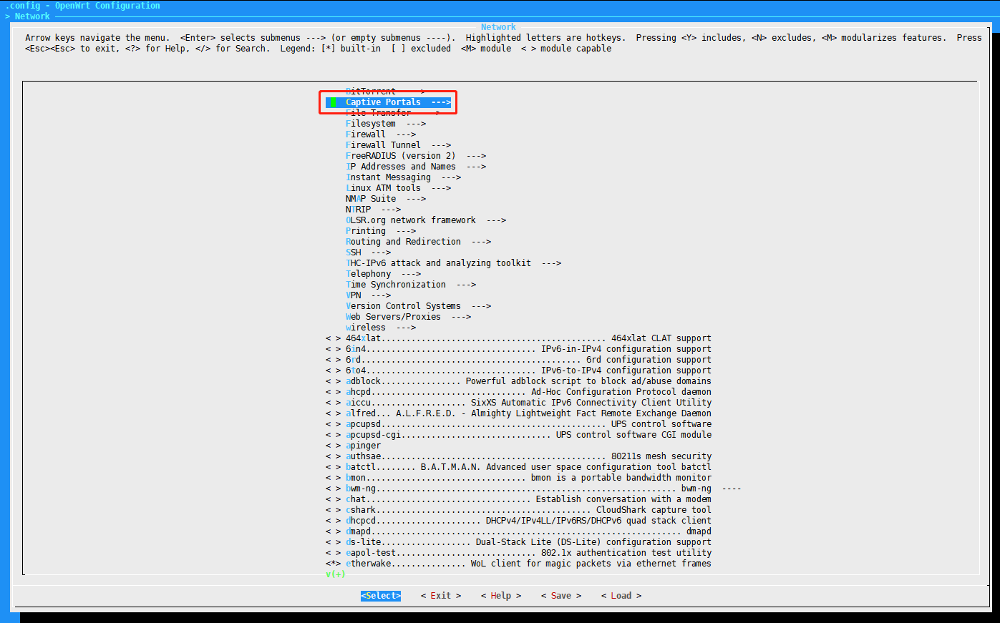
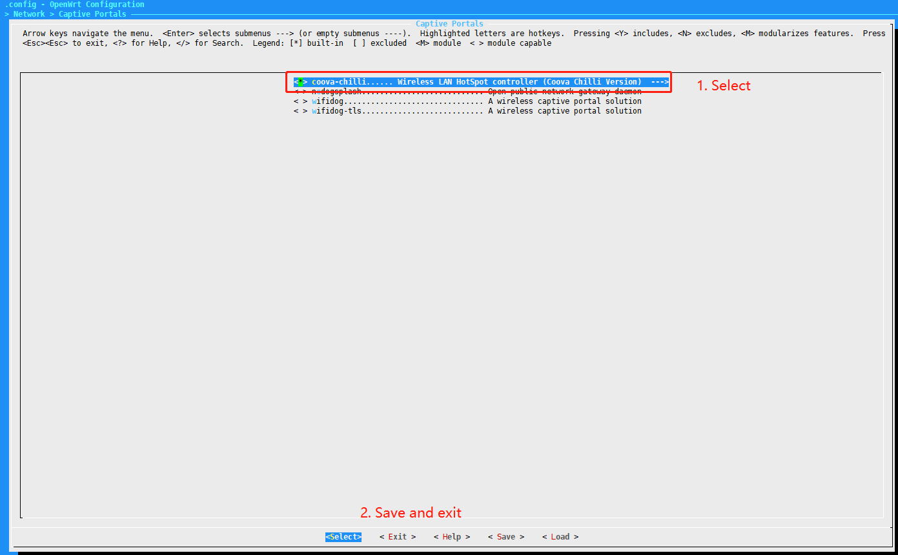
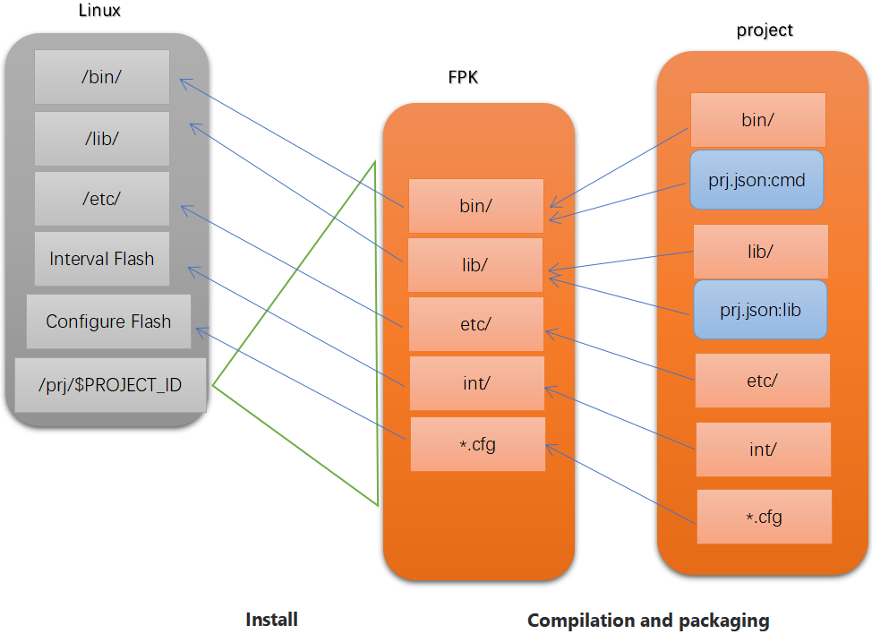
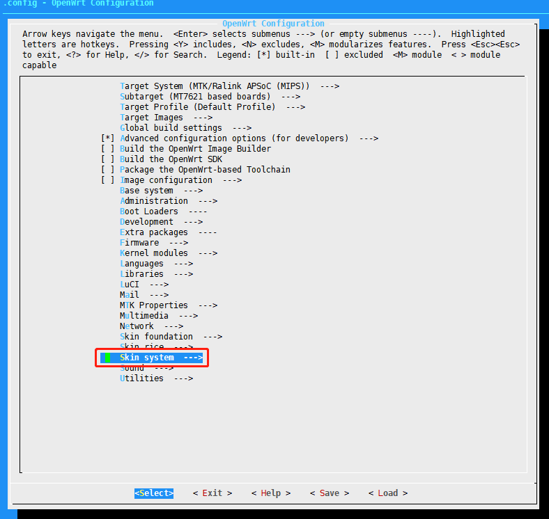
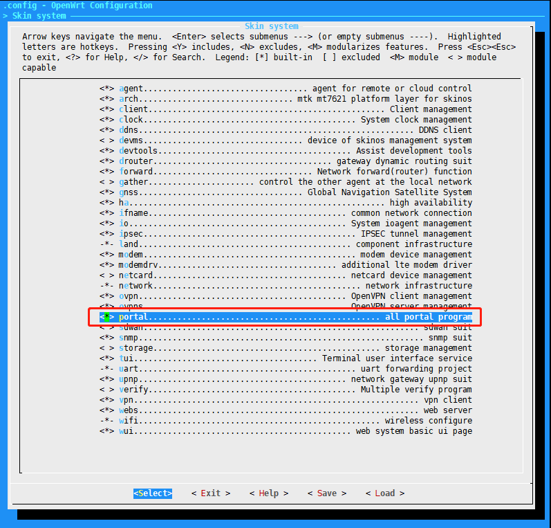

## SkinSDK与Openwrt的SDK的关系



**Top SDK**, 即SkinSDK, 目录tiger7即是SkinSDK

**Bottom SDK**, 通过 **$gPLATFORM**的值确定, 在R600(3218/5218)的产品中此值为mtk2, 即目录tiger7/mtk2, mtk2为一个Openwrt的SDK


## 移植Bottom SDK中已存在的Openwrt应用
以下示例移植coova-chilli到SkinOS中
#### 1. 勾选coova-chilli应用
```
dimmalex@HMS:~/tiger7$ make menuconfig
```




#### 2. 编译出coova-chilli应用
```
dimmalex@HMS:~/tiger7$ make
```

#### 3. 创建项目
执行以下指令创建项目
```
dimmalex@HMS:~/tiger7$ ./tools/prj create portal
project portal introduction: all portal program
dimmalex@HMS:~/tiger7$ 
```
指令完成后在对应的project目录下可查看到portal项目及对应的基本的文件
```
dimmalex@HMS:~/tiger7$ ls project/portal/
Makefile  prj.json
dimmalex@HMS:~/tiger7$ cat project/portal/prj.json 
{
    "name":"portal",
    "version":"7.0.0",
    "author":"land@fpk",
    "intro":"all portal program"
}
dimmalex@HMS:~/tiger7$ 
```

#### 3. 拷贝编译好的coova-chilli必要的文件到项目中

以下是项目打包成FPK安装包及安装到Linux的过程图示



基于以上打包流程, 因此需要执行如何操作将coova-chilli打包到项目中

```
dimmalex@HMS:~/tiger7/project/portal$ mkdir etc
dimmalex@HMS:~/tiger7/project/portal$ cp -r ~/tiger7/smtk2/build_dir/target-mipsel_24kec+dsp_glibc-2.19/root-ramips/etc/chilli ./etc
dimmalex@HMS:~/tiger7/project/portal$ cp -r ~/tiger7/smtk2/build_dir/target-mipsel_24kec+dsp_glibc-2.19/root-ramips/etc/chilli.conf ./etc
dimmalex@HMS:~/tiger7/project/portal$ mkdir bin
dimmalex@HMS:~/tiger7/project/portal$ cp -r ~/tiger7/smtk2/build_dir/target-mipsel_24kec+dsp_glibc-2.19/root-ramips/usr/sbin/chilli* ./bin
dimmalex@HMS:~/tiger7/project/portal$ mkdir lib
dimmalex@HMS:~/tiger7/project/portal$ cp -r ~/tiger7/smtk2/build_dir/target-mipsel_24kec+dsp_glibc-2.19/root-ramips/usr/lib/libchill* ./lib
```

#### 4. 创建项目组件实现最简单的脚本组件来启动coova-chilli

###### 拷贝脚本组件模板到项目中并改名为chilli
```
dimmalex@HMS:~/tiger7/project/portal$ cp ../tmptools/component.ash ./chilli.ash
```
###### 修改setup/shut函数实现开机运行chilli, 并机结束chilli
```
#!/bin/bash
# Copyright (C) 2020-2022 ASHYELF
# include fundamental function support, you cannot delete this
. $cheader

# setup method for register a normal service
setup()
{
    # syslog
    he log.info[ "run the chilli" ]
    # run the chilli in background
    chilli -c /etc/chilli.conf &
    creturn ttrue
}
# shut method for unregister all service
shut()
{
    he log.info[ "shut the chilli" ]
    killall chilli
    creturn ttrue
}

# test the shell component is work
test()
{
    he log.info[ "test the chilli" ]
    echo "test the chilli is work"
    creturn ttrue
}

# call the method, you cannot delete this
cend
```
###### 注册开机及关机项， 让系统在开关机时执行chilli.ash中的setup及shut
```
dimmalex@HMS:~/tiger7$ ./tools/prj add_init portal general portal@chilli.setup
dimmalex@HMS:~/tiger7$ ./tools/prj add_uninit portal general portal@chilli.shut
```


###### 编译成FPK安装包
首先更新菜单
```
dimmalex@HMS:~/tiger7$ make menu
```

然后勾选项目后保存
```
dimmalex@HMS:~/tiger7$ make menuconfig
```



编译portal项目
```
dimmalex@HMS:~/tiger7$ make obj=portal
```
等待编译成功将会在tiger7/build/store目录下生成portal开头的.fpk安装包
```
dimmalex@HMS:~/tiger7$ ls build/store/port*
build/store/portal-7.0.0-mt7621.fpk
dimmalex@HMS:~/tiger7$ 
```

###### 升级到产品中
将portal-7.0.0-mt7621.fpk升级包安装到产品上


升级后可以在对应的软件列表中查看到


## 移植SkinSDK中不存在的Openwrt应用

需要首先将Openwrt应用的整个源代码目录拷贝到**Bottom SDK**(Openwrt的SDK)的对应的目录下即可
之后通过make menu更新菜单
```
dimmalex@HMS:~/tiger7$ make menu
```
然后与之上介绍的《移植Bottom SDK中已存在的Openwrt应用》相同


