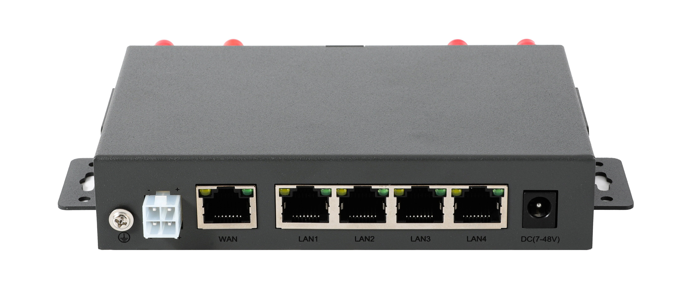

## 简介

###### 5218为一款五网口工业用LTE网关, 此网关含有
 - **3G/4G全网通频段接入**(*4G双天线*), **三个百兆以太网口(RJ45)**, **双串口**, *串口1为RS232, 串口2为RS485(可定制为RS232)*
 - **双SIM卡槽**, 双SIM卡支持自动切换及强制使用指定SIM卡槽
 - **无线2.4G双天线**(*300Mbit/s*)
 - **两路输入输出IO口**(可选I2C总线)
 - **支持DC头供电或带卡扣凤凰头供电**
 - **可选装eSIM**, 代替插SIM卡, 增加稳定性
 - **GPS及北斗定位功能**
 - **短信功能**, 支持中文短信及短信管理网关
 - **PPTP, L2TP, IPSEC, GRE, OPENVPN等常用VPN功能**
 - **ZeroTier, WireGuard等SDWAN的功能**
 - **零配置(ZTP)** 支持
 - **Portal** 支持
 - **支持常用的摄象头视频流字符叠加**, 可将网络信号，GPS信息，串口传感器，I2C传感器采集的数据叠加到摄象头视频流中

###### 为支持工业级应用环境带有
 - **宽电压供电及车载头供电支持**, 支持7V到48V之间的电压供电, 并可用抗震车载头供电
 - **宽温支持**, 支持低温-40度冷启动, 高温75度长期工作
 - **硬件狗**
 - **防静电保护**
 - **多路独立电源设计**, 独立功能模块间相互监控, 出现异常可快速恢复

###### 多种方式接入互联网
 - **3G/4G接入互联网**
 - **3G/4G透传模式(Modem)支持**
 - **有线WAN口接入互联网**
 - **2.4G无线接入互联网**,  **2.4G无线中继桥接**
 - **混合(多WAN)上网---3G/4G与有线WAN口接入同时工作**, 冷备份, 热备份及负载均衡带宽叠加
 - **混合(多WAN)上网---3G/4G与2.4G无线接入同时工作**, 冷备份, 热备份及负载均衡带宽叠加, 实现在无人机或车载上进站连本地无线网络出站使用LTE上网的功能
 - **混合(多WAN)上网---2.4G无线接入与有线WAN口接入同时工作**, 冷备份, 热备份及负载均衡带宽叠加
 - **混合(多WAN)上网---强制客户端(或应用)使用指定接入方式上网**, 允许在多种接入方式同时工作时强制客户端或应用分别使用不同的接入方式访问互联网
 - **定制更多智能接入方式**, 开放SDK编程环境提供示例及标准接口可客户自定制更多接入策略， 如定制三种接入方式同时工作， 自动根据现场情况或指定策略动态变换接入方式等

###### 提供多种接口供设备连接到互联网
 - **以太网口(802.3u)**
 - **2.4G无线(802.11bgn)**
 - **串口(RS485/RS232)**
 - **IO口(3.3V输入输出)或I2C接口**

###### 串口支持多种模式： 透传/Modbus/MQTT/指令模式/HTTP POST/自定义协议转换
 - **串口透传** 支持自定义注册包/激活包/保活包, 自定义包前后缀, 服务器与客户端同时工作及多服务器, 流量统计
 - **Modbus TCP/MQTT协议**, 可为PLC设备及实时物联网设备接入网络
 - **HTTP POST协议**, 可将串口数据通过HTTP POST传送到指定的服务器
 - **支持串口指令模式**, 可通过串口指令管理控制网关
 - **两路串口同时工作**, 默认为RS232+RS485, 可选支持RS232+RS232
 - **定制各种串口协议**, 开放SDK编程环境提供示例及标准接口可客户自定制更多串口协议

###### IO口支持实时控制及监控
 - **2路IO口实时切换输入输出模式**
 - **提供自定义远程管理IO口协议**, 允许远程服务器实时操作网关的IO口, 配置IO口模式, 输入模式下IO口电平发生变化时实时通知远程服务器
 - **提供MQTT协议管理IO口**, 自动订阅主题及IO变化时发布主题等功能实现远程操作及监控网关IO口电平变化
 - IO口可配置为**I2C引脚实现外接I2C设备**, 如外接I2C显示屏,电池电量计等功能
 - **定制各种IO控制协议**, 开放SDK编程环境提供示例及标准接口可客户自定制更多IO管理口协议

###### GPS多种类数据采集上报
 - **GPS或北斗**
 - **NMEA原始数据上报**, 可指定报头及指定上报间隔
 - **MQTT数据上报**
 - **HTTP JSON数据上报**

###### 多种管理协议支持, 允许用户通过协议实现本地或远程全方位管理控制网关
 - **本地TCP协议控制**
 - **本地HTTP协议状态查询**
 - **本地网络广播搜寻网关**
 - **本地管理工具包及编程API**, 提供Linux环境下的管理工具包, 实现在本地管理网关/OTA升级, 并开放管理工具包编程API及示例, 快速帮助客户实现对网关的管理
 - **短信管理**, 支持通过短信重启重置网关， 查询网关状态，修改网关配置等
 - **远程HTTP协议状态上报**(网关信息/终端信息/GPS信息), **远程HTTP协议控制**, **MQTT状态上报告警及MQTT网关管理等功能**
 - **远程管理云服务器SDK**, 提供Linux环境下的云管理服务器, 实现远程管理网关/OTA升级, 并开放管理工具包编程API及示例, 快速帮助客户实现对网关的远程管理

###### 为支持多功能应用及定制化开发使用了专为网关行业开发的Skin嵌入式系统
 - **7*24小时全年无故障运行**, 功能强大, 性能卓越, **功能模块组件式分离开发**, 统计的作业接口, 方便客户编写自已的应用程序
 - **框架式开发**, 支持自行定制指定功能的协议组件, 如可只编写LTE模块驱动识别组件, 编写串口协议转换组件及编写远程被管理组件对端客户的管理平台等
 - **纯C语言编写**, 行业内应用功能齐全, 并可**在线编程**
 - **完备的开发环境及开发文档免费下载**, 一步到位允许用户基于现有功能上进一步开发定制化的功能, 并将现有功能包装为统一的接口允许客户直接调用
 - **可跟据客户需求开发**, 也可提供一对一提供开发指导

## 网关实物图
   

## 硬件规格
|  参数   | 规格  |
| :-----:| :---- |
| **尺寸(mm)** | 尺寸: 137mm X 88.4mm X 28mm |
| **4G参数(LTE)**  | 默认使用**移远EC20**双天线全网通模块, 也可搭配客户指定的其它模块或专网模块 **4G频段**: FDD LTE: B1/B3/B8 TDD LTE: B38/B39/B40/B41 **3G频段**: TDSCDMA: B34/B39  WCDMA: B1/B8 **2G频段**: CDMA 1x/EVDO: BC0  GSM: 900/1800 **带宽**: 1.4/3/5/10/15/20MHz LTE-FDD: Max 150Mbps (DL) Max 50Mbps (UL) LTE-TDD: Max 130Mbps (DL) Max 35Mbps (UL) **灵敏度** FDD B1: -97dBm (10M) FDD B3: -95dBm (10M) FDD B8: -94dBm (10M) TDD B38: -97dBm (10M) TDD B39: -97dBm (10M) TDD B40: -97dBm (10M) TDD B41: -96dBm (10M) WCDMA B1: -111dBm WCDMA B8: -110dBm TDSCDMA B34: -109dBm TDSCDMA B39: -109dBm CDMA BC0: -109dBm GSM 900: -109dBm GSM 1800: -109dBm **输出功率** Class 3 (23dBm±2dB) for LTE FDD Class 3 (23dBm±2dB) for LTE TDD Class 2 (24dBm +1/-3dB) for TD-SCDMA Class 3 (24dBm +1/-3dB) for WCDMA Class 3 (24dBm±1dB) for CDMA BC0 Class E2 (27dBm ±3dB) for EDGE 900MHz Class E2 (26dBm ±3dB) for EDGE 1800MHz Class 4 (33dBm ±2dB) for GSM 900MHz Class 1 (30dBm ±2dB) for GSM 1800MHz |
| **2.4G参数(WIFI)**   | **标准**：IEEE802.11bgn 300Mbps(2T2R) **发射功率** 11n HT40 MCS7: 15dBm 11b CCK: 18dBm 11G OFDM: 15dBm **接收灵敏度** 300Mbps: -65dBm 54Mbps: -73dBm 11Mbps: -86dBm|
| **WAN口** | RJ45 WAN接口(10/100Mbps自适应), 网关模式及混合模式为**WAN接口**, 其它模式下为**LAN接口**, 自带LINK指定灯  |
| **LAN1口** | RJ45 LAN接口(10/100Mbps自适应), 自带LINK指定灯  |
| **LAN2口** | RJ45 LAN接口(10/100Mbps自适应), 自带LINK指定灯  |
| **LAN3口** | RJ45 LAN接口(10/100Mbps自适应), 自带LINK指定灯  |
| **LAN4口** | RJ45 LAN接口(10/100Mbps自适应), 自带LINK指定灯  |
| **串口1** | 8PIN凤凰头中的两PIN为串口1接口, *默认**RS232**,可定制提供TTL电平串口*  |
| **串口2** | 8PIN凤凰头中的两PIN为串口2接口, *默认**RS485串口**, 可定制为RS232电平串口* |
| **车载供电口** | 2*2PIN(4.2mm间距)电源供电口(**供电范围为7-48V**)  |
| **DC头供电口** | 5.5*2.0mm DC电源供电口(**供电范围为7-48V**)  |
| **WIFI天线接口(2个)** | WIFI2.4G SMA天线接口*2(外螺纹+孔)  |
| **3G/4G天线接口(2个)** | 3G/4G SMA天线接口*2(外螺纹+孔) |
| **GPS天线接口** | GPS SMA天线接口(外螺纹+孔) |
| **SIM卡槽(2个)** | 抽屉式大SIM卡槽 |
| **接键(1个)** | 复位按键 |
| **指示灯(4个)** | **电源灯(红)**, 电源接通过常亮 **系统灯(蓝)**:刚上电时常亮，启动后但未连接慢闪，正在拨号时快闪， 连接网络成功后常亮 **信号灯(红)**: 4G信号弱时亮 **信号灯(绿)**: 4G信号强时亮 |
| **凤凰头接口** | 3.5mm间距共8PIN 包含串口1, 串口2, 2路IO口, 3.3V电源及GND引脚  |
| **功耗（满负荷时）** | 小于3W, 基于无线环境与网络负载不同瞬间峰值可能会高于3W， 建议提供5W功率 |
| **温度** | 工作温度： -40℃ ~ +75℃ |

## 硬件配置表
|  接口  | 3218标准版  | 3218-232  | 3218-GPS  |
|:-----:|:----:|:----:|:----:|
| 串口1-RS232| V | V | V |
| 串口2-RS232|  | V |  |
| 串口2-RS485| V |  | V |
| LTE全网通基带| V | V | V |
| GPS定位 |  |  | V |

***如需更多其它配置请联系销售***

## 软件功能表
|  功能   | 描述  |
| :-----:| :---- |
| **联网方式** | **单连接上网**： 3G/4G上网，有线上网，无线上网，桥接，中继，无线互联网, 3G/4G透传(Modem)模式 **混合(多WAN)上网**： 3G/4G与以太网有线上网同时工作, 备份及负载均衡带宽叠加 3G/4G与无线WIFI上网同时工作, 备份及负载均衡带宽叠加 无线WIFI上网与以太网有线上网同时工作, 备份及负载均衡带宽叠加 **组合上网模式**: 3G/4G上网+桥接， 3G/4G上网+有线接内网, 3G/4G上网+无线接内网, 其它复杂定制组合 |
| **LTE网络**| 3G/4G支持 **多种拨号模式** (如点对点, 网卡拨号等), *可选支持IPV6协议栈* 3G/4G/5G支持1000多个运营商， **自动匹配运营商** **APN支持自定义** 支持SIM卡 **PIN码** **短信管理(SMS)** **锁网络制式** **锁频段** **锁小区** **锁SIM卡** **锁3G/4G模块** 自定义查询/设置AT指令 |
| **网络稳定性**| 多种网络保活机制, **ICMP检测**, **接收包计数检测** 连续失败恢复等功能, *并可配置相关细节及阀值*，确保数据终端永久在线 |
| **串口功能**| 串口支持 **透传** 模式, 支持指定帧长度帧间隔、流控、自定义注册包/保活包、自定义包前后缀、向串口发送自定义激活包、**多服务器与客户端同时工作**、**多协议同时工作**、**流量统计** 串口透传支持 **多数据中心** 功能 串口支持 **ModbusRTU** 协议(*将串口上的ModbusRTU转换成ModbusTCP*) 串口支持 **MQTT数据透传** (*并支持向串口发送自定义激活包*) 串口支持 **指令模式**, *支持专有HE指令用于控制及管理网关* 串口支持 **外置GPS及北斗模块** ，并可将GPS数据解析并上传或摄象头视频流字符叠加 串口支持**外接温感烟感**等多种传感器, 并可将数据解析并上传或摄象头视频流字符叠加 |
| **网关稳定性**| 工业级硬件看门狗 3路独立供电单元相互监控 低温自热机制 自动重启(*定时或定点及空闲时重启*) |
| **高可用性**| 多网关间相互备用, *高可用性HA(VRRP), 单台网关故障可切换到备用网关* |
| **虚拟专用网**| 支持L2TP客户端(*支持隧道密码*) PPTP客户端(*支持MPPE*) GRE隧道 OpenVPN客户端(*支持预共享密钥,证书*) IPSEC(*支持预共享密钥,证书*) ZeroTier WireGuard |
| **GPS定位**| 支持 **NMEA协议TCP/UDP上报**(*可指定包头及上报间隔*) 支持 **TCP/UDP NMEA服务器** 功能(*允许其它客户端主动连接网关获到定位信息, 允许指定客户端数*) 支持 **MQTT协议**上报定位信息 支持 **HTTP JSON协议**上报定位信息 支持 **JT/T808协议**上传定位信息 |
| **网络应用**| 防火墙 端口映射(NAT)及DMZ主机 端口代理 域名劫持 应用层网关 静态路由表管理 **源地址路由**, **端口路由**等高级路由功能 DDNS(支持花生壳及多种国内外运营商) UPNP 域名重定向 IGMP正向/反向代理 动态路由协议（RIPv1、RIPv2、RIPng、OSPFv2、OSPFv3） SNMP(可自定义OID) |
| **网络监控**| 网络实时流量图， 终端实时流量及用量统计, 终端流量控制、访问控制、定时上网 终端远程唤醒(WOL) |
| **无线(WIFI)功能**| 2.4G无线热点 2.4G无线网卡 无线黑白名单 发射功率调整 Portal功能：自定义广告界面, *WIFIdog广告推送(需定制)*，*Coova Chilli广告推送(需定制)* |
| **时间管理**| 基站对时 NTP对时 支持 **局域网对其它设备授时**, *给某些专网用无RTC摄象头等设备提供正确的时间* |
| **开发接口**| 局域网搜索协议(发现网关), 局域网TCP/HTTP控制协议(控制网关) 局域网批量升级协议(批量升级网关固件) 远程HTTP控制协议(云平台管理) 网关信息(3G/4G信号连接时长流量/网关基本信息等各种网关状态), GPS信息, 终端信息(终端MAC地址/连接时间及时长)等上报协议 网页接口获取网关信息API IO口远程控制协议 远程MQTT监控协议(告警云平台) 终端命令行(SSH/Telnet/串口)接口 在线开发脚本项目(开发shell脚本并注册为开机或关机或事件触发运行,并可在线开发管理界面), 在线将脚本项目打包用于安装于其它网关中 在线开发定时运行指定的脚本 短信(SMS)控制协议|
| **第三方开发支持**| SkinOS系统属于开放式Linux操作系统, 针对项目用户可提供完整的开发环境, 支持客户自已开发应用软件 系统为纯C语言开发的网关操作系统, 可运行于嵌入式芯片平台及X86工控机中, 性能高, 功耗低, 发热量小 提供组件式开发环境, 可基于系统现有的组件方便的开发客户应用软件包(FPK软件包)并可跨嵌入式平台应用 组件式开发环境提供统一的API及丰富的组件接口供客户调用 堆叠式的组件应用开发可快速开发客户定制项目, 并生成软件包, 客户定制项目可无修改跨平台移植到所有支持Skin系统的产品中|
| **远程管理** *针对定制项目*| 批量查看网关状态及管理 批量重启及复位网关， 批量升级网关 网关分组管理, 网关单独管理 网关下的终端管理 *4G流量统计及配额管理(开发中)* *告警信息记录及邮件通知(开发中)* *网关运行日志管理(开发中)*|
| **网关管理**| 备份及导入配置，本地升级, 在线升级, 局域网批量升级 LOGO上传，WEB管理界面定制上传，定制默认配置，*恢复出厂也可保留* 英文切换, *恢复出厂也可保留* 可安装卸载FPK软件包, 可恢复原始固件状态 云平台远程管理 Telnet/SSH连入网关 串口命令行管`理（CLI） 指示灯开关， IO口常用功能定义 本地及远程日志 **IO扩展（支持自定义输入及输出）用于工业控制, 通过自定义协议或MQTT协议远程实时控制** **升级失败可恢复**（不死Bootloader） 可定制普通用户及超级用户界面区分管理, **锁定指定配置**, **锁定升级**, **锁定重启**, **锁定恢复出厂及锁定配置导入导出**等功能 **提供x86/aarch64(arm)平台的网关管理工具包及OTA升级工具** 支持专有工具实现 **批量升级**, **批量测试** |
| **后续功能**| USSD(开发中)、TR069(开发中) |
| **最大用户数**| 无线：20个， 有线：50个 |

## 网关示意图

 
 

## 网关前面接口图 

 

###### rail : **为导轨定位支架, 用在将网关安装至导轨上**

###### WIFI-1 : **2.4G无线天线, SMA天线接口(外螺纹+内孔)**

###### WIFI-2 : **2.4G无线天线, SMA天线接口(外螺纹+内孔)**

###### LTE-1 : **LTE主天线, SMA天线接口(外螺纹+内孔)**

###### LTE-2 : **LTE分集天线, SMA天线接口(外螺纹+内孔)**

###### GPS : **GPS天线, SMA天线接口(外螺纹+内孔)**
- 针对带有GPS功能的子型号将集成此接口

###### SIM card slot flap : **SIM卡槽挡板, 带有两个镙丝固定, 拧下镙丝即可见两个SIM卡槽, 分别为SIM卡1及SIM卡2的卡槽**
- SIM1对应的为SIM卡槽1, 此卡槽位于上方, 默认使用此卡槽
- SIM2对应的为SIM卡槽2, 此卡槽位于下方

###### GTRBA12+: **由GND, TTL-TX, TTL-RX, RS485-B, RS485-A, IO口g1, IO口g2及VCC3.3的引脚组成的凤凰头端子**
- G为GND接地
    > 使用IO口或串口时可以从这个管脚取地
- T为串口1即TTL串口的发送引脚
- R为串口1即TTL串品的接收引脚
- B为串口2引脚, 在RS485的模式下为B, 在TTL电平模式下为接收引脚
- A为串口2引脚, 在RS485的模式下为A, 在TTL电平模式下为发送引脚
- 1为IO口1
- 2为IO口2
- +为可供出3.3V的电源引脚
    > 使用IO口或串口时可以从这个管脚取电

###### P: **红色电源指示灯**
- 网关被供电时常亮
- 网关无供电时灭

###### S: **蓝色系统指示灯**
- 刚上电时常亮
    > 上电后不亮表示通电不正常或网关可能损坏
- 启动后自检时慢闪
    > 自检失败将一直保持慢闪
    > 慢闪时一直保持亮与灭时长相同表示未识别到LTE模块
    > 慢闪时一直保持灭比亮时长表示未识别到SIM卡
- 正在拨号时快闪
    > 网关升级时也会快闪
- 连接网络成功后常亮

###### H： **绿色信号强度指示灯, LTE信号强时亮**
- LTE信号非常强时长亮
- LTE信号良好是闪

###### L: **红色信号强度指示灯, LTE信号弱时亮**
- LTE信号弱时长亮
- LTE信号非常弱时闪

###### RESET: **恢复出厂按键**
- 为一个小孔, 上电开机后用顶针按下5至8秒钟松开网关将恢复出厂并重启

## 网关后面接口图 

 

###### 2X2车载供电口: **分别标有两个-及两个+, 代表2负2正的管脚, 请按此标注给网关供电, 支持输入7至48V直流电**
- -为供电负极
- +为供电正极

###### WAN口: **为带有LINK灯的为有线WAN/LAN网口**
- 在默认配置下即为LAN口, 用于连接其它设备, 为其提供上网服务
- 而将网关的工作模式配置为有线宽带或混合模式时, 为WAN口, 用于连接其它路由器实现接入互联网

###### LAN1口: **为带有LINK灯的为有线LAN网口**
- 为LAN口, 用于连接其它有线设备, 为其提供上网服务

###### LAN2口: **为带有LINK灯的有线LAN网口**
- 为LAN口, 用于连接其它有线设备, 为其提供上网服务

###### LAN3口: **为带有LINK灯的有线LAN网口**
- 为LAN口, 用于连接其它有线设备, 为其提供上网服务

###### LAN4口: **为带有LINK灯的有线LAN网口**
- 为LAN口, 用于连接其它有线设备, 为其提供上网服务

###### DC(9-48V) : **DC电源供电口, 支持输入9至48V直流电**

## 尺寸图(具体以dxf文件为准)

 

## 8PIN凤凰端子接口规格(串口及IO口)

 

## 2X2PIN车载端子接口规格(电源)

 

----

