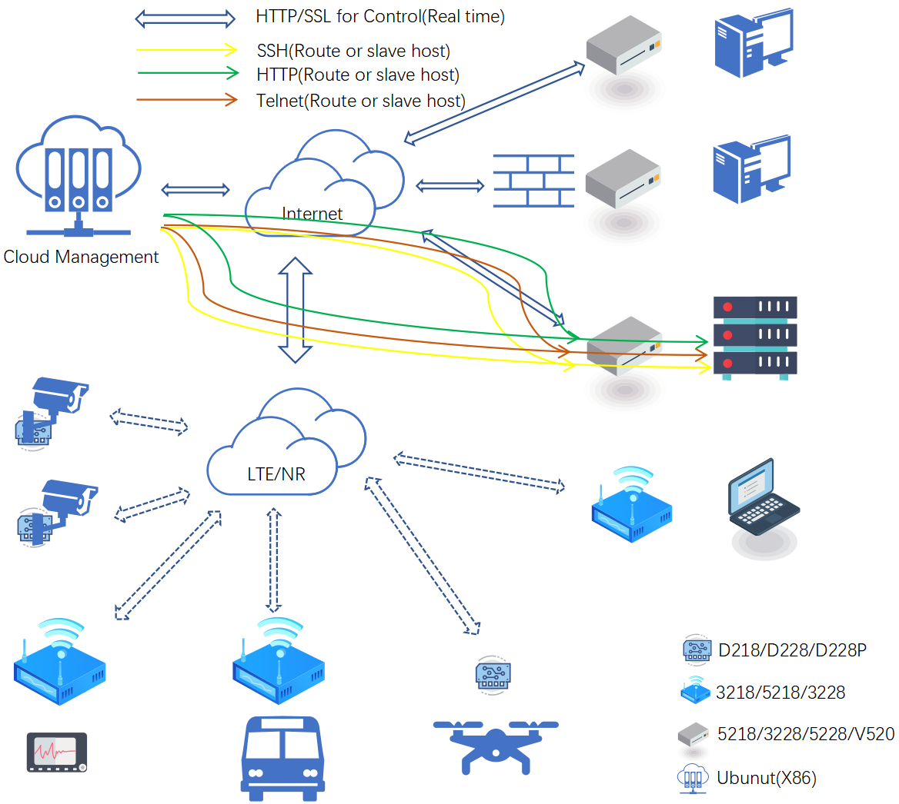
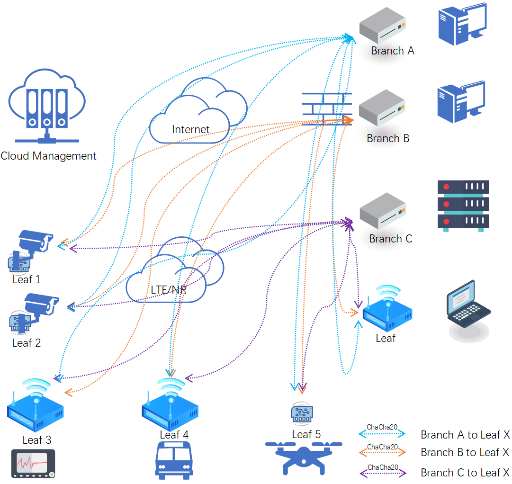
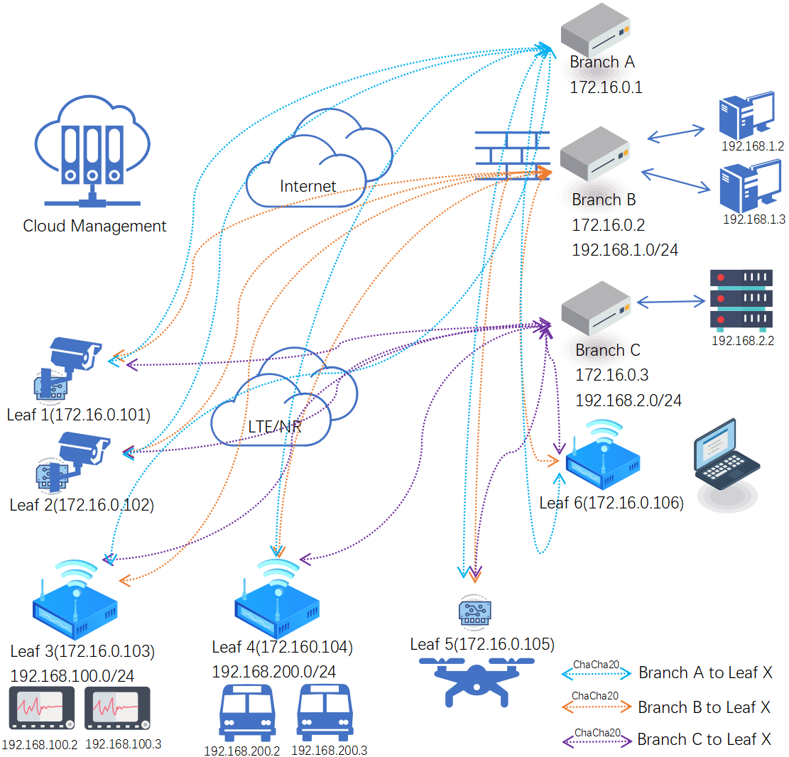

## 简介

###### 云平台管理方式
 - **使用SSL通信保护设备与平台间的信令交互**, 
 - **支持多用户管理**
 - **提供开发接口实现云平台自定义开发**
 - **多种信令下发方式, 确保设备永久在线**
 - **远程实时控制实现直接访问设备界面及设备终端命令行**

###### 实时控制
 - **通过云平台登录设备网页界面**
 - **通过云平台登录设备SSH**
 - **通过云平台登录设备Telnet**

###### LTE/NR自组网
 - **多介质接入**, 支持LTE/NR, 有线WAN, 无线WISP多种方式接入自组网
 - **多形态**, 即支持板卡嵌入到客户设备中实现自组网接入, 也支持路由器独立式接入
 - **使用安全高效的ChaCha20加密实现数据交换**
 - **支持创建多个网络**, 各网络间互相隔离
 - **多主干多终端**, 多个主干, 主干与终端, 主干与主干点对点交换, 低延迟, 不限流
 - **多个主干相互备份** 一个主干掉线不影响其它主干通信
 - **子网能力** 为接入的设备分配一个网段
 - **终端与终端间互通**, 终端与终端可互通

###### 完整的开发接口
 - **可为客户搭建云平台**
 - **通过云平台开发接口可完全实时管理设备** 实时IO操作, 串口操作等
 - **通过云平台开发接口批量升级设备**
 - **通过云平台开发接口备份及下发设备配置**

## 云平台管理交互图

 

## 自组网点对点示意图
 

## 自组网子网示意图
 

