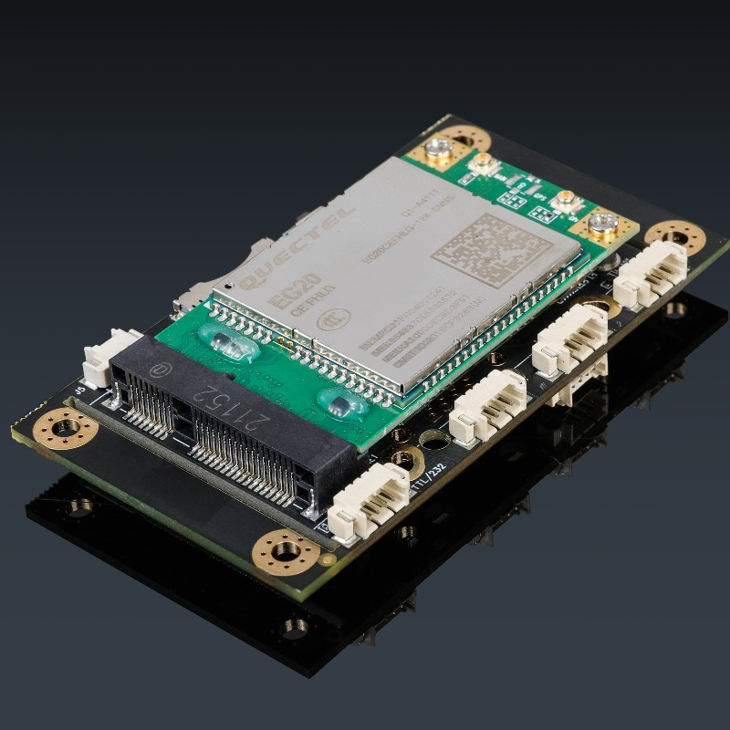
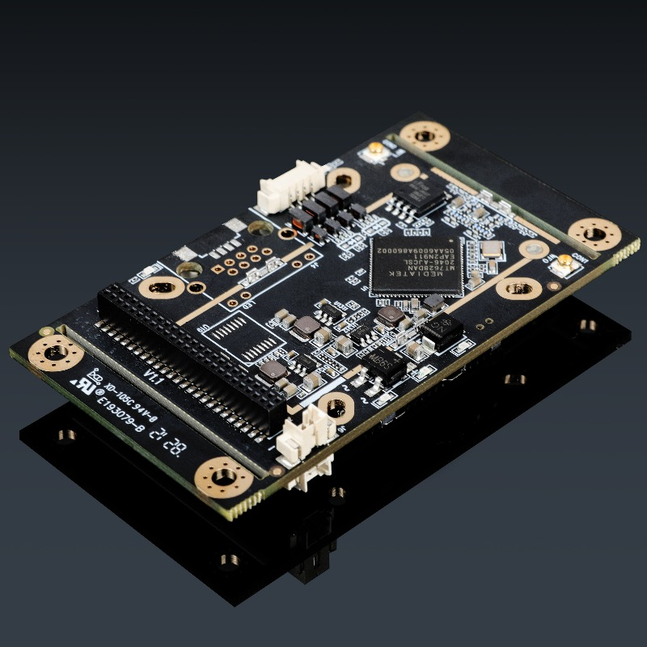
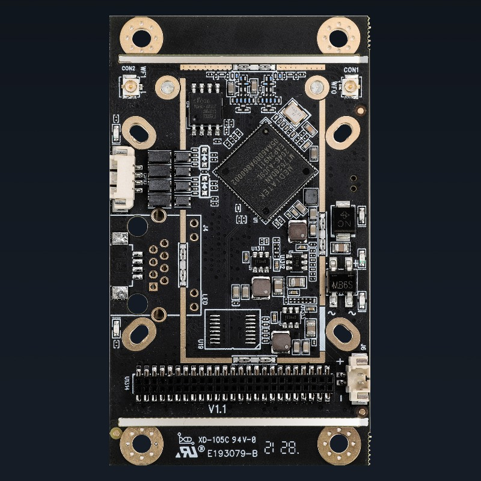
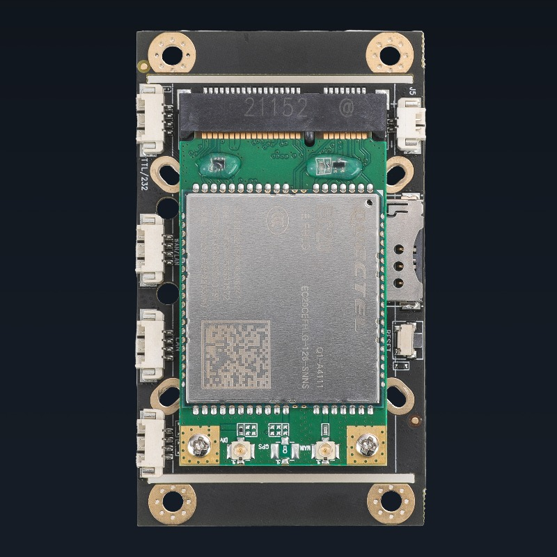
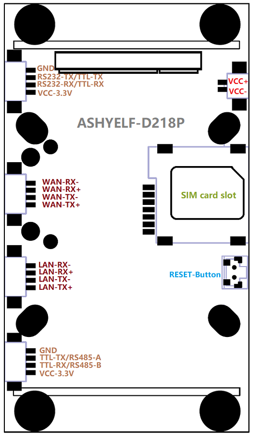
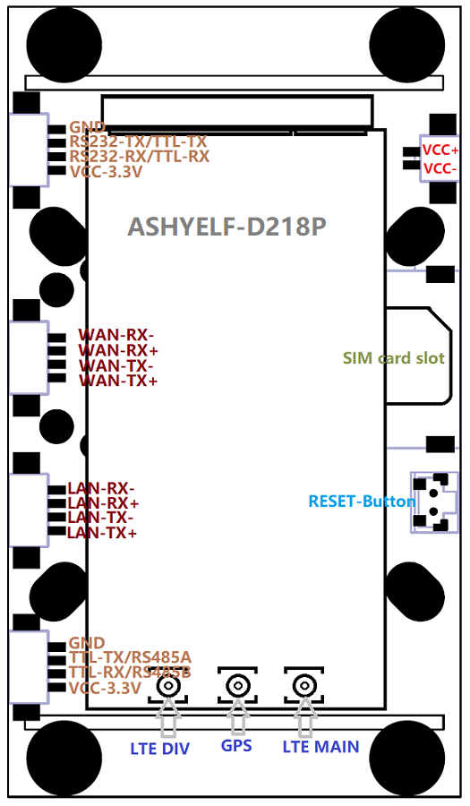
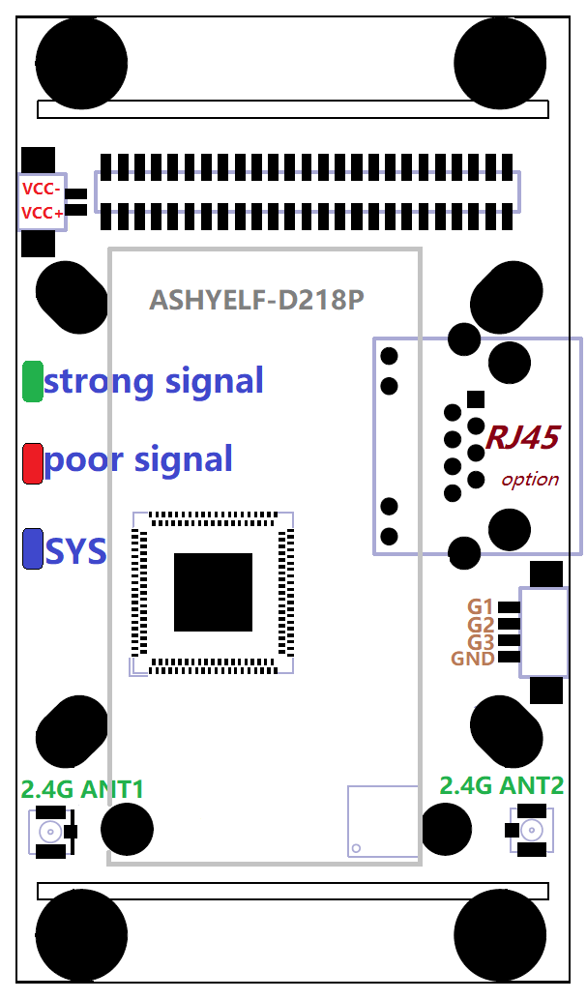
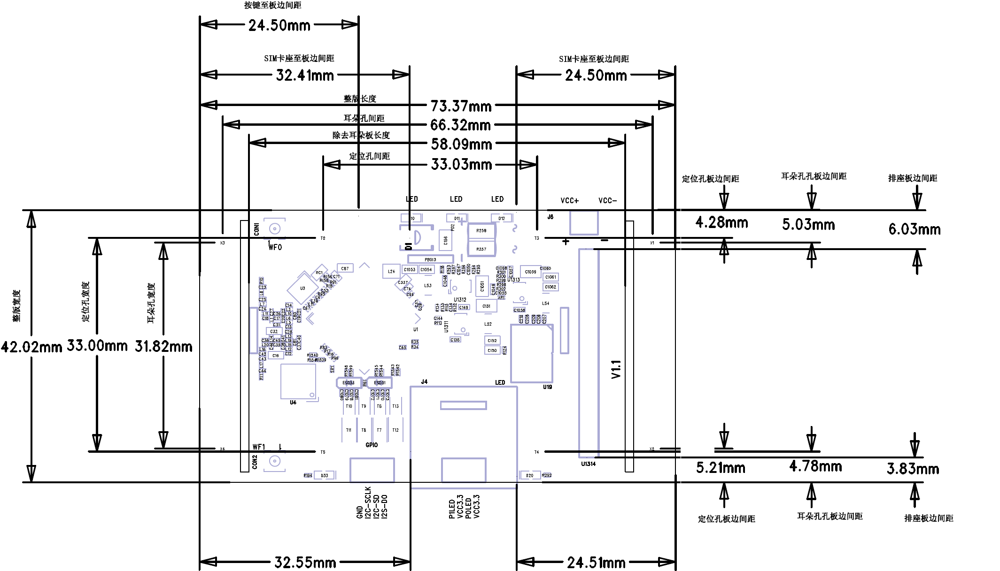
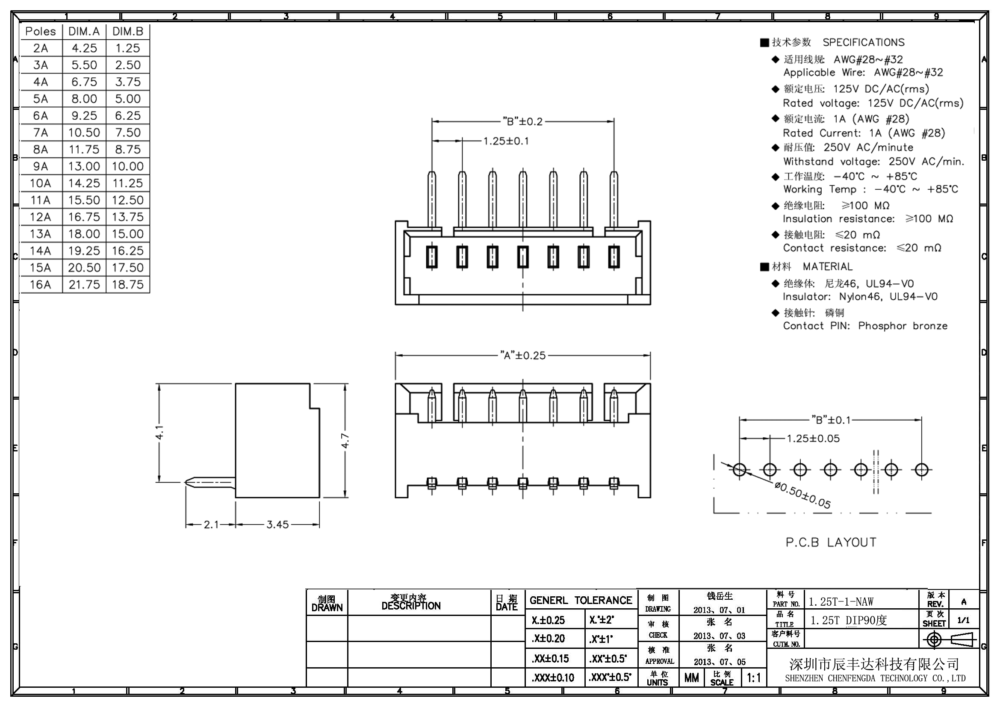

## 简介

###### D218为一款接口丰富, 工业用LTE路由模块, 此路由模块含有
 - **2G/3G/4G全网通频段接入**, **双百兆以太网口**, **双串口**(*RS485/RS232/TTL可选*)
 - **双天线2.4G无线**(*300M*)
 - **3路输入输出IO口**(*可选配置为I2C*)
 - **支持PIN针母座**, 通过PIN母座可向外转接5个网口(*2个带变压器,3个未带变压器*)、两个串口、SIM卡槽、复位按键、指示灯及IO口接口
 - **GPS定位功能**
 - **短信远程管理**
  - **PPTP/L2TP/IPSEC/OPENVxPxN等常用VPN功能**
 - **ZeroTier/WireGuard等SDWAN的功能**

###### 为支持工业级应用环境带有
 - **宽温支持**, 支持低温-40度冷启动, 高温75度长期工作
 - **硬件狗**
 - **防静电保护**
 - **3路独立电源设计**, 独立功能模块间相互监控, 出现异常可快速重置恢复

###### 多种方式接入互联网
 - **3G/4G接入互联网**
 - **有线WAN口接入互联网**
 - **2.4G无线接入互联网**,  **2.4G无线中继桥接**
 - **3G/4G与有线WAN口接入同时工作**, 冷备份, 热备份及负载均衡带宽叠加
 - **3G/4G与2.4G无线接入同时工作**, 冷备份, 热备份及负载均衡带宽叠加, 实现在无人机或车载上进站连本地无线网络出站使用LTE上网的功能
 - **2.4G无线接入与有线WAN口接入同时工作**, 冷备份, 热备份及负载均衡带宽叠加
 - **强制客户端(或应用)使用指定接入方式上网**, 允许在多种接入方式同时工作时强制客户端或应用分别使用不同的接入方式访问互联网
 - **定制更多智能接入方式**, 开放SDK编程环境提供示例及标准接口可客户自定制更多接入策略， 如定制三种接入方式同时工作， 自动根据现场情况或指定策略动态变换接入方式等
 - **支持云鹰卡三网切换**, 可定制支持云鹰卡实现随意切换联通/电信/移动运营商

###### 提供多种接口供其它设备连接到互联网
 - **以太网口(802.3u)**
 - **2.4G无线(802.11bgn)**
 - **串口(RS485/RS232/TTL)**
 - **IO口(3.3V输入输出)**

###### 串口支持多种模式： 透传/Modbus/MQTT/指令模式/外接GPS北斗定位模块/自定义协议转换
 - **串口透传** 支持自定义注册包/激活包/保活包, 自定义包前后缀, 服务器与客户端同时工作及多服务器, 流量统计
 - **Modbus/MQTT协议**, 可为PLC设备及实时物联网设备接入网络 
 - **串口GPS数据上报**, 串口支持外接GPS, 可解析其数据并上报
 - **支持串口指令模式**, 可通过串口指令管理控制设备
 - **两路串口同时工作**, 可选RS232及RS485, RS232及TTL, TTL及RS485, 双TTL四种组合
 - **定制各种串口协议**, 开放SDK编程环境提供示例及标准接口可客户自定制更多串口协议

###### IO口支持实时控制及监控
 - **3路IO口实时切换输入输出模式**
 - **提供自定义远程管理IO口协议**, 允许远程服务器实时操作设备的IO口, 配置IO口模式, 输入模式下IO口电平发生变化时实时通知远程服务器
 - **提供MQTT协议管理IO口**, 自动订阅主题及IO变化时发布主题等功能实现远程操作及监控设备IO口电平变化
 - IO口可配置为**I2C引脚实现外接I2C设备**
 - **定制各种IO控制协议**, 开放SDK编程环境提供示例及标准接口可客户自定制更多IO管理口协议

###### GPS多种类数据采集上报
 - **GPS或北斗**
 - **NMEA原始数据上报**, 可指定报头及指定上报间隔
 - **MQTT数据上报**
 - **HTTP JSON数据上报**

###### 多种管理协议支持, 允许用户通过协议实现本地或远程全方位管理控制路由模块
 - **本地TCP协议控制**
 - **本地HTTP协议状态查询**
 - **本地网络广播搜寻设备**
 - **本地管理工具包及编程API**, 提供Linux环境下的管理工具包, 实现在本地管理设备/OTA升级, 并开放管理工具包编程API及示例, 快速帮助客户实现对设备的管理
 - **短信管理**, 支持通过短信重启重置设备， 查询设备状态，修改设备配置等
 - **远程HTTP协议状态上报**(设备信息/终端信息/GPS信息), **远程HTTP协议控制**, **MQTT状态上报告警及MQTT设备管理等功能**
 - **远程管理云服务器SDK**, 提供Linux环境下的云管理服务器, 实现远程管理设备/OTA升级, 并开放管理工具包编程API及示例, 快速帮助客户实现对设备的远程管理

###### 为支持多功能应用及定制化开发使用了专为路由行业开发的Skin嵌入式系统
 - **7*24小时全年无故障运行**, 功能强大, 性能卓越, **功能模块组件式分离开发**, 统计的作业接口, 方便客户编写自已的应用程序
 - **框架式开发**, 支持自行定制指定功能的协议组件, 如可只编写LTE模块驱动识别组件, 编写串口协议转换组件及编写远程被管理组件对端客户的管理平台等
 - **纯C语言编写**, 行业内应用功能齐全, 并可**在线编程**
 - **完备的开发环境及开发文档**, 一步到位允许用户基于现有功能上进一步开发定制化的功能, 并将现有功能包装为统一的接口允许客户直接调用

###### 含有两项专利
 - 本产品已获 **[实用新型专利](./专利.pdf)** 及外观专利， 使用正品，**排除法律风险**

## 模块实物图
    

## 硬件规格
|  参数   | 规格  |
| :-----:| :---- |
| **尺寸(mm)** | 带定位板尺寸: 42mm X 73.4mm X 12.9mm, 拆除定位板尺寸：42mm X 58mm X 12.9mm |
| **4G参数(LTE)**  | 默认使用**移远EC20双天线全网通模块**, 也可搭配客户指定的其它模块 **4G频段**: FDD LTE: B1/B3/B8 TDD LTE: B38/B39/B40/B41 **3G频段**: TDSCDMA: B34/B39  WCDMA: B1/B8 **2G频段**: CDMA 1x/EVDO: BC0  GSM: 900/1800 **带宽**: 1.4/3/5/10/15/20MHz LTE-FDD: Max 150Mbps (DL) Max 50Mbps (UL) LTE-TDD: Max 130Mbps (DL) Max 35Mbps (UL) **灵敏度** FDD B1: -97dBm (10M) FDD B3: -95dBm (10M) FDD B8: -94dBm (10M) TDD B38: -97dBm (10M) TDD B39: -97dBm (10M) TDD B40: -97dBm (10M) TDD B41: -96dBm (10M) WCDMA B1: -111dBm WCDMA B8: -110dBm TDSCDMA B34: -109dBm TDSCDMA B39: -109dBm CDMA BC0: -109dBm GSM 900: -109dBm GSM 1800: -109dBm **输出功率** Class 3 (23dBm±2dB) for LTE FDD Class 3 (23dBm±2dB) for LTE TDD Class 2 (24dBm +1/-3dB) for TD-SCDMA Class 3 (24dBm +1/-3dB) for WCDMA Class 3 (24dBm±1dB) for CDMA BC0 Class E2 (27dBm ±3dB) for EDGE 900MHz Class E2 (26dBm ±3dB) for EDGE 1800MHz Class 4 (33dBm ±2dB) for GSM 900MHz Class 1 (30dBm ±2dB) for GSM 1800MHz |
| **2.4G参数(WIFI)**   | **标准**：IEEE802.11bgn 300Mbps(2T2R) **发射功率** 11n HT40 MCS7: 15dBm 11b CCK: 18dBm 11G OFDM: 15dBm **接收灵敏度** 300Mbps: -65dBm 54Mbps: -73dBm 11Mbps: -86dBm|
| **WAN口** | 4PIN(1.25mm间距)WAN接口(10/100Mbps自适应), *网关模式及混合模式为**WAN口**, 其它模式下为**LAN口***  |
| **LAN口** | 4PIN(1.25mm间距)LAN接口(10/100Mbps自适应)  |
| **串口1** | 4PIN(1.25mm间距)串口接口, *默认**TTL电平**, 可选配置为**IO接口**, 并定制提供RS232电平串口*  |
| **串口2** | 4PIN(1.25mm间距)串口接口, *默认**RS485串口**, 可配置修改为TTL电平串口*   |
| **IO口(3个)** | 4PIN(1.25mm间距)式IO接口, *默认3路IO口, 可选配置为**I2C接口**加1路IO口*  |
| **电源供电口(2个)** | **立式**及**卧式**的2PIN(1.25mm间距)式供电接口(7-15V/2-3A)各一个(*可选支持5V*)，建议使用12V1A给其中之一供电即可  |
| **定位孔** | 8个定位孔, 分4个内定位孔(34mm*34mm)及4个外定位孔, *4个外定位孔所在的定位板可拆除*  |
| **WIFI天线接口(2个)** | WIFI2.4G IPEX-1天线接口*2  |
| **3G/4G天线接口(2个)** | 默认提供**2个4G IPEX-1接口**, *可选提供2个4G IPEX-1接口和GPS IPEX-1接口* |
| **SIM卡槽** | Micro SIM卡槽， **缺口向外触面向PCB板插入, 不支持热插拨** |
| **接键(1个)** | 复位按键 |
| **指示灯(3个)** | **系统灯(蓝)**:刚上电时常亮，启动后但未连接慢闪，正在拨号时快闪， 连接网络成功后常亮 **信号灯(红)**: 4G信号弱时亮 **信号灯(绿)**: 4G信号强时亮 |
| **PIN针母座(50PIN)** | **双排（1.0mm间距）50PIN母座, 可向外提供以下接口转接** 2个带变压器网口 3个无变压器网口 两个串口 4路供电口 SIM卡接线 按键及指示灯 IO接口  |
| **功耗（满负荷时）** | 小于3W, 基于无线环境与网络负载不同瞬间峰值可能会高于3W， 建议提供5W功率 |
| **温度** | 工作温度： -40℃ ~ +75℃ |

## 硬件配置表
|  接口  | D218标准版  | D218-232  | D218-GPS  | D218核心版  |
|:-----:|:----:|:----:|:----:|:----:|
| 串口1-TTL| V |  | V | V |
| 串口1-RS232|  | V |  |  |
| 串口2-RS485/TTL软件可配置| V | V | V | V |
| LTE全网通基带| V | V | V | V |
| GPS定位 |  |  | V |  |
|MiniPCI-E插槽-自配LTE模块|  |  |  | V |

***如需更多其它配置请联系销售***

## 软件功能表
|  功能   | 描述  |
| :-----:| :---- |
| **联网方式** | **单连接上网**： 3G/4G上网，有线上网，无线上网，桥接，中继，无线互联网, 3G/4G猫(Modem) **混合上网**： 2G/3G/4G与以太网有线上网同时工作, 冷备份, 热备份及负载均衡带宽叠加 2G/3G/4G与无线WIFI上网同时工作, 冷备份, 热备份及负载均衡带宽叠加 无线WIFI上网与以太网有线上网同时工作, 冷备份, 热备份及负载均衡带宽叠加 **组合上网模式**: 3G/4G上网+桥接， 3G/4G上网+有线接内网, 3G/4G上网+无线接内网, 其它复杂定制组合 |
| **LTE网络**| 3G/4G支持 **多种拨号模式** (如点对点, 网卡拨号等), *可选支持IPV6协议栈* 3G/4G/5G支持1000多个运营商， **自动匹配运营商** **APN支持自定义** 支持SIM卡 **PIN码** **短信管理(SMS)** **锁频段** **锁SIM卡** **锁3G/4G模块** 保持 **常驻指定网络模式** 功能, *如用于常驻于3G/4G模式防止切换至2G模式等* 支持 **云鹰SIM卡** 实现三网切换 |
| **网络稳定性**| 多种网络保活机制, **ICMP检测**, **接收包计数检测** 连续失败重启恢复等功能，确保数据终端永久在线 |
| **串口功能**| 两路串口支持 **透传** 模式, 支持指定帧长度帧间隔、流控、自定义注册包/保活包、自定义包前后缀、向串口发送自定义激活包、**服务器与客户端同时工作**、**流量统计** 两路串口透传支持 **多数据中心** 功能 两路串口支持 **ModbusRTU** 协议(*将串口上的ModbusRTU转换成ModbusTCP*) 两路串口都支持 **MQTT数据透传** (*并支持向串口发送自定义激活包*) 两路串口都支持 **指令模式**, *支持专有HE指令用于控制及管理设备* TTL串口支持 **外接GPS及北斗** ，并可将GPS数据解析并上传 |
| **设备稳定性**| 工业级硬件看门狗 3路独立供电单元软件相互监控 低温自热机制 自动重启(*定时或定点及空闲时重启*) |
| **高可用性**| 多设备间相互备用, *高可用性HA(VRRP), 单台设备故障可切换到备用设备* |
| **虚拟专用网**| 支持L2TP客户端(*支持隧道密码*) PPTP客户端(*支持MPPE*) GRE隧道 OpenVxpxn客户端(*支持预共享密钥,证书*) IPSEC |
| **GPS定位**| 支持 **NMEA协议TCP/UDP上报**(*可指定包头及上报间隔*) 支持 **TCP/UDP NMEA服务器** 功能(*允许其它客户端主动连接设备获到定位信息, 允许指定客户端数*) 支持 **MQTT协议**上报定位信息 支持 **HTTP JSON协议**上报定位信息 支持 **JT/T808协议**上传定位信息 |
| **网络应用**| 防火墙 端口映射(NAT)及DMZ主机 端口代理 域名劫持 应用层网关 静态路由表管理 **源地址路由**, **端口路由**等高级路由功能 DDNS(支持花生壳及多种网内外运营商) UPNP 域名重定向 IGMP正向/反向代理 *动态路由协议（RIPv1、RIPv2、RIPng、OSPFv2、OSPFv3、BGP-4和 BGP-4+）(需定制)* |
| **网络监控**| 网络实时流量图， 终端实时流量及用量统计, 终端流量控制、访问控制、定时上网 终端远程唤醒(WOL) |
| **无线(WIFI)功能**| 2.4G无线热点 2.4G无线网卡 无线黑白名单 发射功率调整 *WIFIdog广告推送(需定制)* *Coova Chilli广告推送(需定制)* |
| **时间管理**| 基站对时 NTP对时 支持 **局域网对其它设备授时**, *给某些专网用无RTC摄象头等设备提供正确的时间* |
| **开发接口**| 局域网搜索协议(发现设备), 局域网TCP/HTTP控制协议(控制设备) 局域网批量升级协议(批量升级设备固件) 远程HTTP控制协议(云平台管理) 设备信息(3G/4G信号连接时长流量/设备基本信息等各种设备状态), GPS信息, 终端信息(终端MAC地址/连接时间及时长)等上报协议 网页接口获取设备信息API IO口远程控制协议 远程MQTT监控协议(告警云平台) 终端命令行(SSH/Telnet/串口)接口 在线开发脚本项目(开发shell脚本并注册为开机或关机或事件触发运行,并可在线开发管理界面), 在线将脚本项目打包用于安装于其它设备中 在线开发定时运行指定的脚本 短信(SMS)控制协议|
| **第三方开发支持**| Skin系统属于开放式Linux操作系统, 针对项目用户可提供完整的开发环境, 支持客户自已开发应用软件 系统为纯C语言开发的路由器操作系统, 可运行于嵌入式芯片平台及X86工控机中, 性能高, 功耗低, 发热量小 提供组件式开发环境, 可基于系统现有的组件方便的开发客户应用软件包(FPK软件包)并可跨嵌入式平台应用 组件式开发环境提供统一的API及丰富的组件接口供客户调用 堆叠式的组件应用开发可快速开发客户定制项目, 并生成软件包, 客户定制项目可无修改跨平台移植到所有支持Skin系统的产品中 Skin系统现已支持的MT7628/MT7620/MT7621/MT7622, AR9331/AR9341/AR9344/AR9342, QCA9531/QCA9561/QCA9563/QCA9558, RK3568等多种芯片方案 Skin系统现已支持从PCBA模块到两网口， 三网口，五网口，百兆，千兆，有线，无线WIFI5, 无线WIFI6, LTE-4G, NR-5G等多种路由系列的产品|
| **远程管理** *针对定制项目*| 批量查看设备状态及管理 批量重启及复位设备， 批量升级设备 设备分组管理, 设备单独管理 设备下的终端管理 *4G流量统计及配额管理(开发中)* *告警信息记录及邮件通知(开发中)* *设备运行日志管理(开发中)*|
| **设备管理**| 备份及导入配置，本地升级, 在线升级, 局域网批量升级 LOGO上传，定制默认配置，*恢复出厂也可保留* 英文切换, *恢复出厂也可保留* 可安装卸载FPK软件包, 可恢复原始固件状态 云平台远程管理 Telnet/SSH连入设备 串口命令行管理（CLI） 指示灯开关， IO口常用功能定义 本地及远程日志 **IO扩展（支持自定义输入及输出）用于工业控制, 通过自定义协议或MQTT协议远程实时控制** **升级失败可恢复**（不死Bootloader） 可定制普通用户及超级用户界面区分管理, **锁定指定配置**, **锁定升级**, **锁定重启**, **锁定恢复出厂及锁定配置导入导出**等功能 **提供x86/aarch64(arm)平台的设备管理工具包及OTA升级工具** 支持专有工具实现 **批量升级**, **批量测试** |
| **后续功能**| USSD(开发中)、TR069(开发中)、SNMP(开发中) |
| **最大用户数**| 无线：20个， 有线：50个 |

## 模块正面接口图 

|  **未插LTE模块**   | **带LTE模块**  |
| :-----:| :----: |
|   |  | 

###### VCC+与VCC- : **卧式电源供电口, 2PIN座子(1.25mm), VCC+为正极, VCC-为负极** ***设备可选两个位置供电口之一***

###### SIM card slot: **SIM卡插槽, 可插入Micro SIM卡**
- SIM卡缺口向外接触面向PCB板插入

###### RESET-Button: **恢复出厂按键**
- 上电开机后按下5至8秒钟松开设备将恢复出厂并重启

###### 串口1: **由GND, RS232-TX/TTL-TX, RS232-RX/TTL-RX, VCC-3.3V组成**
- GND引脚为接地, VCC-3.3V引脚输出3.3V供电
- 串口1默认为TTL模式, RS232-TX/TTL-TX为发送, RS232-RX/TTL-RX为接收, 可定制为RS232模式

###### 串口2: **由GND, TTL-TX/RS485-A, TTL-RX/RS485-B, VCC-3.3V组成**
- GND引脚为接地, VCC-3.3V引脚输出3.3V供电
- 串口2有两种模式可配置, 默认RS485模式, 为RS485模式时, TTL-TX/RS485-A为RS485的A, TTL-RX/RS485-B为RS485的B
- 串口2也可配置为TTL模式, 为TTL模式时, TTL-TX/RS485-A为TTL的发送, TTL-RX/RS485-B为TTL的接收

###### WAN口: **由WAN-RX-, WAN-RX+, WAN-TX-, WAN-TX+组成, 为有线网口**
- 在默认配置下WAN口即为LAN口, 用于连接其它有线设备, 为其提供上网服务
- 而将设备的工作模式配置为有线宽带或混合模式时, WAN口即为WAN口, 用于连接其它的路由器设备实现接入互联网
    > WAN-TX- 与 网线序号1 相连
    > WAN-TX+ 与 网线序号2 相连
    > WAN-RX- 与 网线序号3 相连
    > WAN-RX+ 与 网线序号6 相连
    > ***网口具有自适应功能， 即WAN-TX-/WAN-TX+可与网线1/2随意置换， WAN-RX-/WAN-RX+可与网线3/6随意置换, WAN-TX-/WAN-TX+这也可与网线3/6接而WAN-RX-/WAN-RX+可与网络1/2接***

###### LAN口: **由LAN-RX-, LAN-RX+, LAN-TX-, LAN-TX+组成, 为有线网口**
- 用于连接其它有线设备, 为其提供上网服务
    > LAN-TX- 与 网线序号1 相连
    > LAN-TX+ 与 网线序号2 相连
    > LAN-RX- 与 网线序号3 相连
    > LAN-RX+ 与 网线序号6 相连
    > ***网口具有自适应功能， 即LAN-TX-/LAN-TX+可与网线1/2随意置换， LAN-RX-/LAN-RX+可与网线3/6随意置换, LAN-TX-/LAN-TX+这也可与网线3/6接而LAN-RX-/LAN-RX+可与网络1/2接***

###### LTE天线: **由LTE MAIN, GPS, LTE DIV组成, 为IPEX-1的天线接头, 用于连接对应的天线**
- LTE MAIN为LTE的主天线接口, 用于接LTE天线, 在使用4G上网功能时必须要接
- GPS用于接GPS天线, 默认没有此天线接口, 而在特定的型号中会带有此天线接口, 带有此天线接口的模块表示外接GPS天线后即拥有GPS定位功能
- LTE DIV为LTE的分集天线接口, 在使用4G上网功能时在此接口上接LTE天线将会提高信号质量及带宽

## 模块背面接口图

 

###### VCC+与VCC- : **立式电源供电口, 2PIN座子(1.25mm), VCC+为正极, VCC-为负极** ***设备可选两个位置供电口之一***

###### SYS: **蓝色系统指示灯**
- 刚上电时常亮
    > 上电后不亮表示通电不正常或设备可能损坏
- 启动后自检时慢闪
    > 自检失败将一直保持慢闪
    > 慢闪时一直保持亮与灭时长相同表示未识别到LTE模块
    > 慢闪时一直保持灭比亮时长表示未识别到SIM卡
- 正在拨号时快闪
    > 设备升级时也会快闪
- 连接网络成功后常亮

###### poor signal: **红色信号强度指示灯, LTE信号弱时亮**
- LTE信号弱时长亮
- LTE信号非常弱时闪

###### strong signal： **绿色信号强度指示灯, LTE信号强时亮**
- LTE信号非常强时长亮
- LTE信号良好是闪

###### 2.4G ANT1: **2.4G的WIFI天线1, 用于接IPEX-1头的2.4G WIFI天线**

###### 2.4G ANT12: **2.4G的WIFI天线2, 用于接IPEX-1头的2.4G WIFI天线**

###### G1/G2/G3/GND: **IO口, 3个IO口都可支持输入及输出**
- G1为IO口1, 当配置为I2C时, 此引脚为I2C的SCL, *即串行时钟线*
- G2为IO口2, 当配置为I2C时, 此引脚为I2C的SD, *即串行数据线*
- G3为IO口3
- GND为接地
    > 使用IO口可以从设备的其它任意接口中取GND或VCC-3.3V

## 尺寸图(具体以dxf文件为准)

 

## WAN, LAN, 串口, IO及电源供电接口规格

 

## 其它资料

[快速安装说明](./setup.md)

[底座接口说明](./spec_misc.md)

----
