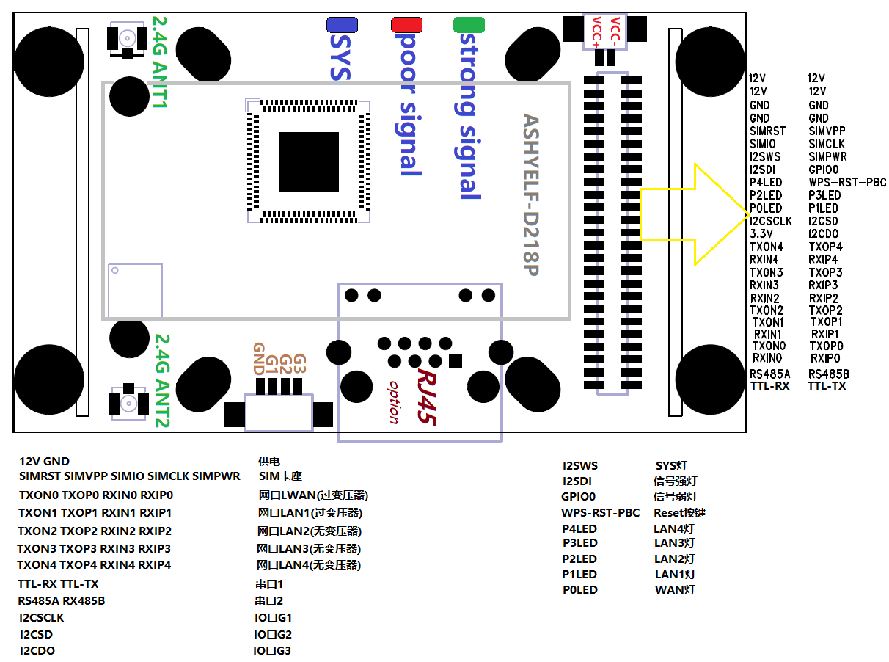
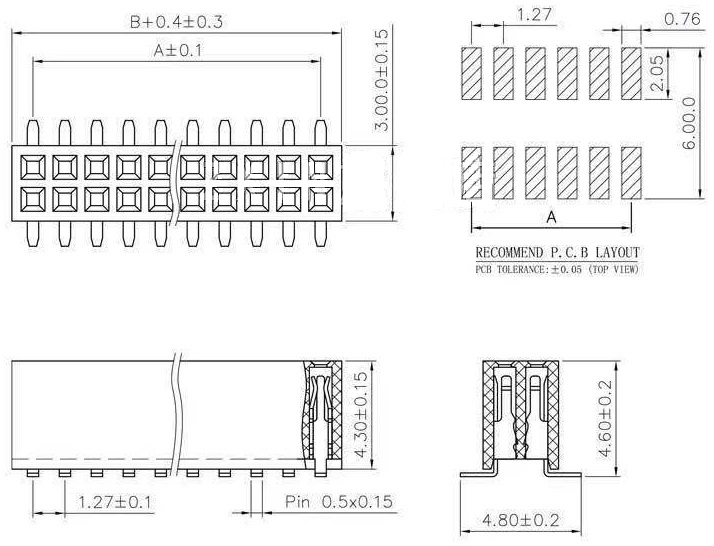

## D218其它资料
本文档进一步介绍D218的高级应用需要用的资料, 文档中会提到规格书相关的内容, 请对照规格书理解内容

## 背面50PIN座子接口图

 

###### 12V/GND： **共4根供电头4根GND**
- 支持7-12V的供电
- 因单PIN的管脚过细, 因此需要使用至少两对以上的12V与GND来对板子供电, 最好是4对全接
###### SIMRST/SIMVPP/SIMIO/SIMCLK/SIMPWR： **SIM卡座接线**
- 与218板子上的SIM卡接线共用, 因此如要外接SIM座与218板子上的SIM卡不能同时使用
###### TXON0/TXOP0/RXIN0/RXIP0： **网口LWAN**
- 与218板子上的LWAN口接线共用
###### TXON1/TXOP1/RXIN1/RXIP1： **网口LAN1**
- 与218板子上的LAN口接线共用
###### TXON2/TXOP2/RXIN2/RXIP2： **网口LAN2**
- 需要接网络变压器后出以太网口
###### TXON3/TXOP3/RXIN3/RXIP3： **网口LAN3**
- 需要接网络变压器后出以太网口
###### TXON4/TXOP4/RXIN4/RXIP4： **网口LAN4**
- 需要接网络变压器后出以太网口
###### TTL-RX/TTL_TX： **串口1**
- 与218板子上的串口1接线共用
###### RS485A/RS485B： **串口2**
- 与218板子上的串口2接线共用
###### I2CSCLK/I2CSD/I2CDO： **IO口G1/G2/G3**
- 与218板子上的IO口接线共用
###### I2SWS/I2SDI/GPIO0： **SYS灯/strong signal灯/poor signal灯**
- 与218板子上的SYS/strong signal/poor signal灯一致
###### I2CSCLK/I2CSD/I2CDO： **IO口G1/G2/G3**
- 与218板子上的IO口接线共用
###### WPS-RST-PBC： **Reset按键**
- 与218板子上的RESET-Button接线共用
###### P0LED： **LWAN口link灯**
###### P1LED： **LAN1口link灯**
###### P2LED： **LAN2口link灯**
###### P3LED： **LAN3口link灯**
###### P4LED： **LAN4口link灯**

## 背面50PIN座子规格书
 

## dxf文件
[点击下载dxf文件](./d218.dxf)

----

