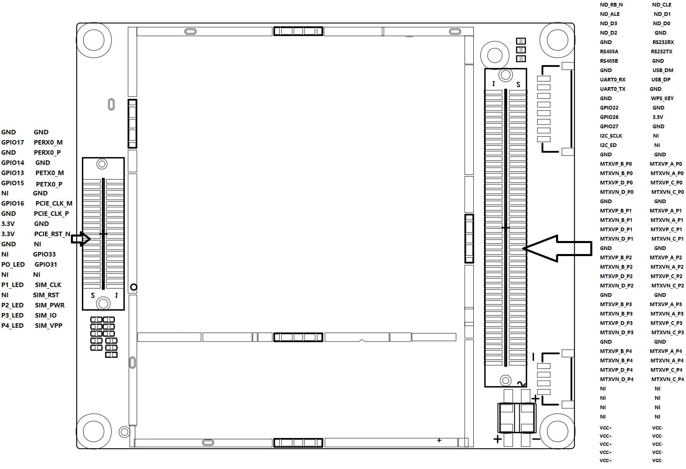
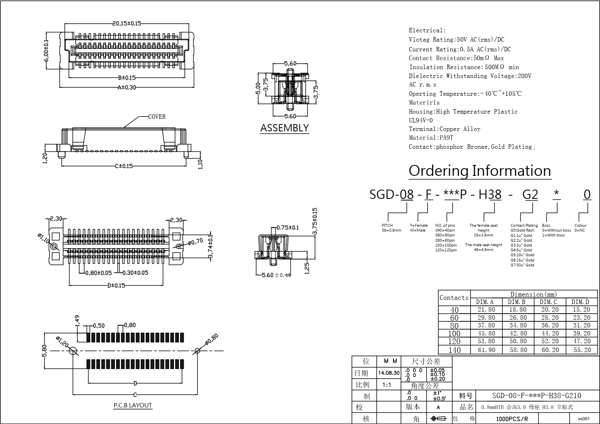

## D228其它资料
本文档进一步介绍D228的高级应用需要用的资料, 文档中会提到规格书相关的内容, 请对照规格书理解内容

## 背面20PIN+50PIN底座接口图

 

#### 50PIN底座接口说明

###### ND_RB_N/ND_CLE/ND_ALE/ND_D1/ND_D3/ND_D0/ND_D2： **Nand Flash接口管脚**
- 不需要Nand flash不接即可
- 如需外接Nand Flash可向销售索要相关参考设计并提供支持此功能的软件

###### RS485A/RS485B： **RS485串口接口管脚**
- 与228板子上的8PIN(1.25mm间距)UART接口的串口(RS485)相同, 因此两者不能同时使用
- 即RS485A管脚是8PIN(1.25mm间距)UART接口的串口上的RS485-A管脚
- 即RS485B管脚是8PIN(1.25mm间距)UART接口的串口上的RS485-B管脚

###### RS232RX/RS232TX： **RS232串口接口管脚**
- 与228板子上的8PIN(1.25mm间距)UART接口的串口(RS232)相同, 因此两者不能同时使用
- 即RS232TX管脚是8PIN(1.25mm间距)UART接口的串口上的RS232-TX管脚
- 即RS232RX管脚是8PIN(1.25mm间距)UART接口的串口上的RS232-RX管脚

###### UART0_TX/UART_TX： **TTL串口接口管脚**
- 与228板子上的8PIN(1.25mm间距)UART接口的串口(TTL)相同, 因此两者不能同时使用
- 即UART0_TX管脚是8PIN(1.25mm间距)UART接口的串口上的TTL-TX管脚
- 即UART0_RX管脚是8PIN(1.25mm间距)UART接口的串口上的TTL-RX管脚

###### USB_DM/USB_DP： **USB2.0接口管脚**
- 用于外扩一个USB2.0的接口

###### GPIO27： **Strong LED, 即系统的Stong灯的引脚**
- 即GPIO27管脚也是8PIN(1.25mm间距)IO接口上的Strong LED管脚

###### GPIO26： **Weak LED, 即系统的Weak灯的引脚**
- 即GPIO26管脚也是8PIN(1.25mm间距)IO接口上的Weak LED管脚

###### GPIO22： **SYS LED, 即系统的SYS灯的引脚**
- 即GPIO22管脚也是8PIN(1.25mm间距)IO接口上的SYS LED管脚

###### WPS_KEY： **即系统的RESET按键的引脚**
- 即WPS_KEY管脚也是8PIN(1.25mm间距)IO接口上的RESET Button管脚

###### I2C_SCLK： **IO口G2**
- 与228板子上背面的8PIN(1.25mm间距)IO接口的G2相同
- 即I2C_SCLK管脚是8PIN(1.25mm间距)IO接口的I2C_SCLK管脚

###### I2C_SD： **I0口G1**
- 与228板子上背面的8PIN(1.25mm间距)IO接口的G1相同
- 即I2C_SD管脚是8PIN(1.25mm间距)IO接口的I2C_SD管脚

###### MTXVP_B_P0/MTXVP_A_P0/MTXVN_B_P0/MTXVN_A_P0/MTXVP_D_P0/MTXVP_C_P0/MTXVN_D_P0/MTXVN_C_P0： **千兆以太网口(LAN1）**
- 需要接网络变压器后出以太网口

###### MTXVP_B_P1/MTXVP_A_P1/MTXVN_B_P1/MTXVN_A_P1/MTXVP_D_P1/MTXVP_C_P1/MTXVN_D_P1/MTXVN_C_P1： **千兆以太网口(LAN2）**
- 需要接网络变压器后出以太网口

###### MTXVP_B_P2/MTXVP_A_P2/MTXVN_B_P2/MTXVN_A_P2/MTXVP_D_P2/MTXVP_C_P2/MTXVN_D_P2/MTXVN_C_P2： **千兆以太网口(LAN3）**
- 需要接网络变压器后出以太网口

###### MTXVP_B_P3/MTXVP_A_P3/MTXVN_B_P3/MTXVN_A_P3/MTXVP_D_P3/MTXVP_C_P3/MTXVN_D_P3/MTXVN_C_P3： **千兆以太网口(LAN4）**
- 与228板子上正面的8PIN(1.25mm间距)LAN接口相同
- 即MTXVP_B_P3是8PIN(1.25mm间距)LAN接口的RX_D2+
- 即MTXVP_A_P3是8PIN(1.25mm间距)LAN接口的TX_D1+
- 即MTXVN_B_P3是8PIN(1.25mm间距)LAN接口的RX_D2-
- 即MTXVN_A_P3是8PIN(1.25mm间距)LAN接口的TX_D1-
- 即MTXVP_D_P3是8PIN(1.25mm间距)LAN接口的BI_D4+
- 即MTXVP_C_P3是8PIN(1.25mm间距)LAN接口的BI_D3+
- 即MTXVN_D_P3是8PIN(1.25mm间距)LAN接口的BI_D4-
- 即MTXVN_C_P3是8PIN(1.25mm间距)LAN接口的BI_D3-

###### MTXVP_B_P4/MTXVP_A_P4/MTXVN_B_P4/MTXVN_A_P4/MTXVP_D_P4/MTXVP_C_P4/MTXVN_D_P4/MTXVN_C_P4： **千兆以太网口(WAN）**
- 与228板子上正面的8PIN(1.25mm间距)WAN接口相同
- 即MTXVP_B_P4是8PIN(1.25mm间距)WAN接口的RX_D2+
- 即MTXVP_A_P4是8PIN(1.25mm间距)WAN接口的TX_D1+
- 即MTXVN_B_P4是8PIN(1.25mm间距)WAN接口的RX_D2-
- 即MTXVN_A_P4是8PIN(1.25mm间距)WAN接口的TX_D1-
- 即MTXVP_D_P4是8PIN(1.25mm间距)WAN接口的BI_D4+
- 即MTXVP_C_P4是8PIN(1.25mm间距)WAN接口的BI_D3+
- 即MTXVN_D_P4是8PIN(1.25mm间距)WAN接口的BI_D4-
- 即MTXVN_C_P4是8PIN(1.25mm间距)WAN接口的BI_D3-

###### VCC+/VCC-： **共5根供电VCC+及VCC-**
- 支持7-15V的供电
- 因单PIN的管脚过细, 因此需要使用至少四对以上的12V与GND来对板子供电, 最好是5对全接

#### 20PIN底座接口说明

###### GPIO17/GPIO14/GPIO13/GPIO15/GPIO16/GPIO33/GPIO32: **扩展用IO口**
- 需要定制软件使用

###### PERX0_M/PERX0_P/PETX0_M/PETX0_P/PCIE_CLK_M/PCIE_CLK_P/PCIE_RST_N： **PCIE接口**
- 可用于外接PCIE的无线网卡或是其它的PICE设备， 需要修改软件支持即可

###### P0_LED： **LAN1口link灯**
###### P1_LED： **LAN2口link灯**
###### P2_LED： **LAN3口link灯**
###### P3_LED： **LAN4口link灯**
###### P4_LED： **WAN口link灯**

## 背面20PIN/50PIN座子规格书
 

## dxf文件
[点击下载dxf文件](./d228.dxf)

----

