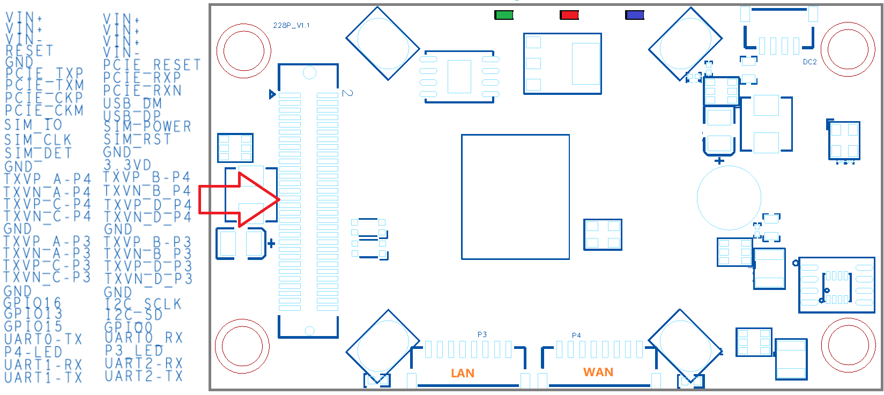
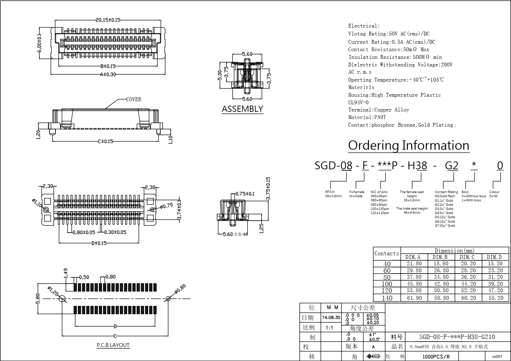

## D228P其它资料
本文档进一步介绍D228P的高级应用需要用的资料, 文档中会提到规格书相关的内容, 请对照规格书理解内容

## 背面60PIN底座接口图

 

#### 60PIN底座接口说明

###### VIN+/VIN-： **共5根VIN+正极供电及两根VIN-负极**
- 支持7-15V的供电

###### RESET： **即系统的RESET按键的引脚**

###### PCIE_TXP/PCIE_TXM/PCIE_CKP/PCIE_CKM/PCIE_RESET/PCIE_RXP/PCIE_RXN： **PCIE接口**
- 可用于外接PCIE的无线网卡或是其它的PICE设备， 需要修改软件支持即可

###### USB_DM/USB_DP： **USB2.0接口管脚**
- 用于外扩一个USB2.0的接口

###### SIM_RST/SIM_DET/SIM_IO/SIM_CLK/SIM_POWER： **SIM卡座接线**
- 与D228P板子上的SIM卡接线共用, 因此如要外接SIM座与D228P板子上的SIM卡不能同时使用

###### TXVP_B_P3/TXVP_A_P3/TXVN_B_P3/TXVN_A_P3/TXVP_D_P3/TXVP_C_P3/TXVN_D_P3/TXVN_C_P3： **千兆以太网口(LAN）**
- 与D228P板子上正面的8PIN(1.25mm间距)LAN接口相同
- 即TXVP_B_P3是8PIN(1.25mm间距)LAN接口的RX_D2+
- 即TXVP_A_P3是8PIN(1.25mm间距)LAN接口的TX_D1+
- 即TXVN_B_P3是8PIN(1.25mm间距)LAN接口的RX_D2-
- 即TXVN_A_P3是8PIN(1.25mm间距)LAN接口的TX_D1-
- 即TXVP_D_P3是8PIN(1.25mm间距)LAN接口的BI_D4+
- 即TXVP_C_P3是8PIN(1.25mm间距)LAN接口的BI_D3+
- 即TXVN_D_P3是8PIN(1.25mm间距)LAN接口的BI_D4-
- 即TXVN_C_P3是8PIN(1.25mm间距)LAN接口的BI_D3-

###### TXVP_B_P4/TXVP_A_P4/TXVN_B_P4/TXVN_A_P4/TXVP_D_P4/TXVP_C_P4/TXVN_D_P4/TXVN_C_P4： **千兆以太网口(WAN）**
- 与D228P板子上正面的8PIN(1.25mm间距)WAN接口相同
- 即TXVP_B_P4是8PIN(1.25mm间距)WAN接口的RX_D2+
- 即TXVP_A_P4是8PIN(1.25mm间距)WAN接口的TX_D1+
- 即TXVN_B_P4是8PIN(1.25mm间距)WAN接口的RX_D2-
- 即TXVN_A_P4是8PIN(1.25mm间距)WAN接口的TX_D1-
- 即TXVP_D_P4是8PIN(1.25mm间距)WAN接口的BI_D4+
- 即TXVP_C_P4是8PIN(1.25mm间距)WAN接口的BI_D3+
- 即TXVN_D_P4是8PIN(1.25mm间距)WAN接口的BI_D4-
- 即TXVN_C_P4是8PIN(1.25mm间距)WAN接口的BI_D3-

###### GPIO16： **SYS LED, 即系统的SYS灯的引脚**

###### GPIO13： **Weak LED, 即系统的Weak灯的引脚**

###### GPIO15： **Strong LED, 即系统的Stong灯的引脚**

###### GPIO0： **GPIO引脚**
- 与D228P板子上正面的8PIN(1.25mm间距)IO接口的G1引脚相同

###### I2C_SCLK/I2C_SD： **I2C或GPIO引脚**
- I2C_SCLK与D228P板子上正面的8PIN(1.25mm间距)IO接口的G3引脚相同
- I2C_SD与D228P板子上正面的8PIN(1.25mm间距)IO接口的G2引脚相同

###### P3_LED： **LAN口link灯**
###### P4_LED： **WAN口link灯**

###### UART0_TX/UART0_TX： **TTL调试串口接口管脚**
- 与D228P板子上的8PIN(1.25mm间距)UART1接口的串口相同, 因此两者不能同时使用
- 即UART0_TX管脚是8PIN(1.25mm间距)UART接口的串口上的UART1-TX管脚
- 即UART0_RX管脚是8PIN(1.25mm间距)UART接口的串口上的UART1-RX管脚

###### UART1_TX/UART1_TX： **TTL串口接口管脚**
- 与D228P板子上的8PIN(1.25mm间距)UART2接口的串口相同, 因此两者不能同时使用
- 即UART1_TX管脚是8PIN(1.25mm间距)UART接口的串口上的UART2-TX管脚
- 即UART1_RX管脚是8PIN(1.25mm间距)UART接口的串口上的UART2-RX管脚

###### UART2_TX/UART2_TX： **TTL串口接口管脚**
- 与D228P板子上的8PIN(1.25mm间距)UART3接口的串口相同, 因此两者不能同时使用
- 即UART2_TX管脚是8PIN(1.25mm间距)UART接口的串口上的UART3-TX管脚
- 即UART2_RX管脚是8PIN(1.25mm间距)UART接口的串口上的UART3-RX管脚

## 背面60PIN座子规格书
 

## dxf文件
[点击下载dxf文件](./d228p.dxf)

----

