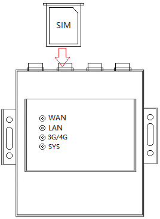
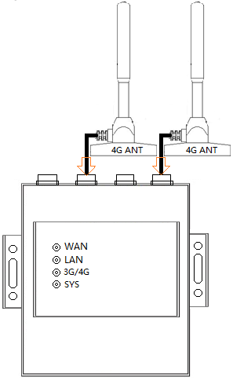
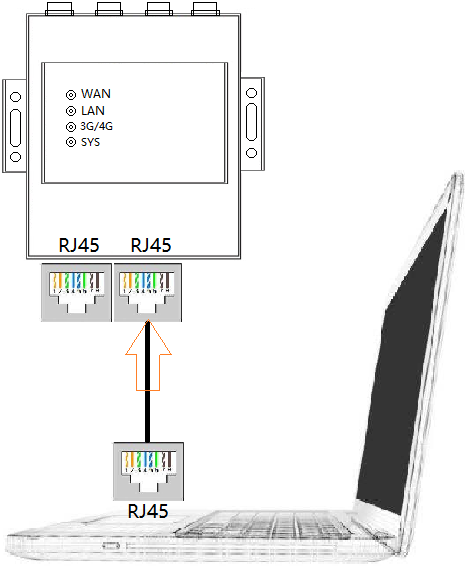
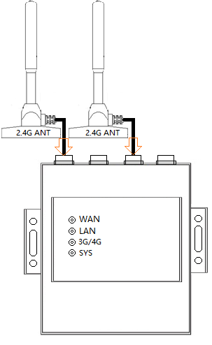
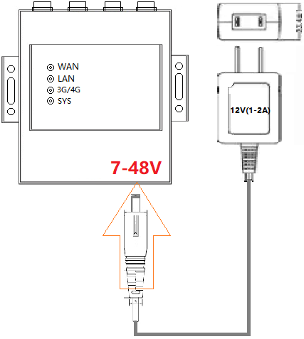
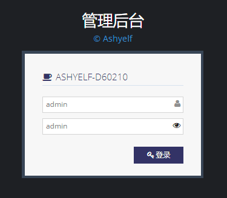
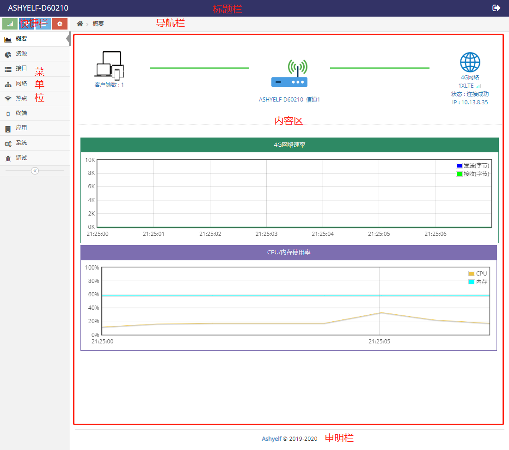
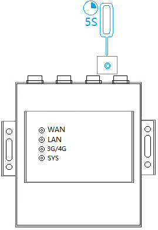

## 快速安装说明
- 通过简洁的图示及文字，为维护人员或用户提供便利的操作说明，指导您如何快速应用路由器
- 由于产品版本升级或其它原因，本文档内容会不定期更新。文中所有信息仅作为使用指导

#### 第一步：插入SIM卡

#### 第二步：接4G天线
 

#### 第三步：电脑(其它设备)通过网口与路由器连接
 

#### 第四步：给路由器接WIFI天线
 

#### 第五步：给路由器上电

#### 第六步：访问互联网

**等待路由器的SYS常亮后, 通过网口与路由器连接的电脑(或其它设备) 即可直接访问互联网**

**如何使用无线连接路由器**
- 打开笔记本电脑或手机的无线设置
- 搜索并选择连接路由器对应的SSID, 根据路由器的MAC地址不同, SSID会有变化, 通常路由器的SSID为 **ASHYELF-XXXXXX** 的格式（XXXXXX代表设备MAC地址的后六位）
    ###### 如MAC地址为88:12:4B:00:13:10的路由器的SSID会是ASHYELF-001310 ######
- 输入路由器的SSID密码, 通常路由器的密码为 **87654321**
- 然后等待连接成功即可直接访问互联网

**为了保证路由器能稳定高效的工作，强烈建议用户阅以下对应文档**
- 使用普通的电话卡或物联卡接入互联网需要注意的事项, 见 **[使用普通SIM卡接入互联网](../../use/LTE上网使用普通SIM卡.md)**
- 使用APN专网卡接入虚拟私有拨号网络(VPDN)需要注意的事项, 见 **[使用APN专网SIM卡接入互联网](../../use/LTE上网使用APN卡.md)**

## 如何登录路由器管理界面

##### 通过有线或无线连接上路由器后打开浏览器
- 在浏览器地址栏输入 **192.168.8.1** 后回车进入器的 **登录界面** 
- 输入用户名, 默认的用户名是 **admin**
- 输入管理密码, 默认的管理密码是 **admin**
- 点击 **登录** 按键即可进入 **管理界面**

  

##### 管理界面介绍
管理界面分为六个区域, 管理界面的菜单分为九个大类

 

- 菜单简介

**概要**: 显示路由器当前的基本状态, 主要为连接状态及实时流量， 终端数量， 无线名称信道， CPU内存负载

**资源**: 系统资源的详细信息

**接口**: 所有网络接口的详细信息

**网络**: 常用的网络设置， 如4G网络，本地网络，路由表，端口映射，防火墙等基本的网络设置

**热点**: 无线SSID的设置

**终端**: 终端的管理，上网控制，访问控制，流量管理等

**应用**: 各种应用, 固件中自带的软件或软件仓库中安装软件都将在此菜单项中显示

**系统**: 针对路由器的管理配置， 如升级，配置管理，密码管理等

**调试**: 调试或开发需要用到的一些功能

- 工作模式简介

针于不同的应用场景路由器可提供不同的工作方式，这是工作模式的由来，**工作模式** 的配置在 **系统** 菜单下 **设备管理** 中, 路由器常用的工作模式如下：

**4G路由器**: 通过3G/4G连接互联网并为接入的客户端提供3G/4G的上网服务

**宽带路由器**：通过有线WAN口连接互联网并为接入的客户端提供上网服务

**无线连网**：通过WIFI连接其它WIFI网络并为接入的客户端提供上网服务

**无线热点**：相当于带无线功能的交换机, 此模式下默认不会分配IP地址, 通常用于放置在路由器的下一级

**混合上网**：此模式下可选择在3G/4G、有线WAN口、WIFI三种模式中组合上网， 实现多种上网方式同时存在或备份或负载均衡

## 如何恢复出厂设置
两种方法可将路由器恢复到出厂时的设置状态：
- 点击 **管理界面** 中的 **系统** 菜单下 **配置管理** 菜单项界面中的 **恢复出厂设置** 按键即可恢复出厂设置。
- 在设备启动完成后常按 **复位(RESET)** 按键5秒至8秒，然后释放，路由器将恢复出厂设置并自动重启（***必须在路由器启动后常按复位按键才有效***）。

     

## 更多使用说明

- [端口映射使用说明](../../use/端口映射使用说明.md)
- [串口使用说明](../../use/串口使用说明.md)
- [IO口远程控制说明---原始字符串](../../com/arch/io_text_protocol.md)
- [IO口远程控制说明---MQTT](../../com/arch/io_mqtt_protocol.md)

当需要更复杂的连网方式时可参看此说明
- [混合模式的用法](../../use/混合模式的用法.md)

当需要抓取日志时可参看此说明
- [远程日志使用说明](../../use/远程日志的用法.md)

当需要工程人员远程协助设置时可参看此说明
- [远程协助设置.md](../../use/远程协助设置.md)

## 其它资料

[产品规格书](./spec.md)

----

