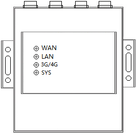

## 简介

###### 2218为一款小巧的双网口工业用LTE路由器, 此路由器含有
 - **2G/3G/4G全网通频段接入**(*4G双天线*), **双百兆以太网口(RJ45)**, **单串口**(*默认为RS485, 可定制为RS232/TTL*)
 - **无线2.4G双天线**(*300M*), *GPS功能可选*
 - **支持DC头供电及4PIN头供电**, 可通过DC头供电, 也可通过4PIN头对设备供电
 - **可选GPS功能**

###### 为支持工业级应用环境带有
 - **宽电压供电及车载头供电支持**, 支持7到50V之间的电压供电
 - **宽温支持**, 支持低温-40度热启动, 高温75度长期工作
 - **硬件狗**
 - **防静电保护**
 - **3路独立电源设计**, 独立功能模块间相互监控, 出现异常可快速重置恢复

###### 多种接入方式互联网
 - **2G/3G/4G与以太网有线上网同时工作**, 冷备份, 热备份及负载均衡带宽叠加
 - **2G/3G/4G与无线WIFI上网同时工作**, 冷备份, 热备份及负载均衡带宽叠加, 实现在无人机或车载上进站连本地无线网络出站使用LTE上网的功能
 - **无线WIFI上网与以太网有线上网同时工作**, 冷备份, 热备份及负载均衡带宽叠加
 - **强制客户端(或应用)使用指定接入方式上网**, 允许强制接入的客户端或应用分别使用不同的接入方式访问互联网
 - **定制更多智能接入方式**, 开放SDK编程环境提供示例及标准接口可客户自定制更多接入策略
 - **支持云鹰卡三网切换**, 可定制支持云鹰卡实现随意切换联通/电信/移动运营商

###### 多种管理协议支持, 允许用户通过协议实现本地或远程全方位管理控制
 - **本地TCP协议控制**, **本地HTTP协议状态查询**, **本地网络广播搜寻设备**
 - **远程HTTP协议状态上报**(设备信息/终端信息/GPS信息), **远程HTTP协议控制**, **MQTT状态上报告警及MQTT设备管理等功能**
 - **本地管理工具包及编程API**, 提供Linux环境下的管理工具包, 实现在本地管理设备/OTA升级, 并开放管理工具包编程API及示例, 快速帮助客户实现对设备的管理

###### 多功能串口透传/Modbus/MQTT/指令模式
 - **串口透传**支持自定义注册包/激活包/保活包, 自定义包前后缀, 服务器与客户端同时工作及多服务器, 流量统计
 - **Modbus/MQTT协议**, 可为PLC设备及实时物联网设备接入网络 
 - **串口GPS数据上报**, 串口支持外接GPS, 可解析其数据并上报
 - **支持串口指令模式**, 可通过串口指令管理控制设备
 - **定制各种串口协议**, 开放SDK编程环境提供示例及标准接口可客户自定制更多串口协议

###### 为支持多功能应用及定制化开发使用了专为路由行业开发的Farm嵌入式操作系统
 - **7*24小时全年无故障运行**, 功能强大, 性能卓越, **功能模块组件式分离开发**, 统计的作业接口, 方便客户编写自已的应用程序
 - **框架式开发**, 支持自行定制指定功能的协议组件, 如可只编写LTE模块驱动识别组件, 编写串口协议转换组件及编写远程被管理组件对端客户的管理平台等
 - **纯C语言编写**, 行业内应用功能齐全, 并可**在线编程**
 - **完备的开发环境及开发文档**, 一步到位允许用户基于现有功能上进一步开发定制化的功能, 并将现有功能包装为统一的接口允许客户直接调用

## 路由器实物图

## 硬件规格
|  参数   | 规格  |
| :-----:| :---- |
| **尺寸(mm)** | 尺寸: 83mm X 70mm X 28mm |
| **4G参数(LTE)**  | 默认使用**移远EC20**或**SIMCOM7600CE双天线全网通模块**, 也可搭配客户指定的其它模块 **4G频段**: FDD LTE: B1/B3/B8 TDD LTE: B38/B39/B40/B41 **3G频段**: TDSCDMA: B34/B39  WCDMA: B1/B8 **2G频段**: CDMA 1x/EVDO: BC0  GSM: 900/1800 **带宽**: 1.4/3/5/10/15/20MHz LTE-FDD: Max 150Mbps (DL) Max 50Mbps (UL) LTE-TDD: Max 130Mbps (DL) Max 35Mbps (UL) **灵敏度** FDD B1: -97dBm (10M) FDD B3: -95dBm (10M) FDD B8: -94dBm (10M) TDD B38: -97dBm (10M) TDD B39: -97dBm (10M) TDD B40: -97dBm (10M) TDD B41: -96dBm (10M) WCDMA B1: -111dBm WCDMA B8: -110dBm TDSCDMA B34: -109dBm TDSCDMA B39: -109dBm CDMA BC0: -109dBm GSM 900: -109dBm GSM 1800: -109dBm **输出功率** Class 3 (23dBm±2dB) for LTE FDD Class 3 (23dBm±2dB) for LTE TDD Class 2 (24dBm +1/-3dB) for TD-SCDMA Class 3 (24dBm +1/-3dB) for WCDMA Class 3 (24dBm±1dB) for CDMA BC0 Class E2 (27dBm ±3dB) for EDGE 900MHz Class E2 (26dBm ±3dB) for EDGE 1800MHz Class 4 (33dBm ±2dB) for GSM 900MHz Class 1 (30dBm ±2dB) for GSM 1800MHz |
| **2.4G参数(WIFI)**   | **标准**：IEEE802.11bgn 300Mbps(2T2R) **发射功率** 11n HT40 MCS7: 15dBm 11b CCK: 18dBm 11G OFDM: 15dBm **接收灵敏度** 300Mbps: -65dBm 54Mbps: -73dBm 11Mbps: -86dBm|
| **WAN口** | RJ45 WAN接口(10/100Mbps自适应), 网关模式及混合模式为**WAN口**, 其它模式下为**LAN口**  |
| **LAN口** | RJ45 LAN接口(10/100Mbps自适应)  |
| **串口** | 4PIN(2.0mm间距)中的两PIN为串口接口, *默认**RS485串口**,可定制为RS232及TTL*  |
| **PIN针供电口** | 4PIN(2.0mm间距)中的两PIN用于电源供电口(**供电范围为7-48V**)  |
| **DC头供电口** | 5.5*2.0mm DC电源供电口(**供电范围为7-48V**)  |
| **WIFI天线接口(2个)** | WIFI2.4G SMA天线接口*2(外螺纹+孔)  |
| **3G/4G天线接口(2个)** | 3G/4G SMA天线接口*2(外螺纹+孔) |
| **GPS天线接口** | GPS SMA天线接口(外螺纹+孔) |
| **SIM卡槽** | 抽屉式大SIM卡槽, **不支持热插拨** |
| **接键(1个)** | 复位按键 |
| **指示灯(4个)** | **系统灯(蓝)**:刚上电时常亮，启动后但未连接慢闪，正在拨号时快闪， 连接网络成功后常亮 **信号灯**: 4G信号弱时亮红色, 4G信号强时亮绿色 **LAN0**: LAN0(WAN)网口LINK灯 **LAN1**: LAN1网口LINK灯 |
| **4PIN座子** | 2.0mm间隔 中间两个为RS485的A跟B 两边两个为VCC+及VCC-(**供电范围为7-48V**)  |
| **功耗（满负荷时）** | 小于3W, 基于无线环境与网络负载不同瞬间峰值可能会高于3W， 建议提供5W功率 |
| **温度** | 工作温度： -40℃ ~ +75℃ |

## 硬件配置表
|  接口  | 2218标准版  | 2218-232  | 2218-GPS  |
|:-----:|:----:|:----:|:----:|
| 串口-RS232|  | V |  |
| 串口-RS485| V | V | V |
| LTE全网通基带| V | V | V |
| GPS定位 |  |  | V |

## 软件功能表
|  功能   | 描述  |
| :-----:| :---- |
| **联网方式** | **单连接上网**： 3G/4G上网，有线上网，无线上网，桥接，中继，无线互联网, 3G/4G猫(Modem) **混合上网**： 2G/3G/4G与以太网有线上网同时工作, 冷备份, 热备份及负载均衡带宽叠加 2G/3G/4G与无线WIFI上网同时工作, 冷备份, 热备份及负载均衡带宽叠加 无线WIFI上网与以太网有线上网同时工作, 冷备份, 热备份及负载均衡带宽叠加 **组合上网模式**: 3G/4G上网+桥接， 3G/4G上网+有线接内网, 3G/4G上网+无线接内网, 其它复杂定制组合 |
| **LTE网络**| 3G/4G支持 **多种拨号模式** (如点对点, 网卡拨号等), *可选支持IPV6协议栈* 3G/4G/5G支持1000多个运营商， **自动匹配运营商** **APN支持自定义** 支持SIM卡 **PIN码** **锁频段** **锁SIM卡** **锁3G/4G模块** 保持 **常驻指定网络模式** 功能, *如用于常驻于3G/4G模式防止切换至2G模式等* 支持 **云鹰SIM卡** 实现三网切换 |
| **网络稳定性**| 多种网络保活机制, **ICMP检测**, **接收包计数检测** 连续失败重启恢复等功能, *并可配置相关细节及阀值*，确保数据终端永久在线 |
| **串口功能**| 串口支持 **透传** 模式, 支持流控、自定义注册包/保活包、自定义包前后缀、向串口发送自定义激活包、**服务器与客户端同时工作**、**流量统计** 串口透传支持 **多数据中心** 功能 串口支持 **ModbusRTU** 协议(*将串口上的ModbusRTU转换成ModbusTCP*) 串口支持 **MQTT数据透传** (*并支持向串口发送自定义激活包*) 串口支持 **指令模式**, *支持专有HE指令用于控制及管理设备* TTL模式下串口支持 **外接GPS及北斗** ，并可将GPS数据解析并上传 |
| **设备稳定性**| 工业级硬件看门狗 3路独立供电单元软件相互监控 低温自热机制 自动重启(*定时或定点及空闲时重启*) |
| **高可用性**| 多设备间相互备用, *高可用性HA(VRRP), 单台设备故障可切换到备用设备* |
| **虚拟专用网**| 支持L2TP客户端(*支持隧道密码*) PPTP客户端(*支持MPPE*) GRE隧道 OpenVxPxN客户端(*支持预共享密钥,证书*) *IPSEC(需定制)* |
| **GPS定位**| 在设备的特定子型号上支持GPS定位，支持 **NMEA协议上报**(*可指定包头及上报间隔*) 支持 **NMEA服务器** 功能(*允许其它客户端主动连接设备获到定位信息*) 支持 **JT/T808协议上传定位信息** |
| **网络应用**| 防火墙 端口映射(NAT)及DMZ主机 端口代理 域名劫持 应用层网关 静态路由表管理 **源地址路由**, **端口路由**等高级路由功能 DDNS(支持花生壳及多种网内外运营商) UPNP 域名重定向 IGMP正向/反向代理 *动态路由协议（RIPv1、RIPv2、RIPng、OSPFv2、OSPFv3、BGP-4和 BGP-4+）(需定制)* |
| **网络监控**| 网络实时流量图， 终端实时流量及用量统计, 终端流量控制、访问控制、定时上网 终端远程唤醒(WOL) |
| **无线(WIFI)功能**| 2.4G无线热点 2.4G无线网卡 无线黑白名单 发射功率调整 WIFIdog(通过WIFIdog实现广告推送) Coova Chilli广告推送 |
| **时间管理**| 基站对时 NTP对时 支持 **局域网对其它设备授时**, *给某些专网用无RTC摄象头等设备提供正确的时间* |
| **开发接口**| 局域网搜索协议(发现设备), 局域网TCP/HTTP控制协议(控制设备) 局域网批量升级协议(批量升级设备固件) 远程HTTP控制协议(云平台管理) 设备信息(3G/4G信号连接时长流量/设备基本信息等各种设备状态), GPS信息, 终端信息(终端MAC地址/连接时间及时长)等上报协议 网页接口获取设备信息API IO口远程控制协议 远程MQTT监控协议(告警云平台) 终端命令行(SSH/Telnet/串口)接口 在线开发脚本项目(开发shell脚本并注册为开机或关机或事件触发运行,并可在线开发管理界面), 在线将脚本项目打包用于安装于其它设备中 在线开发定时运行指定的脚本 *短信(SMS)控制协议(需定制)*|
| **第三方开发支持**| Farm系统属于开放式操作系统, 针对项目用户可提供完整的开发环境, 支持客户自已开发应用软件 系统为纯C语言开发的路由器操作系统, 可运行于嵌入式芯片平台及X86工控机中, 性能高, 功耗低, 发热量小 提供组件式开发环境, 可基于系统现有的组件方便的开发客户应用软件包(FPK软件包)并可跨嵌入式平台应用 组件式开发环境提供统一的API及丰富的组件接口供客户调用 堆叠式的组件应用开发可快速开发客户定制项目, 并生成软件包, 客户定制项目可无修改跨平台移植到所有支持Farm操作系统的产品中 Farm系统现已支持的MT7628/MT7620/MT7621/MT7622, AR9331/AR9341/AR9344/AR9342, QCA9531/QCA9561/QCA9563/QCA9558等多种路由器芯片方案 Farm系统现已支持从PCBA模块，两网口， 三网口，五网口，百兆，千兆，有线，无线等多种路由系列的产品|
| **远程管理** *针对定制项目*| 批量查看设备状态及管理 批量重启及复位设备， 批量升级设备 设备分组管理, 设备单独管理 设备下的终端管理 *4G流量统计及配额管理(开发中)* *告警信息记录及邮件通知(开发中)* *设备运行日志管理(开发中)*|
| **设备管理**| 备份及导入配置，本地升级, 在线升级, 局域网批量升级 英文切换, *恢复出厂也可保留* 可安装卸载FPK软件包, 可恢复原始固件状态 云平台远程管理 Telnet/SSH连入设备 串口命令行管理（CLI） 指示灯开关， IO口常用功能定义 本地及远程日志 **IO扩展（支持自定义输入及输出）用于工业控制, 通过自定义协议或MQTT协议远程实时控制** **升级失败可恢复**（不死Bootloader） **开发者选项切换** 可定制普通用户及超级用户界面区分管理, **锁定指定配置**, **锁定升级**, **锁定重启**, **锁定恢复出厂及锁定配置导入导出**等功能 **提供x86/aarch64(arm)平台的设备管理工具包及OTA升级工具** 支持专有工具实现 **批量升级**, **批量测试** |
| **后续功能**| USSD(开发中)、TR069(开发中)、SNMP(开发中) |
| **最大用户数**| 无线：20个， 有线：50个 |

## 路由器正面接口图 

 

###### SYS: **蓝色系统指示灯**
- 刚上电时常亮
    > 上电后不亮表示通电不正常或设备可能损坏
- 启动后自检时慢闪
    > 自检失败将一直保持慢闪
    > 慢闪时一直保持亮与灭时长相同表示未识别到LTE模块
    > 慢闪时一直保持灭比亮时长表示未识别到SIM卡
- 正在拨号时快闪
    > 设备升级时也会快闪
- 连接网络成功后常亮

###### 3G/4G: **信号强度指示灯**
- 无信号时灭
- 信号非常弱时红灯闪
- 信号弱时红灯长亮
- 信号强时绿灯闪
- 信号非常强时绿灯长亮

###### WAN: **WAN/LAN有线网口指示灯**

###### LAN: **LAN有线网口指示灯**

## 路由器前面接口图 

 

###### 4G-1 : **LTE主天线, SMA天线接口(外螺纹+孔)**

###### 4G-2 : **LTE分集天线, SMA天线接口(外螺纹+孔)**

###### WIFI-1 : **2.4G无线天线, SMA天线接口(外螺纹+孔)**

###### WIFI-2 : **2.4G无线天线, SMA天线接口(外螺纹+孔)**

###### SIM: **SIM卡插槽, 可插入Micro SIM卡**
- SIM卡放入卡托中插入

###### RESET: **恢复出厂按键**
- 为一个小孔, 上电开机后用顶针按下5至8秒钟松开设备将恢复出厂并重启

###### GTRD: **由 供电输入线, RS485-A/RS232-TX, RS485-B/RS232-RX, 供电接地线 组成**
- G的引脚为供电输入, 可通过此引脚对设备供电, 支持7-48V的供电输入
- T为串口引脚, 在RS485的模式下为A, 在RS232的模式下为发送引脚
- R为串口引脚, 在RS485的模式下为B, 在RS232的模式下为发接收引脚
- D的引脚为GND接地, 对设备供电时此脚用来接地, 在使用串口RS232也可以从这个接口取接地

## 路由器后面接口图

 

###### LAN口: **为有线LAN网口**
- 为LAN口, 用于连接其它有线设备, 为其提供上网服务

###### WAN/LAN口: **为有线WAN网口**
- 在默认配置下即为LAN口, 用于连接其它有线设备, 为其提供上网服务
- 而将设备的工作模式配置为有线宽带或混合模式时, 为WAN口, 用于连接其它的路由器设备实现接入互联网

###### DC7V-35V : **DC电源供电口, 支持输入7-48V直流电**

## 尺寸图(具体以dxf文件为准)

 

## 串口, 4PIN电源供电接口规格

 

## 升级包下载
[ftp://ftp.wmdevice.com/d218/](ftp://ftp.wmdevice.com/d218/)

## 其它资料

[快速安装说明](./setup.md)

----

