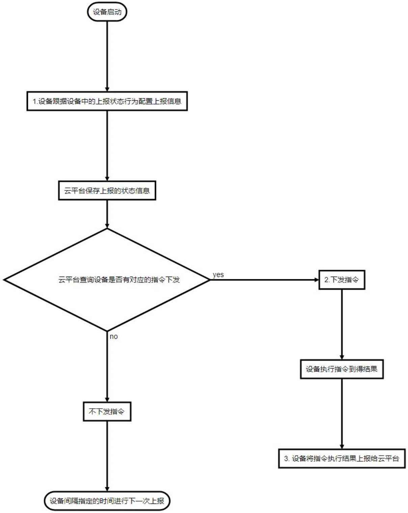

***
# 远程管理协议说明 
网关通过HTTP协议与云平台交互, 接受并处理与云平台的管理协议, 通过此协议云平台可以实现大批量远程管理网关

### **1. 网关与云平台交互的信息**  

网关与云平台之间主要交互这六类信息
- **组件状态**: 
  - 网关所有的状态, 通过交互此类数据实现对网关状态的监控
  - 单向交互(即网关向云平台发送状态)

- **组件配置**: 
  - 网关所有的配置, 通过交互此类数据实现对网关的配置管理
  - 双向交互(即云平台可向网关发送配置, 网关也可向云平台发送配置)

- **告警**: 
  - 网关的异常事件
  - 单向交互(即网关向云平台发送告警)
- **消息**: 
  - 网关的常规事件
  - 单向交互(即网关向云平台发送消息)
- **日志**: 
  - 网关日志
  - 单向交互(即网关向云平台发送日志)
- **持续性数据**: 
  - 网关可要求云平台协助保存一些持续性易变的数据, 以便网关断电也不失丢
  - 双向交互(即网关向云平台发送数据, 云平台也可向网关发送这类数据)


### **2. 网关与云平台交互机制**

- 网关间隔指定的时间会向云平台发起HTTP POST请求上报一个JSON（这个动作简称为**上报状态行为**）, 这个JSON中包含：
  - **网关的MAC** 
    每个网关的MAC地址都是唯一的， 通过MAC地址唯一标识网关
  - **网关所属管理帐号** 
    每个网关都可设置一个所属的管理帐号, 通过云平台登录对应帐号后即可管理本网关
  - **所属管理帐号验证码(可选)** 
    所属管理帐号可要求网关给出验证码, 当所属管理帐号要求给出验证码时网关必须给出正确的验证码才可以被对应的帐号管理
  - JSON中还可基于网关当前的配置包含以下内容(可同时包含): 
    - **组件状态** 
    所有的组件状态都可以上报给云平台, 具体上报哪些组件状态由网关的 **初始上报信息(Report Context)** 指定, 而云平台可以在网关POST时返回 **report** 节点给网关来调整网关的 **上报信息** 及 **上报间隔**
    以下两个信息比较重要, 这里介绍下, *更多详细的上报信息介绍见 **[远程状态上报说明](./devport_report.md)***:
      - **网关的基本状态（组件land@machine的status接口返回的JSON）** 
        通常网关默认会上报此状态
      - **网关的当前配置版本（属性cfgversion）** 
        在组件land@machine的status返回的JSON中有一个cfgverion的属性用来表示网关的**当前配置版本**, 通常云平台会为每台接入的网关保存一份当前的配置及网关当前配置版本, 当网关本地的配置被修改后网关的**当前配置版本**（cfgversion）会发生变化， 通过对比网关**当前配置版本**（cfgversion）可判断网关的配置是否被本地修改过 
    
    - **组件配置** 
    当云平台在上一次的HTTP交互时有下发upload命令时网关就会POST网关所有的组件配置
    - **告警** 
    网关发生的一些异常事件, 由 **上报状态行为配置** 指定是否上报
    - **消息** 
    网关发生的一些普通事件, 由 **上报状态行为配置** 指定是否上报
    - **日志** 
    网关的日志, 由 **上报行为配置** 指定是否上报
    - **持续性数据**： 
    网关可向云平台发送需要协助保存的持续性易变数据, 通常是一些流量计数

- 云平台可在网关向云平台POST时返回一个JSON, 通过下发的这个JSON完成控制网关, 在这个JSON时可包含以下信息：
    - **组件配置** 
    当云平台的组件配置发生变化时会向网关返回变化的配置，以方便网关得到最新的配置
    - **上报状态行为配置** 
    当云平台需要改变网关的**上报状态行为**时可以下发新的**上报状态行为配置**
    - **持续性数据** 
    当云平台收到网关的要求下发持续性数据时下发


### **3. 指令执行流程图**

云平台通过 **指令** 调用网关组件的接口来控制网关 
  - 云平台会在网关上报时下发 **指令** 要求网关执行指令 
  - 网关会在执行完指后后将 **指令执行结果** 向云平台上报 
  - 对于重启/恢复出厂等指令会导致网关立即重启而不会上报指令执行结果

云平台可在网关POST时下发指令, 网关收到后将会执行下发的指令并将结果返回给云平台


```flow
st=>start: 网关启动
post=>operation: 1.设网关跟据网关中的上报状态行为配置上报信息
save=>operation: 云平台保存上报的状态信息
search=>condition: 云平台查询网关是否有对应的指令下发
noreport=>operation: 不下发指令
end=>end: 网关间隔指定的时间进行下一次上报
sendhe=>operation: 2.下发指令
op=>operation: 设网关执行指令到得结果
sendret=>operation: 3. 设网关将指令执行结果上报给云平台
st->post->save->search
search(yes,right)->sendhe->op->sendret
search(no)->noreport->end
```

### **4. 指令执行详细协议**

以下给出以上流程图有关1，2，3交互的详细协议介绍， 其中：
- 1为网关上报的内容 
- 2为云平台下发指令 
- 3为网关上报指令执行结果 
1. 网关上报状态 
    网关向云平台发起POST请求, JSON中带有status节点：
    ```javascript
    POST /dev HTTP/1.1
    Host: lte.wmdevice.com
    Accept: */*
    Content-Type:application/json;charset=UTF-8

    {
        // 属性介绍
        "macid":"gateway MAC identify",           // [ string ]
        "user":"gateway username",                // [ string ], 网页上可配置
        "vcode":"gateway username vcode",         // [ string [, 网页上可配置

        "status":                                 // 表明为状态的内容
        {
            "land@machine.status":                // 网关基本信息, 其下节点属性具体见land@machine组件status接口描述
            {
                "mode":"equipment operator mode",               // < ap, wisp, nwisp, gateway, dgateway, misp, nmisp, dmisp, mix >
                                                                    // ap: access point
                                                                    // wisp: 2.4G Wireless Internet Service Provider connection
                                                                    // nwisp: 5.8G Wireless Internet Service Provider connection( need the board support 5.8G wirless baseba
                                                                    // gateway: wire WAN gateway
                                                                    // dgateway: Dual wire WAN gateway
                                                                    // misp: LTE Mobile Internet Service Provider connection( need the board support LTE baseband)
                                                                    // nmisp: Next LTE/NR Mobile Internet Service Provider connection( need the board support LTE/NR baseban
                                                                    // dmisp: Dual LTE/NR Mobile Internet Service Provider connection( need the board support two LTE/NR bas
                                                                    // mix: custom mix connection from multiple internet connection
                "name":"equipment name",
                "platform":"equipment platform identify",
                "hardware":"equipment hardware identify",
                "custom":"equipment custom identify",
                "scope":"equipment scope identify",
                "version":"equipment version",
                "cfgversion":"gateway configure version",       // [ string ]
                "livetime":"system running time",               // hour:minute:second:day
                "current":"current date",                       // hour:minute:second:month:day:year
                "mac":"equipment MAC address",
                "macid":"equipment MAC identify or serial id",
                "model":"equipment model",
                "magic":"equipment magic identify"
            }
            // ...  更多状态, 具体<远程状态上报说明>
        }
    }
    ```
    为了直观这里给出的是json对象缩进格式(实际通信中不一定会有缩进)

2. 云平台下发指令 
    当云平台发现网关有对应的指令要求下发时(通常由客户修改)将会将下发给网关(JSON中带有he节点), 内容如下：
    ```javascript
    HTTP/1.1 200 OK
    Server: AP-ApCenter
    Date: Tue Dec 31 17:49:24 2013
    Connection: keep-alive

    {
        "he":             // 要求网关执行以下指令
        {
            "he command identify":"he command"        // [ string ] : [ string ]
            // ... 更多指令
        }
    }
    ```
    网关收到指令后将执行

3. 网关上报指令执行结果 
    ```javascript
    POST /dev HTTP/1.1
    Host: lte.wmdevice.com
    Accept: */*
    Content-Type:application/json;charset=UTF-8

    {
        // 属性介绍
        "macid":"gateway MAC identify",           // [ string ]
        "user":"gateway username",                // [ string ], 网页上可配置
        "vcode":"gateway username vcode",         // [ string [, 网页上可配置

        "hevalue":                                 // 表明为状态的内容
        {
            "he command identify":"he command return"        // [ string ] : [ string ]
            // ... 更多指令
        }
    }
    ```
