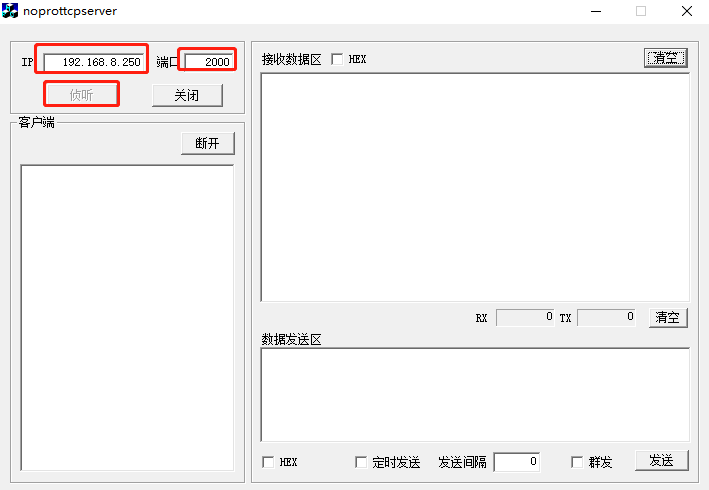
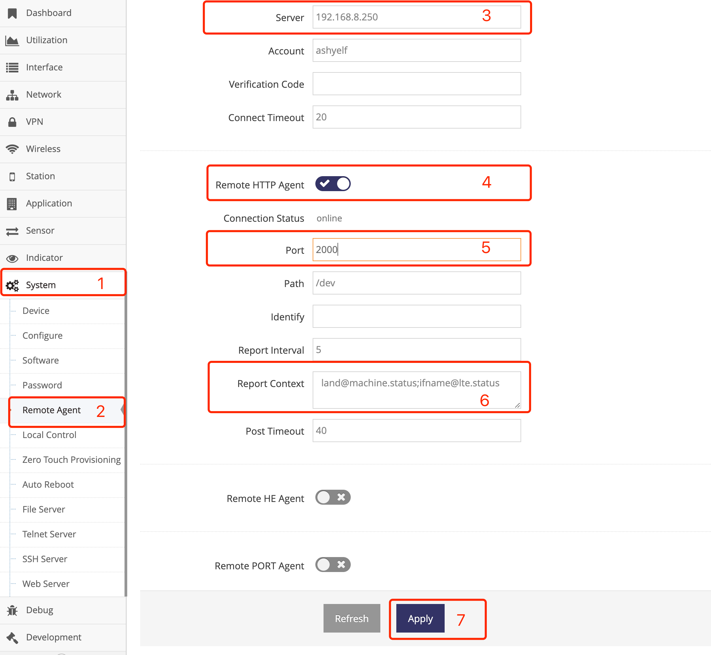
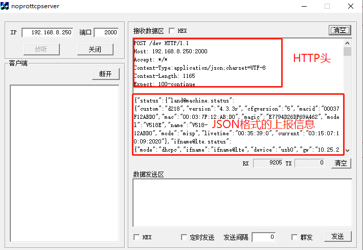

***


# 远程状态上报说明

通过以下网页可以规定网关上报指定状态, 也可以规定网关上报到指定的服务器


网关通过HTTP协议POST一个JSON对象给服务器, 当 **初始上报信息(Report Context)** 为空时, 默认网关会上报以下项目
- 网关基本信息, 节点名为land@machine.status
- 联网状态, 节点名为network@frame.default
- GPS定位信息, 节点名为gnss@nmea.info, GPS定位功能启用才上报
- 各种网关上已接的传感器信息, 当对应的传感器连接网关并启用功能才上报
    - 电池电量, 节点名为sensor@voltameter.status
    - 温湿度信息, 节点名为sensor@hygrometer.status
    - 甲烷仪读数信息, 节点名为sensor@methanometry.status
    - 噪声探测信息, 节点名为sensor@noisedetector.status
    - 其它定制类的传感器状态, 每个传感器会使用不同节点名命名, 具体可资询技术支持

***节点名即为组件接口***


### **1. 状态上报详细协议**

交互协议为标准的HTTP协议, 网关POST一个JSON对象给服务器, 所有的状态信息以节点名封装在这个JSON对象的status节点中

- 网关上报状态, 网关启动后会跟据 **初始上报信息(Report Context)** 指定的节点来上报规定的项目, 可通过网页或是终端来修改
    网关向服务器发起POST请求, JSON中带有status节点, status节点下即是网关要上报的状态信息, 当 **初始上报信息(Report Context)** 为空时, 网关POST如下:
    ```javascript
    POST /dev HTTP/1.1
    Host: lte.wmdevice.com
    Accept: */*
    Content-Type:application/json;charset=UTF-8

    {
        // 属性介绍
        "macid":"gateway MAC identify",           // [ string ]
        "user":"gateway username",                // [ string ], 网页上可配置
        "vcode":"gateway username vcode",         // [ string [, 网页上可配置

        "status":                                 // 表明为状态的内容
        {
            "land@machine.status":                // 网关基本信息, 其下节点属性具体见land@machine组件status接口描述
            {
                "mode":"equipment operator mode",               // < ap, wisp, nwisp, gateway, dgateway, misp, nmisp, dmisp, mix >
                                                                    // ap: access point
                                                                    // wisp: 2.4G Wireless Internet Service Provider connection
                                                                    // nwisp: 5.8G Wireless Internet Service Provider connection( need the board support 5.8G wirless baseba
                                                                    // gateway: wire WAN gateway
                                                                    // dgateway: Dual wire WAN gateway
                                                                    // misp: LTE Mobile Internet Service Provider connection( need the board support LTE baseband)
                                                                    // nmisp: Next LTE/NR Mobile Internet Service Provider connection( need the board support LTE/NR baseban
                                                                    // dmisp: Dual LTE/NR Mobile Internet Service Provider connection( need the board support two LTE/NR bas
                                                                    // mix: custom mix connection from multiple internet connection
                "name":"equipment name",
                "platform":"equipment platform identify",
                "hardware":"equipment hardware identify",
                "custom":"equipment custom identify",
                "scope":"equipment scope identify",
                "version":"equipment version",
                "cfgversion":"gateway configure version",       // [ string ]
                "livetime":"system running time",               // hour:minute:second:day
                "current":"current date",                       // hour:minute:second:month:day:year
                "mac":"equipment MAC address",
                "macid":"equipment MAC identify or serial id",
                "model":"equipment model",
                "magic":"equipment magic identify"
            }
            "network@frame.default":             // 联网状态, 其下节点属性4G联网具体见ifname@lte组件status接口描述, 有线宽带见ifname@wan组件status接口描述, 无线连网见ifname@wisp组件status接口描述
            {
                "ifname":"ifname@lte",
                "status":"Current state",                      // [ setup, register, ready, nodevice, reset, down, up ]
                                                                    // setup for setup the modem
                                                                    // register for register the network
                                                                    // ready for ready to connect to internet, hint signal/network/simcard all ok
                                                                    // nodevice for the corresponding module could not be found
                                                                    // reset for reset the modem
                                                                    // down for the network is down
                                                                    // up for the network is connect succeed
                "mode":"IPV4 address mode",                    // [ dhcpc ] for DHCP, [ static ] for manual setting， [ ppp ] for PPP dial
                "netdev":"netdev name",                        // [ string ]
                "gw":"gateway ip address",                     // [ ip address ]
                "dns":"dns ip address",                        // [ ip address ]
                "dns2":"dns2 ip address",                      // [ ip address ]
                "ip":"ip address",                             // [ ip address ]
                "mask":"network mask",                         // [ ip address ]
                "delay":"delay time",                          // [ failed, 0-10000 ], failed for icmp failed
                "livetime":"online time",                      // hour:minute:second:day
                "rx_bytes":"send bytes",                       // [ number ]
                "rx_packets":"send packets",                   // [ number ]
                "tx_bytes":"receive bytes",                    // [ number ]
                "tx_packets":"receive packets",                // [ number ]
                "mac":"MAC address",                           // [ MAC address ]
                // For LTE/NR baseband Status, the parameters are the same as modem@lte.status
                // ##### For details, see status of modem@lte  #####
                "state":"Current state",                       // [ setup, register, ready, connecting, connected reset ]
                                                                     // setup for setup the modem
                                                                     // register for register the network
                                                                     // ready for ready to connect to internet, hint signal/network/simcard all ok
                                                                     // connecting for connect to the internet
                                                                     // connected for connect internet succeed
                                                                     // reset for reset the modem
                "mversion":"Modem version",                    // [ string ]
                "imei":"IMEI numer",                           // [ string ]
                "imsi":"IMSI number",                          // [ string ]
                "iccid":"ICCID number",                        // [ number, nosim, pin, puk ]
                                                                     // number for iccid
                                                                     // nosim for cannot found the simcard
                                                                     // pin for the simcard need PIN code
                                                                     // puk for the simcard pin error

                "plmn":"MCC and MNC",                          // [ number, noreg, dereg ]
                                                                     // number for MCC and MNC
                                                                     // noreg for cannot register to opeartor
                                                                     // unreg for cannot register to opeartor
                                                                     // dereg for register to operator be refused
                "netera":"technology Generation",              // [ 2G, 3G, 4G, 5G ], Optional
                "nettype":"network type",                      // The format varies depending on the module
                                                                     // 2G usually shows GSM, GPRS, EDGE, CDMA
                                                                     // 3G usually shows WCDMA, EVDO, TDSCDMA, HSPA, HSDPA, HSUPA
                                                                     // 4G usually shows LTE, FDD, TDD

                
                "signal":"signal level",                        // [ 0, 1, 2, 3 4 ], 0 for no signal, 1 for weakest signal , 4 for strongest signal
                "csq":"CSQ number",                             // [ number ]
                "rssi":"signal intensity",                      // [ number ], the unit is dBm
                "rsrp":"RSRP value",                            // Optional, The format varies depending on the module
                "rsrq":"RSRQ value",                            // Optional, The format varies depending on the module
                "sinr":"sinr value",                            // Optional, The format varies depending on the module 
                "band":"current band",                          // Optional, The format varies depending on the module
                "pcid":"Physical Cell ID",                      // [ number ], Optional

                "operator":"operator name"                      // [ string ]
            }, 
            "gnss@nmea.info":                   // GPS信息, 其下节点属性具体见uart@gnss组件status接口描述
            {
                "step":"step of location",                      // [ setup, search, located ]
                "utc":"UTC date",                               // [ float ]
                "lon":"longitude",                              // [ float ]
                "lat":"latitude",                               // [ float ]
                "longitude":"longitude",                        // [ float ]
                "latitude":"latitude",                          // [ float ]
                "speed":"speed",                                // [ float ]
                "direction":"direction",
                "declination":"declination",
                "elv":"Either altitude height",                 // [ float ], the unit is meter
                "inview":"Number of visible satellites",        // [ number ]
                "inuse":"Number of satellites in use"           // [ nubmer ]     
            },
            "sensor@voltameter.status":         // 电量计信息, 其下节点属性具体见sensor@voltameter组件status接口描述
            {
                "state":"the battary state",                    // [ "noboard", "charge", "uncharge" ]
                                                                   // noboard: indicates cannot find the Voltameter
                                                                   // charge: indicates charging
                                                                // uncharge: indicates not charged
                "voltage":"current voltage",                    // [ number ], unit is V
                "percent":"current battary power"               // [ nubmer ], unit is %
            },
            "sensor@hygrometer.status":         // 温湿度传感器信息, 其下节点属性具体见sensor@hygrometer组件status接口描述
            {
                "humidity":"current humidity",                    // [ number ], unit is %
                "temperature":"current temperature"               // [ number ], unit is ℃
            },
            "sensor@methanometry.status":       // 甲烷检测仪, 其下节点属性具体见sensor@methanometry组件status接口描述
            {
                "concentration":"concentration of methane"        // [ number ], unit is ppm·m
            },
            "sensor@noisedetector.status":      // 噪声检测器, 其下节点属性具体见sensor@noisedetector组件status接口描述
            {
                "noise":"noise level"                             // [ number ], unit is DB
            }
            // ... 更多传感器状态可资源技术支持
        }
    }
    ```


- 网关上报状态间隔, 网关会跟据 **上报间隔(Report Interval)** 来上报, 可通过网页或是终端来修改
    网关向服务器发起POST请求后, 会等待服务器回复信息, 这个时间叫交互超时(Talk Timeout), 这个时间可以在网关网页上配置
    如服务器不回复数据也不关闭HTTP的连接将导致网关在此等待一个交互超时(Talk Timeout), 这会导致上报间隔会就被拉长, 即变成: 交互超时+上报间隔.


### **2. 服务器动态调整网关上报内容及间隔**
服务器可根据用户或自身的需求来动态的改变网关上报的内容及间隔

- 服务器可在网关POST后下发一个JSON来改变网关之后的上报内容及上报间隔, 如无需修改即关闭连接即可
    当服务器需要改变网关上报内容及上报间隔可回复一个JSON(JSON中带有report节点)再关闭HTTP的连接, 回复内容介绍：
    ```javascript
    HTTP/1.1 200 OK
    Server: AP-ApCenter
    Date: Tue Dec 31 17:49:24 2013
    Connection: keep-alive

    {
        "report":
        {
            "interval":"上报的间隔",     // [ number ]
            "status":                  // 上报的项目列表
            {
                "组件接口":"",
                "组件接口2":"",
                "组件接口3":""
                // 更多项目 ...
            }
        }


    }
    ```

- 示例回复JSON让网关上报网关基本信息, 联网状态, GPS信息外再上报客户端列表, 并间隔5秒上报一次, 回复内容如下：
    ```javascript
    HTTP/1.1 200 OK
    Server: AP-ApCenter
    Date: Tue Dec 31 17:49:24 2013
    Connection: keep-alive

    {
        "report":
        {
            "interval":"3",                          // 间隔为3秒
            "status":
            {
                "land@machine.status":"",                // 上报网关基本信息
                "network@frame.default":"",              // 上报联网状态
                "gnss@nmea.info":"",                     // 上报GPS信息
                "client@station.list":""                 // 上报客户端列表
            }
        }
    }
    ```
    网关收到后将跟据其中的interval规定的间隔上报, 并在以status规定的内容上报


### **3. 网关可上报的内容**
理论上网关可以上报网关中所有的状态, 具体对应的状态的节点名称可资询技术支持


### **附. 测试网关上报信息**

通过在电脑上运行TCP服务器， 然后将网关的 **服务器** 的设置为TCP服务器所在的电脑的IP地址, 通过TCP服务器来接收网关上报的数据, 确定网关可以正确的上报状态信息

- 首先关机电脑上防火墙及所有防火墙软件

- 下载TCP服务器软件， 并在电脑上运行, 下载地址为: ftp://ftp.wmdevice.com/pub/tools/tcp_server.exe
    示例： 
    电脑的IP地址为192.168.8.250， 运行的TCP服务器的端口为2000
    

- 设置网关的管理服务器指向运行的TCP服务器
    

- TCP服务器显示接收到网关上报的数据
    


