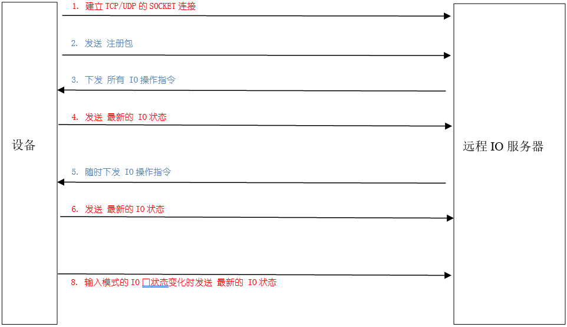
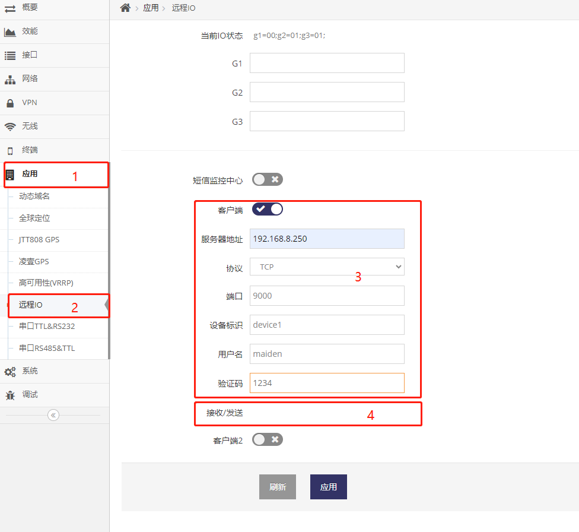
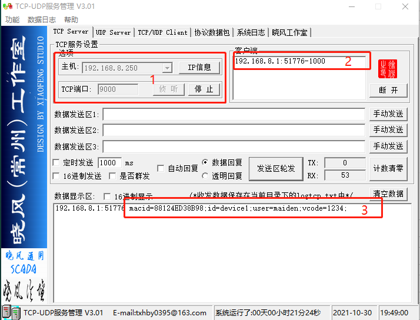
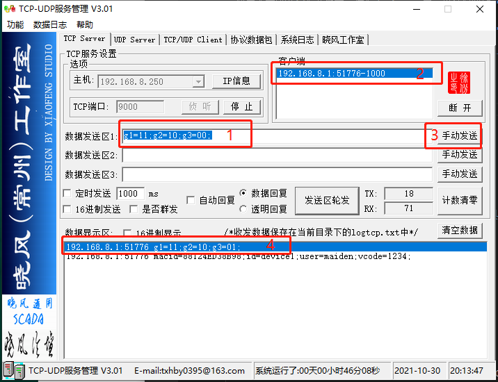
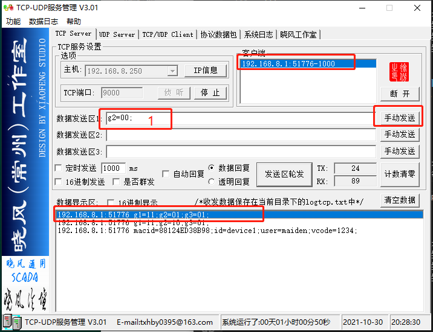
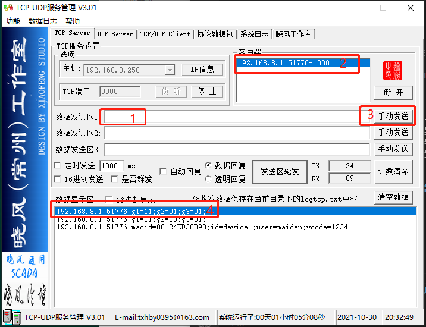
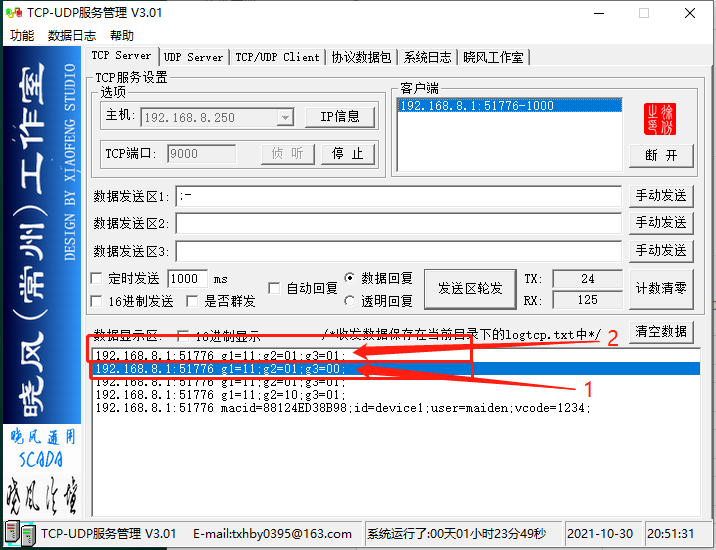

***
# 远程IO控制协议 --- 原始字符串格式

此协议用于远程控制设备的IO口
- 此协议使用人类可读字符串来交互信息
- 此协议即可实现让远程IO服器控制设备IO口
- 也可以实现当设备的IO口输入电平状态变化时主动通知远程IO服务器


## 远程IO口控制交互机制

### 建立实时连接

1. 首先由 **设备** 开机后会主动通过 **TCP或UDP**(网页可配置) 连接 **远程IO服务器**(网页可配置) 指定的 **端口**(网页可配置)
2. 连接成功后 **设备** 会向 **远程IO服务器** 发送 **注册包**
3. **远程IO服务器** 收到 **注册包** 后可选向设备回复 **IO操作指令**
***设备重启会丢失所有的IO的状态, 所以建议远程IO服务器在收到注册包后回复IO操作指令中应包括所有IO的状态***
4. **设备** 收到 **IO操作指令** 会执行对应的IO操作并回复操作后的 **IO状态**

通过以上4点建立实时连接并将设备IO口同步到最新的状态

### 实时连接建立后, 远程IO服务器实时操作设备IO口

5. 实时连接建立后，**远程IO服务器** 可随时下发 **IO操作指令** 给 **设备**
6. **设备** 收到 **IO操作指令** 会执行对应的IO操作并回复操作后的 **IO状态**

通过5/6点的机制实现远程服务器可随时实时操作设备的IO口状态

### 实时连接建立后, 设备检测IO口状态变化时实现向远程IO服务器更新状态

7. 实时连接建立后，**设备** 会实时监控配置为输入状态的IO口的状态
8. 当IO口的状态变化时 **设备** 会立即向 **远程IO服务器** 发送最新的 **IO状态**

通过7/8点的机制使得远程IO服务器能实时得到设备IO口的状态变化




## 原始字符串格式协议说明

1. 协议以ASCII文本格式的字符串组成
2. 无论是设备向远程IO服务器发送的信息还是远程IO服务器向设备发送的信息, 协议中有1个或多个以分号结尾的字段, 格式为:
    ```
        关键字=值;关键字2=值2;关键字3=值3;关键字4=值4;
    ```
    无任何关键字及值的空字段也是合法的, 通常用于远程IO服务器查询设备当前状态时发送给设备
    ```
        ;
    ```
3. 每一个字段表示一个内容, 非空字符通常有两部分, 以等号分隔, 等号前是 **关键字** 用于指定信息类型, 等号为关健字对应的 **值**
    ```
        关键字=值;
    ```
    - 此内容可以为一个 **IO操作指令**
    - 也可以为一个 **IO状态**
    - 也可以为 **注册包** 中表明设备身份的信息


## 通过TCP-UDP工具模似远程IO服务器使用原始字符串格式协议控制设备IO口

### 配置设备上的原始字符串格式协议

当我们点击路由器管理界面的 **系统** 菜单下的 **LED/IO控制** 菜单项时进入IO控制界面

**红框3** 为 **原始字符串格式协议** 部分的配置

**红框4** 为 **原始字符串格式协议** 部分的状态



上图中我们配置了:
- **远程IO服务器** 的地址为192.168.8.250
- **协议** 使用 TCP
- **端口** 为9000
- **设备ID** 为device1
- **用户名** 为maiden
- **授权码** 为1234


### 在TCP-UDP工具上收到注册包

填入以上的配置并点击应用后我们将在192.168.8.250电脑上的TCP-UDP工具首先收到注册包

**红框1** 显示我们是在192.168.8.250的主机上运行了一个监听在TCP端口9000上的TCP-UDP工具

**红框2** 显示设备192.168.8.1已连接上来

**红框3** 显示设备192.168.8.1已发送了注册包过来



以下是上图中TCP-UDP工具收到的注册包:
```
macid=88124ED38B98;id=device1;user=maiden;vcode=1234;
```
- 以上有4个字段, 每个字段以分号结尾
- 第一个字段以macid为关键字, 值为88124ED38B98, 表示设备的 **MAC地址** 为88124ED38B98, 即88:12:4E:D3:8B:98
- 第二个字段以id为关键字, 值为device1, 表示设备配置的 **设备ID号** 为device1
- 第三个字段以user为关键字, 值为maiden, 表示设备配置的 **用户名** 为maiden
- 第二个字段以vcode为关键字, 值为1234, 表示设备配置的 **授权码** 为1234

***注意, 当设备每一次重启或是每一次断网后的重新连接时TCP-UDP工具都将被192.168.8.1连接后首先收到这个注册包***


### 使用TCP-UDP工具模拟远程IO服务器下发多个IO操作指令

在填入 **g1=11;g2=10;g3=00;** 后点击 **发送给192.168.8.1** , 然后点击 **发送** 即可将IO操作指令发送给192.168.8.1



上图 **红框1** 中下发的多个IO操作指令:
```
g1=11;g2=10;g3=00;
```
- 共总3个字段, 每个字段都以分号结尾, 表示有3个IO操作
- 第一个字段以g1为关键字, 值为11, 表示将设备的g1这个IO号设置为输出模式(值的第一个数为1表示输出), 并输出高电平(值的第二个数为1表示输出高电平)
- 第二个字段以g2为关键字, 值为10, 表示将设备的g2这个IO号设置为输出模式(值的第一个数为1表示输出), 并输出低电平(值的第二个数为0表示输出低电平)
- 第三个字段以g3为关键字, 值为00, 表示将设备的g3这个IO号设置为输入模式(值的第一个数为0表示输入), 在输入模式下第二个数不启作用(我们随意用0代替)


上图 **红框4** 是下发IO操作指令后设备重新向TCP-UDP工具上报的所有IO的最新状态:
```
g1=11;g2=10;g3=01;
```
- 共总3个字段, 每个字段都以分号结尾, 表示有3个IO状态
- 第一个字段以g1为关键字, 值为11, 表示当前设备的g1这个IO号为输出模式(值的第一个数为1表示输出), 并输出高电平(值的第二个数为1表示输出高电平)
- 第二个字段以g2为关键字, 值为10, 表示当前设备的g2这个IO号为输出模式(值的第一个数为1表示输出), 并输出低电平(值的第二个数为0表示输出低电平)
- 第三个字段以g3为关键字, 值为00, 表示当前设备的g3这个IO号为输入模式(值的第一个数为0表示输入), 并被输入高电平(值的第二个数为1表示被输入高电平)


### 使用TCP-UDP工具模拟远程IO服务器下发一个IO操作指令

在填入 **g2=00;** 后点击 **发送给192.168.8.1** , 然后点击 **发送** 即可将IO操作指令发送给192.168.8.1



上图 **红框1** 中下发的IO操作指令:
```
g2=00;
```
- 共总1个字段, 表示有1个IO操作
- 字段以g2为关键字, 值为00, 表示将设备的g2这个IO号设置为输入模式(值的第一个数为0表示输入), 在输入模式下第二个数不启作用(我们随意用0代替)

上图 **红框4** 是下发IO操作指令后设备重新向TCP-UDP工具上报的所有IO的最新状态:
```
g1=11;g2=01;g3=01;
```
- 共总3个字段, 每个字段都以分号结尾, 表示有3个IO状态
- 第一个字段以g1为关键字, 值为11, 表示当前设备的g1这个IO号为输出模式(值的第一个数为1表示输出), 并输出高电平(值的第二个数为1表示输出高电平)
- 第二个字段以g2为关键字, 值为00, 表示当前设备的g2这个IO号为输入模式(值的第一个数为0表示输入), 并被输入高电平(值的第二个数为1表示被输入高电平)
- 第三个字段以g3为关键字, 值为00, 表示当前设备的g3这个IO号为输入模式(值的第一个数为0表示输入), 并被输入高电平(值的第二个数为1表示被输入高电平)


### 使用TCP-UDP工具模拟远程IO服务器查询当前IO状态

在填入 **;** 后点击 **发送给192.168.8.1** , 然后点击 **发送** 即可发送给192.168.8.1



上图 **红框1** 中下发的空指令, 此指令将使设备重新上报所有IO的状态:
```
;
```
上图红框4是设备重新向TCP-UDP工具上报的所有IO的最新状态:
```
g1=11;g2=01;g3=01;
```


#### 当设备为输入模式的IO电平发生变化时, TCP-UDP工具立即收到变化后的IO状态

当我们将设备上的IO口的g3的管脚与GND相连时, 我们收到了 **红框1** 的内容

当我们将设备上的IO口的g3的管理与GND断开时, 我们收到了 **红框2** 的内容



上图  **红框1** 中上报的状态的第三个字段表示g3当前的状态为输入模式(值的第一个数为0表示输入), 并被输入的低电平(值的第二个数为0表示被输入低电平):
```
g3=00;
```
上图 **红框2** 中上报的状态的第三个字段表示g3当前的状态为输入模式(值的第一个数为0表示输入), 并被输入的高电平(值的第二个数为0表示被输入高电平):
```
g3=01;
```
***需要特别注意的是, 要设备主动上报IO状态时必须要将对应的IO口设置为输入模式***


