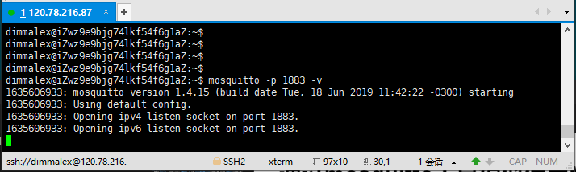
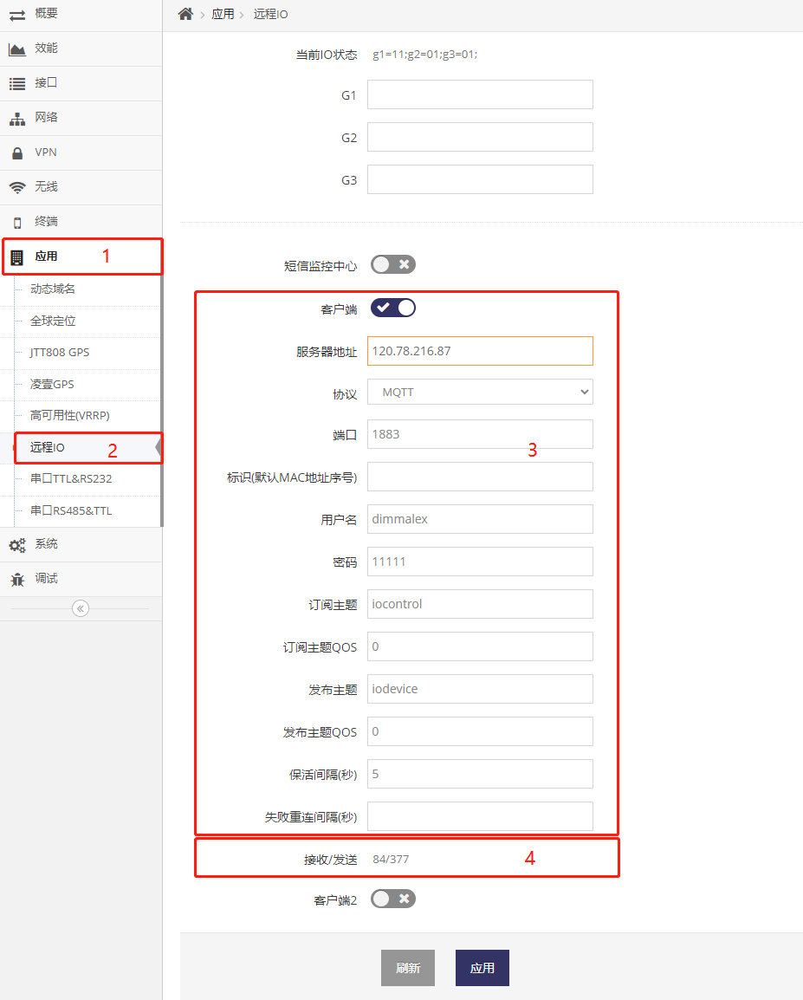
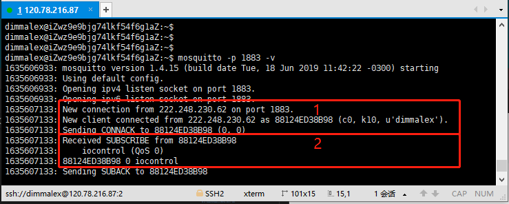
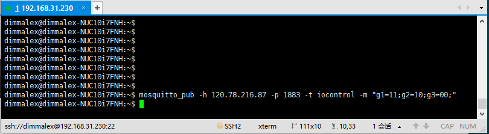
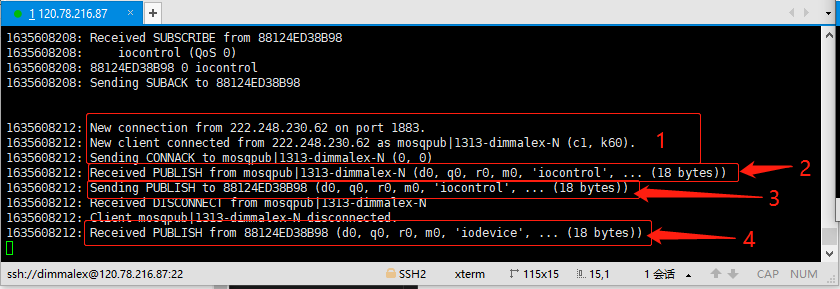
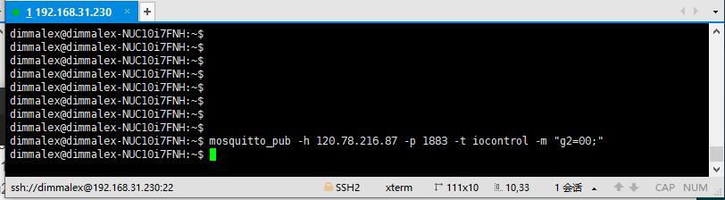
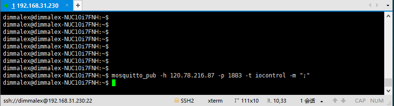
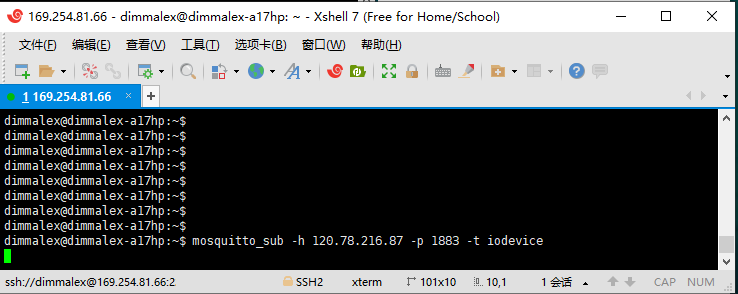

***
# 远程IO控制协议 --- MQTT格式

此协议用于基于MQTT协议远程控制设备的IO口
- 此协议使用MQTT来包装 **原始字符串格式协议**, 有关更多原始字符串格式协议请参见 [远程IO控制协议---原始字符串格式](./io_text_protocol.md)
- 此协议即可实现让远程服器控制设备IO口
- 也可以实现当设备的IO口输入电平状态变化时主动通知远程服务器


## 远程IO口控制交互机制

### 建立MQTT连接

1. 首先由 **设备** 开机后会主动通过 **MQTT协议** 连接 **远程MQTT服务器**(网页可配置) 指定的 **端口**(网页可配置)
2. 连接成功后 **设备** 会向 **远程MQTT服务器** 发送 **订阅主题**(网页可配置) 订阅相关的主题
3. 连接成功后 **设备** 会以指定的 **保活间隔**(网页可配置) 向 **远程MQTT服务器** 发送PINGREQ
4. 连接成功后 **远程MQTT服务器** 收到PINGREQ后会向 **设备** 回复PINGRESP

通过以上4点建立MQTT连接并保活MQTT链接的状态

### MQTT连接建立后, 其它MQTT的客户端通过远程MQTT服务器向设备发送IO操作指令

5. 实时连接建立后，**其它MQTT的客户端** 可随时通过设备的订阅主题下发 **IO操作指令** 给 **设备**
6. **设备** 收到 **IO操作指令** 会执行对应的IO操作并通过 **发布主题**(网页可配置)向 **远程MQTT服务器** 发布最新的 **IO状态**

通过5/6点的机制实现其它MQTT客户端可随时实时操作设备的IO口状态

### MQTT连接建立后, 设备检测IO口状态变化时通过远程MQTT服务器发布IO状态

7. 实时连接建立后，**设备** 会实时监控配置为输入状态的IO口的状态
8. 当IO口的状态变化时 **设备** 会立即通过 **发布主题**(网页可配置)向 **远程MQTT服务器** 发布最新的 **IO状态**

通过7/8点的机制使得其它MQTT客户端能实时得到IO口的状态变化


## IO操作指令及IO状态在MQTT消息中格式说明

1. 消息以ASCII文本格式的字符串组成
2. 无论是设备发布的的消息还是接收的订阅的消息, 消息中有1个或多个以分号结尾的字段, 格式为:
    ```
        关键字=值;关键字2=值2;关键字3=值3;关键字4=值4;
    ```
    无任何关键字及值的空字段也是合法的, 通常用于查询设备当前IO状态时向设备订阅的主题发布
    ```
        ;
    ```
3. 每一个字段表示一个内容, 非空字符通常有两部分, 以等号分隔, 等号前是 **关键字** 用于指定信息类型, 等号为关健字对应的 **值**
    ```
        关键字=值;
    ```
    - 此内容可以为一个 **IO操作指令**
    - 也可以为一个 **IO状态**


## 通过mosquitto工具模似使用MQTT协议控制设备IO口

### 启动远程MQTT服务器

在120.78.216.87的主机上的1883的端口上远程MQTT服务器
```
mosquitto -p 1883 -v
```



### 配置设备上的MQTT协议

当我们点击路由器管理界面的 **系统** 菜单下的 **LED/IO控制** 菜单项时进入IO控制界面

**红框3** 为 **MQTT协议** 部分的配置

**红框4** 为 **MQTT协议** 部分的状态



上图中我们配置了:
- **远程IO服务器** 的地址为120.78.216.87
- **端口** 为1883
- **标识** 为空, 即将使用设备的MAC地址序号, 当前设备MAC地址序号为88124ED38B98
- **订阅主题** 为iocontrol
- **发布主题** 为iodevice
- **保活间隔** 为5秒


### 通过远程MQTT服务器查看到设备接入

填入以上的配置并点击应用后我们将在120.78.216.87的mosquitto程序中看到设备88124ED38B98连入



**红框1** 显示设备88124ED38B98连入

**红框2** 显示设备88124ED38B98订阅了iocontrol的主题

***注意, 当设备每一次重启或是每一次断网后的重新连接时都会再不停的尝试通过MQTT协议连入远程MQTT服务器***


### 使用mosquitto_pub命令模拟其它MQTT客户端通过远程MQTT服务器下发多个IO操作指令

在其它电脑上向远程MQTT服务器的iocontrol主题发送 **g1=11;g2=10;g3=00;**
```
mosquitto_pub -h 120.78.216.87 -p 1883 -t iocontrol -m "g1=11;g2=10;g3=00;"
```



通过-h指定远程MQTT的服务器, 通过-p指定端口为1883, 通过-t指定发布主题为iocontrol, 通过-m给出消息:
```
g1=11;g2=10;g3=00;
```
- 消息共总3个字段, 每个字段都以分号结尾, 表示有3个IO操作
- 第一个字段以g1为关键字, 值为11, 表示将设备的g1这个IO号设置为输出模式(值的第一个数为1表示输出), 并输出高电平(值的第二个数为1表示输出高电平)
- 第二个字段以g2为关键字, 值为10, 表示将设备的g2这个IO号设置为输出模式(值的第一个数为1表示输出), 并输出低电平(值的第二个数为0表示输出低电平)
- 第三个字段以g3为关键字, 值为00, 表示将设备的g3这个IO号设置为输入模式(值的第一个数为0表示输入), 在输入模式下第二个数不启作用(我们随意用0代替)


下图是在120.78.216.87的mosquitto程序中看到整个转发过程



**红框1** 显示mosquitto_pub命令模似的客户端的连入

**红框2** 显示mosquitto_pub命令模似的客户端发布了iocontrol主题的消息

**红框3** 显示120.78.216.87上的mosquitto程序向设备88124ED38B98转发了这个iocontrol主题的消息

**红框4** 显示设备88124ED38B98收到了iocontrol主题的消息后, 通过主题iodevice重新发布了设备最新的IO状态


### 使用mosquitto_pub命令模拟其它MQTT客户端通过远程MQTT服务器下发一个IO操作指令

在其它电脑上向远程MQTT服务器的iocontrol主题发送 **g2=00;**
```
mosquitto_pub -h 120.78.216.87 -p 1883 -t iocontrol -m "g2=00;"
```



通过-h指定远程MQTT的服务器, 通过-p指定端口为1883, 通过-t指定发布主题为iocontrol, 通过-m给出消息:
```
g2=00;
```
字段以g2为关键字, 值为00, 表示将设备的g2这个IO号设置为输入模式(值的第一个数为0表示输入), 在输入模式下第二个数不启作用(我们随意用0代替)


### 使用mosquitto_pub命令模拟其它MQTT客户端通过远程MQTT服务器让设备发布最新的IO状态

在其它电脑上向远程MQTT服务器的iocontrol主题发送 **;**
```
mosquitto_pub -h 120.78.216.87 -p 1883 -t iocontrol -m ";"
```



通过-h指定远程MQTT的服务器, 通过-p指定端口为1883, 通过-t指定发布主题为iocontrol, 通过-m给出消息:
```
;
```
空字段表示要求设备发布最新的IO状态


### 当设备为输入模式的IO电平发生变化时, 使用mosquitto_sub命令模拟其它MQTT客户端通过远程MQTT服务器得到设备更新的IO状态
```
mosquitto_sub -h 120.78.216.87 -p 1883 -t iodevice
```



当我们将设备上的IO口的g3的管脚与GND相连时, 我们收到了红框1的内容
当我们将设备上的IO口的g3的管理与GND断开时, 我们收到了红框2的内容


上图红框1中收到发布主题的消息中的第三个字段表示g3当前的状态为输入模式(值的第一个数为0表示输入), 并被输入的低电平(值的第二个数为0表示被输入低电平):
```
g3=00;
```
上图红框2中收到发布主题的消息中的第三个字段表示g3当前的状态为输入模式(值的第一个数为0表示输入), 并被输入的高电平(值的第二个数为0表示被输入高电平):
```
g3=01;
```
***需要特别注意的是, 要设备主动上报IO状态时必须要将对应的IO口设置为输入模式***


