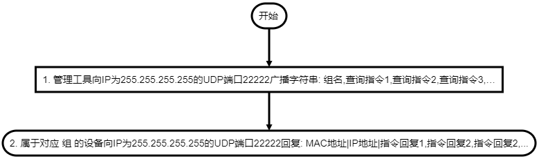
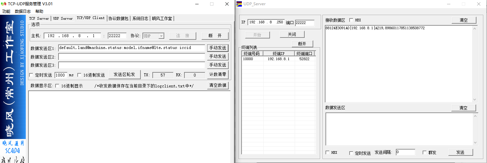

## 本地被管理协议说明

网关可接受来自局域网的管理协议, 管理协议通常由批量管理工具或本地的其它设备发出, 通过此协议批量管理工具或其它设备可以实现局域网管理网关


#### 协议分类

在局域网与网关通信分为三种协议
- **TCP(JSON)控制协议(端口22220), 用于通过TCP发送JSON指令管理网关**
- **局域网搜索协议(UDP端口22222), 用于在局域网内搜索所有的网关**
- **局域网查询协议(UDP端口22222), 用于在局域网内搜索所有的网关并查询所有网关的信息(不常用)**


---


## 局域网搜索协议
在局域网通过向 **UDP端口22222** 广播搜索网内的所有网关
##### 1. 搜索网内网关交互流程
图示

流程图（与上图一致, 如无法显示请忽略）
```flow
device=>end: 2. 属于对应 组 的网关向IP为255.255.255.255的UDP端口22222回复MAC及IP及WEB端口: MAC地址|IP地址|管理网页端口|
data=>operation: 1. 管理工具向IP为255.255.255.255的UDP端口22222广播字符串: 组名
client=>start: 开始
client->data->device
```
*注: 所有网关默认都属于default组（可通过网页修改）, 向UDP端口22222广播default即可搜索局域网内所有的网关*

##### 2. 搜索网内的网关交互详解
- 1. **管理工具** 发送搜索请求
    即向IP为255.255.255.255的UDP端口22222广播组名7个字符default, 所有在网内网关都能收到这个字符串
    ```
    default
    ```
- 2. **网关** 回复
    网内所有网关收到default字符串后会向UDP端口22222广播回复自已的MAC地址、IP地址及管理网页的端口, 格式为: 
    ```
    MAC地址|IP地址|管理网页端口
    ```
- 示例: 如网关的MAC为00:03:7F:12:BB:80、IP为192.168.8.1、WEB管理服务器端口为80, 回复数据将为如下32个字符加上十六进制的0x0结尾:
    ```
    00037F12BB80|192.168.8.1|80
    ```
##### 3. 使用Windwos工具使用局域网搜索协议测试搜索网内的网关
- 左边为发送工具, 向192.168.8.1的22222端口发送UDP包(广播是需要向255.255.255.255的22222端口发UDP包,此工具不支持广播所以使用单播方式代替演示)
- 右边为接收工具, 在当前PC机(192.168.8.250)上的22222端口上接收网关的回复包

*注意: 因未找到合适的广播工具而用单播工具代替演示, 在实际开发过程中通过向UDP的22222端口广播相同的数据将产生相同的结果*


## 局域网查询协议
在局域网通过向 **UDP端口22222** 广播搜索并查询网内的所有网关的信息, 因使用UDP协议所以当交互数据过大时会出现丢包的问题, 不合适做信息量较大的交互

##### 1. 查询网内网关基本信息交互流程
图示

流程图（与上图一致, 如无法显示请忽略）
```flow
device=>end: 2. 属于对应 组 的网关向IP为255.255.255.255的UDP端口22222回复: MAC地址-指令回复1|指令回复2|指令回复2|...
data=>operation: 1. 管理工具向IP为255.255.255.255的UDP端口22222广播字符串: 组名+查询指令1|查询指令2|查询指令3|…
client=>start: 开始
client->data->device
```
*注: 所有网关默认都属于default组（可通过网页修改）, 广播default即可搜索局域网内所有的网关*

##### 2. 查询网内网关基本信息交互详解
- 1. **管理工具** 发送查询请求, 即向IP为255.255.255.255的UDP端口22222广播组名7个字符default加逗号及以逗号间隔的指令, 所有在网内网关都能收到这个字符串
    ```
    default+HE查询指令1|HE查询指令2|HE查询指令3
    ```
- 2. **网关** 回复, 所有网关收到后会向UDP端口22222广播回复自已的MAC地址、IP地址及指令的执行结果, 格式为: 
    ```
    MAC地址-HE查询指令1回复|HE查询指令2回复|HE查询指令3回复
    ```
    以下列举几个常用的HE指令, HE指令格式介绍见 [HE指令介绍](../use/he/he_command_cn.md) , 具体更多的指令可以参看网关组件对应的介绍文档:
    ```
    land@machine:model           //  查询网关的型号
    land@machine:version         //  查询网关的软件版本
    land@machine:mode            //  查询网关的工作模式
    ifname@lte.status:imei       //  查询LTE的IMEI号
    ifname@lte.status:iccid      //  查询LTE的CCID号
    ifname@lte.status:signal     //  查询LTE的信号
    ifname@lte.status:rssi       //  查询LTE的信号强度
    ifname@lte.status:rsrp       //  查询LTE的RSRP
    gnss@nmea.info:step          //  查询GPS状态
    ```

- 示例
    如要查询局域网所有网关的型号及IMEI号将发送如下:
    ```
    default+land@machine:model|ifname@lte.status:imei
    ```
    如MAC为00:03:7F:12:3A:D0型号为A218的网关将回复如下：
    ```
    00037F123AD0-A218|862107043556307
    ```
    如MAC为00:03:7F:13:3A:D8型号为V519的网关将回复如下：
    ```
    00037F133AD08-V519|86210704355692
    ```    
##### 3. 使用Windwos工具测试查询网内的网关收发包
- 左边为发送工具, 向192.168.8.1的22222端口发送UDP包, 查询局域网内所有网关的型号及CCID号
- 右边为接收工具, 在当前PC机(192.168.8.250)上的22222端口上接收网关的回复包, MAC为88:12:4E:30:91:A0的网关回复自已的型号为A219, CCID号为89860117851138508772

*注意: 因未找到合适的广播工具而用单播工具代替演示, 在实际开发过程中通过向UDP的22222端口广播相同的数据将产生相同的结果*


