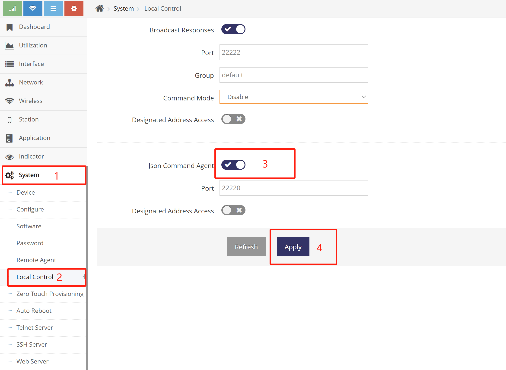
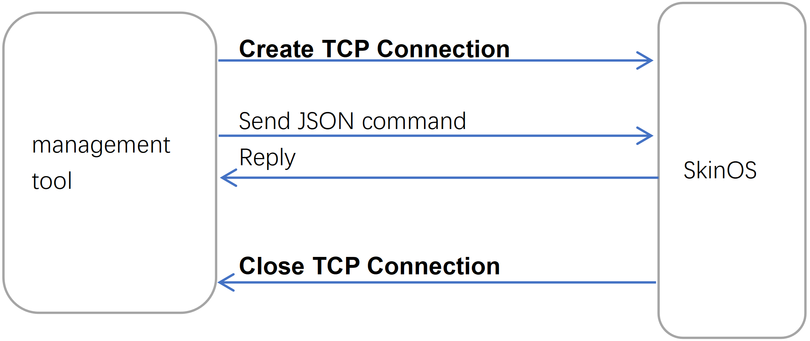

# 本地被管理协议说明   
网关可接受来自局域网的管理协议, 管理协议通常由批量管理工具或本地的其它设备发出, 通过此协议批量管理工具或其它设备可以实现局域网管理网关

### 协议分类   
在局域网与网关通信分为三种协议   
- **TCP(JSON)控制协议(端口22220), 用于通过TCP发送JSON指令管理网关**   
- **局域网搜索协议(UDP端口22222), 用于在局域网内搜索所有的网关**   
- **局域网查询协议(UDP端口22222), 用于在局域网内搜索所有的网关并查询所有网关的信息(不常用)**   

   

---
# TCP(JSON)控制协议   
通过 **TCP端口22220** 与网关交互JSON指令, 实现对网关的控制, 使用TCP协议交互, 适合交互各种信息   

### 在网关上开启JSON控制协议   
默认网关不会响应TCP(JSON)控制协议, 需要进入管理网页打开此协议, *打开此协议会存在安全风险，请确保局域网安全*   
   

### 与网关的交互流程   
如下图所示   
   
交互简介   
- 每一次的交互都需要建立TCP连接, 然后再发送JSON指令, 网关收到JSON指令将会回复JSON指令的执行结果, 之后将立即关闭TCP连接   
- 每一次交互都需要建立一个TCP连接, 也称之为**短连接**, 为保证指令的完整性, 指令被设计成一个完整的JSON对象, 同样回复信息也是一个完整的JSON对象   
- 对于网关的操作可以分为三种JSON指令:   
    1. 查询配置：用于查询网关的配置   
	2. 修改配置：用于修改网关的配置   
	3. 调用功能接口(API)：用于获取或操作网关的状态等   

### JSON指令格式 --- HE指令模式   
直接使用JSON格式发送HE指令, **更多HE终端指令介绍见此文档 [终端管理命令行使用介绍](../../use/he/he_command_cn.md)**   
以下是JSON格式发送HE指令格式介绍   
```json
{
    "cmd1":"HE指令"   // [ 字符串 ]:[ 字符串 ] 属性名可随意命名, 用于在JSON中唯一的标识当前指令, 由此可实现在一个交互中多个指令, 网关回复时也以此指令命名标识其回复
    // 更多指令...
}
```   
网关跟据HE指令执行的结果返回内容, 格式可为:   
1. 一个JSON   
    ```json
    {
        "cmd1":{JSON格式的配置内容}
    }
    ```   
2. 一个字符串   
    ```json
    {
        "cmd1":"属性值"
    }
    ```   
3. 空, 表示不存在此项配置   
    ```json
    {
        "cmd1":"NULL"
    }
    ```   
例1：如查询网关的基本配置的HE指令为 land@machine, 对应的json指令格式为   
```json
{ "cmd1":"land@machine" }
```   
例2：如查询网关名称的HE指令为 land@machine:name, 对应的json指令格式为   
```json
{ "cmd1":"land@machine:name" }
```   
例2：如查询网关工作模式的HE指令为 land@machine:mode, 对应的json指令格式为   
```json
{ "cmd1":"land@machine:mode" }
```   
例3：如查询网关LTE/NR(4G/5G)网络的配置的HE指令为 ifname@lte, 对应的json指令格式为   
```json
{ "cmd1":"ifname@lte" }
```    
例4：如查询网关LTE/NR(4G/5G)网络的状态的HE指令为 ifname@lte.status, 对应的json指令格式为   
```json
{ "cmd1":"ifname@lte.status" }
```   
例5：如调用clock@date(系统时间)的ntpsync方法实现与ntp1.aliyun.com的NTP对时的HE指令为clock@date.ntpsync[ntp1.aliyun.com], 对应的json指令格式为   
```json
{ "cmd1":"clock@date.ntpsync[ntp1.aliyun.com]" }
```   
例6：也可以同时执行多条HE指令, 如果重启一下LTE/NR(4G/5G)网络先执行ifname@lte.shut再执行ifname@lte.setup, 对应的json指令格式为   
```json
{ "cmd1":"ifname@lte.shut", "cmd2":"ifname@lte.setup" }
```   

### JSON指令格式 --- JSON模式   
- 查询网关配置交互格式介绍   
    查询网关配置的终端指令格式为 **组件名称[:属性/属性/...]**, 以下是JSON指令格式介绍   
    ```json
    {
        "cmd1":   // [ 字符串 ]:{} 可随意命名, 用于在JSON中唯一的标识当前指令, 由此可实现在一个交互中多个指令, 网关回复时也以此指令命名标识其回复
        {
            "com":"组件名称",       // [ 字符串 ], 组件名称用于指定网关的功能项, 如agent@remote为网关的远程管理, land@machine为网关的基本配置
            "ab":"属性[/属性/…]"    // [ 字符串 ], 可选, 组件名称对应的功能项的配置都是一个完整的JSON, 通过此属性可只查询指定的属性, 无表示查询组件名称对应功能项所有配置
        }
        // 更多指令...
    }
    ```   
    跟据网关的实际配置返回值的格式可为：   
    1. 一个JSON
        ```json
        {
            "cmd1":{JSON格式的配置内容}
        }
        ```   
    2. 一个字符串， 查询时"ab"有指定属性   
        ```json
        {
            "cmd1":"属性值"
        }
        ```   
    3. 空, 表示不存在此项配置   
        ```json
        {
            "cmd1":"NULL"
        }
        ```   
    例1：如查询网关的基本配置的HE指令为 land@machine , 对应的json指令格式为   
    ```json
    { "cmd1": { "com":"land@machine" } }
    ```   
    例2：如查询网关名称的HE指令为 land@machine:name , 对应的json指令格式为   
    ```json
    { "cmd1": { "com":"land@machine","ab":"name" } }
    ```   
    例2：如查询网关工作模式的HE指令为 land@machine:mode , 对应的json指令格式为   
    ```json
    { "cmd1": { "com":"land@machine","ab":"mode" } }
    ```   
    例3：如查询网关LTE/NR(4G/5G)网络的配置的HE指令为 ifname@lte , 对应的json指令格式为   
    ```json
    { "cmd1": { "com":"ifname@lte" } }
    ```   

- 修改网关配置交互格式介绍   
    修改网关配置的HE指令格式为 **组件名称[:属性/属性/...]=值**   
    以下是JSON指令格式介绍 --- 当值为字符串时   
    ```json
    {
        "cmd1": // [ 字符串 ]:{} 可随意命名, 用于在JSON中唯一的标识当前指令, 由此可实现在一个交互中多个指令, 网关回复时也以此指令命名标识其回复
        {
            "com":"组件名称",       // [ 字符串 ], 组件名称用于指定网关的功能项, 如agent@remote为网关的远程管理, land@machine为网关的基本配置
            "ab":"属性[/属性/…]",   // [ 字符串 ], 可选, 组件名称对应的功能项的配置都是一个完整的JSON, 通过此属性可只查询指定的属性, 无表示查询组件名称对应功能项所有配置
	        "op":"=",              // 指定操作为赋值
	        "v":"值"               // [ 字符串 ]
        }
    }
    ```   
    以下是JSON指令格式介绍 --- 当值为JSON对象时   
    ```json
    {
        "cmd1":                    // [ 字符串 ]:{} 可随意命名, 用于在JSON中唯一的标识当前指令, 由此可实现在一个交互中多个指令, 网关回复时也以此指令命名标识其回复
        {
            "com":"组件名称",       // [ 字符串 ], 组件名称用于指定网关的功能项, 如agent@remote为网关的远程管理, land@machine为网关的基本配置
            "ab":"属性[/属性/…]",   // [ 字符串 ], 可选, 组件名称对应的功能项的配置都是一个完整的JSON, 通过此属性可只查询指定的属性, 无表示查询组件名称对应功能项所有配置
	        "op":"=",              // 指定操作为赋值
	        "v":{JSON格式的值}      // [ JSON ]
        }
    }
    ```   
    网关返回值成功为ttrue, 失败时为tfalse：   
    1. 返回ttrue   
        ```json
        {
            "cmd1":"ttrue"
        }
        ```   
    2. 返回tfalse   
        ```json
        {
            "cmd1":"tfalse"
        }
        ```   
    例1：如修改网关语言的HE指令为 land@machine:language=en , 对应的json指令格式为   
    ```json
    { "cmd1": { "com":"land@machine", "ab":"language", "op":"=", "v":"en" } }
    ```   
    例2：如修改网关名称的HE指令为 land@machine:name=NewName , 对应的json指令格式为   
    ```json
    { "cmd1": { "com":"land@machine","ab":"name", "op":"=", "v":"NewName" } }
    ```   

- 调用网关接口交互格式介绍   
    调用网关接口的HE指令格式为 **组件名称.接口名称[ 参数1, 参数2, 参数3 ]**   
    以下是JSON指令格式介绍   
    ```json
    {
        "cmd1": // [ 字符串 ]:{} 可随意命名, 用于在JSON中唯一的标识当前指令, 由此可实现在一个交互中多个指令, 网关回复时也以此指令命名标识其回复
        {
            "com":"组件名称",       // [ 字符串 ], 组件名称用于指定网关的功能项，如ifname@lte为网关的LTE网络, network@frame为网关的网络连接框架
	        "op":"接口名称",        // [ 字符串 ]，指定调用组件什么接口, 不通的接口有不同的功能, 如ifname@lte的status接口返回LTE网络状态, ifname@lte的shut接口表示断开LTE的连接
	        "1":"参数1",            // [ 字符串 ]，可选, 参数可为字符串(即引号开头及引号结尾), 也可以为JSON(即{开头}结尾)
	        "2":"参数2",            // [ 字符串 ]，可选, 参数可为字符串(即引号开头及引号结尾), 也可以为JSON(即{开头}结尾)
            "3":"参数3"             // [ 字符串 ]，可选, 参数可为字符串(即引号开头及引号结尾), 也可以为JSON(即{开头}结尾)
        }
    }
    ```   
    跟据调用接口不同, 网关返回值可分为以下五种：   
    1. 返回ttrue, 通常用于表示操作成功   
        ```json
        {
            "cmd1":"ttrue"
        }
        ```   
    2. 返回tfalse, 通常用于表示操作失败   
        ```json
        {
            "cmd1":"tfalse"
        }
        ```   
    3. 返回JSON, 通常表示操作的返回信息   
        ```json
        {
            "cmd1":{返回JSON内容}
        }
        ```   
    4. 返回字符串, 通常表示操作的返回信息   
        ```json
        {
            "cmd1":"返回字符串内容"
        }
        ```   
    5. 无返回, 有的接口不返回任何信息   
        ```json
        {
            "cmd1":"NULL"
        }
        ```   
    例1：如获取网关基本状态的HE指令为 land@machine.status , 对应的json指令格式为   
    ```json
    { "cmd1": { "com":"land@machine", "op":"status" } }
    ```   
    例2：如获取网关LTE/NR(4G/5G)网络状态的HE指令为 ifname@lte.status , 对应的json指令格式为   
    ```json
    { "cmd1": { "com":"ifname@lte", "op":"status" } }
    ```   
    例3：如查询网关定位信息的HE指令为 gnss@nmea.info , 对应的json指令格式为   
    ```json
    { "cmd1": { "com":"gnss@nmea", "op":"info" } }
    ```   


---
# TCP(JSON)控制协议管理网关说明   

## SkinOS工作模式简介   
针于不同的应用场景网关可提供不同的工作方式, 网关常用的工作模式如下:   

**4G网关**: 通过3G/4G连接互联网的网关模式, TCP(JSON)控制协议发送如下设置为此模式   
```json
{
    "cmd1":
    {
        "com":"land@machine.mode[misp]"       // 切换
    }, 
    "cmd2":
    {
        "com":"lland@machine.restart[3]"      // 三秒后重启系统
    }
}
```   
**4G/5G网关**: 通过4G/5G连接互联网的网关模式, TCP(JSON)控制协议发送如下设置为此模式   
```json
{
    "cmd1":
    {
        "com":"land@machine.mode[nmisp]"       // 切换
    }, 
    "cmd2":
    {
        "com":"lland@machine.restart[3]"      // 三秒后重启系统
    }
}
```   
**4G5G猫**: 提供4G/5G猫的功能, 完成与4G/5G网络连接但不获取IP地址, 需要其它的客户端通过DHCP协议获取4G/5G的IP地址, TCP(JSON)控制协议发送如下设置为此模式   
```json
{
    "cmd1":
    {
        "com":"land@machine.mode[mbridge]"       // 切换
    }, 
    "cmd2":
    {
        "com":"lland@machine.restart[3]"      // 三秒后重启系统
    }
}
```   
**双4G/5G网关**：通过两个4G/5G连接互联网的网关模式, 只有在有两个4G/5G基带的产品上才支持, TCP(JSON)控制协议发送如下设置为此模式   
```json
{
    "cmd1":
    {
        "com":"land@machine.mode[dmisp]"       // 切换
    }, 
    "cmd2":
    {
        "com":"lland@machine.restart[3]"      // 三秒后重启系统
    }
}
```   
**有线网关**：通过有线WAN口连接互联网的网关模式, TCP(JSON)控制协议发送如下设置为此模式    
```json
{
    "cmd1":
    {
        "com":"land@machine.mode[gateway]"       // 切换
    }, 
    "cmd2":
    {
        "com":"lland@machine.restart[3]"      // 三秒后重启系统
    }
}
```   
**双WAN口网关**：通过两个有线WAN口连接互联网的网关模式, TCP(JSON)控制协议发送如下设置为此模式   
```json
{
    "cmd1":
    {
        "com":"land@machine.mode[dgateway]"       // 切换
    }, 
    "cmd2":
    {
        "com":"lland@machine.restart[3]"      // 三秒后重启系统
    }
}
```   
**2.4G无线连网网关**：通过2.4G无线客户端连接其它WIFI网络的网关模式, TCP(JSON)控制协议发送如下设置为此模式   
```json
{
    "cmd1":
    {
        "com":"land@machine.mode[wisp]"       // 切换
    }, 
    "cmd2":
    {
        "com":"lland@machine.restart[3]"      // 三秒后重启系统
    }
}
```   
**5.8G无线连网网关**：通过5.8G无线客户端连接其它WIFI网络的网关模式, TCP(JSON)控制协议发送如下设置为此模式   
```json
{
    "cmd1":
    {
        "com":"land@machine.mode[nwisp]"       // 切换
    }, 
    "cmd2":
    {
        "com":"lland@machine.restart[3]"      // 三秒后重启系统
    }
}
```   
**无线热点**：相当于带无线功能的交换机, 此模式下默认不会分配IP地址, 通常用于放置在路由器的下一级, TCP(JSON)控制协议发送如下设置为此模式   
```json
{
    "cmd1":
    {
        "com":"land@machine.mode[ap]"       // 切换
    }, 
    "cmd2":
    {
        "com":"lland@machine.restart[3]"      // 三秒后重启系统
    }
}
```   
**混合**：此模式下可使用4G/5G、有线WAN口、无线连网三种模式中组合上网, 实现多种上网方式同时存在并相互备份或负载均衡, TCP(JSON)控制协议发送如下设置为此模式   
```json
{
    "cmd1":
    {
        "com":"land@machine.mode[mix]"       // 切换
    }, 
    "cmd2":
    {
        "com":"lland@machine.restart[3]"      // 三秒后重启系统
    }
}
```     

## 常用的功能操作说明   

### 4G/5G联网设置   
- **连接普通的4G(LTE)网络**   
    1. 网关插上SIM卡后   
    2. 将设备的 **工作模式** 设置为 **4G网关**, 通常4G网关默认即为此模式    
    网关就会自动通过4G(LTE)连上互联网, 不需要任何设置, 将终端设备或电脑通过有线或无线连接网关即可访问互联网   
- **连接普通的5G(NR)网络**   
    1. 网关插上SIM卡后    
    2. 将设备的 **工作模式** 设置为 **4G/5G网关**, 通常5G网关默认即为此模式     
    网关就会自动通过5G(NR)连上互联网, 不需要任何设置, 将终端设备或电脑通过有线或无线连接网关即可访问互联网   
- **[4G/5G(LTE/NR)接入虚拟专用网络(VPDN/APN)](./lte/he_lte_apn_cn.md)** 介绍使用LTE/NR接入VPDN/APN网络   
- ***[4G/5G(LTE/NR)接入自建基站网络](./lte/lte_spec_cn.md)**(编写中)* 介绍使用LTE/NR接入自建基站网络   
- ***[4G/5G(LTE/NR)双SIM卡](./lte/lte_bsim_cn.md)**(编写中)* 介绍LTE/NR双卡的使用   
- ***[4G/5G(LTE/NR)短信功能](./lte/lte_sms_cn.md)**(编写中)* 介绍LTE/NR短信的使用   
- ***[锁定SIM卡](./lte/lte_lockimsi_cn.md)**(编写中)*, 锁定后更换SIM卡无法工作   
- ***[锁定4G/5G(LTE/NR)模组](./lte/lte_lockimei_cn.md)**(编写中)*, 锁定后更换4G/5G(LTE/NR)模组无法工作   
- ***[常用模块锁定频段](./lte/lte_lockband_cn.md)**(编写中)*   
- ***[自定义指定AT指令](./lte/lte_customat_cn.md)**(编写中)*   
- ***[AT指令网络透传使用](./lte/lte_atport_cn.md)**(编写中)*, 实现一个服务器或客户端透传来自网络的AT指令到4G/5G(LTE/NR)模组中   
- ***[4G/5G(LTE/NR)定位功能及使用](./lte/lte_gnss_cn.md)**(编写中)*   
### 有线宽带联网设置   
- ***[PPPOE拨号联网](./wan/wan_pppoe_cn.md)**(编写中)*   
- ***[自动获取(DHCP)联网](./wan/wan_dhcp_cn.md)**(编写中)*   
- ***[静态地址联网](./wan/wan_static_cn.md)**(编写中)*   
- ***[纯路由模式下有线宽带联网](./wan/wan_nonat_cn.md)**(编写中)*   
### 2.4G/5.8G无线连网设置   
- ***[无线连网自动获取(DHCP)使用](./wisp/wisp_dhcp_cn.md)**(编写中)*   
- ***[无线连网静态地址使用](./wisp/wisp_static_cn.md)**(编写中)*   
- ***[无线连网PPPOE拨号使用](./wisp/wisp_pppoe_cn.md)**(编写中)*   
- ***[纯路由模式下无线连网](./wisp/wisp_nonat_cn.md)**(编写中)*   
### 使用4G/5G, 有线宽带, 2.4G/5.8G无线连网多个连接同时联网   
- ***[双4G/5G网关模式的使用](./mix-mode/dmisp_cn.md)**(编写中)*, 实现双4G/5G同时联网, 双4G/5G间实现备份或是负载均衡   
- ***[双WAN口网关模式的使用](./mix-mode/dgateway.md)**(编写中)*, 实现双WAN口连接同时联网, 双WAN口连接间实现备份或是负载均衡   
- ***[混合模式的使用](./mix-mode/mix_cn.md)**(编写中)*, 混合模式下实现多种连接同时联网, 各种连接间实现备份或是负载均衡   
### 2.4G/5.8G无线热点工作模式   
- ***[无线热点模式使用](./ap/ap_cn.md)**(编写中)*   
- ***[无线热点模式下中继其它热点](./ap/repeater_cn.md)**(编写中)*   
### 4G5G猫(Modem)工作模式   
- ***[4G5G猫(Modem)模式使用](./ap/mbridge_cn.md)**(编写中)*   
### 本地网络设置   
- ***[本地网络地址设置](./lan/lan_ip_cn.md)**(编写中)*   
- ***[本地网络设置多个地址](./lan/lan_mip_cn.md)**(编写中)*   
- ***[本地网络分配地址段(DHCP服务器)设置](./lan/dhcps_cn.md)**(编写中)*   
- ***[为终端分配(绑定)指定的IP地址](./client/bind_ip_cn.md)**(编写中)*   
### 系统管理   
- ***[修改网关的名称](./system/name_cn.md)**(编写中)*   
- ***[重启网关](./system/reboot_cn.md)**(编写中)*   
- ***[重置网关配置(恢复出厂设置)](./system/reset_cn.md)**(编写中)*   
- ***[管理网关的时间及时区](./system/date_cn.md)**(编写中)*   
- ***[开启NTP服务为本地设备授时](./system/ntps_cn.md)**(编写中)*   
- ***[网关配置备份及导入](./system/configure_cn.md)**(编写中)*   
- ***[网关固件升级](./upgrade/upgrade_cn.md)**(编写中)*   
- ***[网关网页强制升级](./upgrade/boot_web_upgrade_cn.md)**(编写中)*   
- ***[网关TFTP强制升级](./upgrade/boot_tftp_upgrade_cn.md)**(编写中)*   
- ***[管理员密码修改](./system/password_cn.md)**(编写中)*   
- ***[设置网关定时重启](./system/restart_cn.md)**(编写中)*   
- ***[Telnet服务器](./system/telnetd_cn.md)**(编写中)*   
- ***[SSH服务器](./system/sshd_cn.md)**(编写中)*   
- ***[FTP服务器](./system/ftps_cn.md)**(编写中)*   
- ***[WEB服务器(管理界面)](./system/webs_cn.md)**(编写中)*   
- ***[LED指示灯管理](./system/led_cn.md)**(编写中)*   
- ***[Hosts文件配置](./system/hosts_cn.md)**(编写中)*      
- ***[锁定网关配置](./custom/lockconfig_cn.md)**(不公开防止误操作)*, 锁定配置后不再允许用户修改网关配置       
- ***[锁定升级](./custom/lockupdate_cn.md)**(不公开防止误操作)*, 锁定升级后不再允许用户升级网关              
- ***[锁定重启](./custom/lockreboot_cn.md)**(不公开防止误操作)*, 锁定重启后不再允许用户重启网关     
### 无线热点   
- ***[无线热点名称及密码信道等设置](./wifi/ssid_cn.md)**(编写中)*   
- ***[无线热点黑白名单设置](./wifi/acl_cn.md)**(编写中)*   
- ***[中继其它热点](./wifi/sta_cn.md)**(编写中)*   
### 防火墙  
- **防火墙** 用于控制 **通过外网口访问网关或内网终端** 的权限, 跟 **访问控制** 相反, **访问控制** 则用于控制 **内网终端访问外网** 的权限   
- ***[允许外网访问网关指定的服务](./firewall/allow_access_cn.md)**(编写中)*   
### 端口映射或代理   
- ***[端口映射使用说明](./portmap/portmap_cn.md)**(编写中)*   
- ***[端口代理使用说明](./portproxy/portproxy.md)**(编写中)*   
### 终端访问控制及管理   
- **访问控制** 用于控制 **内网终端访问外网** 的权限, 跟 **防火墙** 相反, **防火墙** 则用于控制 **通过外网口访问网关或内网终端** 的权限   
- 通过 ***[限制终端访问](./acl/access_control_cn.md)**(编写中)* 实现对接入终端访问互联网的目的地或内容进行管控    
- 通过 ***[限制终端上网](./acl/internet_control_cn.md)**(编写中)*  实现对客户端访问互联网的权限或时间进行管控   
- 通过 ***[上网白名单设置](./acl/access_whitelist_cn.md)**(编写中)*  实现白名单式的管控   
- 通过 ***[上网黑名单设置](./acl/access_blacklist_cn.md)**(编写中)*  实现黑名单式的管控   
- 通过 ***[为访问及上网规则添加指定时间生效](./acl/control_timer_cn.md)**(编写中)* 实现设置的规则定时生效   
- ***[为终端自定义名称](./client/bind_name_cn.md)**(编写中)*   
### 路由功能   
- ***[路由表管理](./route/route.md)**(编写中)*      
- ***[基于源地址的路由设置](./route/src_route.md)**(编写中)*      
- ***[基于端口的路由设置](./route/port_route.md)**(编写中)*      
### 调试功能   
- ***[抓包使用说明](./debug/tcpdump_cn.md)**(编写中)*   
- ***[日志的使用](./hosts/hosts.md)**(编写中)*, 可调整日志存放位置, 记录等级, 保存大小, 远程日志等      
- ***[ping连通性测试](./debug/tcpdump_cn.md)**(编写中)*   
- ***[iperf打流带宽测试](./debug/tcpdump_cn.md)**(编写中)*      
- ***[有互联网的远程协助](./debug/internet_remote_cn.md)**(编写中)*, 用于让网关接入调试云平台, 技术人员可通过调试云平台连接网关      
- ***[无互联网的远程协助](./debug/nointernet_remote_cn.md)**(编写中)*, 用于让技术人员远程连接电脑调试网关      

## VPN功能使用   
- ***[设置两台网关Wireguard实现互通示例](./sdwan/wireguard_cn.md)**(编写中)*   
- ***[L2TP客户端的使用](./sdwan/wireguard.md)**(编写中)*   
- ***[PPTP客户端的使用](./sdwan/wireguard.md)**(编写中)*   
- ***[GRE隧道的使用](./sdwan/wireguard.md)**(编写中)*   
- ***[OpenVPN客户端的使用](./sdwan/wireguard.md)**(编写中)*   
- ***[IPSEC的使用](./sdwan/wireguard.md)**(编写中)*   

## 串口功能使用   
- ***[串口透传的使用](./uart/uart_tcp_cn.md)**(编写中)*   
- ***[串口MQTT透传](./uart/uart_mqtt_cn.md)**(编写中)*   
- ***[串口Modbus透传](./lte/lte_apn_setup.md)**(编写中)*   
- ***[串口HTTP透传](./lte/lte_apn_setup.md)**(编写中)*   
- ***[串口终端命令行模式](./lte/lte_apn_setup.md)**(编写中)*, 此模式下可实现通过串口控制并管理网关   
- ***[串口外接GPS/BD模块](./lte/lte_apn_setup.md)**(编写中)*, 此模式下让外接的GPS/BD模块提示定位数据源   
- ***[本地设备获取串口数据](./lte/lte_apn_setup.md)**(编写中)*   

## 串口外接Modbus传感器   
- ***[串口Modbus主控模式下外接各种传感器](./lte/lte_apn_setup.md)**(编写中)*   
- ***[传感器信息HTTP上报](./lte/lte_apn_setup.md)**(编写中)*   
- ***[本地设备获取感器信息](./lte/lte_apn_setup.md)**(编写中)*   

## IO功能使用   
- ***[通过TCP/UDP协议远程控制IO](./lte/lte_apn_setup.md)**(编写中)*   
- ***[通过MQTT协议远程控制IO](./lte/lte_apn_setup.md)**(编写中)*   
- ***[通过短信(SMS)远程控制IO](./lte/lte_apn_setup.md)**(编写中)*   
- ***[本地设备控制IO](./lte/lte_apn_setup.md)**(编写中)*   

## 定位功能使用   
- ***[全球定位的使用](./gnss/gnss_setup_cn.md)**(编写中)*   
- ***[GPS/BD定位数据(NMEA)TCP/UDP协议上报](./gnss/gnss_tcpudp_cn.md)**(编写中)*   
- ***[GPS/BD定位信息MQTT协议上报](./gnss/gnss_mqtt_cn.md)**(编写中)*   
- ***[GPS/BD定位信息HTTP协议上报](./gnss/gnss_http_cn.md)**(编写中)*   
- ***[GPS/BD定位信息JT/T808协议上报](./gnss/gnss_jt808_cn.md)**(编写中)*   
- ***[本地设备获取GPS/BD定位信息](./gnss/gnss_tcpjson_setup.md)**(编写中)*   

## I2C功能的使用   
- ***[外接I2C显示屏](./lte/lte_apn_setup.md)**(编写中)*   
- ***[外接I2C电量板实现读取电量信息](./lte/lte_apn_setup.md)**(编写中)*   
- ***[I2C电量板的电量信息HTTP协议上报](./lte/lte_apn_setup.md)**(编写中)*    
- ***[本地设备获取I2C电量板的电量信息](./lte/lte_apn_setup.md)**(编写中)*  

## 高级应用    
- ***[本地控制网关](./lte/lte_apn_setup.md)**(编写中)*   
- ***[网关通过HTTP上报状态](./lte/lte_apn_setup.md)**(编写中)*   
- ***[通过短信控制网关](./lte/lte_apn_setup.md)**(编写中)*   
- ***[SNMP的使用及自定义OID](./lte/lte_apn_setup.md)**(编写中)*   
- ***[动态路由协议使用](./lte/lte_apn_setup.md)**(编写中)*   
- ***[高可用性(VRRP)的使用](./lte/lte_apn_setup.md)**(编写中)*   

**(编写中)的功能都已实现, 使用文档暂未上传, 如有需要可资询技术人员上传**


---
# TCP(JSON)控制协议常用示例   

#### 示例-获取网关基本信息配置   
- 网关基本信息在land@machine组件的配置中, 发送查询land@machine配置指令即可(在终端中的命令为land@machine), 点击 [设备基本信息](../../com/land/machine.md) 查看有关配置的介绍
```json
{
    "cmd1":
    {
        "com":"land@machine"
    }
}
```
- 网关返回示例
```json
{
    "cmd1":
    {
        "mode":"gateway",                              // 网关工作模式为宽带路由
        "name":"5228-128870",                          // 网关名称为5228-128870
        "mac":"00:03:7F:12:88:70",                     // 网关MAC为00:03:7F:12:88:70
        "macid":"00037F128870",                        // 网关ID为00037F128870
        "language":"cn",                               // 网关语言为chinese
        "cfgversion":"134"                             // 网关配置版本为134(暗示网关配置被修改过134次)
    }
}
```
使用TCP客户端工具测试:   


#### 示例-获取网关基本状态
- 网关基本状态由land@machine组件的status接口返回, 发送调用land@machine组件status方法指令即可(在终端中的命令为land@machine.status), 点击 [设备基本信息](../../com/land/machine.md) 查看有关status接口的介绍
```json
{
    "cmd1":
    {
        "com":"land@machine",
        "op":"status"
    }
}
```
- 网关返回
```json
{
    "cmd1":
    {
        "mode":"gateway",                     // 网关工作模式为宽带路由
        "name":"5228-128870",                 // 网关名称为5228-128870
        "platform":"smtk2",
        "hardware":"mt7621",
        "custom":"d228",                      // 产品编号
        "scope":"std",
        "version":"v7.2.1231",                // 软件版本
        "livetime":"12:06:00:2",              // 在线时长  时：分：秒：天
        "current":"15:36:52:03:02:2023",      // 当前时间  时:分:秒:月:日:年
        "mac":"00:03:7F:12:88:70",            // 网关MAC为00:03:7F:12:88:70
        "macid":"00037F128870",
        "model":"5228",                       // 产品型号
        "cmodel":"",
        "magic":"0E82CEC20232FFFF",
        "cfgversion":"134"                    // 网关配置版本为134(暗示网关配置被修改过134次)
    }
}
```


#### 示例-获取LTE/NR(4G/5G)网络状态信息
- LTE/NR(4G/5G)状态信息由ifname@lte的status接口返回, 点击 [LTE/NR(4G/5G)网络](../../com/ifname/lte.md) 及 [LTE/NR(4G/5G)基带](../../com/modem/lte.md) 查看有关status接口的介绍
```json
{
    "cmd1":
    {
        "com":"ifname@lte",
        "op":"status"
    }
}
```
- 网关返回
```json
{
    "cmd1":
    {
        "mode":"dhcpc",                    // IPv4的连接模式为DHCP
        "netdev":"usb0",                   // 网络设备为usb0
        "gw":"10.137.89.118",              // 网关为10.137.89.118, 只有连接成功后才出现
        "dns":"120.80.80.80",              // DNS为120.80.80.80,, 只有连接成功后才出现
        "dns2":"221.5.88.88",              // 备用DNS为221.5.88.88, 只有连接成功后才出现
        "status":"up",                     // "up"表示连接成功
                                                 // [ "setup", "register", "ready", "nodevice", "reset", "down", "up" ]
                                                 // "setup" 为正在初始化模块
                                                 // "register" 为正在注册网络
                                                 // "ready" 为链路正常准备发起连网, 此状态暗示信号/网络/SIM卡都已检测到
                                                 // "nodevice" 为没有找到对应的LTE模组
                                                 // "reset" 为正在重置LTE模组
                                                 // "down" 为网络未连接
                                                 // "up" 为连接成功
        "ip":"10.137.89.117",              // IP地址为10.137.89.117, 只有连接成功后才出现
        "mask":"255.255.255.252",          // 掩码为255.255.255.252, 只有连接成功后才出现
        "livetime":"00:15:50:0",           // 表示已上线15分钟50秒, 只有连接成功后才出现
        "rx_bytes":"1256",                 // 收到了1256字节, 只有连接成功后才出现
        "rx_packets":"4",                  // 收到了4包, 只有连接成功后才出现
        "tx_bytes":"1320",                 // 发送了1320字节, 只有连接成功后才出现
        "tx_packets":"4",                  // 发送了4包, 只有连接成功后才出现
        "mac":"02:50:F4:00:00:00",         // MAC地址为02:50:F4:00:00:00
        "method":"slaac",                  // IPv6地址模式为slaac
        "addr":"fe80::50:f4ff:fe00:0",     // IPv6的地址为fe80::50:f4ff:fe00:0
        "imei":"867160040494084",          // IMEI号为867160040494084
        "imsi":"460015356123463",          // IMSI为460015356123463
        "iccid":"89860121801097564807",    // SIM卡的ICCID为89860121801097564807
                                                 // [ number, "nosim", "pin", "puk" ]
                                                 // 数字为SIM卡的ICCID号
                                                 // "nosim" 为未找到SIM卡
                                                 // "pin" 为SIM卡需要PIN码
                                                 // "puk" 为SIM卡PIN码错误

        "csq":"14",                        // CSQ为14
        "signal":"3",                      // 信号格数为3格
                                                 // [ "0", "1", "2", "3", "4" ],
                                                 // "0" 为无信号
                                                 // "1" 为一格信号, 为最弱的信号
                                                 // "4" 为四格信号, 为最强的信号
        "plmn":"46001",                    // PLMN为46001
        "nettype":"WCDMA",                 // 网络制式为WCDMA
        "rssi":"-107",                     // 信号强度为-107
        "operator":"中国联通",              // 运营商的名称为中国联通
        "operator_advise":                 // 针对 中国联通 建议的配置
        {
            "dial":"*99#",                    // 拨号号码为*99#
            "apn":"3gnet"                     // APN为3gnet
        }
    }
}
```


#### 示例-断开LTE/NR(4G/5G)网络, 必须要有LTE/NR(4G/5G)网络的工作模式下才有效(如在4G/5G路由器或混合模式下)
- 断开LTE网络连接调用ifname@lte组件的shut接口(在终端中的命令为ifname@lte.shut), 点击 [LTE/NR(4G/5G)网络](../../com/ifname/lte.md) 查看shut接口介绍
```json
{
    "cmd1":
    {
        "com":"ifname@lte",             // LTE网络组件
        "op":"shut"                     // 调用shut接口断开
    }
}
```
***注意, 实际发送时不允许包含注解***
- 网关返回
```json
{
    "cmd1":"ttrue"
}
```

#### 示例-发起LTE/NR(4G/5G)连网, 必须要有LTE/NR(4G/5G)网络的工作模式下才有效(如在4G/5G路由器或混合模式下)
- 启用LTE/NR(4G/5G)连网调用ifname@lte组件的setup接口(在终端中的命令为ifname@lte.setup), 点击 [LTE/NR(4G/5G)网络](../../com/ifname/lte.md) 查看setup接口介绍
```json
{
    "cmd1":
    {
        "com":"ifname@lte",              // LTE网络组件
        "op":"setup"                    // 调用setup接口发起连接
    }
}
```
***注意, 实际发送时不允许包含注解***
- 网关返回
```json
{
    "cmd1":"ttrue"
}
```


#### 示例-设置禁用LTE/NR(4G/5G)网络(禁用后重启后也会保持禁用), 将改变网关的配置不建议频繁使用
- 设置禁用LTE/NR(4G/5G)网络即是将ifname@lte配置中的status属性改为disable即可(在终端中的命令为ifname@lte:status=disable), 点击 [LTE/NR(4G/5G)网络](../../com/ifname/lte.md) 查看配置介绍
```json
{
    "cmd1":
    {
        "com":"ifname@lte",             // LTE网络组件
        "ab":"status",                  // 指定修改status属性
        "op":"=",                       // 赋值操作
        "v":"disable"                   // 将status属性的值改为disable即禁用
    }
}
```
***注意, 实际发送时不允许包含注解***
- 网关返回
```json
{
    "cmd1":"ttrue"
}
```

#### 示例-设置启用LTE/NR(4G/5G)连网(启用后重启后也会保持启用), 将改变网关的配置不建议频繁使用
- 设置启用LTE/NR(4G/5G)网络即是将ifname@lte配置中的status属性改为enable即可(在终端中的命令为ifname@lte:status=enable), 点击 [LTE/NR(4G/5G)网络](../../com/ifname/lte.md) 查看配置介绍
```json
{
    "cmd1":
    {
        "com":"ifname@lte",             // LTE网络组件
        "ab":"status",                  // 指定修改status属性
        "op":"=",                       // 赋值操作
        "v":"enable"                    // 将status属性的值改为enable即启用
    }
}
```
***注意, 实际发送时不允许包含注解***
- 网关返回
```json
{
    "cmd1":"ttrue"
}
```


#### 示例-设置LTE/NR(4G/5G)网络的拨号APN相关的配置
- 修改ifname@lte的配置即可, 修改APN需要先打开APN自定义, 然后设置APN相关的信息, 整个指令需要修改多项属性值, 点击 [LTE/NR(4G/5G)网络](../../com/ifname/lte.md) 及 [LTE/NR(4G/5G)基带](../../com/modem/lte.md) 相关的配置介绍
```json
{
    "cmd1":
    {
        "com":"ifname@lte",            // LTE网络
        "op":"|",                      // 或操作, 即只修改以下给出的属性的值, ifname@lte组件配置中其它未在v中给出的属性保留原来的值(如果op的值为=号将会删除其它的属性)
        "v":
        {
            "profile":"enable",        // 打开APN自定义
            "profile_cfg":             // 自定义APN的信息
            {
                "dial":"*99#",          // 拨号号码
                "apn":"NewAPN",         // APN
                "user":"ctnet",         // 用户名
                "passwd":"234352"       // 密码
            }
        }
    }
}
```
***注意, 实际发送时不允许包含注解***
- 网关返回
```json
{
    "cmd1":"ttrue"
}
```


#### 示例-获取第二个LTE/NR(4G/5G)网络状态信息(对于双模块网关)
- 第二个LTE/NR状态信息由ifname@lte2的status接口返回(在终端中的命令为ifname@lte2.status), 点击[LTE/NR(4G/5G)网络](../../com/ifname/lte.md)及[LTE/NR(4G/5G)基带](../../com/modem/lte.md)查看有关status接口的介绍
```json
{
    "cmd1":
    {
        "com":"ifname@lte2",
        "op":"status"
    }
}
```
- 网关返回
```json
{
    "cmd1":
    {
        ... // 内容与 6 相同
    }
}
```


#### 示例-使用第一个LTE/NR(4G/5G)模块发送短信
- 第一个LTE/NR的模块为modem@lte, 点击[LTE/NR(4G/5G)基带](../../com/modem/lte.md)查看有关smssend接口的介绍
```json
{
    "cmd1":
    {
        "com":"modem@lte",
        "op":"smssend",
        "1":"+13266606322",
        "2":"这是一个测试短信"
    }
}
```   
- 网关返回
```json
{
    "cmd1":"ttrue"
}
```    


#### 示例-获取第一个LTE/NR(4G/5G)模块的所有短信
- 第一个LTE/NR的模块为modem@lte, 点击[LTE/NR(4G/5G)基带](../../com/modem/lte.md)查看有关smslist接口的介绍
```json
{
    "cmd1":
    {
        "com":"modem@lte",
        "op":"smslist"
    }
}
```   
- 网关返回
```json
{
    "cmd1":
    {
        "lte.612f6C":
        {
            "id":"lte.612f6C",
            "contact":"8617688704240",
            "date":"23-12-18 22:50:01",
            "content":"看下午方便的话可以   "
        },
        "lte.Y9kWLV":
        {
            "id":"lte.Y9kWLV",
            "contact":"8617688704240",
            "date":"23-12-18 22:50:03",
            "content":"要   现的"
        },
        "lte.ovV6nw":
        {
            "id":"lte.ovV6nw",
            "contact":"8617688704240",
            "date":"23-12-18 22:49:22",
            "content":"看下午方便的话可以"
        },
        "lte.sTQ9x1":
        {
            "id":"lte.sTQ9x1",
            "contact":"8617688704240",
            "date":"23-12-18 22:51:22",
            "content":"iiik'帮"
        },
        "lte.uKyisL":
        {
            "id":"lte.uKyisL",
            "contact":"8617688704240",
            "date":"23-12-18 22:51:49",
            "content":"ss'ddd"
        }
    }
}
```    


#### 示例-删除一条短信
- 第一个LTE/NR的模块为modem@lte, 给出短信的id号即可删除对应的短信, 点击[LTE/NR(4G/5G)基带](../../com/modem/lte.md)查看有关smslist接口的介绍
```json
{
    "cmd1":
    {
        "com":"modem@lte",
        "op":"smsdel",
        "1":"lte.612f6C"
    }
}
```   
- 网关返回
```json
{
    "cmd1":"ttrue"
}
```    


#### 示例-获取网关的客户端信息
- 网关上的客户端信息由client@station组件的list接口返回(在终端中的命令为client@station.list), 点击 [终端管理](../../com/client/station.md) 查看有关list接口的介绍
```json
{
    "cmd1":
    {
        "com":"client@station",
        "op":"list"
    }
}
```
- 网关返回
```json
{
    "cmd1":
    {
        "00:E0:4C:68:2A:8B":                           // 客户端MAC地址
        {
            "ip":"192.168.1.250",                        // IP地址
            "netdev":"lan",                              // 接入的网络接口
            "ifname":"ifname@lan",                       // 接入的网络连接
            "livetime":"00:40:25:0"                      // 连接时间
        },
        "FC:87:43:DC:6F:B4":                          // 客户端MAC地址
        {
            "ip":"192.168.1.248",                        // IP地址
            "netdev":"lan",                              // 接入的网络接口
            "ifname":"ifname@lan",                       // 接入的网络连接
            "livetime":"00:40:11:0",                     // 连接时间
            "ifdev":"wifi@assid",                        // 接入的连接网关
            "rssi":"-73",                                // 信号强度, 只有连接网关热点的设备才有此属性
            "name":"HUAWEI_P30_Pro-9f13d2ee6f",          // 客户端名称
            "tx_bytes":"610528",                         // 发送字节
            "rx_bytes":"1653658"                         // 接收字节
        }
    }
}
```


#### 示例-获取全球定位信息(对应的网关必须有全球定位功能并且配置正确)
- 定位信息由gnss@nmea组件的info接口返回(在终端中的命令为gnss@nmea.info), 点击 [全球定位](../../com/gnss/nmea.md) 查看有关info接口的介绍
```json
{
    "cmd1":
    {
        "com":"gnss@nmea",
        "op":"info"
    }
}
```
- 网关返回
```json
{
    "cmd1":
    {
        "step":"located",                           // 表示已定位到
                                                          // [ "setup", "search", "located" ]
                                                          // "setup" 为初始化中
                                                          // "search" 为搜索中
                                                          // "located" 为已定位到
        "utc":"7:55:22:7:12:2021",                  // UTC时间
        "lon":"11356.56400",                        // 经度为11356.56400, 已定位到后才出现
        "lat":"2240.80119",                         // 纬度为2240.80119, 已定位到后才出现
        "longitude":"113.94273",                    // 经度(十进制), 已定位到后才出现
        "latitude":"22.68001",                      // 纬度(十进制), 已定位到后才出现
        "speed":"0.34",                             // 速度, 已定位到后才出现
        "elv":"77.90",                              // 高度为77.90, 单位为米, 已定位到后才出现
        "direction":"",
        "declination":"",
        "inuse":"5"                                 // 可使用的卫星数为5个
    }
}
```


#### 示例-获取网关本地网络(LAN)状态信息
- 网关LAN口信息由ifname@lan组件的status接口返回(在终端中的命令为ifname@lan.status), 点击查看 [本地网络(LAN)](../../com/ifname/lan.md) 查看有关status接口的介绍
```json
{
    "cmd1":
    {
        "com":"ifname@lan",
        "op":"status"
    }
}
```
- 网关返回
```json
{
    "cmd1":
    {
        "mode":"static",                   // IPv4的连接模式为静态设置
        "netdev":"lan",                    // 网络设备为lan
        "status":"up",                     // 接口已上线
        "ip":"192.168.8.1",                // IP地址为192.168.8.1
        "mask":"255.255.255.0",            // 掩码为255.255.255.0
        "livetime":"01:15:50:0",           // 已上线1小时15分钟50秒
        "rx_bytes":"1256",                 // 接收了1256字节
        "rx_packets":"4",                  // 接收了4包
        "tx_bytes":"1320",                 // 发送了1320字节
        "tx_packets":"4",                  // 发送了4包
        "mac":"02:50:F4:00:00:00",         // MAC地址为02:50:F4:00:00:00
        "method":"slaac",                  // IPv6地址模式为slaac
        "addr":"fe80::50:f4ff:fe00:0"      // 本地IPv6地址为fe80::50:f4ff:fe00:0
    }
}
```


#### 示例-重启网关
- 对应终端中的命令land@machine.restart, 点击 [设备基本信息](../../com/land/machine.md) 查看有关restart接口的介绍
```json
{
    "cmd1":
    {
        "com":"land@machine",
        "op":"restart"
    }
}
```
- 网关返回如下后将会在3至15秒内重启
```json
{
    "cmd1":"ttrue"
}
```

#### 示例-重置网关(恢复默认设置)
- 对应终端中的命令land@machine.default, 点击查看 [设备基本信息](../../com/land/machine.md) 查看有关default接口的介绍
```json
{
    "cmd1":
    {
        "com":"land@machine",
        "op":"default"
    }
}
```
- 网关返回如下后将会在3至15秒内重启
```json
{
    "cmd1":"ttrue"
}
```

#### 示例-修改网关admin用户的密码
- 用户及密码管理在land@auth组件中, 修改密码使用modify的接口, 以下示例修改用户名admin的密码为123456, 点击 [用户名密码及权限](../../com/land/auth.md) 查看modify接口介绍
```json
{
    "cmd1":
    {
        "com":"land@auth",             // 帐号密码及权限管理组件
        "op":"modify",                 // 调用修改接口
        "1":"",                        // 要修改的域, 空为默认所有域
        "2":"admin",                   // 要修改的用户名
        "3":"admin",                   // 原密码
        "4":"123456"                   // 新密码
    }
}
```
***注意, 实际发送时不允许包含注解***
- 网关返回
```json
{
    "cmd1":"ttrue"
}
```


#### 示例-修改2.4G无线热点的SSID名称
- 2.4G无线热点的配置在组件wifi@nssid中, ssid属性的值为SSID名称, 以下示例修改SSID名称为NewSSID(在终端中的命令为wifi@nssid:ssid=NewSSID), 点击 [2.4G热点](../../com/wifi/nssid.md) 查看配置介绍
```json
{
    "cmd1":
    {
        "com":"wifi@nssid",
        "ab":"ssid",
        "op":"=",
        "v":"NewSSID"
    }
}
```
- 网关返回
```json
{
    "cmd1":"ttrue"
}
```

#### 示例-同时修改2.4G无线热点的SSID名称及密码
- 同时修改两个及以上的属性需要使用**或操作**, 以下示例修改SSID名称为NewSSID并将密码修改为NewPassword(在终端中的命令为wifi@nssid|{"ssid":"NewSSID","secure":"wpapskwpa2psk","wpa_key":"NewPassword"}), 点击 [2.4G热点](../../com/wifi/nssid.md) 查看配置介绍
```json
{
    "cmd1":
    {
        "com":"wifi@nssid",            // 2.4G无线热点组件
        "op":"|",                      // 或操作, 即只修改以下给出的属性的值, wifi@nssid组件配置中其它未在v中给出的属性保留原来的值(如果op的值为=号将会删除其它的属性)
        "v":
        {
            "ssid":"NewSSID",          // SSID的名称改为NewSSID
            "secure":"wpapskwpa2psk",  // 安全方式改为WPA自动
            "wpa_key":"NewPassword"    // WPA的密码改为NewPassword
        }
    }
}
```
***注意, 实际发送时不允许包含注解***
- 网关返回
```json
{
    "cmd1":"ttrue"
}
```

#### 示例-同时修改5.8G无线热点的SSID名称及密码
- 5.8G无线热点配置在组件wifi@assid中, 以下示例修改SSID名称为NewSSID-5G并将密码修改为NewPassword(在终端中的命令为wifi@assid|{"ssid":"NewSSID-5G","secure":"wpapskwpa2psk","wpa_key":"NewPassword"}), 点击 [5.8G热点](../../com/wifi/assid.md) 查看配置介绍
```json
{
    "cmd1":
    {
        "com":"wifi@assid",            // 5.8G无线热点组件
        "op":"|",                      // 或操作, 即只修改以下给出的属性的值, wifi@assid组件配置中其它未在v中给出的属性保留原来的值(如果op的值为=号将会删除其它的属性)
        "v":
        {
            "ssid":"NewSSID-5G",          // SSID的名称改为NewSSID-5G
            "secure":"wpapskwpa2psk",  // 安全方式改为WPA自动
            "wpa_key":"NewPassword"    // WPA的密码改为NewPassword
        }
    }
}
```
***注意, 实际发送时不允许包含注解***
- 网关返回
```json
{
    "cmd1":"ttrue"
}
```


#### 示例-设置2.4G无线连网连接指定的SSID, 必须要有WISP接口的工作模式下才有效(如在2.4G无线连网或混合模式下)
- 2.4G无线连网配置在组件ifname@wisp中, 设置2.4G无线连网需要同时修改两个以上的属性, 因此使用**或操作**, 以下示例设置连接SSID为CMCC密码为CMCC@passwd的2.4G网络(在终端的命令为ifname@wisp|{"peer":"CMCC","secure":"wpapskwpa2psk","wpa_key":"CMCC@passwd"}), 点击 [无线连网(WISP)](../../com/ifname/wisp.md) 查看配置介绍
```json
{
    "cmd1":
    {
        "com":"ifname@wisp",            // 2.4G无线连网组件
        "op":"|",                       // 或操作, 即只修改以下给出的属性的值, ifname@wisp组件配置中其它未在v中给出的属性保留原来的值(如果op的值为=号将会删除其它的属性)
        "v":
        {
            "status":"enable",          // 启用此连接
            "peer":"CMCC",              // 连接的SSID为CMCC
            "secure":"wpapskwpa2psk",   // 安全方式改为WPA自动
            "wpa_key":"CMCC@passwd"     // WPA的密码改为CMCC@passwd
        }
    }
}
```
***注意, 实际发送时不允许包含注解***
- 网关返回
```json
{
    "cmd1":"ttrue"
}
```

#### 示例-设置禁用2.4G无线连网, 必须要有WISP接口的工作模式下才有效(如在2.4G无线连网或混合模式下)
- 2.4G无线连网配置在组件ifname@wisp中, 修改status属性改为disable即可(在终端中的命令为ifname@wisp:status=disable), 点击 [无线连网(WISP)](../../com/ifname/wisp.md) 查看配置介绍
```json
{
    "cmd1":
    {
        "com":"ifname@wisp",            // 2.4G无线连网组件
        "ab":"status",                  // 指定修改status属性
        "op":"=",                       // 赋值操作
        "v":"disable"                   // 将status属性的值改为disable即禁用
    }
}
```
***注意, 实际发送时不允许包含注解***
- 网关返回
```json
{
    "cmd1":"ttrue"
}
```

#### 示例-断开2.4G无线连网, 必须要有WISP接口的工作模式下才有效(如在2.4G无线连网或混合模式下)
- 断开2.4G无线连接调用ifname@wisp的shut接口(在终端中的命令为ifname@wisp.shut), 点击 [无线连网(WISP)](../../com/ifname/wisp.md) 查看shut接口介绍
```json
{
    "cmd1":
    {
        "com":"ifname@wisp",            // 2.4G无线连网组件
        "op":"shut"                     // 调用shut接口断开2.4G无线连网
    }
}
```
***注意, 实际发送时不允许包含注解***
- 网关返回
```json
{
    "cmd1":"ttrue"
}
```

#### 示例-发起2.4G无线连网, 必须有WISP接口的工作模式下才有效(如在2.4G无线连网或混合模式下)， 并已配置好相关的2.4G无线连网的参数且被断开过
- 发起2.4G无线连网调用ifname@wisp的setup接口(在终端中的命令为ifname@wisp.setup), 点击 [无线连网(WISP)](../../com/ifname/wisp.md) 查看setup接口介绍
```json
{
    "cmd1":
    {
        "com":"ifname@wisp",            // 2.4G无线连网组件
        "op":"setup"                    // 调用setup接口让2.4G无线连网发起连接
    }
}
```
***注意, 实际发送时不允许包含注解***
- 网关返回
```json
{
    "cmd1":"ttrue"
}
```


#### 示例-设置5.8G无线连网连接指定的SSID, 必须要有WISP2接口的工作模式下才有效(如在5.8G无线连网或混合模式下)
- 5.8G无线连网配置在组件ifname@wisp2中, 以下示例设置连接SSID为CMCC-5G密码为CMCC@passwd的5.8G网络(在终端中的命令为ifname@wisp2|{"peer":"CMCC-5G","secure":"wpapskwpa2psk","wpa_key":"CMCC@passwd"}), 点击 [无线连网(WISP)](../../com/ifname/wisp.md) 查看配置介绍
```json
{
    "cmd1":
    {
        "com":"ifname@wisp2",            // 5.8G无线连网组件
        "op":"|",                        // 或操作, 即只修改以下给出的属性的值, ifname@wisp组件配置中其它未在v中给出的属性保留原来的值(如果op的值为=号将会删除其它的属性)
        "v":
        {
            "status":"enable",           // 启用此连接
            "peer":"CMCC-5G",            // 连接的SSID为CMCC-5G
            "secure":"wpapskwpa2psk",    // 安全方式改为WPA自动
            "wpa_key":"CMCC@passwd"      // WPA的密码改为CMCC@passwd
        }
    }
}
```
***注意, 实际发送时不允许包含注解***
- 网关返回
```json
{
    "cmd1":"ttrue"
}
```

#### 示例-设置禁用5.8G无线连网, 必须要有WISP2接口的工作模式下才有效(如在5.8G无线连网或混合模式下)
- 5.8G无线连网配置在组件ifname@wisp2中, 修改status属性改为disable即可(在终端中的命令为ifname@wisp2:status=disable), 点击 [无线连网(WISP)](../../com/ifname/wisp.md) 查看配置介绍
```json
{
    "cmd1":
    {
        "com":"ifname@wisp2",            // 5.8G无线连网组件
        "ab":"status",                   // 指定修改status属性
        "op":"=",                        // 赋值操作
        "v":"disable"                    // 将status属性的值改为disable即禁用
    }
}
```
***注意, 实际发送时不允许包含注解***
- 网关返回
```json
{
    "cmd1":"ttrue"
}
```

#### 示例-断开5.8G无线连网, 必须要有WISP2接口的工作模式下才有效(如在5.8G无线连网或混合模式下)
- 5.8G无线连网管理在组件ifname@wisp2中, 断开5.8G无线连接调用shut接口(在终端中的命令为ifname@wisp2.shut), 点击 [无线连网(WISP)](../../com/ifname/wisp.md) 查看shut接口介绍
```json
{
    "cmd1":
    {
        "com":"ifname@wisp2",            // 5.8G无线连网组件
        "op":"shut"                      // 调用shut接口断开5.8G无线连网
    }
}
```
***注意, 实际发送时不允许包含注解***
- 网关返回
```json
{
    "cmd1":"ttrue"
}
```

#### 示例-发起5.8G无线连网, 必须有WISP2接口的工作模式下才有效(如在5.8G无线连网或混合模式下)， 并已配置好相关的5.8G无线连网的参数且被断开
- 5.8G无线连网管理在组件ifname@wisp2中, 发起5.8G无线连网调用setup接口(在终端中的命令为ifname@wisp2.setup), 点击 [无线连网(WISP)](../../com/ifname/wisp.md) 查看setup接口介绍
```json
{
    "cmd1":
    {
        "com":"ifname@wisp2",            // 5.8G无线连网组件
        "op":"setup"                     // 调用setup接口让5.8G无线连网发起连接
    }
}
```
***注意, 实际发送时不允许包含注解***
- 网关返回
```json
{
    "cmd1":"ttrue"
}
```


#### 示例-添加新策略路由, 指定源地址为192.168.2.12走第一个LTE
- 策略路由管理在组件forward@rule中, 添加策略路由由add接口操作, 点击 [Policy based routing](../../com/forward/rule.md) 查看接口add相关介绍
```json
{
    "cmd1":
    {
        "com":"forward@rule",             // 策略路由组件
        "op":"add",                       // 调用add接口添加规则, 此规则的名称为senser, 此规则要求源地址为192.168.2.12的数据走第一个LTE
        "1":"senser",                         // 规则名称
        "2":"192.168.2.12",                   // 源地址
        "3":"",                               // 掩码
        "4":"",                               // 源接口名称
        "5":"",                               // mark id
        "6":"1",                              // 指定路由表, 1通常为第一个LTE, 2通常为第二个LTE, 3通常为有线宽带， 4为第二个有线宽带, 5为2.4G无线连网, 6为5.8G无线连网
        "7":"33000"                           // 优先级, 通常优先级需在32766至35000之间
    }
}
```
***注意, 实际发送时不允许包含注解***
- 网关返回
```json
{
    "cmd1":"ttrue"
}
```
#### 示例-添加新策略路由, 指定所有数据走第二个LTE
```json
{
    "cmd1":
    {
        "com":"forward@rule",             // 策略路由组件
        "op":"add",                       // 调用add接口添加规则, 此规则的名称为video, 此规则要求所有的数据走第二个LTE
        "1":"video",                         // 规则名称
        "2":"",                              // 源地址
        "3":"",                              // 掩码
        "4":"",                              // 源接口名称
        "5":"",                              // mark id
        "6":"2",                             // 指定路由表, 1通常为第一个LTE, 2通常为第二个LTE, 3通常为有线宽带， 4为第二个有线宽带, 5为2.4G无线连网, 6为5.8G无线连网
        "7":"33300"                          // 优先级, 通常优先级需在32766至35000之间
    }
}
```
***注意, 实际发送时不允许包含注解***
- 网关返回
```json
{
    "cmd1":"ttrue"
}
```
#### 示例-删除原设置的名为video的策略路由规则
- 删除策略路由由delete接口操作, 
```json
{
    "cmd1":
    {
        "com":"forward@rule",             // 策略路由组件
        "op":"delete",                    // 调用delete接口添加规则, 此规则的名称为video
        "1":"video"                          // 规则名称
    }
}
```
***注意, 实际发送时不允许包含注解***
- 网关返回
```json
{
    "cmd1":"ttrue"
}
```
#### 示例-同时添加两条策略路由, 指定源地址为192.168.2.12走第一个LTE, 并指定其它所有数据走第二个LTE
```json
{
    "cmd1":
    {
        "com":"forward@rule",             // 策略路由组件
        "op":"add",                       // 调用add接口添加规则, 此规则的名称为senser, 此规则要求源地址为192.168.2.12的数据走第一个LTE
        "1":"senser",                         // 规则名称
        "2":"192.168.2.12",                   // 源地址
        "3":"",                               // 掩码
        "4":"",                               // 源接口名称
        "5":"",                               // mark id
        "6":"1",                              // 指定路由表, 1通常为第一个LTE, 2通常为第二个LTE, 3通常为有线宽带， 4为第二个有线宽带, 5为2.4G无线连网, 6为5.8G无线连网
        "7":"33000"                           // 优先级, 通常优先级需在32766至35000之间
    },
    "cmd2":
    {
        "com":"forward@rule",             // 策略路由组件
        "op":"add",                       // 调用add接口添加规则, 此规则的名称为video, 此规则要求所有的数据走第二个LTE
        "1":"video",                         // 规则名称
        "2":"",                              // 源地址
        "3":"",                              // 掩码
        "4":"",                              // 源接口名称
        "5":"",                              // mark id
        "6":"2",                             // 指定路由表, 1通常为第一个LTE, 2通常为第二个LTE, 3通常为有线宽带， 4为第二个有线宽带, 5为2.4G无线连网, 6为5.8G无线连网
        "7":"33300"                          // 优先级, 通常优先级需在32766至35000之间
    }
}
```
***注意, 实际发送时不允许包含注解***
- 网关返回
```json
{
    "cmd1":"ttrue",
    "cmd2":"ttrue"
}
```
#### 示例-删除原添加的名为senser及名为video的策略路由规则

```json
{
    "cmd1":
    {
        "com":"forward@rule",             // 策略路由组件
        "op":"delete",                    // 调用delete接口添加规则, 此规则的名称为video
        "1":"senser"                          // 规则名称
    },
    "cmd2":
    {
        "com":"forward@rule",             // 策略路由组件
        "op":"delete",                    // 调用delete接口添加规则, 此规则的名称为video
        "1":"video"                          // 规则名称
    }
}
```
***注意, 实际发送时不允许包含注解***
- 网关返回
```json
{
    "cmd1":"ttrue",
    "cmd2":"ttrue"
}
```


## 对照组件文档使用TCP(JSON)协议管理

有两种方式可以查询到所有组件文档, 通过这些组件文档可以管理到网关的每一个功能
- 访问 [在线组件文档](../../com/) 查看组件文档, 此在线文件会随着开发新的功能动态增加及修订
- 资询技术支持人员

#### 组件文档要点

- 在 [在线组件文档](../../com/) 中首先以行的形式列出了系统中常用的项目, 每个项目下包含了组件文档
- 点击项目进入项目中, 会以行的形式列出此项目下所有的组件文档
- 点击组件打开组件文档, 组件文件首先是抬头, 抬头是组件名称介绍
- 组件文档首先是介绍此组件的功能, 然后就是 **Configuration**, 配置是JSON格式, 可以在JSON控制协议或命令行中查询或修改这些配置, 通常文档中会给出修改及查询示例
- 组件文档 **Configuration** 之后通常是介绍此组件的 **Methods**, 可以在JSON控制协议或命令行中调用这些方法

#### 对照功能组件文档查询组件配置

在组件文档的抬头中会指出组件名, 比如 [日志管理](../../com/land/syslog.md) 的组件名为 **land@syslog**

- 发送JOSN查询指令, 对应的HE指令为land@syslog
```json
{
    "cmd1":
    {
        "com":"land@syslog"
    }
}
```

网关将返回如下, cmd1的属性即是land@syslog的配置
```json
{
    "cmd1":
    {
        "status":"enable",               // 开启syslog
        "type":"init|serv|joint|default",// 记录启动项及关机项, 服务, 事件及其它默认类型相关的日志
        "level":"info",                  // 只记录通知级别的日志
        "trace":"enable",                // 记录代码位置及进程ID
        "size":"20",                     // 记录池为20k
        "remote":"192.168.8.100",        // 远程日志服务器地址为192.168.8.100
        "port":"514"                     // 远程日志服务器的端口为514
    }
}
```

- 也可以在发送JOSN指令中查询组件配置中指定的属性, 只需要增加 **ab**属性, 在 **ab** 属性的值中给出指定的属性
```json
{
    "cmd1":
    {
        "com":"land@syslog",
        "ab":"size"
    }
}
```

网关将返回如下, cmd1的属性值即是land@syslog配置下size属性的值
```json
{
    "cmd1":"100"
}
```

#### 对照组件文档修改组件配置

接以上 [日志管理](../../com/land/syslog.md) 的组件文档, 在文档的 **Configuration** 中描述属性可以在JOSN指令协议中修改
- 通过JSON指令协议修改land@syslog的远程日志服务器(remote属性值)为192.168.8.230
    ```json
    {
        "cmd1":
        {
	        "com":"land@syslog",
	        "ab":"remote",
	        "op":"=",
	        "v":"192.168.8.230"
        }
    }
    ```

    网关将返回如下, cmd1的属性值指示是否成功, 成功返厍ttrue, 失败返回tfalse
    ```json
    {
        "cmd1":"ttrue"
    }
    ```

- 通过JSON指令协议同时修改land@syslog的多个属性值, 以下同时修改remote及port两个属性, 并不对其它的属性产生任何影响
    ```json
    {
        "cmd1":
        {
	        "com":"land@syslog",
	        "op":"|",
	        "v":
            {
                "remote":"192.168.8.231",
                "port":"510"
            }
        }
    }
    ```

    网关将返回如下, cmd1的属性值指示是否成功, 成功返厍ttrue, 失败返回tfalse
    ```json
    {
        "cmd1":"ttrue"
    }
    ```

- 通过JSON指令协议修改land@syslog的所有配置, 组件配置都是一个JSON, 如要修改所有的配置必须同样的给出一个JSON
    ```json
    {
        "cmd1":
        {
	        "com":"land@syslog",
	        "op":"=",
	        "v":
            {
                "status":"enable",
                "location":"memory",
                "type":"arch|land|default",
                "level":"info",
                "trace":"disable",
                "size":"110",
                "remote":"",
                "port":"514"
            }
        }
    }
    ```

    网关将返回如下, cmd1的属性值指示是否成功, 成功返厍ttrue, 失败返回tfalse
    ```json
    {
        "cmd1":"ttrue"
    }
    ```

#### 对照组件文档调用组件接口

接以上 [日志管理](../../com/land/syslog.md) 的组件文档, 在文档的 **Methods** 中描述接口(API)都可以在JSON指令协议中调用
- 在JSON指令协议中调用组件land@syslog的clear接口清除日志
    ```json
    {
        "cmd1":
        {
	        "com":"land@syslog",
	        "op":"clear"
        }
    }
    ```

    网关将返回如下, cmd1的属性值指示是否成功, 成功返厍ttrue, 失败返回tfalse
    ```json
    {
        "cmd1":"ttrue"
    }
    ```
