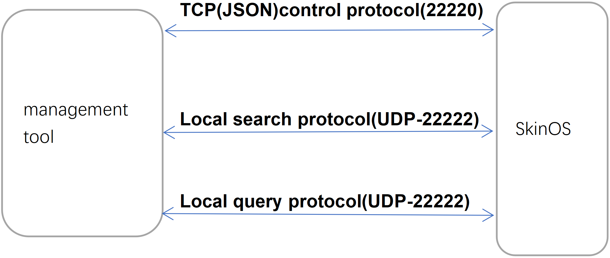
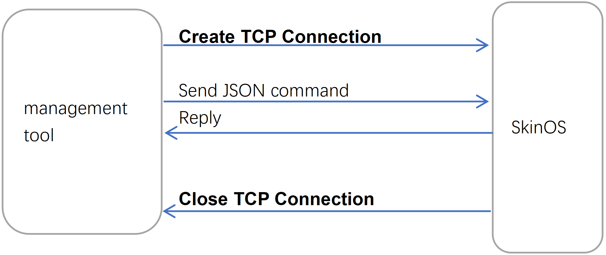

***
# 本地被管理协议说明
设备可接受来自局域网的管理协议, 管理协议通常由批量管理工具或本地的其它设备发出, 通过此协议批量管理工具或其它设备可以实现局域网管理设备


### **1. 协议分类**  

在局域网与设备通信分为三种协议
- **局域网搜索协议(UDP端口22222), 用于在局域网内搜索所有的设备**
- **局域网查询协议(UDP端口22222), 用于在局域网内搜索所有的设备并查询所有设备的信息**
- **JSON控制协议(TCP端口22220), 用于通过TCP协议修改或查询指定设备的配置及调用指定设备的接口**
图示


### **2. 局域网搜索协议**
在局域网通过向 **UDP端口22222** 广播搜索网内的所有设备
##### 1. 搜索网内设备交互流程
图示

流程图（可能无法显示）
```flow
device=>end: 2. 属于对应 组 的设备向IP为255.255.255.255的UDP端口22222回复MAC及IP及WEB端口: MAC地址|IP地址|管理网页端口|
data=>operation: 1. 管理工具向IP为255.255.255.255的UDP端口22222广播字符串: 组名
client=>start: 开始
client->data->device
```
*注: 所有设备默认都属于default组（可通过网页修改）, 向UDP端口22222广播default即可搜索局域网内所有的设备*

##### 2. 搜索网内的设备交互详解
- 1. **管理工具** 发送搜索请求
    即向IP为255.255.255.255的UDP端口22222广播组名7个字符default, 所有在网内设备都能收到这个字符串
    ```
    default
    ```
- 2. **设备** 回复
    网内所有设备收到default字符串后会向UDP端口22222广播回复自已的MAC地址、IP地址及管理网页的端口, 格式为: 
    ```
    MAC地址|IP地址|管理网页端口
    ```
- 示例: 如设备的MAC为00:03:7F:12:BB:80、IP为192.168.8.1、WEB管理服务器端口为80, 回复数据将为如下32个字符加上十六进制的0x0结尾:
    ```
    00037F12BB80|192.168.8.1|80
    ```
##### 3. 使用Windwos工具使用局域网搜索协议测试搜索网内的设备
- 左边为发送工具, 向192.168.8.1的22222端口发送UDP包(广播是需要向255.255.255.255的22222端口发UDP包,此工具不支持广播所以使用单播方式代替演示)
- 右边为接收工具, 在当前PC机(192.168.8.250)上的22222端口上接收设备的回复包

*注意: 因未找到合适的广播工具而用单播工具代替演示, 在实际开发过程中通过向UDP的22222端口广播相同的数据将产生相同的结果*


### **3. 局域网查询协议**
在局域网通过向 **UDP端口22222** 广播搜索并查询网内的所有设备的信息, 因使用UDP协议所以当交互数据过大时会出现丢包的问题, 不合适做信息量较大的交互

##### 1. 查询网内设备基本信息交互流程
图示

流程图（可能无法显示）
```flow
device=>end: 2. 属于对应 组 的设备向IP为255.255.255.255的UDP端口22222回复: MAC地址|IP地址|指令回复1,指令回复2,指令回复2,...|
data=>operation: 1. 管理工具向IP为255.255.255.255的UDP端口22222广播字符串: 组名,查询指令1,查询指令2,查询指令3,…
client=>start: 开始
client->data->device
```
*注: 所有设备默认都属于default组（可通过网页修改）, 广播default即可搜索局域网内所有的设备*

##### 2. 查询网内设备基本信息交互详解
- 1. **管理工具** 发送查询请求, 即向IP为255.255.255.255的UDP端口22222广播组名7个字符default加逗号及以逗号间隔的指令, 所有在网内设备都能收到这个字符串
    ```
    default,he查询指令1,he查询指令2,he查询指令3
    ```
- 2. **设备** 回复, 所有设备收到后会向UDP端口22222广播回复自已的MAC地址、IP地址及指令的执行结果, 格式为: 
    ```
    MAC地址|IP地址|he查询指令1回复,he查询指令2回复,he查询指令3回复
    ```
    以下列举几个常用的he指令, he指令格式介绍见[终端HE指令使用说明](../use/he_command.md), 具体更多的指令可以参看设备组件对应的markdown文件:
    ```
    land@machine:model           //  查询设备的型号
    land@machine:version         //  查询设备的软件版本
    land@machine:mode            //  查询设备的工作模式
    ifname@lte.status:imei       //  查询4G的IMEI号
    ifname@lte.status:iccid      //  查询4G的CCID号
    ifname@lte.status:signal     //  查询4G的信号
    ifname@lte.status:rssi       //  查询4G的信号强度
    ifname@lte.status:rsrp       //  查询4G的RSRP
    gnss@nmea.info:step        //  查询GPS状态
    ```

- 示例
    如要查询局域网所有设备的型号及IMEI号将发送如下:
    ```
    default,land@machine:model,ifname@lte.status:imei
    ```
    如MAC为00:03:7F:12:3A:D0（IP为192.168.8.1）型号为A218的设备将回复如下：
    ```
    00037F123AD0|192.168.8.1|A218,862107043556307
    ```
    如MAC为00:03:7F:13:3A:D8（IP为192.168.8.1）型号为V519的设备将回复如下：
    ```
    00037F133AD08|192.168.8.1|V519,86210704355692
    ```    
##### 3. 使用Windwos工具测试查询网内的设备收发包
- 左边为发送工具, 向192.168.8.1的22222端口发送UDP包, 查询局域网内所有设备的型号及CCID号
- 右边为接收工具, 在当前PC机(192.168.8.250)上的22222端口上接收设备的回复包, MAC为88:12:4E:30:91:A0的设备回复自已的型号为A219, CCID号为89860117851138508772

*注意: 因未找到合适的广播工具而用单播工具代替演示, 在实际开发过程中通过向UDP的22222端口广播相同的数据将产生相同的结果*


### **4. JSON控制协议**
通过 **TCP端口22220** 与设备交互JSON指令， 实现对设备的控制, 使用TCP协议交互, 适合交互各种信息

##### 1. 在设备上开启JSON控制协议
默认设备不会响应JSON控制协议, 需要进入管理网页打开此协议(*打开此协议会存在安全风险，请确保局域网安全*)

或者通过终端命令行打开此协议
```
# agent@local:json           // 查询json服务器的状态
disable
# agent@local:json=enable    // 修改json服务器的状态为开启
true
# agent@local:json           // 再次查询修改后的配置
enable
# 
```

##### 2. 与设备的交互流程
- 如下图所示

- 交互简介
    每一次的交互都需要建立TCP连接, 然后再发送JSON指令, 设备收到JSON指令将会回复JSON指令的执行结果, 之后将立即关闭TCP连接, 因此, 每一次交互都需要建立一个TCP连接, 也称之为**短连接**, 为保证指令的完整性, 指令被设计成一个完整的JSON对象, 同样回复信息也是一个完整的JSON对象, 对于设备的操作可以分为三种JSON指令：
	1. 查询配置：用于查询设备当前的配置
	2. 修改配置：用于修改设备的配置
	3. 调用接口：用于查看或修改设备的状态等

##### 3. JSON指令格式
- 查询设备配置交互格式介绍
    查询配置指令格式, 对应的he指令格式为 ***组件名称[:属性/属性/...]***
    ```json
    {
        "cmd1":                    // [ 字符串 ]:{} 可随意命名, 用于在JSON中唯一的标识当前指令, 由此可实现在一个交互中多个指令, 设备回复时也以此指令命名标识其回复
        {
            "com":"组件名称",       // [ 字符串 ], 组件名称用于指定设备的功能项, 如agent@remote为设备的远程管理, land@machine为设备的基本配置
            "ab":"属性[/属性/…]"    // [ 字符串 ], 可选, 组件名称对应的功能项的配置都是一个完整的JSON, 通过此属性可只查询指定的属性, 无表示查询组件名称对应功能项所有配置
        }
        // 更多指令...
    }
    ```
    返回值跟据设备的实际配置格式可为：
    1. 一个JSON
        ```json
        {
            "cmd1":{JSON格式的配置内容}
        }
        ```
    2. 一个字符串， 查询时"ab"有指定属性
        ```json
        {
            "cmd1":"属性值"
        }
        ```
    3. 空, 表示不存在此项配置
        ```json
        {
            "cmd1":"NULL"
        }
        ```

- 修改设备配置交互格式介绍
    修改设备配置指令格式(值为字符串时), 对应的he指令格式为 ***组件名称[:属性/属性/...]=值***
    ```json
    {
        "cmd1":                    // [ 字符串 ]:{} 可随意命名, 用于在JSON中唯一的标识当前指令, 由此可实现在一个交互中多个指令, 设备回复时也以此指令命名标识其回复
        {
            "com":"组件名称",       // [ 字符串 ], 组件名称用于指定设备的功能项
                                                // 如agent@remote为设备的远程管理, land@machine为设备的基本配置
            "ab":"属性[/属性/…]",   // [ 字符串 ], 可选, 组件名称对应的功能项的配置都是一个完整的JSON, 通过此属性可只查询指定的属性, 无表示查询组件名称对应功能项所有配置
	        "op":"=",              // 指定操作为赋值
	        "v":"值"               // [ 字符串 ]
        }
    }
    ```
    修改设备配置指令格式(值为JSON), 对应的he指令格式为 ***组件名称[:属性/属性/...]={值}***
    ```json
    {
        "cmd1":                    // [ 字符串 ]:{} 可随意命名, 用于在JSON中唯一的标识当前指令, 由此可实现在一个交互中多个指令, 设备回复时也以此指令命名标识其回复
        {
            "com":"组件名称",       // [ 字符串 ], 组件名称用于指定设备的功能项
                                                // 如agent@remote为设备的远程管理, land@machine为设备的基本配置
            "ab":"属性[/属性/…]",   // [ 字符串 ], 可选, 组件名称对应的功能项的配置都是一个完整的JSON, 通过此属性可只查询指定的属性, 无表示查询组件名称对应功能项所有配置
	        "op":"=",              // 指定操作为赋值
	        "v":{JSON格式的值}      // [ JSON ]
        }
    }
    ```
    设备返回值成功是为ttrue, 失败时为tfalse：
    1. 返回ttrue
        ```json
        {
            "cmd1":"ttrue"
        }
        ```json
    2. 返回tfalse
        ```json
        {
            "cmd1":"tfalse"
        }
        ```

- 调用组件接口交互格式介绍
    调用组件接口指令格式, 对应的he指令格式为 ***组件名称.接口名称[ 参数1, 参数2, 参数3 ]***
    ```json
    {
        "cmd1":                    // [ 字符串 ]:{} 可随意命名, 用于在JSON中唯一的标识当前指令, 由此可实现在一个交互中多个指令, 设备回复时也以此指令命名标识其回复
        {
            "com":"组件名称",       // [ 字符串 ], 组件名称用于指定设备的功能项
                                                // 如ifname@lte为设备的LTE网络, network@frame为设备的网络连接框架
	        "op":"接口名称",        // [ 字符串 ]，指定调用组件什么接口, 不通的接口有不同的功能
                                                // 如ifname@lte的status接口返回LTE网络状态, ifname@lte的shut接口表示断开LTE的连接
	        "1":"参数1",            // [ 字符串 ]，可选, 参数可为字符串(即引号开头及引号结尾), 也可以为JSON(即{开头}结尾)
	        "2":"参数2",            // [ 字符串 ]，可选, 参数可为字符串(即引号开头及引号结尾), 也可以为JSON(即{开头}结尾)
            "3":"参数3"             // [ 字符串 ]，可选, 参数可为字符串(即引号开头及引号结尾), 也可以为JSON(即{开头}结尾)
        }
    }
    ```
    跟据调用接口不同, 设备返回值可分为以下五种：
    1. 返回ttrue, 通常用于表示操作成功
        ```json
        {
            "cmd1":"ttrue"
        }
        ```
    2. 返回tfalse, 通常用于表示操作失败
        ```json
        {
            "cmd1":"tfalse"
        }
        ```
    3. 返回JSON, 通常表示操作的返回信息
        ```json
        {
            "cmd1":{返回JSON内容}
        }
        ```
    4. 返回字符串, 通常表示操作的返回信息
        ```json
        {
            "cmd1":"返回字符串内容"
        }
        ```
    5. 无返回, 有的接口不返回任何信息
        ```json
        {
            "cmd1":"NULL"
        }
        ```


##### 4. 示例-获取设备基本信息配置
- 设备基本信息属于land@machine组件的配置, 发送查询备基本信息配置指令即可(在HE终端中的命令行为land@machine), 点击[设备基本信息组件](../com/land/machine.md)查看有关配置的介绍
```json
{
    "cmd1":
    {
        "com":"land@machine"
    }
}
```
- 设备返回示例
```json
{
    "cmd1":
    {
        "mode":"gateway",                              // 设备工作模式为宽带路由
        "name":"5228-128870",                          // 设备名称为5228-128870
        "mac":"00:03:7F:12:88:70",                     // 设备MAC为00:03:7F:12:88:70
        "macid":"00037F128870",                        // 设备ID为00037F128870
        "language":"cn",                               // 设备语言为chinese
        "cfgversion":"134"                             // 设备配置版本为134(暗示设备配置被修改过134次)
    }
}
```
使用TCP客户端工具测试:


##### 5. 示例-获取设备基本状态
- 设备基本状态需要通过land@machine组件的status接口返回, 发送调用land@machine组件的status接口指令即可(在HE终端中的命令行为land@machine.status), 点击[设备基本信息组件](../com/land/machine.md)查看有关status接口的介绍
```json
{
    "cmd1":
    {
        "com":"land@machine",
        "op":"status"
    }
}
```
- 设备返回
```json
{
    "cmd1":
    {
        "mode":"gateway",
        "name":"5228-128870",
        "platform":"smtk2",
        "hardware":"mt7621",
        "custom":"d228",                      // 产品编号
        "scope":"std",
        "version":"v7.2.1231",                // 软件版本
        "livetime":"12:06:00:2",              // 在线时长  时：分：秒：天
        "current":"15:36:52:03:02:2023",      // 当前时间  时:分:秒:月:日:年
        "mac":"00:03:7F:12:88:70",
        "macid":"00037F128870",
        "model":"5228",                       // 产品型号
        "cmodel":"",
        "magic":"0E82CEC20232FFFF",
        "cfgversion":"134"
    }
}
```


##### 6. 示例-获取4G状态信息
- 4G状态信息通过ifname@lte的status接口返回, 因此发送调用ifname@lte组件的status接口指令(在HE终端中的命令行为ifname@lte.status), 点击[4G网络管理组件](../com/ifname/lte.md)及[4G模块管理组件](../com/modem/lte.md)查看有关status接口的介绍
```json
{
    "cmd1":
    {
        "com":"ifname@lte",
        "op":"status"
    }
}
```
- 设备返回
```json
{
    "cmd1":
    {
        "mode":"dhcpc",                    // IPv4 connect mode is DHCP
        "netdev":"usb0",                   // netdev is usb0
        "gw":"10.137.89.118",              // gateway is 10.137.89.118
        "dns":"120.80.80.80",              // dns is 120.80.80.80
        "dns2":"221.5.88.88",              // backup dns is 221.5.88.88
        "status":"up",                     // connect is succeed
        "ip":"10.137.89.117",              // ip address is 10.137.89.117
        "mask":"255.255.255.252",          // network mask is 255.255.255.252
        "livetime":"00:15:50:0",           // already online 15 minute and 50 second
        "rx_bytes":"1256",                 // receive 1256 bytes
        "rx_packets":"4",                  // receive 4 packets
        "tx_bytes":"1320",                 // send 1320 bytes
        "tx_packets":"4",                  // send 4 packets
        "mac":"02:50:F4:00:00:00",         // netdev MAC address is 02:50:F4:00:00:00
        "method":"slaac",                  // IPv6 address mode is slaac
        "addr":"fe80::50:f4ff:fe00:0",     // local IPv6 address is fe80::50:f4ff:fe00:0
        "imei":"867160040494084",          // imei is 867160040494084
        "imsi":"460015356123463",          // imei is 460015356123463
        "iccid":"89860121801097564807",    // imei is 89860121801097564807
        "csq":"3",                         // CSQ nubmer is 3
        "signal":"3",                      // signal level is 3
        "state":"connect",                 // state is connect to the internet
        "plmn":"46001",                    // plmn is 46001
        "nettype":"WCDMA",                 // nettype is WCDMA
        "rssi":"-107",                     // signal intensity is -107
        "operator":"中国联通",              // operator name is 中国联通
        "operator_advise":                 // recommended profile for 中国联通
        {
            "name":"中国联通",                 // name is 中国联通
            "dial":"*99#",                    // dial number is *99#
            "apn":"3gnet"                     // APN is 3gnet
        }
    }
}
```

##### 7. 示例-获取第二个4G状态信息(对于双模块设备)
- 第二个4G状态信息通过ifname@lte2的status接口返回, 因此发送调用ifname@lte2组件的status接口指令(在HE终端中的命令行为ifname@lte2.status), 点击[4G网络管理组件](../com/ifname/lte.md)及[4G模块管理组件](../com/modem/lte.md)查看有关status接口的介绍
```json
{
    "cmd1":
    {
        "com":"ifname@lte2",
        "op":"status"
    }
}
```
- 设备返回
```json
{
    "cmd1":
    {
        ... // 内容与 6 相同
    }
}
```


##### 8. 示例-获取设备上的客户端信息
- 设备上的客户端信息由client@station组件的list接口返回, 因此发送调用client@station组件的list接口指令(在HE终端中的命令行为client@station.list), 点击[客户端管理组件](../com/client/station.md)查看有关list接口的介绍
```json
{
    "cmd1":
    {
        "com":"client@station",
        "op":"list"
    }
}
```
- 设备返回
```json
{
    "cmd1":
    {
        "00:E0:4C:68:2A:8B":                           // 客户端MAC地址
        {
            "ip":"192.168.1.250",                        // IP地址
            "netdev":"lan",                              // 接入的网络接口
            "ifname":"ifname@lan",                       // 接入的网络连接
            "livetime":"00:40:25:0"                      // 连接时间
        },
        "FC:87:43:DC:6F:B4":                          // 客户端MAC地址
        {
            "ip":"192.168.1.248",                        // IP地址
            "netdev":"lan",                              // 接入的网络接口
            "ifname":"ifname@lan",                       // 接入的网络连接
            "livetime":"00:40:11:0",                     // 连接时间
            "ifdev":"wifi@assid",                        // 接入的连接设备
            "rssi":"-73",                                // 信号强度, 只有连接设备热点的设备才有此属性
            "name":"HUAWEI_P30_Pro-9f13d2ee6f",          // 客户端名称
            "tx_bytes":"610528",                         // 发送字节
            "rx_bytes":"1653658"                         // 接收字节
        }
    }
}
```


##### 9. 示例-获取GPS信息(对应的设备必须有GPS功能并且配置正确)
- GPS信息由gnss@nmea组件的info接口返回, 因此发送调用gnss@nmea组件的info接口指令(在HE终端中的命令行为gnss@nmea.info), 点击[GPS管理组件](../com/gnss/nmea.md)查看有关info接口的介绍
```json
{
    "cmd1":
    {
        "com":"gnss@nmea",
        "op":"info"
    }
}
```
- 设备返回
```json
{
    "cmd1":
    {
        "step":"located",                           // already located
        "utc":"7:55:22:7:12:2021",                  // UTC
        "lon":"11356.56400",
        "lat":"2240.80119",
        "speed":"0.34",
        "elv":"77.90",
        "direction":"",
        "declination":"",
    }
}
```


##### 10. 示例-获取设备LAN口信息
- 设备LAN口信息由ifname@lan组件的status接口返回, 对应的HE指令为ifname@lan.status, 点击查看[LAN口管理组件](../com/ifname/lan.md)查看有关status接口的介绍
```json
{
    "cmd1":
    {
        "com":"ifname@lan",
        "op":"status"
    }
}
```
- 设备返回
```json
{
    "cmd1":
    {
        "mode":"static",                   // IPv4 connect mode is static
        "netdev":"lan",                    // netdev is lan
        "status":"up",                     // connect is succeed
        "ip":"192.168.1.1",                // ip address is 192.168.1.1
        "mask":"255.255.255.0",            // network mask is 255.255.255.0
        "livetime":"01:15:50:0",           // already online 1 hour and 15 minute and 50 second
        "rx_bytes":"1256",                 // receive 1256 bytes
        "rx_packets":"4",                  // receive 4 packets
        "tx_bytes":"1320",                 // send 1320 bytes
        "tx_packets":"4",                  // send 4 packets
        "mac":"02:50:F4:00:00:00",         // netdev MAC address is 02:50:F4:00:00:00
        "method":"slaac",                  // IPv6 address mode is slaac
        "addr":"fe80::50:f4ff:fe00:0"      // local IPv6 address is fe80::50:f4ff:fe00:0
    }
}
```


##### 11. 示例-重启设备
- 对应的HE指令为land@machine.restart, 点击[设备基本信息组件](../com/land/machine.md)查看有关restart接口的介绍
```json
{
    "cmd1":
    {
        "com":"land@machine",
        "op":"restart"
    }
}
```
- 设备返回如下后将会在3至15秒内重启
```json
{
    "cmd1":"ttrue"
}
```

##### 12. 示例-重置设备(恢复出厂设置)
- 对应的HE指令为land@machine.default, 点击查看[设备基本信息组件](../com/land/machine.md)查看有关default接口的介绍
```json
{
    "cmd1":
    {
        "com":"land@machine",
        "op":"default"
    }
}
```
- 设备返回如下后将会在3至15秒内重启
```json
{
    "cmd1":"ttrue"
}
```

##### 13. 示例-修改设备admin用户的密码
- 用户及密码管理在组件land@auth组件中, 修改密码使用其modify的接口中, 通过调用此接口来修改密码, 点击[帐号密码及权限管理组件](../com/land/auth.md)查看modify接口介绍
```json
{
    "cmd1":
    {
        "com":"land@auth",             // 帐号密码及权限管理组件
        "op":"modify",                 // 调用修改接口
        "1":"",                        // 要修改的域, 空为默认所有域
        "2":"admin",                   // 要修改的用户名
        "3":"admin",                   // 原密码
        "4":"123456"                   // 新密码
    }
}
```
***注意, 实际发送时不允许包含注解***
- 设备返回
```json
{
    "cmd1":"ttrue"
}
```


##### 14. 示例-修改2.4G无线热点的SSID名称
- 2.4G无线热点设置在组件wifi@nssid的配置中, 因此发送修改wifi@nssid组件配置中的ssid属性的值(在HE终端中的命令行为wifi@nssid:ssid=NewSSID), 点击[2.4G无线SSID组件](../com/wifi/nssid.md)查看配置介绍
```json
{
    "cmd1":
    {
        "com":"wifi@nssid",
        "ab":"ssid",
        "op":"=",
        "v":"NewSSID"
    }
}
```
- 设备返回
```json
{
    "cmd1":"ttrue"
}
```

##### 15. 示例-同时修改2.4G无线热点的SSID名称及密码
- 2.4G无线热点设置在组件wifi@nssid的配置中, 同时修改两个及以上的属性需要使用**或操作**(在HE终端中的命令行为wifi@nssid|{"ssid":"NewSSID","secure":"wpapskwpa2psk","wpa_key":"NewPassword"}), 点击[2.4G无线SSID组件](../com/wifi/nssid.md)查看配置介绍
```json
{
    "cmd1":
    {
        "com":"wifi@nssid",            // 2.4G无线热点组件
        "op":"|",                      // 或操作, 即只修改以下给出的属性的值, wifi@nssid组件配置中其它未在v中给出的属性保留原来的值(如果op的值为=号将会删除其它的属性)
        "v":
        {
            "ssid":"NewSSID",          // SSID的名称改为NewSSID
            "secure":"wpapskwpa2psk",  // 安全方式改为WPA自动
            "wpa_key":"NewPassword"    // WPA的密码改为NewPassword
        }
    }
}
```
***注意, 实际发送时不允许包含注解***
- 设备返回
```json
{
    "cmd1":"ttrue"
}
```

##### 16. 示例-同时修改5.8G无线热点的SSID名称及密码
- 5.8G无线热点设置在组件wifi@assid的配置中, 同时修改两个及以上的属性需要使用**或操作**(在HE终端中的命令行为wifi@assid|{"ssid":"NewSSID-5G","secure":"wpapskwpa2psk","wpa_key":"NewPassword"}), 点击[5.8G无线SSID组件](../com/wifi/assid.md)查看配置介绍
```json
{
    "cmd1":
    {
        "com":"wifi@assid",            // 5.8G无线热点组件
        "op":"|",                      // 或操作, 即只修改以下给出的属性的值, wifi@assid组件配置中其它未在v中给出的属性保留原来的值(如果op的值为=号将会删除其它的属性)
        "v":
        {
            "ssid":"NewSSID",          // SSID的名称改为NewSSID-5G
            "secure":"wpapskwpa2psk",  // 安全方式改为WPA自动
            "wpa_key":"NewPassword"    // WPA的密码改为NewPassword
        }
    }
}
```
***注意, 实际发送时不允许包含注解***
- 设备返回
```json
{
    "cmd1":"ttrue"
}
```


##### 17. 示例-修改4G网络的拨号APN相关的设置
- 4G网络设置在组件ifname@lte的配置中, 修改APN需要先打开APN自定义, 然后设置APN相关的信息, 整个指令需要修改多项属性值, 点击[4G网络管理组件](../com/ifname/lte.md)及[4G模块管理组件](../com/modem/lte.md)相关的配置介绍
```json
{
    "cmd1":
    {
        "com":"ifname@lte",            // 4G网络
        "op":"|",                      // 或操作, 即只修改以下给出的属性的值, ifname@lte组件配置中其它未在v中给出的属性保留原来的值(如果op的值为=号将会删除其它的属性)
        "v":
        {
            "profile":"enable",        // 打开APN自定义
            "profile_cfg":             // 自定义APN的信息
            {
                "dial":"*99#",          // 拨号号码
                "apn":"NewAPN",         // APN
                "user":"ctnet",         // 用户名
                "passwd":"234352"       // 密码
            }
        }
    }
}
```
***注意, 实际发送时不允许包含注解***
- 设备返回
```json
{
    "cmd1":"ttrue"
}
```


##### 18. 示例-设置2.4G无线连网连接指定的SSID, 必须要有WISP接口的工作模式下才有效(如在2.4G无线连网或混合模式下)
- 2.4G无线连网设置在组件ifname@wisp的配置中, 设置2.4G无线连网需要同时修改两个以上的属性, 因此使用**或操作**(在HE终端中的命令行为ifname@wisp|{"peer":"CMCC","secure":"wpapskwpa2psk","wpa_key":"CMCC@passwd"}), 点击[无线连网组件](../com/ifname/wisp.md)查看配置介绍
```json
{
    "cmd1":
    {
        "com":"ifname@wisp",            // 2.4G无线连网组件
        "op":"|",                       // 或操作, 即只修改以下给出的属性的值, ifname@wisp组件配置中其它未在v中给出的属性保留原来的值(如果op的值为=号将会删除其它的属性)
        "v":
        {
            "status":"enable",          // 启用此连接
            "peer":"CMCC",              // 连接的SSID为CMCC
            "secure":"wpapskwpa2psk",   // 安全方式改为WPA自动
            "wpa_key":"CMCC@passwd"     // WPA的密码改为CMCC@passwd
        }
    }
}
```
***注意, 实际发送时不允许包含注解***
- 设备返回
```json
{
    "cmd1":"ttrue"
}
```

##### 19. 示例-设置禁用2.4G无线连网, 必须要有WISP接口的工作模式下才有效(如在2.4G无线连网或混合模式下)
- 2.4G无线连网设置在组件ifname@wisp的配置中, 设置禁用2.4G无线连网只需将配置中的status属性改为disable即可(在HE终端中的命令行为ifname@wisp:status=disable), 点击[无线连网组件](../com/ifname/wisp.md)查看配置介绍
```json
{
    "cmd1":
    {
        "com":"ifname@wisp",            // 2.4G无线连网组件
        "ab":"status",                  // 指定修改status属性
        "op":"=",                       // 赋值操作
        "v":"disable"                   // 将status属性的值改为disable即禁用
    }
}
```
***注意, 实际发送时不允许包含注解***
- 设备返回
```json
{
    "cmd1":"ttrue"
}
```

##### 20. 示例-临时断开2.4G无线连网, 必须要有WISP接口的工作模式下才有效(如在2.4G无线连网或混合模式下)
- 2.4G无线连网管理在组件ifname@wisp中, 断开2.4G无线连接只需调用shut接口(在HE终端中的命令行为ifname@wisp.shut), 点击[无线连网组件](../com/ifname/wisp.md)查看shut接口介绍
```json
{
    "cmd1":
    {
        "com":"ifname@wisp",            // 2.4G无线连网组件
        "op":"shut"                     // 调用shut接口断开2.4G无线连网
    }
}
```
***注意, 实际发送时不允许包含注解***
- 设备返回
```json
{
    "cmd1":"ttrue"
}
```

##### 21. 示例-临时发起2.4G无线连网, 必须有WISP接口的工作模式下才有效(如在2.4G无线连网或混合模式下)， 并已配置好相关的2.4G无线连网的参数且被临时断开
- 2.4G无线连网管理在组件ifname@wisp中, 发起2.4G无线连网只需调用setup接口(在HE终端中的命令行为ifname@wisp.setup), 点击[无线连网组件](../com/ifname/wisp.md)查看setup接口介绍
```json
{
    "cmd1":
    {
        "com":"ifname@wisp",            // 2.4G无线连网组件
        "op":"setup"                    // 调用setup接口让2.4G无线连网发起连接
    }
}
```
***注意, 实际发送时不允许包含注解***
- 设备返回
```json
{
    "cmd1":"ttrue"
}
```


##### 22. 示例-设置5.8G无线连网连接指定的SSID, 必须要有WISP2接口的工作模式下才有效(如在5.8G无线连网或混合模式下)
- 5.8G无线连网设置在组件ifname@wisp2的配置中, 设置5.8G无线连网需要同时修改两个以上的属性, 因此使用**或操作**(在HE终端中的命令行为ifname@wisp2|{"peer":"CMCC-5G","secure":"wpapskwpa2psk","wpa_key":"CMCC@passwd"}), 点击[无线连网组件](../com/ifname/wisp.md)查看配置介绍
```json
{
    "cmd1":
    {
        "com":"ifname@wisp2",            // 5.8G无线连网组件
        "op":"|",                        // 或操作, 即只修改以下给出的属性的值, ifname@wisp组件配置中其它未在v中给出的属性保留原来的值(如果op的值为=号将会删除其它的属性)
        "v":
        {
            "status":"enable",           // 启用此连接
            "peer":"CMCC-5G",            // 连接的SSID为CMCC-5G
            "secure":"wpapskwpa2psk",    // 安全方式改为WPA自动
            "wpa_key":"CMCC@passwd"      // WPA的密码改为CMCC@passwd
        }
    }
}
```
***注意, 实际发送时不允许包含注解***
- 设备返回
```json
{
    "cmd1":"ttrue"
}
```

##### 23. 示例-设置禁用5.8G无线连网, 必须要有WISP2接口的工作模式下才有效(如在5.8G无线连网或混合模式下)
- 5.8G无线连网设置在组件ifname@wisp2的配置中, 设置禁用5.8G无线连网只需将配置中的status属性改为disable即可(在HE终端中的命令行为ifname@wisp2:status=disable), 点击[无线连网组件](../com/ifname/wisp.md)查看配置介绍
```json
{
    "cmd1":
    {
        "com":"ifname@wisp2",            // 5.8G无线连网组件
        "ab":"status",                   // 指定修改status属性
        "op":"=",                        // 赋值操作
        "v":"disable"                    // 将status属性的值改为disable即禁用
    }
}
```
***注意, 实际发送时不允许包含注解***
- 设备返回
```json
{
    "cmd1":"ttrue"
}
```

##### 24. 示例-临时断开5.8G无线连网, 必须要有WISP2接口的工作模式下才有效(如在5.8G无线连网或混合模式下)
- 5.8G无线连网管理在组件ifname@wisp2中, 断开5.8G无线连接只需调用shut接口(在HE终端中的命令行为ifname@wisp2.shut), 点击[无线连网组件](../com/ifname/wisp.md)查看shut接口介绍
```json
{
    "cmd1":
    {
        "com":"ifname@wisp2",            // 5.8G无线连网组件
        "op":"shut"                      // 调用shut接口断开5.8G无线连网
    }
}
```
***注意, 实际发送时不允许包含注解***
- 设备返回
```json
{
    "cmd1":"ttrue"
}
```

##### 25. 示例-临时发起5.8G无线连网, 必须有WISP2接口的工作模式下才有效(如在5.8G无线连网或混合模式下)， 并已配置好相关的5.8G无线连网的参数且被临时断开
- 5.8G无线连网管理在组件ifname@wisp2中, 发起5.8G无线连网只需调用setup接口(在HE终端中的命令行为ifname@wisp2.setup), 点击[无线连网组件](../com/ifname/wisp.md)查看setup接口介绍
```json
{
    "cmd1":
    {
        "com":"ifname@wisp2",            // 5.8G无线连网组件
        "op":"setup"                     // 调用setup接口让5.8G无线连网发起连接
    }
}
```
***注意, 实际发送时不允许包含注解***
- 设备返回
```json
{
    "cmd1":"ttrue"
}
```


##### 26. 示例-设置新策略路由, 指定源地址为192.168.2.12走第一个LTE
- 策略路由在组件forward@rule中, 添加策略路由通过add接口操作(在HE终端中的命令行为forward@rule.add), 点击[策略路由组件](../com/forward/rule.md)查看接口add相关介绍
```json
{
    "cmd1":
    {
        "com":"forward@rule",             // 策略路由组件
        "op":"add",                       // 调用add接口添加规则, 此规则的名称为senser, 此规则要求源地址为192.168.2.12的数据走第一个LTE
        "1":"senser",                         // 规则名称
        "2":"192.168.2.12",                   // 源地址
        "3":"",                               // 掩码
        "4":"",                               // 源接口名称
        "5":"",                               // mark id
        "6":"1",                              // 指定路由表, 1通常为第一个LTE, 2通常为第二个LTE, 3通常为有线宽带， 4为第二个有线宽带, 5为2.4G无线连网, 6为5.8G无线连网
        "7":"33000"                           // 优先级, 通常优先级需在32766至35000之间
    }
}
```
***注意, 实际发送时不允许包含注解***
- 设备返回
```json
{
    "cmd1":"ttrue"
}
```
##### 27. 示例-设置新策略路由, 指定所有数据走第二个LTE
- 策略路由在组件forward@rule中, 添加策略路由通过add接口操作(在HE终端中的命令行为forward@rule.add), 点击[策略路由组件](../com/forward/rule.md)查看接口add相关介绍
```json
{
    "cmd1":
    {
        "com":"forward@rule",             // 策略路由组件
        "op":"add",                       // 调用add接口添加规则, 此规则的名称为video, 此规则要求所有的数据走第二个LTE
        "1":"video",                         // 规则名称
        "2":"",                              // 源地址
        "3":"",                              // 掩码
        "4":"",                              // 源接口名称
        "5":"",                              // mark id
        "6":"2",                             // 指定路由表, 1通常为第一个LTE, 2通常为第二个LTE, 3通常为有线宽带， 4为第二个有线宽带, 5为2.4G无线连网, 6为5.8G无线连网
        "7":"33300"                          // 优先级, 通常优先级需在32766至35000之间
    }
}
```
***注意, 实际发送时不允许包含注解***
- 设备返回
```json
{
    "cmd1":"ttrue"
}
```
##### 28. 示例-删除原设置的名为video的策略路由规则
- 策略路由在组件forward@rule中, 删除策略路由通过delete接口操作(在HE终端中的命令行为forward@rule.delete), 点击[策略路由组件](../com/forward/rule.md)查看接口delete相关介绍
```json
{
    "cmd1":
    {
        "com":"forward@rule",             // 策略路由组件
        "op":"delete",                    // 调用delete接口添加规则, 此规则的名称为video
        "1":"video"                          // 规则名称
    }
}
```
***注意, 实际发送时不允许包含注解***
- 设备返回
```json
{
    "cmd1":"ttrue"
}
```
##### 29. 示例-同时设置两条策略路由, 指定源地址为192.168.2.12走第一个LTE, 并指定其它所有数据走第二个LTE
- 策略路由在组件forward@rule中, 添加策略路由通过add接口操作(在HE终端中的命令行为forward@rule.add), 点击[策略路由组件](../com/forward/rule.md)查看接口add相关介绍
```json
{
    "cmd1":
    {
        "com":"forward@rule",             // 策略路由组件
        "op":"add",                       // 调用add接口添加规则, 此规则的名称为senser, 此规则要求源地址为192.168.2.12的数据走第一个LTE
        "1":"senser",                         // 规则名称
        "2":"192.168.2.12",                   // 源地址
        "3":"",                               // 掩码
        "4":"",                               // 源接口名称
        "5":"",                               // mark id
        "6":"1",                              // 指定路由表, 1通常为第一个LTE, 2通常为第二个LTE, 3通常为有线宽带， 4为第二个有线宽带, 5为2.4G无线连网, 6为5.8G无线连网
        "7":"33000"                           // 优先级, 通常优先级需在32766至35000之间
    },
    "cmd2":
    {
        "com":"forward@rule",             // 策略路由组件
        "op":"add",                       // 调用add接口添加规则, 此规则的名称为video, 此规则要求所有的数据走第二个LTE
        "1":"video",                         // 规则名称
        "2":"",                              // 源地址
        "3":"",                              // 掩码
        "4":"",                              // 源接口名称
        "5":"",                              // mark id
        "6":"2",                             // 指定路由表, 1通常为第一个LTE, 2通常为第二个LTE, 3通常为有线宽带， 4为第二个有线宽带, 5为2.4G无线连网, 6为5.8G无线连网
        "7":"33300"                          // 优先级, 通常优先级需在32766至35000之间
    }
}
```
***注意, 实际发送时不允许包含注解***
- 设备返回
```json
{
    "cmd1":"ttrue",
    "cmd2":"ttrue"
}
```
##### 30. 示例-删除原设置的名为senser及名为video的策略路由规则
- 策略路由在组件forward@rule中, 删除策略路由通过delete接口操作(在HE终端中的命令行为forward@rule.delete), 点击[策略路由组件](../com/forward/rule.md)查看接口delete相关介绍
```json
{
    "cmd1":
    {
        "com":"forward@rule",             // 策略路由组件
        "op":"delete",                    // 调用delete接口添加规则, 此规则的名称为video
        "1":"senser"                          // 规则名称
    },
    "cmd2":
    {
        "com":"forward@rule",             // 策略路由组件
        "op":"delete",                    // 调用delete接口添加规则, 此规则的名称为video
        "1":"video"                          // 规则名称
    }
}
```
***注意, 实际发送时不允许包含注解***
- 设备返回
```json
{
    "cmd1":"ttrue",
    "cmd2":"ttrue"
}
```


## 对照组件文档使用JSON控制协议管理设备
有两种方式可以查询到所有组件文档, 通过这些组件文档可以管理到设备的每一个功能
- 访问[在线组件文档](../com/)查看组件文档, 此在线文件会随着开发新的功能动态增加及修订
- 资询技术支持人员

#### 组件文档要点
- 在[在线组件文档](../com/)中首先以行的形式列出了系统中常用的项目, 每个项目下包含了组件文档
- 点击项目进入项目中, 会以行的形式列出此项目下所有的组件文档
- 点击组件打开组件文档, 组件文件首先是抬头, 抬头是组件名称介绍
- 组件文档首先是会介绍此组件的功能, 然后就是 **配置**, 配置是JSON格式, 可以在JSON控制协议或命令行中查询或修改这些配置, 通常文档中会给出修改及查询示例
- 组件文档 **配置** 之后通常是介绍此组件的 **接口**, 可以在JSON控制协议或命令行中调用这些接口

#### 对照组件文档查询组件配置
在组件文档的抬头中会指出组件名, 比如 [日志管理组件](../com/land/syslog.md) 的组件名为 **land@syslog**

- 发送JOSN查询指令, 对应的he指令为land@syslog
```json
{
    "cmd1":
    {
        "com":"land@syslog"
    }
}
```
设备将返回如下, cmd1的属性即是land@syslog的配置
```json
{
    "cmd1":
    {
        "status":"enable",               // 开启syslog
        "type":"init|serv|joint|default",// 记录启动项及关机项, 服务, 事件及其它默认类型相关的日志
        "level":"info",                  // 只记录通知级别的日志
        "trace":"enable",                // 记录代码位置及进程ID
        "size":"20",                     // 记录池为20k
        "remote":"192.168.8.100",        // 远程日志服务器地址为192.168.8.100
        "port":"514"                     // 远程日志服务器的端口为514
    }
}
```

- 也可以在发送JOSN指令中查询组件配置中指定的属性, 只需要增加 **ab**属性, 在 **ab** 属性的值中给出指定的属性
```json
{
    "cmd1":
    {
        "com":"land@syslog",
        "ab":"size"
    }
}
```
设备将返回如下, cmd1的属性值即是land@syslog配置下size属性的值
```json
{
    "cmd1":"100"
}
```


#### 对照组件文档修改组件配置
接以上 [日志管理组件](../com/land/syslog.md) 的组件文档, 在文档的 **配置** 中描述属性可以在JOSN指令协议中修改
- 通过JSON指令协议修改land@syslog的远程日志服务器(remote属性值)为192.168.8.230
    ```json
    {
        "cmd1":
        {
	        "com":"land@syslog",
	        "ab":"remote",
	        "op":"=",
	        "v":"192.168.8.230"
        }
    }
    ```
    设备将返回如下, cmd1的属性值指示是否成功, 成功返厍ttrue, 失败返回tfalse
    ```json
    {
        "cmd1":"ttrue"
    }
    ```

- 通过JSON指令协议同时修改land@syslog的多个属性值, 以下同时修改remote及port两个属性, 并不对其它的属性产生任何影响
    ```json
    {
        "cmd1":
        {
	        "com":"land@syslog",
	        "op":"|",
	        "v":
            {
                "remote":"192.168.8.231",
                "port":"510"
            }
        }
    }
    ```
    设备将返回如下, cmd1的属性值指示是否成功, 成功返厍ttrue, 失败返回tfalse
    ```json
    {
        "cmd1":"ttrue"
    }
    ```
- 通过JSON指令协议修改land@syslog的所有配置, 组件配置都是一个JSON, 如要修改所有的配置必须同样的给出一个JSON
    ```json
    {
        "cmd1":
        {
	        "com":"land@syslog",
	        "op":"=",
	        "v":
            {
                "status":"enable",
                "location":"memory",
                "type":"arch|land|default",
                "level":"info",
                "trace":"disable",
                "size":"110",
                "remote":"",
                "port":"514"
            }
        }
    }
    ```
    设备将返回如下, cmd1的属性值指示是否成功, 成功返厍ttrue, 失败返回tfalse
    ```json
    {
        "cmd1":"ttrue"
    }
    ```

#### 对照组件文档调用组件接口
接以上 [日志管理组件](../com/land/syslog.md) 的组件文档, 在文档的 **接口** 中描述接口都可以在JSON指令协议中调用
- 在JSON指令协议中调用组件land@syslog的clear接口清除日志
    ```json
    {
        "cmd1":
        {
	        "com":"land@syslog",
	        "op":"clear"
        }
    }
    ```
    设备将返回如下, cmd1的属性值指示是否成功, 成功返厍ttrue, 失败返回tfalse
    ```json
    {
        "cmd1":"ttrue"
    }
    ```


## 测试版的协议判断(未对接过旧版本的JSON控制协议的不需要了解)
在形成标准版的JSON指令协议之前我们曾发布过测试版的JSON指令协议
对于已开发过测试版本的JSON指令协议的管理工具想要支持当前标准版本时, 而需要首先判断设备是否支持标准版本, 可以通过发送如果JSON指令来判断:  
```json
{
    "cmd1":
    {
        "com":"land@machine"
    }
}
```

- 对于测试版本的设备将只会返回一对大括号, 收到一对大括号即表示为测试版本的JSON指令协议, 即按原测试版本的JSON指令协议管理 
```json
{
}
```

- 而对于标准版本的设备将会返回对应的设备基本信息, 即可按标准版本的JSON指令协议来管理 
```json
{
    "cmd1":
    {
        "custom":"d218",
        "version":"4.3.3d",
        "macid":"00037F123310",
        "mac":"00:03:7F:12:33:10",
        "magic":"23571121DF68ACC3",
        "model":"D218",
        "name":"D218-123310",
        "mode":"misp", 
        "livetime":"00:01:18:0",
        "current":"01:41:15:01:01:2016"
    }        
}
```


