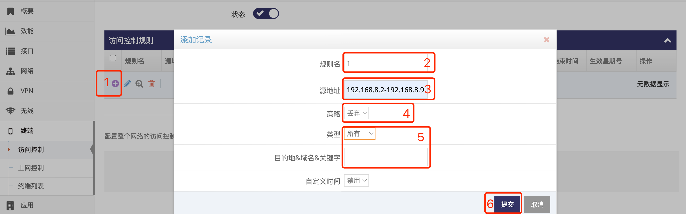
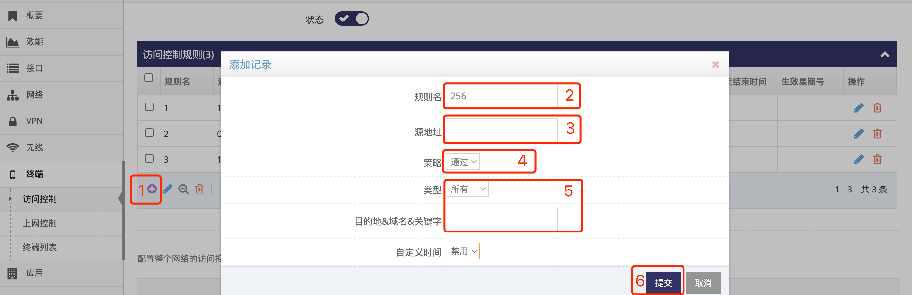
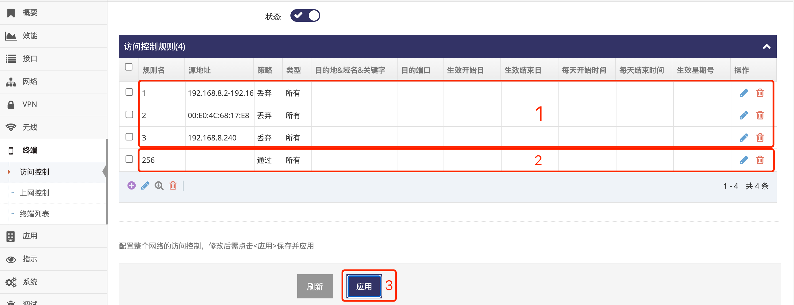

------

## 上网黑名单设置

上网黑名单通过设置访问控制的规则来实现, 并且访问控制的规则名称使用数字实现按顺序匹配   

### 启动访问控制   
- 点击 **红框1** **终端** 下的 **红框2** **访问控制** 菜单项进入访问控制的管理界面   
   
- 点击 **红框3** 启动访问控制后即可点击 **红框4** 添加规则来实现 **上网黑名单**   

### 按顺序首先添加黑名单丢弃   
- 点击 **红框1** 添加黑名单丢弃规则  
   
- **红框2** 为规则名称, 按顺序添加, 从 **1** 到 **256**   
- **红框3** 中给出终端的IP地址   
    - 多台终端IP地址以 **,号** 分隔   
    - 也支持指定一个IP段, 起始地址与结束地址间用 **-号** 隔开即可   
    - 也可以填写终端的MAC地址, MAC地址格式如 **00:03:7E:56:21:31**, 一个输入框中MAC地址不支持填写多个   
- **红框4** 策略选 **丢弃**   
- **红框5** 选 **所有**, 即所有的此终端地址的数据都丢弃   
- 点击 **红框6** 提交即可   

按以上方式添加所有的黑名单的终端即可  

### 最后添加所有数据都让通过   
- 点击 **红框1** 添加其它所有数据都通过的规则   
   
- **红框2** 为规则名称, 填写 **256** 保证最后匹配   
- **红框3** 留空表示匹配所有的IP地址   
- **红框4** 策略选 **通过**   
- **红框5** 选 **所有**, 即所有的终端地址的数据将通过   
- 点击 **红框6** 提交即可  

### 最后应用即可   
- 点击 **红框3** 应用即可   
   
- **红框1** 为黑名单信息, 所以策略都是丢弃, 名称必须为数字   
- **红框2** 为匹配其它数据用于全部通过, 这条规则的名称的数字必须是所有规则名称数字中最大的   
