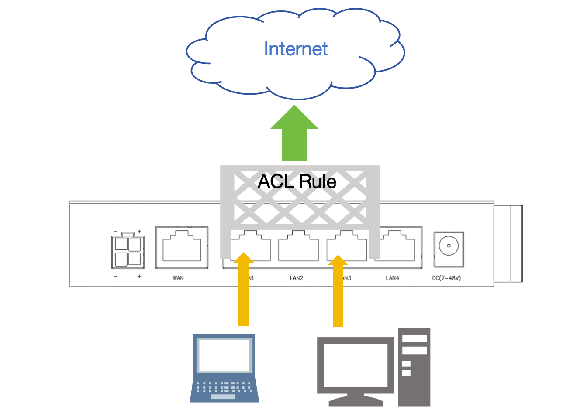

------

## 对终端访问互联网的目的地或内容进行管控

   

- 点击 **红框1** **终端** 下的 **红框2** **访问控制** 菜单项进入访问控制的管理界面   
   
- 点击 **红框3** 启动访问控制后即可点击 **红框4** 添加规则来管控局域网客户端对互联网目的地及内容的访问   
- 添加好规则后点击 **红框5** 应用生效   

### 添加访问控制规则      

- 在添加对话框中指定对应的各种要素即可   
   
- **红框1** 为自定义的规则名称, 支持中英文, 不支持引号斜杠等特别符号
- **红框2** 中给出终端的IP地址
    - 多台终端IP地址以 **,号** 分隔
    - 也支持指定一个IP段, 起始地址与结束地址间用 **-号** 隔开即可   
    - 也可以填写终端的MAC地址, MAC地址格式如 **00:03:7E:56:21:31**, 一个输入框中MAC地址不支持填写多个   
- **红框3** 中选择策略, **丢弃** 为丢弃匹配到此规则的包, **通过** 为放行匹配到此规则的包, **返回** 为不再继续匹配接下来的规则   
- **红框4** **类型** 选择要匹配的协议, 分以下几种   
    - **TCP**, **UDP** 协议, 选此协议则 **目的端口** 必须填写   
    - **所有** 即为所有的协议
    - **域名** 则表示匹配 **目的地&域名&关键字** 输入框的域名   
    - **关键字** 则表示匹配 **目的地&域名&关键字** 输入框的关键字  
- **红框4** **目的地&域名&关键字** 跟据 **类型** 不同输入不同的信息   
    - 当 **类型** 为 **TCP**, **UDP**, **所有** 时可填写目的地的IP地址, 不填写表示匹配所有目的IP
        - 多个目的地的IP地址以 **,号** 分隔
        - 也支持指定一个IP段, 起始地址与结束地址间用 **-号** 隔开即可   
    - 当 **类型** 为 **域名** 时须填写域名   
    - 当 **类型** 为 **关键字** 时须填写关键字   
- **红框4** **目的端口** 在 **类型** 为 **TCP**, **UDP** 可填写目的端口
    - 多个端口以 **,号** 分隔
    - 也支持指定一个端口段, 起始端口与结束端口间用 **-号** 隔开即可   

### 让添加访问控制规则定时生效

在添加规则的对话框中选择生效的时间即可  
   
以上 **红框** 用于选择当前规则的生效时间, 示例中表示从 **2024年7月1号** 开始到 **2024年11月1号** 结束, 每 **周一二三四五** 的 **9点** 到 **18点** 生效   

### 按顺序匹配添加的规则   

通过添加规则时以数字的大小给规则命名可以指定匹配的顺序, 如以下图示   
   
- 规则名为 **1** 将首先匹配, 这将导致所有的源地址为192.168.8.2至192.168.8.9的数据都可通过网关   
- 其次规则名为 **2** 匹配, 这将导致所有访问114.114.114.114的数据都会通过网关     
- 最后规则名为 **3** 的匹配将丢弃所有的数据   

以上图示的规则导致出了规则 **1** 及 **2** 的数据可以访问外, 其它的数据都将被丢弃   

