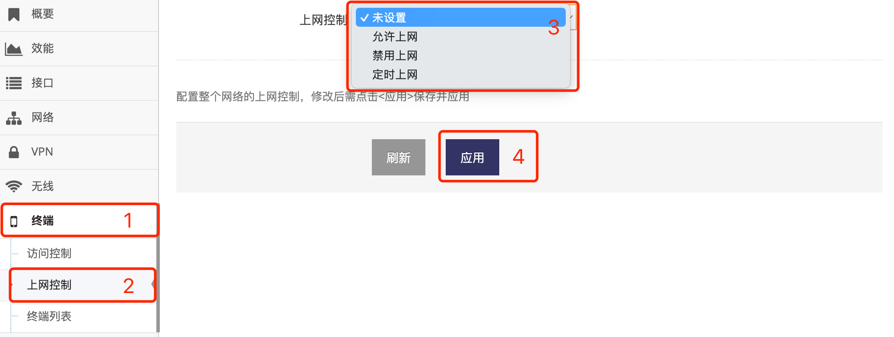
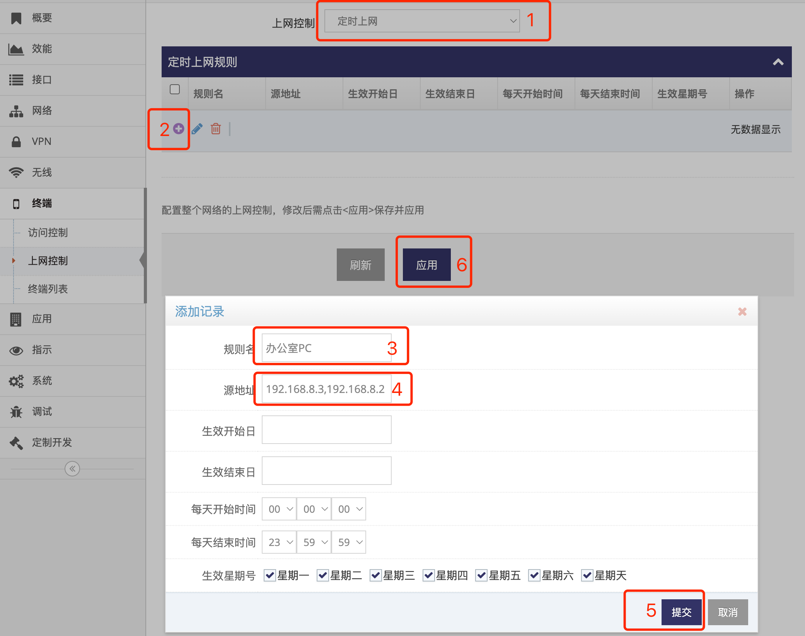
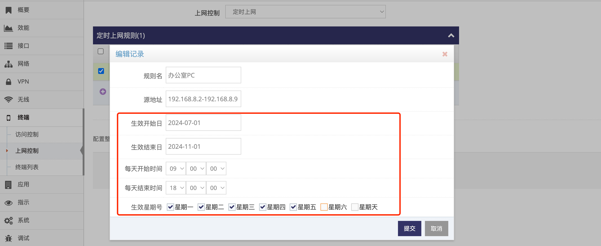

------
## 限制终端上网

### 上网的模式

- 点击 **红框1** **终端** 下的 **红框2** **上网控制** 菜单项进入互联网的的权限的设置界面
- 点击 **红框3** 中选择 **上网控制** 模式, 分为四种控制模式  
    - **未设置**, 即不对访问外网的终端数据做处理, 默认允许上网   
    - **允许上网**, 允许所有终端数据访问外网  
    - **禁用上网**, 丢弃所有访问外网的终端数据   
    - **定时上网**, 允许指定的终端数据访问外网, 并且可以指定时间段     

 

### 允许指定的终端访问外网   
- 点选 **红框1** 为 **定时上网** 时即可允许添加规则 
- 点击 **红框2** 将弹出添加规则的对话框   
- 在 **红框3** 中自定一个规则名
- 在 **红框4** **源地址** 中给出终端的IP地址
    - 多台终端IP地址以 **,号** 分隔
    - 也支持一个指定一个IP段, 起始地址与结束地址间使 **-号** 隔开即可
    - 也可以填写终端的MAC地址, MAC地址格式如 **00:03:7E:56:21:31**, 一个输入框中MAC地址不支持填写多个   
    
- 填写后点击 **红框5** 提交即可添加   

 

- 添加后规则后点击 **红框6** 应用即可   

### 允许指定的终端定时访问外网

在添加规则的对话框中选择生效的时间即可  

以上 **红框** 用于选择当前规则的生效时间, 示例中表示从 **2024年7月1号** 开始到 **2024年11月1号** 结束, 每 **周一二三四五** 的 **9点** 到 **18点** 允许上网
