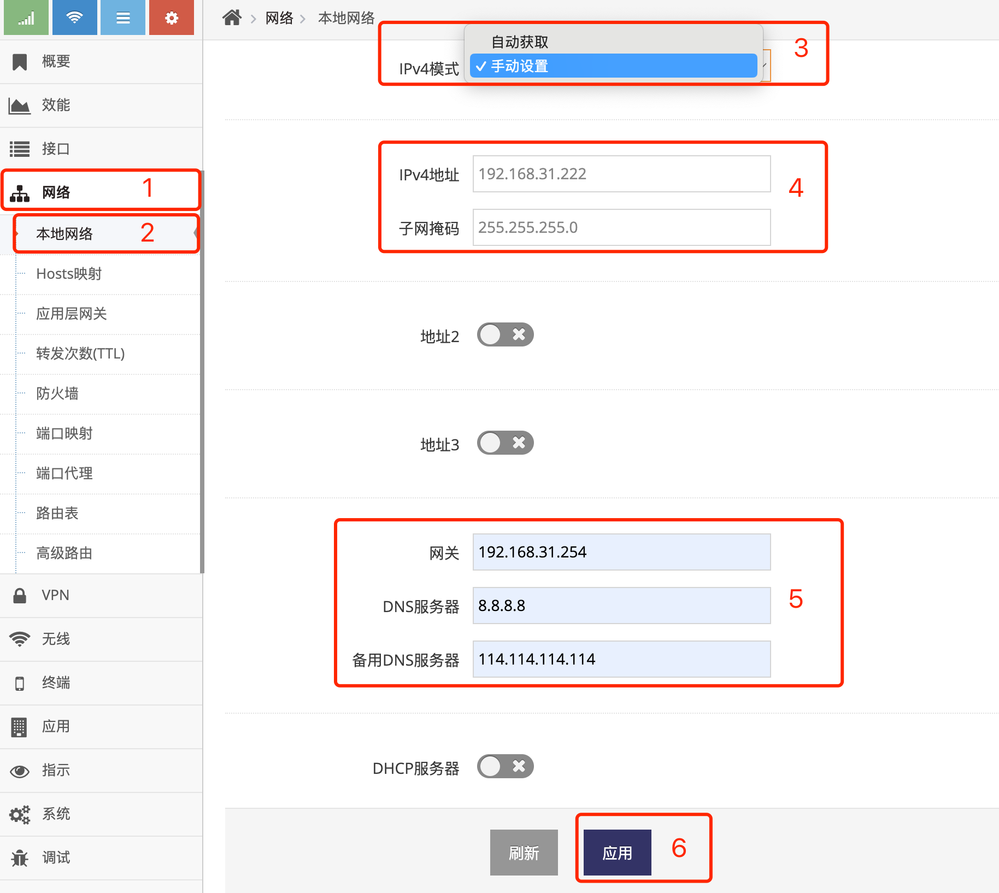
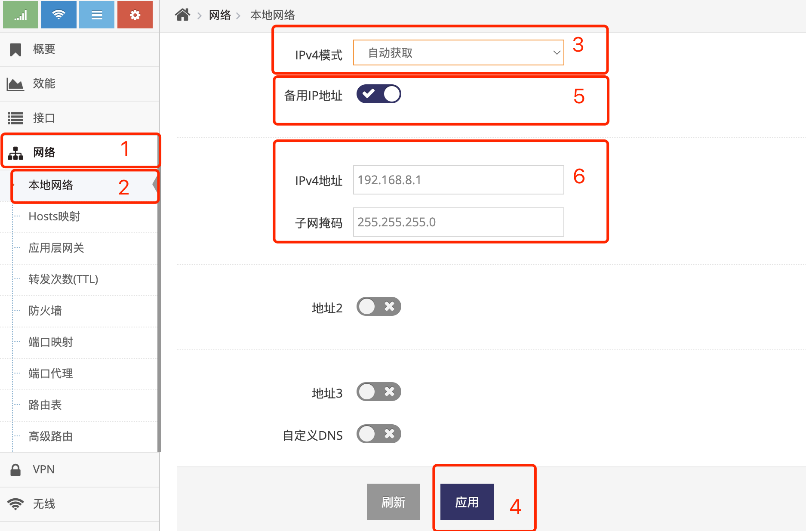

***

## 无线热点设置

无线热点模式下, 网关的表示与交换机一致, 即一个带有无线功能的交换机, 并且不会为接入的电脑及设备分配IP地址   
因此如要访问切换成 **无线热点** 模式的网关则必须手动设置IP地址

 

**Debug(电脑)** 实现对网关的管理与配置, 通过有线连接到网关, 手动设置IP地址为192.168.8.2, 访问网关(192.168.8.1)完成管理配置   
**User(电脑)** 模似正真的使用者, 通过 **无线**或 **有线** 连接到网关, IP地址设为自动获取, 可以获取到 **Router(上一级路由器)** 分配的地址, 并实现通过  **Router(上一级路由器)** 联网   

#### 1. 切换无线热点模式

- 点击 **红框1** **系统** 菜单下的 **红框2** **设备管理** 进入 **设备管理设置界面**   
- 点击 **红框3** **工作模式** 点选 **无线热点** 后, 提示需要重启点击 **确定** 等待网关重启完成即可   

 

在 **无线热点** 模式下, 网关的WAN/LAN口及无线都在同一个广播域, 在使用中WAN口与LAN口无区别   

#### 2. 使用无线或有线连接网关获取上一级路由器分配的地址

切换完成后, 即可通过手机电脑或设备使用 **无线** 或 **有线** 连接网关, IP地址设为自动获取, 连接成功后将获取到 **Router(上一级路由器)** 分配的IP地址, 并通过  **Router(上一级路由器)** 联网

#### 设置网关的地址

网关地址默认为192.168.8.1, 通过以下方式可以修改网关的地址, **但通常不建议修改**

- 点击 **红框1** 的 **网络** 菜单下的 **红框2** 的 **本地网络** 进入 **本地网络设置界面**

 

- 在 **红框3** 的 **IPv4地址** 填写要给网关设置的IP地址

- 在 **红框5** 的 **子网掩码** 填写要给网关设置的子网掩码

- 之后点击 **红框4** 应用后会提示重启, 重启后即需要以新的地址访问网关

#### 无线热点模式下设置网关通过静态IP地址联网

网关默认在无线热点模式下像交换机一样无法联网, 如需网关联网可为其设置可联网的IP地址及网关和域名服务器即可   
按以上联网示意图为其设置一个与上级路由器相同段的IP地址用于联网   

 

- 在 **红框3** 的 **IPv4模式** 选择 **手动设置**

- 在 **红框4** 的 **IPv4地址** 填写可以联网的IP地址

- 在 **红框4** 的 **子网掩码** 填写要子网掩码

- 在 **红框5** 的 **网关** 填写上一级路由器的地址

- 在 **红框5** 的 **DNS服务器** 填写可用的DNS服务器

- 之后点击 **红框6** 应用后会提示重启, 重启后即需要以新的地址访问网关, 同时网关也可以通过上一级路由器(192.168.31.254)实现联网

#### 无线热点模式下设置网关自动获取(DHCP)联网

当 **Router(上一级路由器)** 可以自动分配IP地址时, 可将路由器设置为自动获取(DHCP)来自动配置联网的信息

 

- 在 **红框3** 的 **IPv4模式** 选择 **自动获取**

- 之后点击 **红框4** 应用后会提示重启, 重启后网关将向上一级路由器获取IP地址

    - 在 **红框5** 的 **备用IP地址** 启用后, 在 **红框6** 中的IP地址在网关未成功获取到IP地址时使用, 当获取到IP后将立即弃用

## 无线热点的相关信息

**概要界面** 的 **本地网络** 中显示网关的地址信息及无线热点的状态

*通过在 **管理界面** 点击 **概要** 进入 **概要界面***

 

- 2为当前的 **本地网络** 的信息, 包含当前的 **IPv4地址**, **子网掩码**, **网关**, **域名服务器** 及 **MAC地址**

- 3为当前的 **无线网络** 的信息, 包含当前2.4G热点的 **名称**, **信道** 及 **BSSID**, 

- 如果设备有5.8G的热点也会在 **红框3** 中显示5.8G对应的 **名称**, **信道** 及 **BSSID**

