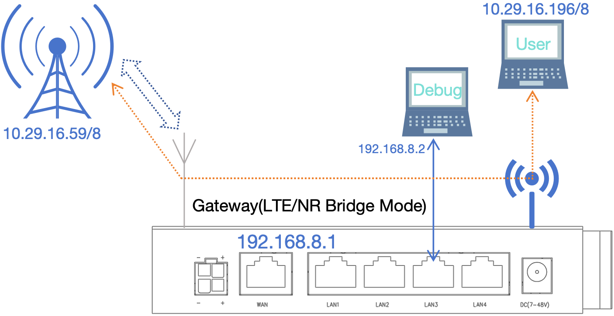
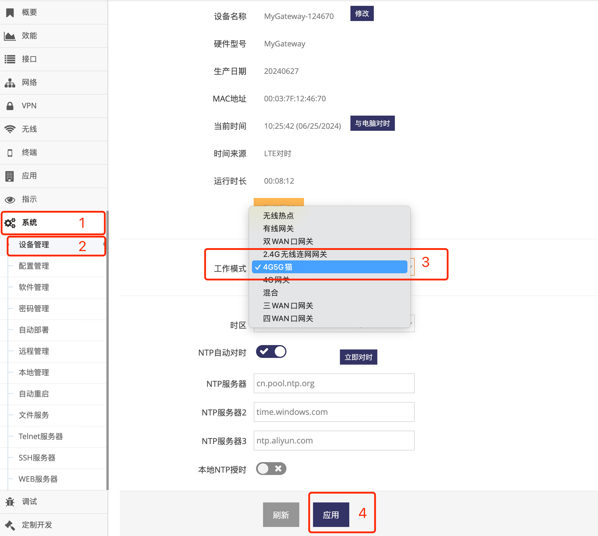
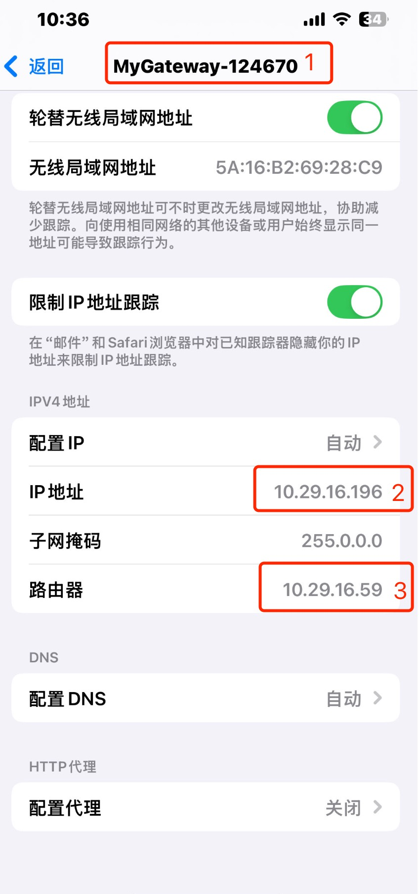
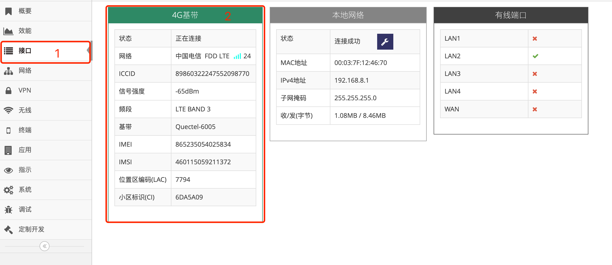

***

## 4G5G猫(Modem)设置

4G5G猫(Modem)下, 网关完成与LTE/NR网络的物理连接, 电脑或其它需要连网的设备连接网关通过自动获取(DHCP)可直接获取到LTE/NR网络分配的地址
因网关不会分配地址, 因此如要访问切换成 **4G5G猫(Modem)** 模式的网关则必须手动设置IP地址  

 

**Debug(电脑)** 实现对网关的管理与配置, 通过有线连接到网关, 手动设置IP地址为192.168.8.2, 访问网关(192.168.8.1)完成管理配置   
**User(电脑)** 模似正真的使用者, 通过 **无线**或 **有线** 连接到网关, IP地址设为自动获取, 可以获取到 **LTE/NR网络** 分配的地址, 并实现通过  **LTE/NR网络** 联网

#### 1. 切换4G5G猫(Modem)模式

- 点击 **红框1** **系统** 菜单下的 **红框2** **设备管理** 进入 **设备管理设置界面**   
- 点击 **红框3** **工作模式** 点选 **4G5G猫** 后, 提示需要重启点击 **确定** 等待网关重启完成即可

 

在 **4G5G猫** 模式下, 网关的WAN/LAN口及无线都在同一个广播域, 在使用中WAN口与LAN口无区别   

#### 2. 使用无线或有线连接网关获取LTE/NR网络地址

切换完成后, 即可通过手机电脑或设备使用 **无线** 或 **有线** 连接网关, IP地址设为自动获取, 连接成功后将获取到LTE/NR网络分配的IP地址, 并通过  **LTE/NR网络** 联网

 

**红框1** 显示手机连接了网关的SSID   
**红框2** 显示手机获取到了LTE/NR分配的IP地址   
**红框1** 显示手机的网关为LTE/NR出口的网关   

## 4G5G猫(Modem)模式下4G/5G基带的相关信息

在 **管理界面** 点击 **接口** 将会显示 **4G基带**(或**4G/5G基带**) 的所有状态信息

 

**红框2** 中显示所有 **4G基带**(或**4G5G基带**) 的信息, 当 **状态** 处理 **正在连接** 则表示网关已中继到LTE/NR网络, 其它设备可以连接网关实现联网

- **状态**, 正常网关会不同的阶段显示如下不同的状态:

    - **找到基带**, 表示找到了网关上安装的LTE/NR模块

    - **初始化**, 表示正在初始化LTE/NR模块

    - **检测SIM卡**, 正在查找网关上插入的SIM卡

    - **检测网络**, 表示正在检测当前LTE/NR网络

    - **检测信号**, 表示正在检测信号强度

    - **基带正常**, 表示LTE/NR模块及SIM卡都已找到, 硬件正常

    - **正在拨号**, 表示正在拨入互联网或VPDN网络

    - **重启基带**, 表示可能出现了故障, 网关正在尝试重置LTE/NR模块后再试

    - **正在连接**, 表示已成功加接到LTE/NR网络, 正在等待其它设备连接

    - **离线**, 连接被手动断开或暂时因为网络问题离线, 网关通常间隔一段时间会恢复, 或是无法恢复时会显示具体的异常的信息

    - **未连接**, 连接被手动断开或暂时因为网络问题离线, 网关通常间隔一段时间会恢复, 或是无法恢复时会显示具体的异常的信息

    而在出现异常是会显示如下信息:

    - **无信号**, 即当前环境没有LTE/NR信号

    - **无基带**, 网关未安装的LTE/NR模块或安装的LTE/NR模块出现故障

    - **IMEI错误**, 网关启用了锁LTE/NR模块的功能, 而且原锁定的LTE/NR模块已被更换

    - **PIN码**, 网关有PIN码而网关未配置PIN码

    - **PIN码错误**, PIN码错误

    - **无SIM卡**, 网关未插SIM卡或SIM卡出现故障, 可尝试断电后重新拨插SIM卡后再上电重试

    - **IMSI错误**, 网关启用了锁SIM卡的功能, 而且原锁定的SIM卡已被更换

    - **未注册**, 出现这个提示可等待5到10分钟再看, 如一直无法恢复则表示当前LTE/NR网络环境差无法注册或SIM卡未充值, 或运营商限制了网关接入

    - **拒绝注册**, 出现这个提示可等待5到10分钟再看, 如一直无法恢复则表示当前LTE/NR网络环境差无法注册或SIM卡未充值, 或运营商限制了网关接入

- **网络** 中显示 **运营商** , **网络类型** 及搜索到的 **信号格数**, **运营商**在中国通常显示 中国电信, 中国联系, 中国移动等信息

    - **网络类型**, 也就是网络制式, 可分为2G, 3G, 4G网络, 2G通常会显示有GSM, GPRS, EDGE, CDMA等关键字, 3G通常会显示WCDMA, EVDO, TDSCDMA, HSPA, HSDPA, HSUPA等关键字, 4G通常会显示LTE, FDD, TDD等关键字, 5G通常会显示NR, SA, NSA等关键字

    - **信号格数** 分为4格, 格数越高表示信息越强, 可供用户直观的了解当前的信号强度

    - **信号格数** 后面是 **CSQ** 的值, 通常取值范围为1-31, 数值越大信号越好

- **ICCID** 中显示为当前SIM卡的 **ICCID号**, 如果未插SIM卡将不显示内容

- **信号强度** 的取值范围为-113dBm到-53dBm, 数值越大信号越好, 如有RSRP还会在之后显示 **RSRP**, 取值范围为-140dBm到-44dBm, 数值越大信号越好

- **IMEI号** 为当前模组的IMEI号, 当网关未安装LTE/NR模组时不显示内容

