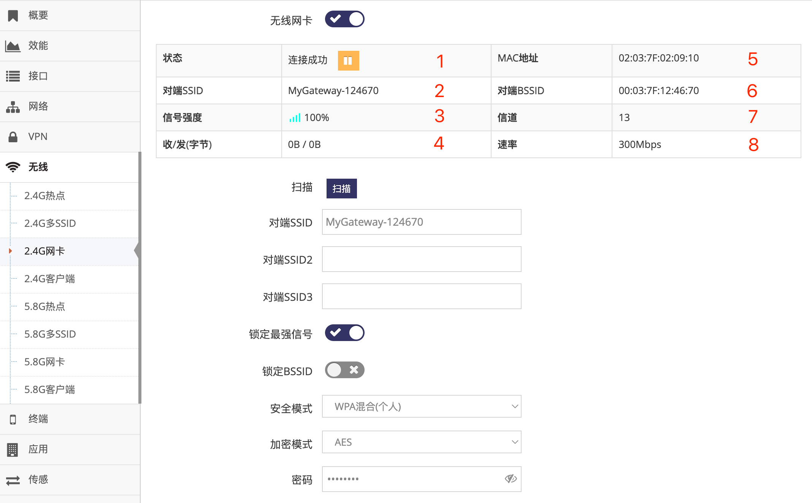

***

## 中继其它热点的设置

在非无线连网模式下都可以设置网关的 **无线网卡** 连接到其它的SSID实现中继功能, 以下示例在无线热点模式下实现中继功能

 

**Debug(电脑)** 通过有线连接到网关, 手动设置IP地址为192.168.8.2, 用于访问无线热点模式下的网关(192.168.8.1), 实现对网关的配置管理, 以下设备都通过此电脑完成
**User(电脑)** 模似正真的使用者, 通过 **无线** 或 **有线** 连接到网关, 地址设为自动获取, 可以获取到 **Router(上一级路由器)** 分配的地址, 并实现通过  **Router(上一级路由器)** 联网

#### 1. 切换无线热点模式

- 点击 **红框1** **系统** 菜单下的 **红框2** **设备管理** 进入 **设备管理设置界面**   
- 点击 **红框3** **工作模式** 点选 **无线热点** 后, 提示需要重启点击 **确定** 等待网关重启完成即可   

 

在 **无线热点** 模式下, 网关的WAN/LAN口及无线都在同一个广播域, 在使用中WAN口与LAN口无区别   

#### 2. 设置无线网卡中继其它热点

- 点击 **红框1** **无线** 菜单下的 **红框2** **2.4G网卡**(或**5.8G网卡**) 进入 **2.4G网卡设置界面**(或**5.8G网卡设置界面**)

 

- 点击 **红框3** 打开无线网卡功能

- 点击 **红框4** 的 **扫描** 后, 弹出当前附近的SSID列表, 点击对应SSID前 **红框A** 的 **选择** 后会将SSID信息自动填入 **红框5** 及 **红框7** 中, 然后用户只需在 **红框7** 中的 **密码** 栏填写密码即可

 

- 也可以直接在 **红框5** 中填入要连接的 **SSID名称** 并在 **红框7** 中填写对应的 **安全模式** **加密模式**及 **密码**, 必须要填写正确否则将无法连接   

- 之后点击 **红框8** 应用即可   

- 正常等待1分钟右左即可在 **红框9** 显示连接成功后获取到的 **对端BSSID**   

    - **红框10** 用于填写多个安全方式完全相同的SSID, 网关将连接他们之中的SSID   
    - **红框6** 用于锁定最强信号, 当连接的SSID有多个设备或连接多个SSID时(红框5)时必须点选   
    - **红框B** 用于当热点列表中未显示对应的SSID时可点 **重新扫描** 直到能显示需要连接的SSID   

#### 3. 使用无线或有线连接网关获取上一级路由器分配的地址

切换完成后, 即可通过手机电脑或设备使用 **无线** 或 **有线** 连接网关, IP地址设为自动获取, 连接成功后将获取到 **Router(上一级路由器)** 分配的IP地址, 并通过  **Router(上一级路由器)** 联网

**注意: 某些上一级路由器会限制中继功能, 不为中继后的电脑分配IP地址, 这种情况下只能手动设置IP地址**

#### 无线热点模式下设置网关通过静态IP地址联网

网关默认在无线热点模式下像交换机一样无法联网, 如需网关联网可为其设置可联网的IP地址及网关和域名服务器即可   
按以上联网示意图为其设置一个与上级路由器相同段的IP地址用于联网   

 

- 在 **红框3** 的 **IPv4模式** 选择 **手动设置**

- 在 **红框4** 的 **IPv4地址** 填写可以联网的IP地址

- 在 **红框4** 的 **子网掩码** 填写要子网掩码

- 在 **红框5** 的 **网关** 填写上一级路由器的地址

- 在 **红框5** 的 **DNS服务器** 填写可用的DNS服务器

- 之后点击 **红框6** 应用后会提示重启, 重启后即需要以新的地址访问网关, 同时网关也可以通过上一级路由器(192.168.31.254)实现联网

#### 无线热点模式下设置网关自动获取(DHCP)联网

当 **Router(上一级路由器)** 可以自动分配IP地址时, 可将路由器设置为自动获取来自动配置联网的信息

 

- 在 **红框3** 的 **IPv4模式** 选择 **自动获取**

- 之后点击 **红框4** 应用后会提示重启, 重启后网关将向上一级路由器获取IP地址

    - 在 **红框5** 的 **备用IP地址** 启用后, 在 **红框6** 中的IP地址在网关未成功获取到IP地址时使用, 当获取到IP后将立即弃用

## 中继的网卡相关信息

在 **2.4G网卡设置界面**(或**5.8G网卡设置界面**) 的上面首先会显示当前网卡连网的基本状态

*通过在 **管理界面** 点击 **无线** 菜单下的 **2.4G网卡**(或**5.8G网卡**) 进入*

 

- 1为当前的 **网络状态**, 正常网关会不同的阶段显示如下不同的状态:

    - **正在连接**, 表示正在拨号

    - **连接成功**, 表示已成功连接

    - **未连接**, 连接被手动断开或暂时因为网络问题离线, 网关通常间隔一段时间会恢复

- 2为当前连接的 **SSID**

- 3为当前SSID的 **信号强度**

- 4为当次连接累计的 **收发字节**, 出现重新连接时会清零( MTK方案中此收发字节不统计将始终为0 )

- 5为当前的无线网卡的 **MAC地址**

- 6为当前连接的 **BSSID**, 即连接SSID设备的MAC地址

- 7为当前连接的SSID的 **信道**

- 8为当前连接的SSID理论最大 **速率**

