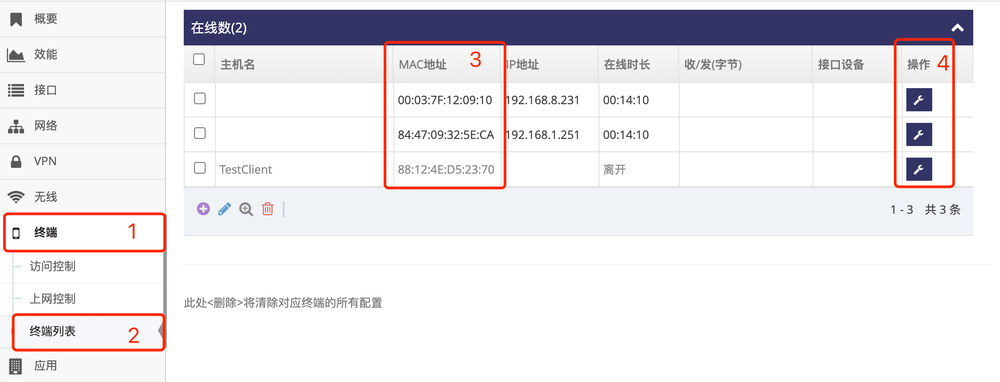

***

## 为终端分配指定的IP地址   

默认电脑或是设备连上网关后, 网关会随机分配 **[本地网络分配地址段](../lan/dhcps_cn.md)** 中的配置 **地址池** 中的地址   

通过如下设置可为电脑或是设备分配指定的IP地址, 前提是必须知道电脑或是设备的 **MAC地址**   

- 点击 **红框1** **终端** 菜单下的 **红框2** **终端列表** 进入 **终端列表管理界面**   

   
 
- 查看 **红框3** 列表, 确认设备是否存在, 如果不存在执行以下操作添加   

    - 如果不在则点击 **红框4** **加号** 添加, 点击后会弹出添加窗口   
     
    - 在添加窗口中 **红框1** 可选输入设备的 **主机名**   
    - 在添加窗口中 **红框1** 输入设备的 **MAC地址** 提交即可添加   

   

- 点击设备所在行 **红框1** **小扳手** 进点对应的 **终端设置界面**   

 

- 点击 **红框1** 启用 **分配IP地址**   
- 在 **红框2** **IP地址** 输入要设备分本的IP地址   
- 在 **红框2** **租期(秒)** 指定租期, 空则使用 **[本地网络分配地址段](../lan/dhcps_cn.md)** 中配置的 **租期**   
- 之后点击 **红框3** 应用即可   
