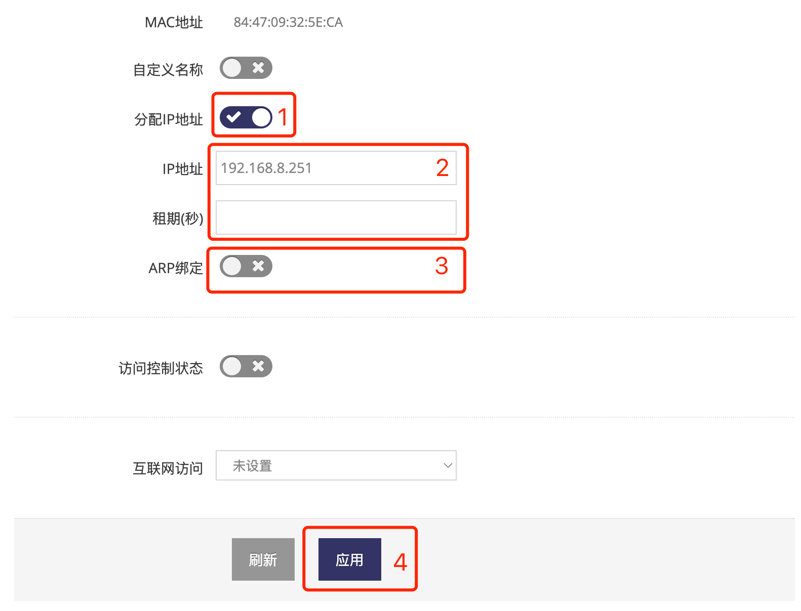
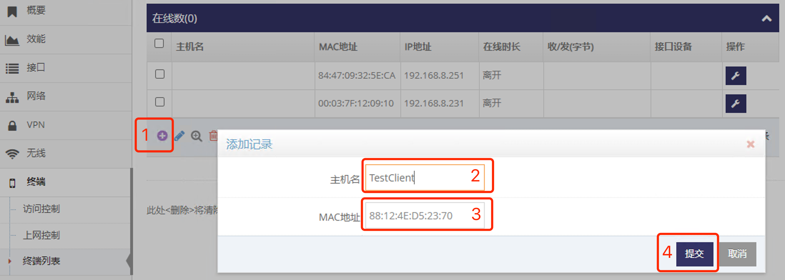

***

## 为终端分配(绑定)指定的IP地址   

默认电脑或是设备连上网关后, 网关会随机分配 **[本地网络分配地址段](../lan/dhcps_cn.md)** 中的配置 **地址池** 中的地址   
通过如下设置可为电脑或是设备分配指定的IP地址, 前提是必须知道电脑或是设备的 **MAC地址**   

### 为已连接网关的设备指定IP地址   
- 点击 **红框1** **终端** 菜单下的 **红框2** **终端列表** 进入 **终端列表管理界面**   
- 查看 **红框3** 列表中找到设备对应的MAC地址所在的行   
   
- 点击对应设备所在行 **红框4** **小扳手** 进点对应的 **终端设置界面**   

   
- 点击 **红框1** 启用 **分配IP地址**   
- 在 **红框2** **IP地址** 输入要设备分本的IP地址   
- **红框2** **租期(秒)** 指定租期, 空则使用 **[本地网络分配地址段](../lan/dhcps_cn.md)** 中配置的 **租期**   
- **红框3** **ARP绑定** 选择是否开启ARP绑定, **绑定后对应的IP不是当前MAC则无法通信**   
- 之后点击 **红框3** 应用即可   

**添加后通过设备不会立马改变IP地址, 需要断开设备与网关的连接后重新连接即可**

### 为未连接网关的设备指定IP地址   

- 未连接网关的设备在 **终端列表管理界面** 无法看到, 需要先添加设备的MAC地址, 点击 **红框1** **加号** 添加, 点击后会弹出添加窗口   
   
- 在添加窗口中 **红框2** 可选输入设备的 **主机名**   
- 在添加窗口中 **红框3** 输入设备的 **MAC地址** 后点击 **红框4** 提交即可
   
- 然后在 **终端列表管理界面** 可以看到新添加的设备
- 之后就可以按 **为已连接网关的设备指定IP地址** 方法为设备指定IP地址   
