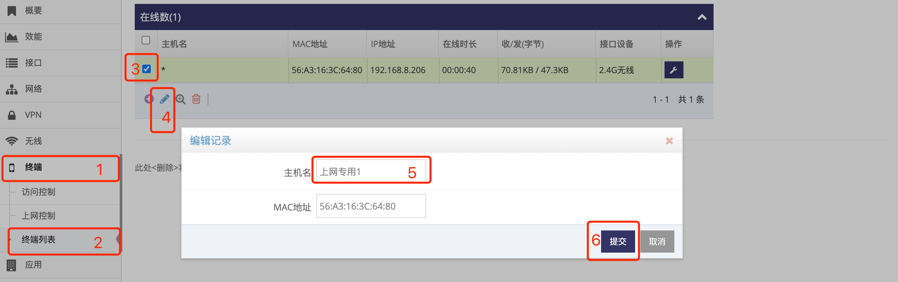

***

## 为终端自定义名称   

默认电脑或是设备连上网关后, 会上报设备的主机名   

通过如下设置可为电脑或是设备备注一个主机名, 前提是必须知道电脑或是设备的 **MAC地址**   

- 点击 **红框1** **终端** 菜单下的 **红框2** **终端列表** 进入 **终端列表管理界面**   
   
- 找到电脑或设备对应的行, 点击 **红框3** 选择此电脑或设备   
- 然后点击 **红框4** 编辑弹出对话框后在 **红框5** 的主机名中输入新的主机名, 主机名不允许有特殊符及空格   
- 之后点击 **红框6** 提交即可   
