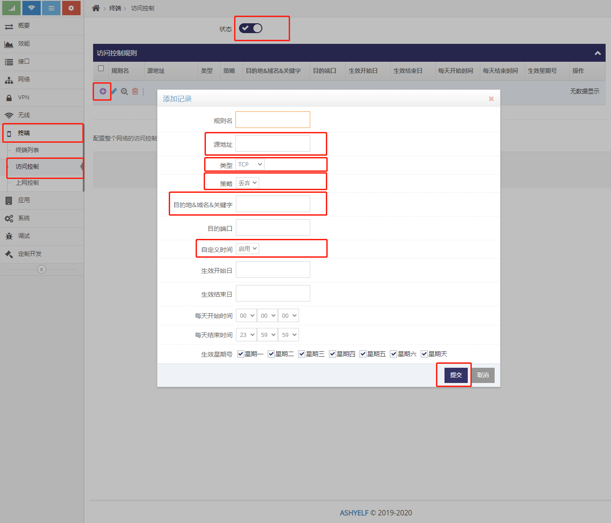
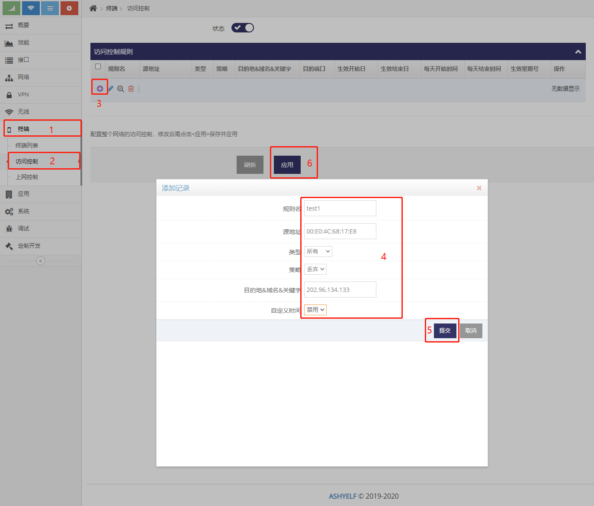
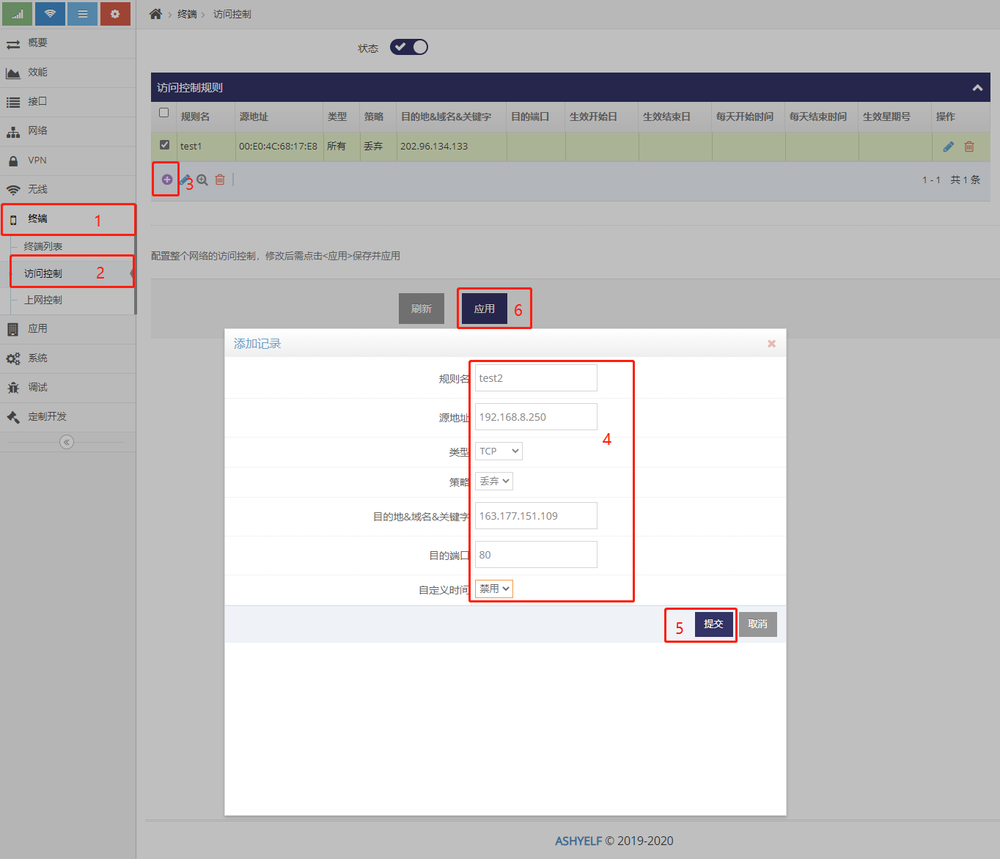
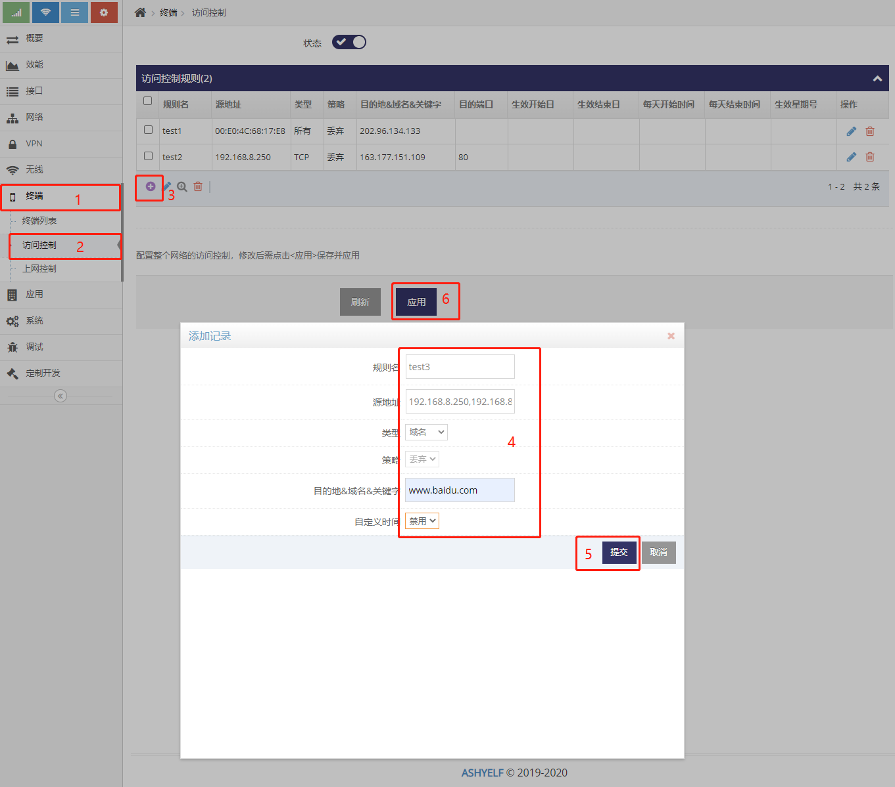
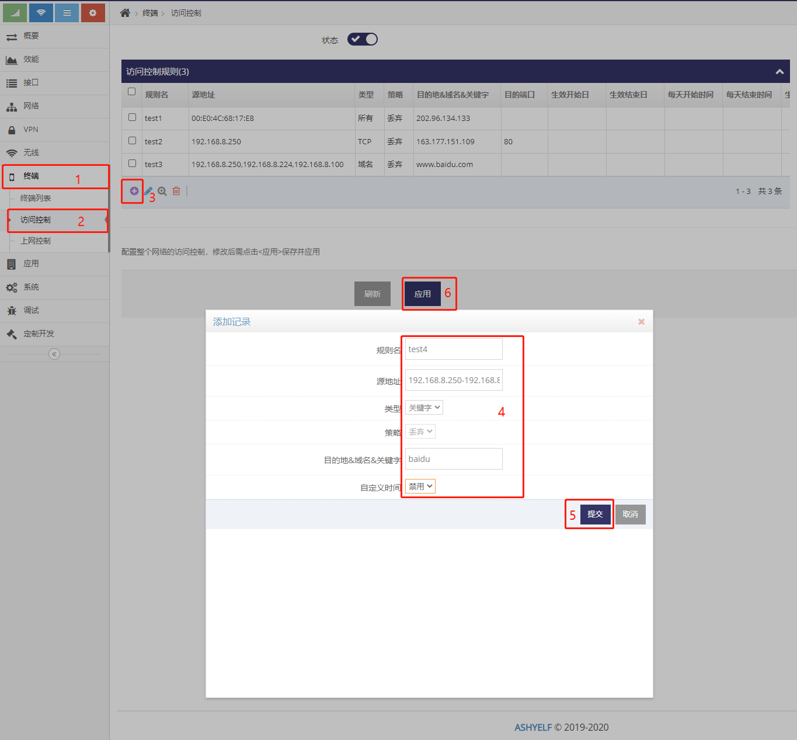

------
## 客户端访问控制

#### 客户端访问控制的几种方式
1. 通过 **访问控制** 实现对客户端访问互联网的目的地或内容进行管控
2. 通过 **上网控制** 实现对客户端访问互联网的权限或时间进行管控
3. 通过 **访问控制** 及 **上网控制** 实现白名单式的管控
4. 通过 **访问控制** 及 **上网控制** 实现黑名单式的管控
5. 通过 **终端列表** 中对指定的客户端访问互联网及访问互联网的目的地或内容的单独管控

#### 对客户端访问互联网的目的地或内容进行管控

- 点击 **终端** 下的 **访问控制** 菜单项进入访问控制的管理界面, 在此界面中可以点击启用后添加规则来管控局域网客户端对互联网目的地及内容的访问
 

- 添加规则时,  **源地址** 用于指定此规则适用于局域网哪些客户端: 
    1. 当规则只针对局域网某台设备时， 可以填写此设备的MAC地址
    2. 当规则只针对局域网某台设备时， 也可以填写此设备的IP地址(但IP地址为动态分配时为易变信息，可以**终端管理**中为其分配固定的IP地址)
    3. 当规则针对局域网多台设备时, 可填写多台设备的IP地址(以逗号分隔)
    4. 当规则针对局域网多台设备时且设备为连续的IP地址时, 可填写多台设备的IP地址段(起始地址-结束地址)
- 添加规则时,  **类型** 用于指定限制客户端访问的内容:
    1. TCP表示只针对TCP协议， 选择此类型后还需要填写对应的TCP目的端口
    2. UDP表示只针对UDP协议， 选择此类型后还需要填写对应的UDP目的端口
    3. 所有表示针对所有协议， 选择此类型后还可以填写对应的目的地址, 不填写表示所有目的地址
    4. 域名表示规则用于限制**域名**， 选择此类型后还需要在 **目的地&域名&关键字** 栏填写对应的域名
    5. 关键字表示规则用于限制 **关键字**， 选择此类型后还需要在 **目的地&域名&关键字** 栏填写对应的关键字
- 添加规则时,  **策略** 指定对于符合当前规则的访问的处理
    1. 丢弃表示禁止符合当前规则的访问
    2. 通过表示允许符合当前规则的访问
    3. 返回表示不再参于之后其它访问控制规则的匹配
- 添加规则时,  **自定义时间** 可以指定一个生效的时间段

###### 示例， 添加规则禁示MAC地址为00:E0:4C:68:17:E8的客户端访问互联网地址202.96.134.133
 
###### 示例， 添加规则禁示IP地址为192.168.8.250的客户端访问互联网地址163.177.151.109的TCP的80端口
 
###### 示例， 添加规则禁示IP地址为192.168.8.250, 192.168.8.224, 192.168.8.100的三个客户端访问www.baidu.com域名
 
###### 示例， 添加规则禁示IP地址为192.168.8.250至192.168.8.254的之间的客户端访问中带有baidu的关键字
 

 #### 对客户端访问互联网的的权限或时间进行管控

 - 点击 **终端** 下的 **上网控制** 菜单项进入互联网的的权限的管理界面, 在此界面中可以点选是否允许所有客户端上网或禁示所有客户上网或指定客户端定时上网
 

- 上网控制模式: 
    1. **未设置**, 表示不做任何管控, 默认允许上网
    2. **允许上网**， 表示默认在访问控制
    3. 当规则针对局域网多台设备时, 可填写多台设备的IP地址(以逗号分隔)
    4. 当规则针对局域网多台设备时且设备为连续的IP地址时, 可填写多台设备的IP地址段(起始地址-结束地址)
- 添加规则时,  **类型** 用于指定限制客户端访问的内容:
    1. TCP表示只针对TCP协议， 选择此类型后还需要填写对应的TCP目的端口
    2. UDP表示只针对UDP协议， 选择此类型后还需要填写对应的UDP目的端口
    3. 所有表示针对所有协议， 选择此类型后还可以填写对应的目的地址, 不填写表示所有目的地址
    4. 域名表示规则用于限制**域名**， 选择此类型后还需要在 **目的地&域名&关键字** 栏填写对应的域名
    5. 关键字表示规则用于限制 **关键字**， 选择此类型后还需要在 **目的地&域名&关键字** 栏填写对应的关键字
- 添加规则时,  **策略** 指定对于符合当前规则的访问的处理
    1. 丢弃表示禁止符合当前规则的访问
    2. 通过表示允许符合当前规则的访问
    3. 返回表示不再参于之后其它访问控制规则的匹配
- 添加规则时,  **自定义时间** 可以指定一个生效的时间段