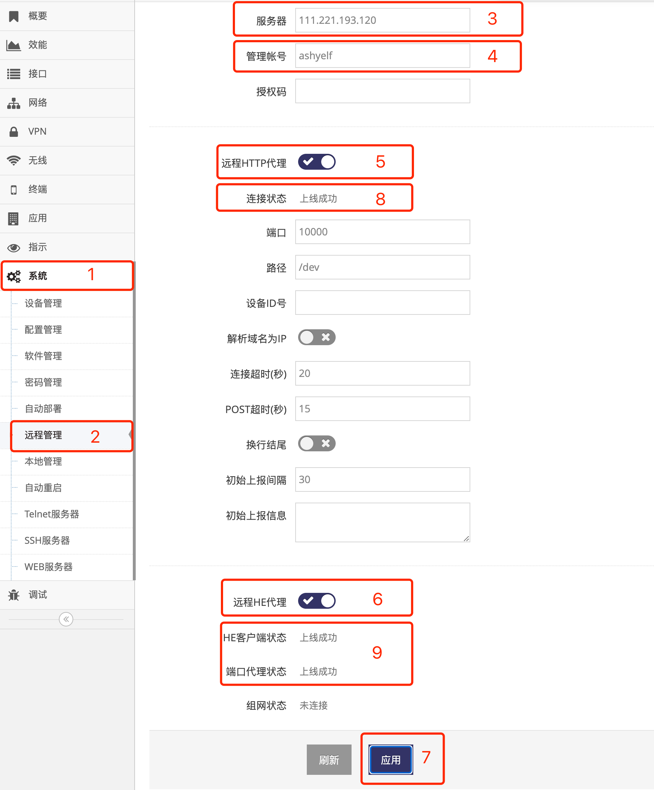
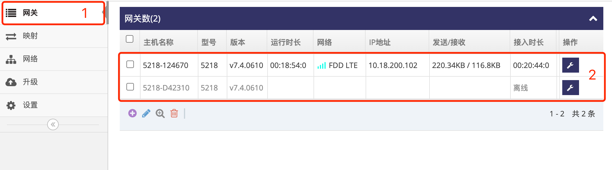

# 将网关接入网关管理平台

## 首先在网关管理平台中添加用户帐号

- 如果无 **管理员网页界面** 的访问权限则需要与 **网关管理平台** 的管理员申请用户帐号   
- 如果有 **管理员网页界面** 的帐号及密码则可查看 **[用户帐号的添加](./cloud/add_user_cn.md)** 来添加用户帐号  

## 然后设置网关接入到指定用户帐号

通过登录网关的 **管理界面**(默认网关的IP地址为192.168.8.1, 连上网关后打开浏览器在地址栏输入 http://192.168.8.1 回车即可)   
- 点击 **红框1** **系统** 菜单下的 **红框2** **远程管理** 进入 **远程管理设置界面**   
- 在 **红框3** **服务器** 输入网关管理平台的地址, 示例为 **111.221.193.120**   
- 在 **红框4** **管理帐号** 输入要接入的用户帐号, 示例为 **ashyelf**  
- 点击 **红框5** 打开远程HTTP代理   
- 点击 **红框6** 打开远程HE代理   
- 点击 **红框7** 的 **应用** 即可   
   
等待个十几秒后网关将成功连接到 **网关管理平台**   

- 在 **红框8** 的连接状态会显示 **上线成功**, 表示网关已成功连接   
- 在 **红框9** 的HE客户端状态会显示 **上线成功**, 表示网关的HE指令客户端也已成功连接   
- 在 **红框9** 的端口代理状态会显示 **上线成功**, 表示内网穿透功能也处于可用状态  

## 登录网关管理平台的用户帐号网页界面   

使用IE访问 **网关管理平台**(Ubuntu) 地址的9000端口即可打开对应的登录界面   
   
- 输入刚添加的帐号: ashyelf, 及对应的密码, 点击 **红框4** 即可登录 **用户帐号网页界面**   

#### 1. 查看在线网关列表

- 点击 **红框1** 的 **网关** 即可显示此用户帐号下所有在线或是未在线的网关   
   

#### 2. 进入指定网关总览界面

- 点击 **红框1** 的 网关列表中对应的 **网关** 后的 **小扳手** 进入指定的 **网关总览界面**   
   
- 在 **网关总览界面** 中的 **红框1** 会显示此网关的基本信息, 包括 **标识**, **版本号**, **工作模式**, **联网信息等**   
- 点击 **网关总览界面** 中的 **红框2** **系统重启** 可直接重启网关   
- 点击 **网关总览界面** 中的 **红框3** **配置更改** 可直接打网关管理界面, 在此界面中可实时查看网关状态, 修改网关配置等   
- 点击 **网关总览界面** 中的 **红框4** **终端** 可直接打开网关的终端命令行界面   
- 点击 **网关总览界面** 中的 **红框4** **网页** 可直接打开网关的WEB界面   
   

