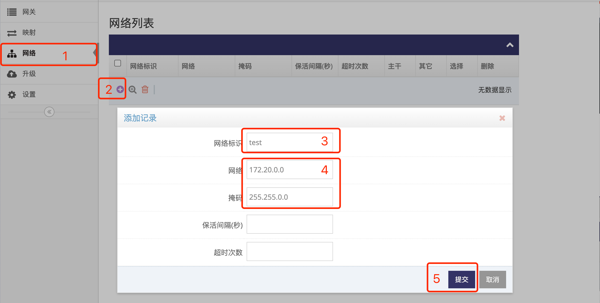

# 在网关管理平台中添加自组网  

### 1. 登录网关管理平台的用户帐号网页界面   

使用IE访问 **网关管理平台**(Ubuntu) 地址的9000端口即可打开对应的登录界面   
   
- 输入用户帐号, 示列为: ashyelf, 及对应的密码, 点击 **红框4** 即可登录 **用户帐号网页界面**   

### 2. 添加一个自组网  

- 点击 **红框1** **网络** 进入 **网络管理界面**    
   
- 点击 **红框2** 的 **加号** 弹出添加记录窗口   
- 在 **红框3** 中输入 **网络标识**, 示例中添加的用户名为 **test**, 网络标识只允许英文字母和数字   
- 在 **红框4** 中输入此网络的网段, 即 **网络** 和对应的 **掩码**, 示列中为 **172.20.0.0** 及 **255.255.0.0**      
- 点击 **红框5** 的 **提交** 即完成一个自组网的添加, 自组网添加后即可向自组网中添加网关实现组网   

