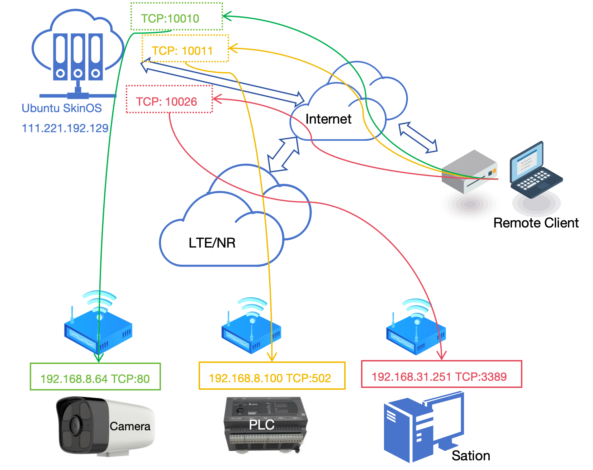
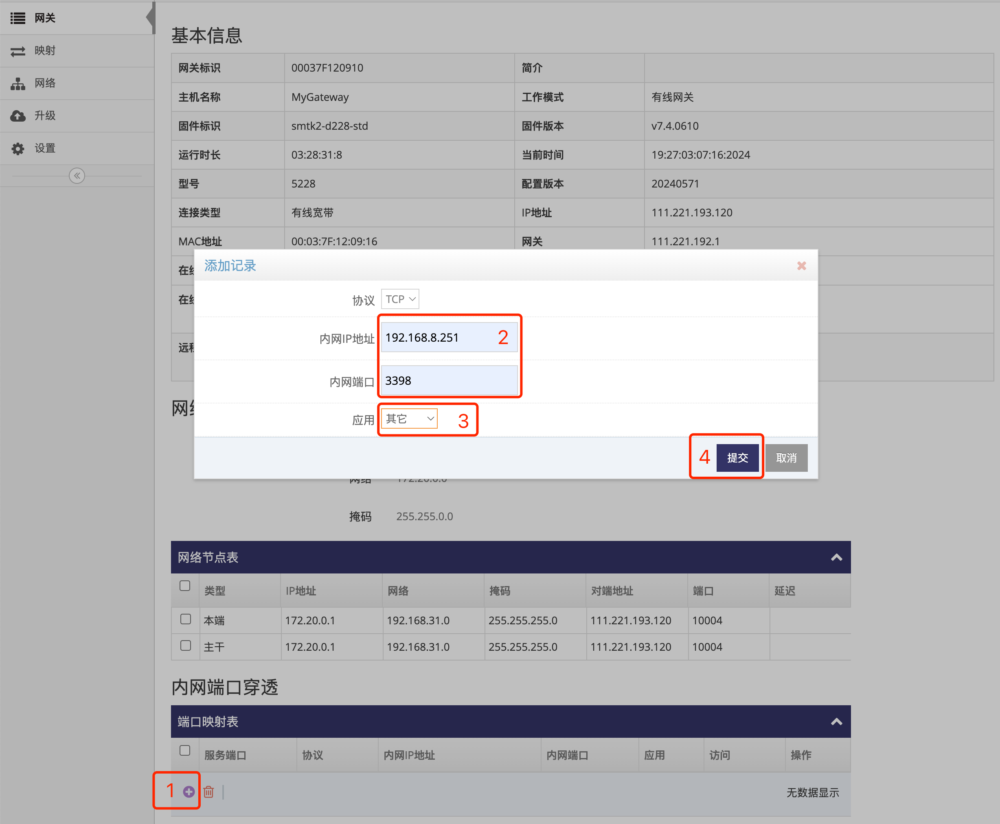
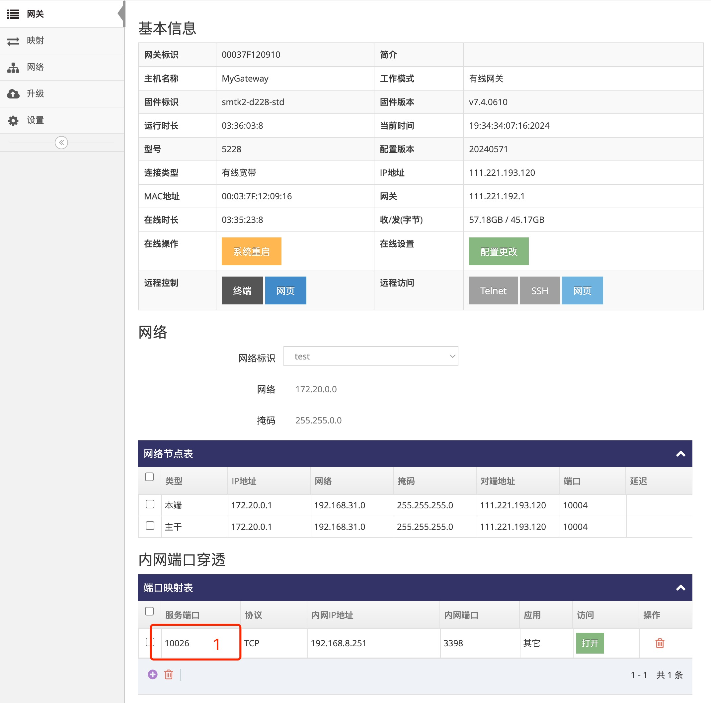

# 在网关管理平台中添加TCP端口内网穿透  

图示了三条内网穿透的映射
- 将 **网关管理平台(111.221.192.129)**  的TCP端口 **10010** 映射到一个网关下的 **摄象头((192.168.8.64)** 的TCP端口 **80** 
- 将 **网关管理平台(111.221.192.129)**  的TCP端口 **10011** 映射到另一个网关下的 **PLC((192.168.8.100)** 的TCP端口 **502** 
- 将 **网关管理平台(111.221.192.129)**  的TCP端口 **10026** 映射到另一个网关下的 **工作站((192.168.31.251)** 的TCP端口 **3389**, 以下示列也是添加此内网穿透规则 

   

### 1. 登录网关管理平台的用户帐号网页界面   

使用IE访问 **网关管理平台**(Ubuntu) 地址的9000端口即可打开对应的登录界面   
   
- 输入用户帐号, 示列为: ashyelf, 及对应的密码, 点击 **红框4** 即可登录 **用户帐号网页界面**   

### 2. 进入需要添加内网穿透的网关总览界面  

- 点击 **红框1** 的 **网关** 即可显示此用户帐号下所有在线或是未在线的网关   
   
- 点击需要需要添加内网穿透的网关对应行的 **红框2** **小扳手** 进入对应的 **网关总览界面**  

### 3. 添加一个TCP端口映射  

- 点击 **红框1** 添加弹出添加记录对话框      
   
- 在 **红框2** 中输入网关下需要TCP端口穿透的设备及以对应的端口
- 在 **红框3** 选择应用类型, 当选为 **TELENT** 或 **SSH** 及 **HTTP** 时在添加成功后对应的 **打开** 按键会使用对应的应用来打开此端口, 如果不需要此功能则选择 **其它** 即可
- 填好后点击 **红框4** 的 **提交** 即可   
- 成功添加后会在 **内网端口穿透** 表中给出对应的服务端口   
   
- 以上 **红框1** 即是映射后的服务端口, 示列为10026, 即访问 **网关管理平台** 的 **10026** 即等于访问到了此网关下 **192.168.8.251** 设备的 **3389** 端口  