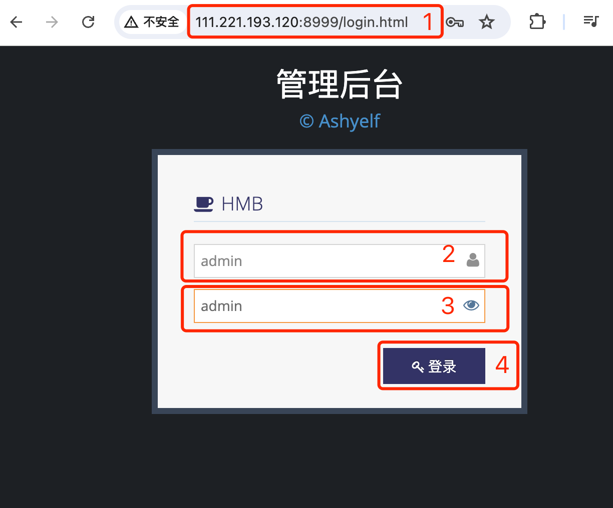
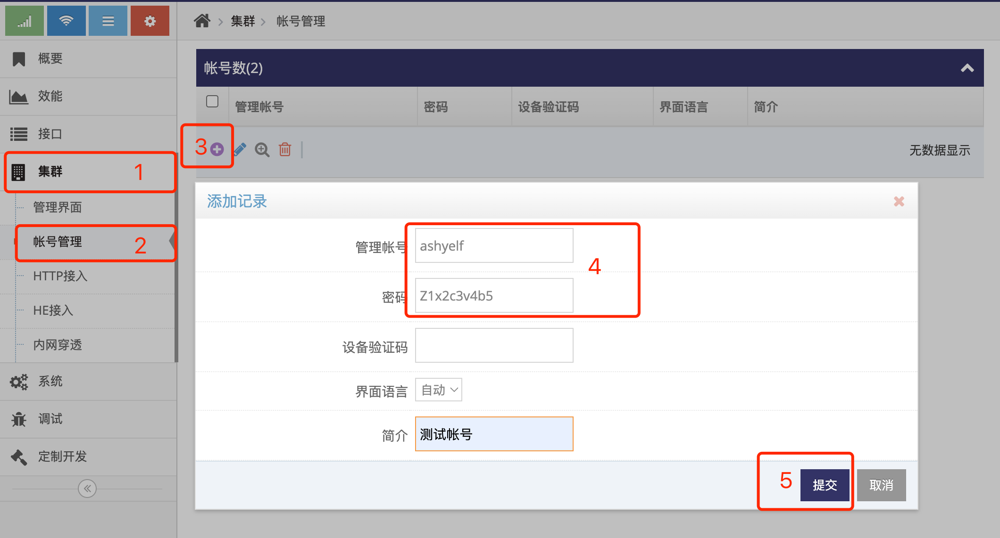

# 在云管理中添加用户帐号

### 1. 登录云管理的管理员网页界面   
使用IE访问 **云管理**(Ubuntu) 地址的8999端口即可打开对应的登录界面   
   
默认用户名: admin, 默认密码: admin, 点击 **红框4** 即可登录 **管理员网页界面**    

### 2. 添加用户帐号   
- 点击 **红框1** **集群** 菜单下的 **红框2** **帐号管理** 进入 **帐号管理界面**    
   
- 点击 **红框3** 的 **加号** 弹出添加记录窗口   
- 在 **红框4** 的 **管理帐号** 填写用户名(**只支持英文加数字**), 示例中添加的用户名为 **ashyelf**   
- 在 **红框4** 的 **密码** 填写密码, 使用用户名及密码可登录用户帐号网页界面对网关进行管理   
- 点击 **红框5** 的 **提交** 即完成用户的添加   

