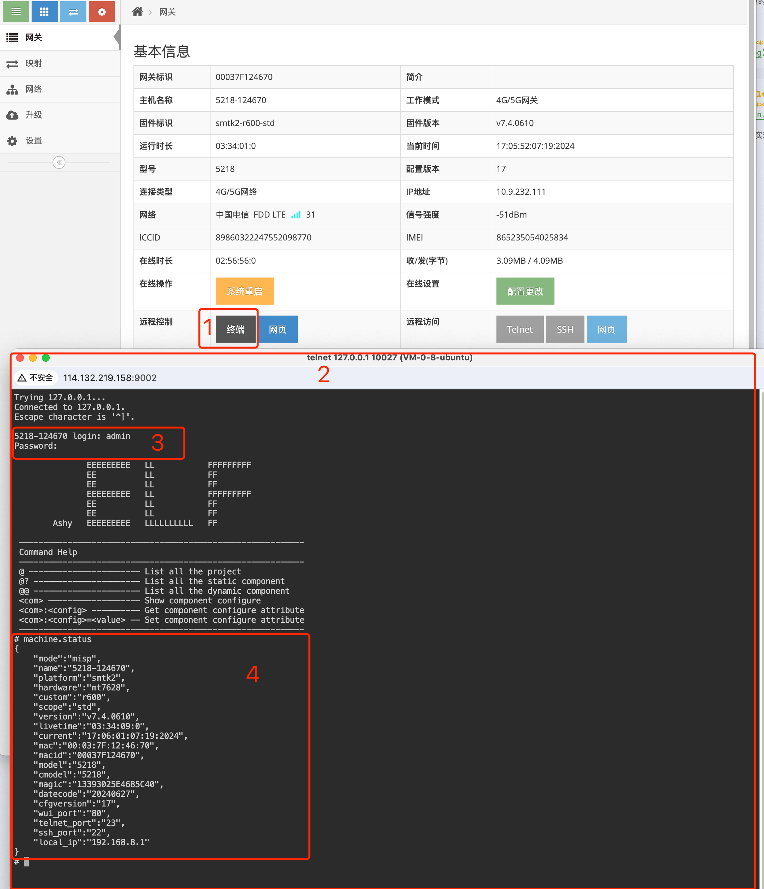

# 远程访问网关的终端命令行

###  1. 登录网关管理平台的用户帐号网页界面   

使用IE访问 **网关管理平台**(Ubuntu) 地址的9000端口即可打开对应的登录界面   
   
- 输入刚添加的帐号: ashyelf, 及对应的密码, 点击 **红框4** 即可登录 **用户帐号网页界面**   

### 2. 进入指定网关总览界面

- 在 **网关列表界面** 点击 **红框1** 的 网关列表中对应的 **网关** 后的 **小扳手** 进入指定的 **网关总览界面**   
   
 
### 3. 远程访问网关的终端命令行

- 点击 **网关总览界面** 中的 **红框1** **终端** 后会直接弹出 **红框2** **终端命令行** 的登陆界面   
- **红框3** 示例输入用户名及密码后即可进入 **终端命令行**   
   

- 在 **红框2** **终端命令行** 可通过命令行操作网关, **终端命令行** 的使用说明可参见 **[通过终端命令行执行HE指令管理网关](../he/he_command_cn.md)**   
- 在 **红框4** 是示例执行HE指令查询网关的基本配置    

