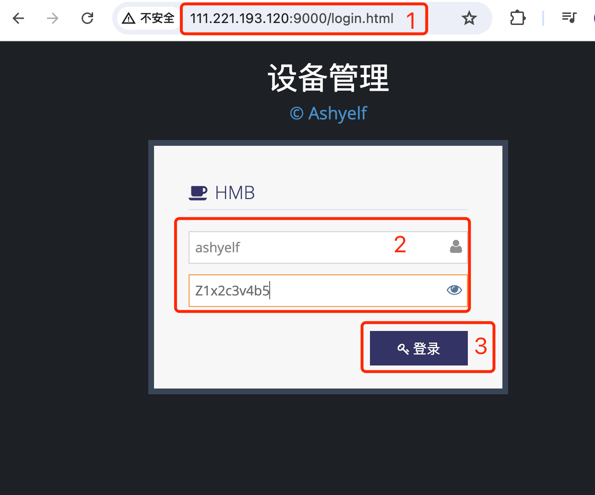
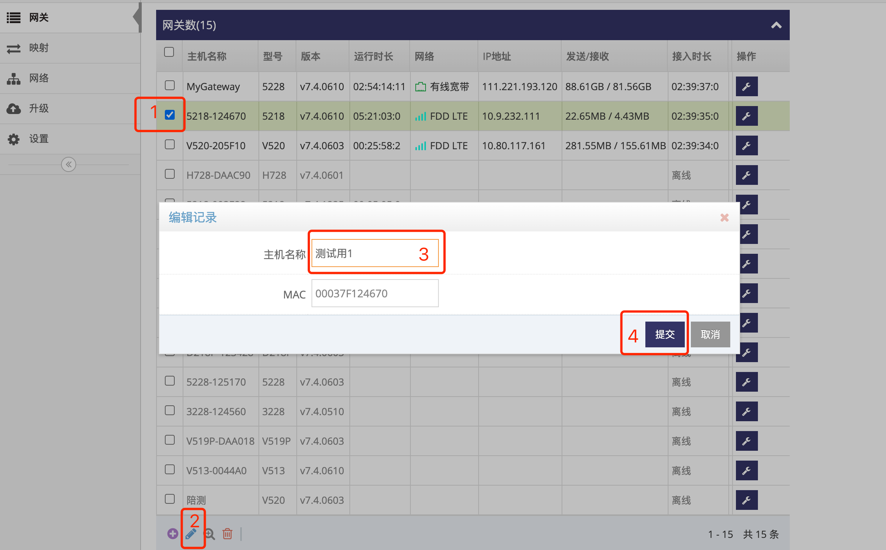

# 修改管理云平台上网关的名称

###  1. 登录网关管理平台的用户帐号网页界面   

使用IE访问 **网关管理平台**(Ubuntu) 地址的9000端口即可打开对应的登录界面   
   
- 输入刚添加的帐号: ashyelf, 及对应的密码, 点击 **红框4** 即可登录 **用户帐号网页界面**   

### 2. 选择网关并修改对应的主机名称

- 在 **网关列表界面** 如 **红框1** 先选要修改的网关
- 然后点击 **红框2** 编辑
- 弹出对话框后修改 **红框3** 主机名称  
- 点击 **红框4** 提交即可   
   
 
**注意: 修改的此主机名称仅存在于云平台上**

