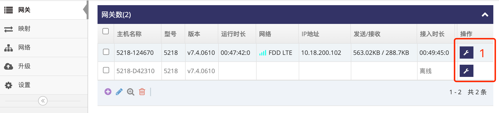

# 重启网关

###  1. 登录网关管理平台的用户帐号网页界面   

使用IE访问 **网关管理平台**(Ubuntu) 地址的9000端口即可打开对应的登录界面   
   
- 输入刚添加的帐号: ashyelf, 及对应的密码, 点击 **红框4** 即可登录 **用户帐号网页界面**   

### 2. 进入指定网关总览界面

- 在 **网关列表界面** 点击 **红框1** 的 网关列表中对应的 **网关** 后的 **小扳手** 进入指定的 **网关总览界面**   
   
 
### 3. 重启网关   

- 点击 **网关总览界面** 中的 **红框1** **系统重启** 后会网关即会重启   
   
- 重启期间无法操作网关   

