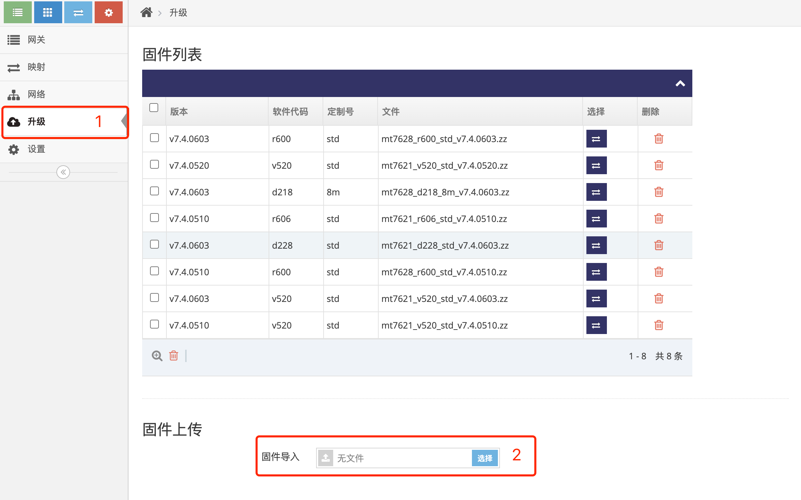
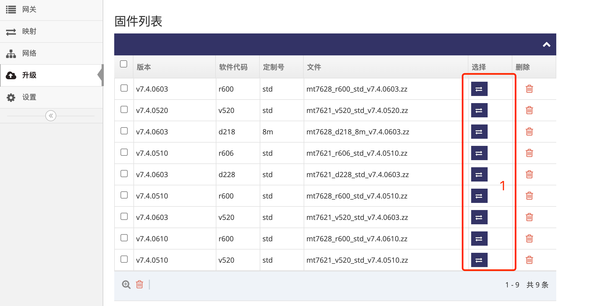
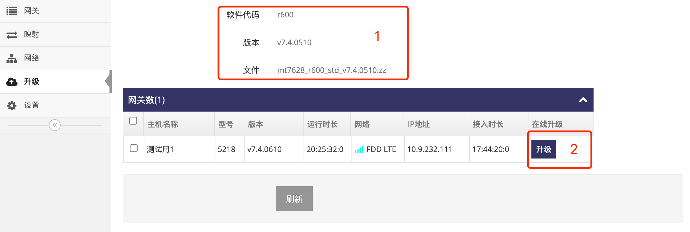

# 上传固件升级网关  

### 1. 登录网关管理平台的用户帐号网页界面   

使用IE访问 **网关管理平台**(Ubuntu) 地址的9000端口即可打开对应的登录界面   
   
- 输入用户帐号, 示列为: ashyelf, 及对应的密码, 点击 **红框4** 即可登录 **用户帐号网页界面**   

### 2. 进入升级界面  

- 点击 **红框1** 的 **升级** 即可显示此用户帐号下所有固件   
   
- 点击 **红框2** 的选择可以上传新固件

### 3. 进入指定固件的升级界面  

- 点击 **红框1** 要升级的固件中对应行所在的按键进入固件升级界面     
   

### 4. 升级网关   
此界面会列出所有能升级的网关   
- 点击 **红框2** 要升级的网关对应行所在的 **升级** 按键即可升级  
   
- **红框1** 显示当前固件的一些信息   
- 只有固件对应型号的网关且固件版本与当前固件不一致才会显示在列表内   
- 网关升级后会自动重启  
