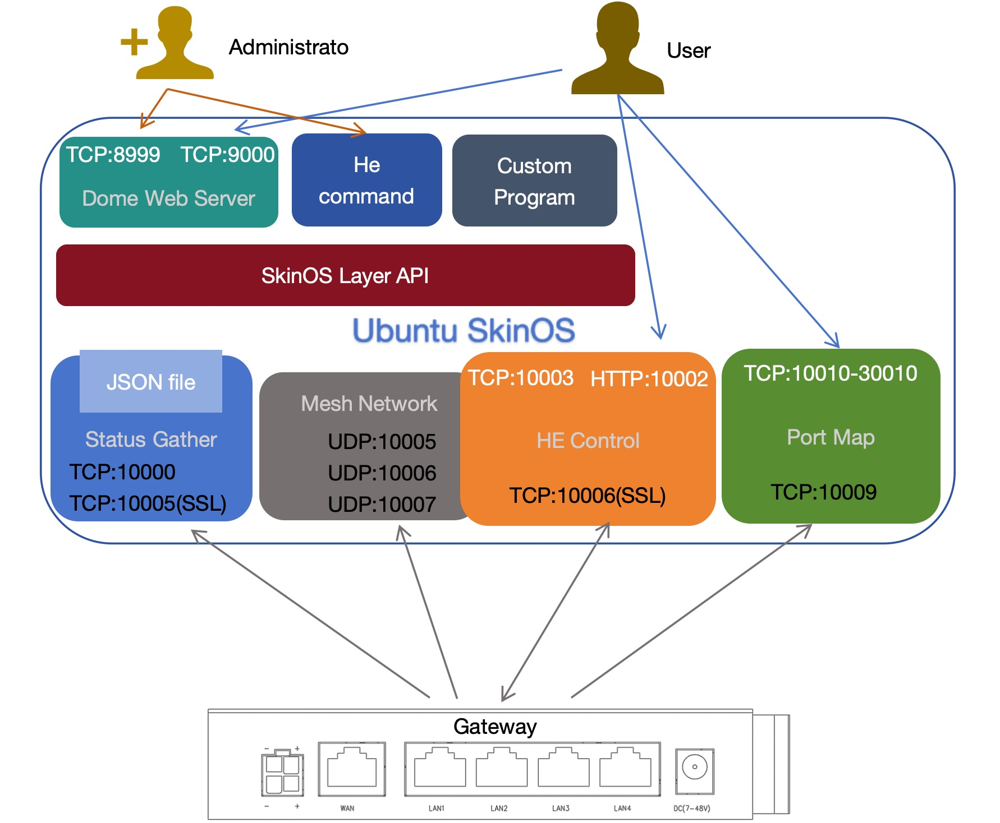

# SkinOS SDK下载与编译   

### 开发环境下载   
在Ubuntu下（ 建议使用20.04或22.04 ）执行以下命令下载开发环境( 请先安装git及make )   
```shell
git clone https://gitee.com/tiger7/tiger7.git
```   
*或者从github上下载*  
```shell
git clone https://github.com/skinos7/tiger7.git
```   

### 进入SDK目录   
```shell
cd tiger7
```  

### 切换SDK为云管理   
```shell
make pid gBOARDID=host-x86-ubuntu
```   

### 安装开发工具   
```shell
make preset
```  
*此指令会协助安装一些常用的开发工具, 也就是执行以下执行来安装开发要用的工具, 如出现安装异常请跟据Ubuntu当前的环境手动安装*   
```
sudo apt-get update
sudo apt-get install vim git subversion pandoc aptitude
sudo apt-get install gcc g++ binutils patch bzip2 flex bison make autoconf gettext texinfo unzip sharutils gawk
sudo apt-get install python2 libtool shtool curl lrzsz zlib1g-dev automake automake1.11
sudo apt-get install lib32z1 libssl-dev device-tree-compiler libevent-dev
sudo snap install ttyd --classic
sudo apt-get install lib32ncurses5
sudo apt-get install libncurses5-dev
sudo apt-get install libncursesw5-dev
```   

### 下载云管理对应的代码及库文件
```shell
make update
```   

### 编译
```shell
make dep
make
```   


# 云管理安装与运行   

### 安装云管理   
```shell
make sdk_install
```   
*此命令完成的工作是将 **./build/rootfs/usr/** 下的文件拷贝到系统的 **/usr** 下, 如果执行失败或对Ubuntu系统熟悉也可自行拷贝*   

### 运行云管理   
```shell
make sdk_start
```   
*此命令完成的工作是运行/usr/prj/setup.sh, 也可用户自已直接运行此脚本*   

运行后云管理默认会启动两套WEB界面    
- **管理员网页界面**, 用于配置云管理及用户管理  
- **用户网页界面**, 登录后用于管理其帐号下的网关   

### 登录管理员网页界面验证是否运行成功   
使用IE访问Ubuntu地址的8999端口即可打开对应的登录界面  
   
如能打开此界面表示 **云管理** 安装成功   
默认用户名: admin, 默认密码: admin, 点击 **红框3** 即可登录 **管理员网页界面**   

### 停止云管理   
```shell
make sdk_stop
```   
*此命令完成的工作是运行/usr/prj/shut.sh, 也可用户自已直接运行此脚本*   


# 云管理的结构及需要用到的端口   
   
云管理是一个综合管理平台, 包含了很多个部件, 每个部件完成不同的功能    
 - **Status Gather** 实现对网关状态及配置的收集及管理, 需要用到 **TCP端口10000**, **TCP端口10005**   
 - **He Control** 通过HE指令实现对网关实时管理, 用到 **TCP端口10001**, **TCP端口10006**, 并通过 **HTTP:10002** 对外实现了一个HTTP的服务器用于接收POST交互HE指令   
 - **Mesh Network** 实现自组网功能, 用到 **UDP端口10005**, **UDP端口10006** 及 **UDP端口10007**   
 - **Port Map** 实现内网穿透, 使用 **TCP端口10009** 让网关连接, 并会静态或动态的将穿透后的端口映射在 **TCP端口10010-30010** 之间  
 - **Dome Web Server** 将 **TCP端口8999** 用于管理员网页界面, 管理云管理上的用户帐号及功能的Dome实现   
 - **Dome Web Server** 将 **TCP端口9000** 用于用户帐号网页界面, 管理其帐号下的网关的Dome实现   
 - **Dome Web Server** 将 **TCP端口9001-9999** 用于随机分配给ttyd使用, 方便用户通过网页直接打开Telnet或SSH   

**在Ubuntu上安装完成后防火墙上需要打开以上提到的端口, 否则云管理对应的功能无法使用**


