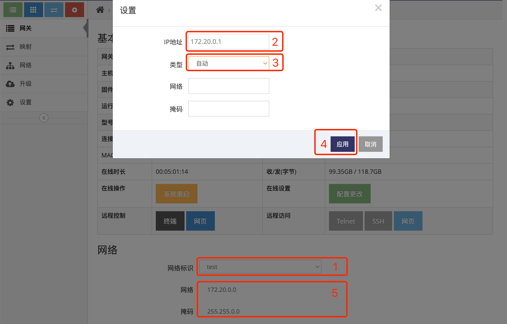

# 为自组网添加主干网关  

主干网关必须有公网地址(动态即可), 通过宽带上网的网关通常有公网地址, 有以下两种方式让网关有公网地址:
- 将网关改为有线宽带模式, 让网关直接通过宽带上网获到公网地址   
- 将通过宽带上网的路由器做个端口映射, 将 **UDP的10004** 端口映射到网关即可   

### 1. 登录网关管理平台的用户帐号网页界面   

使用IE访问 **网关管理平台**(Ubuntu) 地址的9000端口即可打开对应的登录界面   
   
- 输入用户帐号, 示列为: ashyelf, 及对应的密码, 点击 **红框4** 即可登录 **用户帐号网页界面**   

### 2. 进入指定网关的总览界面  

- 点击 **红框1** 的 **网关** 即可显示此用户帐号下所有在线或是未在线的网关   
   
- 点击需要添加的网关对应行的 **红框2** **小扳手** 进入指定网关的总览界面  

### 3. 修改网关的网络标识为指定的自组网   

- 在 **红框1** 中点选对应的自组网的 **网络标识**, 点选后会弹出对话框, 并且会在 **红框5** 中显示对应自组网的网段   
- 在 **红框2** 中填写为此网关指定的自组网的IP地址, 此IP地址必须在自组网网段内   
- 在 **红框3** 中填写为此网关下的本地网络的网络地址, **如果不需要网关下的本地网络间通信请不要填写**      
- 点击 **红框4** 的 **应用** 即可   
   
- 注意 **红框6** 的 **类型** 用于多外主干时的选择, **不要随意改动**, 否则将导致无法组网, 对于无法做主干的网关如果改动了些类型有可能导致被运营商拉黑一段时间      

