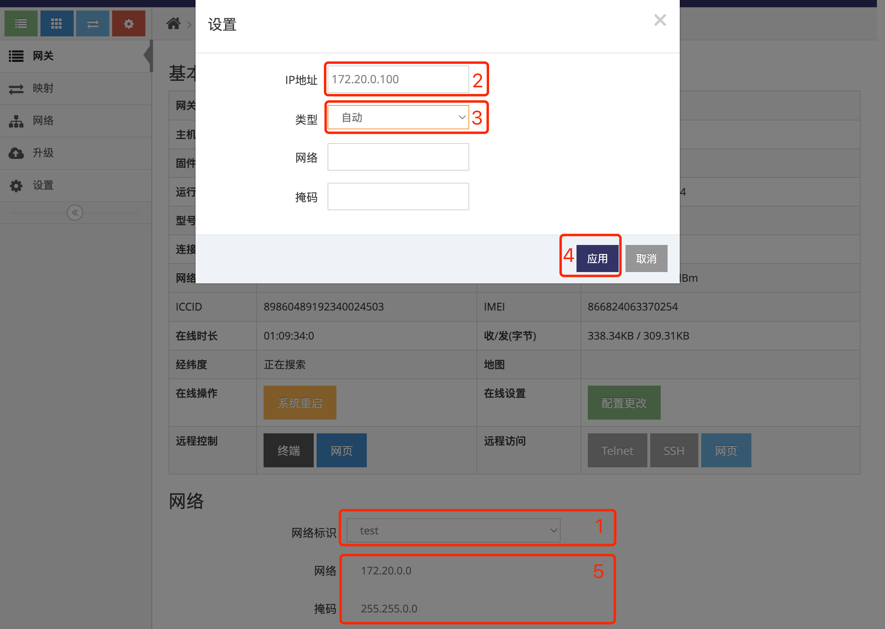
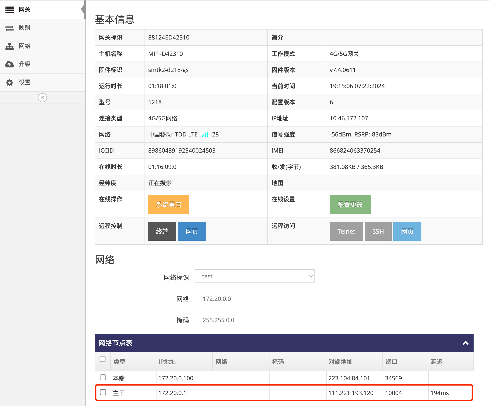
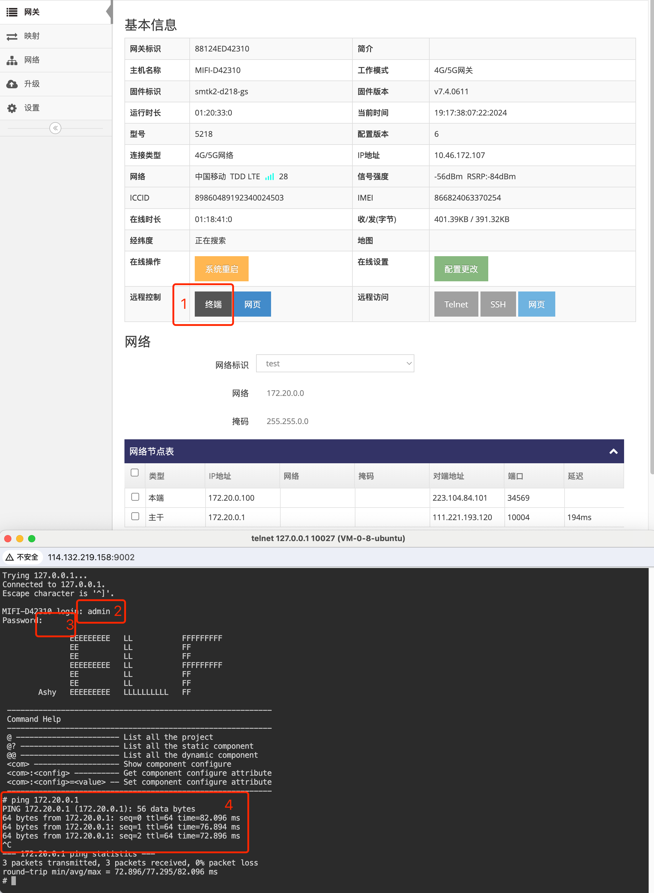

# 将网关添加到指定的自组网  

### 1. 登录网关管理平台的用户帐号网页界面   

使用IE访问 **网关管理平台**(Ubuntu) 地址的9000端口即可打开对应的登录界面   
   
- 输入用户帐号, 示列为: ashyelf, 及对应的密码, 点击 **红框4** 即可登录 **用户帐号网页界面**   

### 2. 进入指定网关的总览界面  

- 点击 **红框1** 的 **网关** 即可显示此用户帐号下所有在线或是未在线的网关   
   
- 点击需要添加的网关对应行的 **红框2** **小扳手** 进入对应的 **网关总览界面**  

### 3. 修改网关的网络标识为指定的自组网   

- 在 **红框1** 中点选对应的自组网的 **网络标识**, 点选后会弹出对话框, 并且会在 **红框5** 中显示对应自组网的网段   
- 在 **红框2** 中填写为此网关指定的自组网的IP地址, 此IP地址必须在自组网网段内   
- 在 **红框3** 中填写为此网关下的本地网络的网络地址, **如果不需要网关下的本地网络间通信请不要填写**      
- 点击 **红框4** 的 **应用** 即可   
   

- 网关成功加入自组网后会在 **网络节点表** 中显示与自组网中所有 **主干** 的延迟   

   

### 4. 进入网关终端界面验证与自组网中其它网关是否可通信   

- 点击 **网关总览界面** 中的 **红框1** **终端** 弹出对应的 **网关终端界面**   

   

- **红框2** 输入终端登陆用户回, 默认为admin  
- **红框3** 输入终端登陆密码回车, 默认为admin, 弹出AshyELF的提示则表示成功登录到网关的终端界面      
- **红框4** 输入ping 172.20.0.1回车即可看到可ping通其它网关(主干)   
- 按CTRL+c可中断ping   

   

