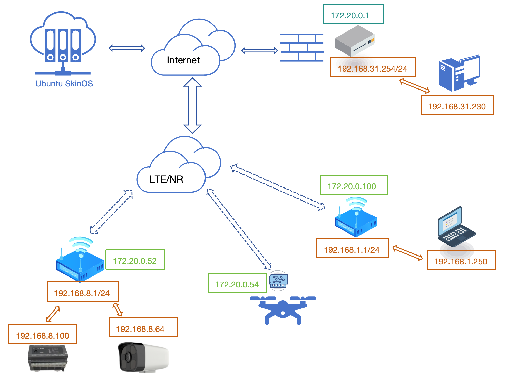
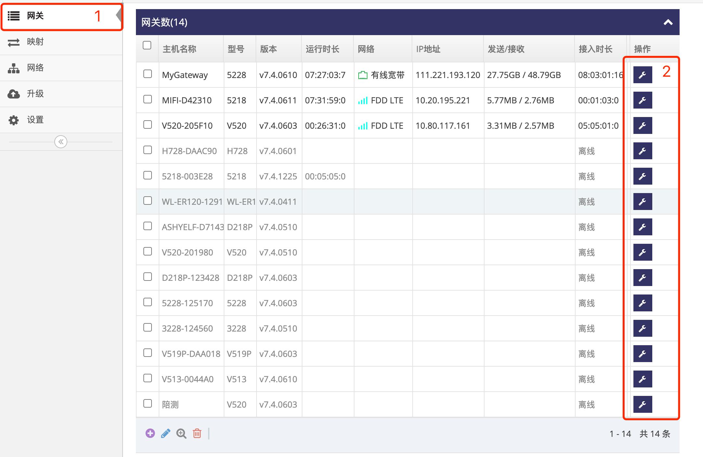

# 为自组网添加主干网关  
主干网关必须有 **动态或静态公网IP地址** , 通过宽带上网的网关通常有公网地址, 以下两种方式让网关有公网地址:
- 将网关改为有线宽带模式, 让网关直接通过宽带上网获到公网地址   
- 将通过宽带上网的路由器做端口映射, 将 **UDP的10004** 端口映射到网关即可   

   
- 基于以上图示, 以下示例添加一台有公网IP地址的网关到自组网当 **主支**, 分配自组网的IP地址为 **172.20.0.1**, 并且其下的局域网为 **192.168.31.0/24**      

### 1. 登录网关管理平台的用户帐号网页界面   
使用IE访问 **网关管理平台**(Ubuntu) 地址的9000端口即可打开对应的登录界面   
   
- 输入用户帐号, 示列为: ashyelf, 及对应的密码, 点击 **红框4** 即可登录 **用户帐号网页界面**   

### 2. 进入有公网地址网关的总览界面  
- 点击 **红框1** 的 **网关** 即可显示此用户帐号下所有在线或是未在线的网关   
   
- 点击需要添加的网关对应行的 **红框2** **小扳手** 进入指定网关的总览界面  

### 3. 修改网关的网络标识为指定的自组网   
- 在 **红框1** 中点选对应的自组网的 **网络标识**, 点选后会弹出对话框, 并且会在 **红框5** 中显示对应自组网的网段   
- 在 **红框2** 中填写为此网关指定的自组网的IP地址, 此IP地址必须在自组网网段内, 基于以上图示填写 **172.20.0.1**   
- 在 **红框3** 中填写为此网关下的本地网络的网络地址, 基于以上图示填写 **192.168.31.0/255.255.255.0**   
- 点击 **红框4** 的 **应用** 完成了一台主支网关的添加   
   
- 注意 **红框6** 的 **类型** 其它选项用于多外主干时的选择, **不要随意改动**, 否则将导致无法组网, 对于无法做主干的网关如果改动了些类型有可能导致被运营商拉黑      

### 4. 自组网总览界面查看主支网关是否接入  
- 等待大至5到10秒后点击 **红框1** **网络** 进入 **网络管理界面**,  **网络管理界面** 会列出所有的自组网列表   
    
- **红框4** 显示 **test** 自组网有一台 **主干**   
- 点击 **红框5** 列中的按键将进入对应 **自组网总览界面**   
- 进入 **自组网总览界面** 后可以看到所有在线跟未在线的网关及自组网的基本信息   
    
- 在网关列表中可以看到 **MyGateway** 的网关的 **NAT类型** 为 **无限**, 即表示此网关以 **主干** 的角色接入 **test** 自组网   

