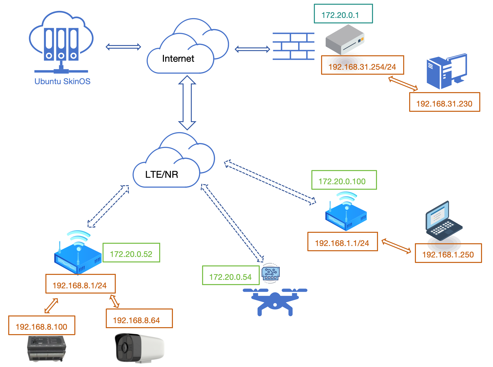
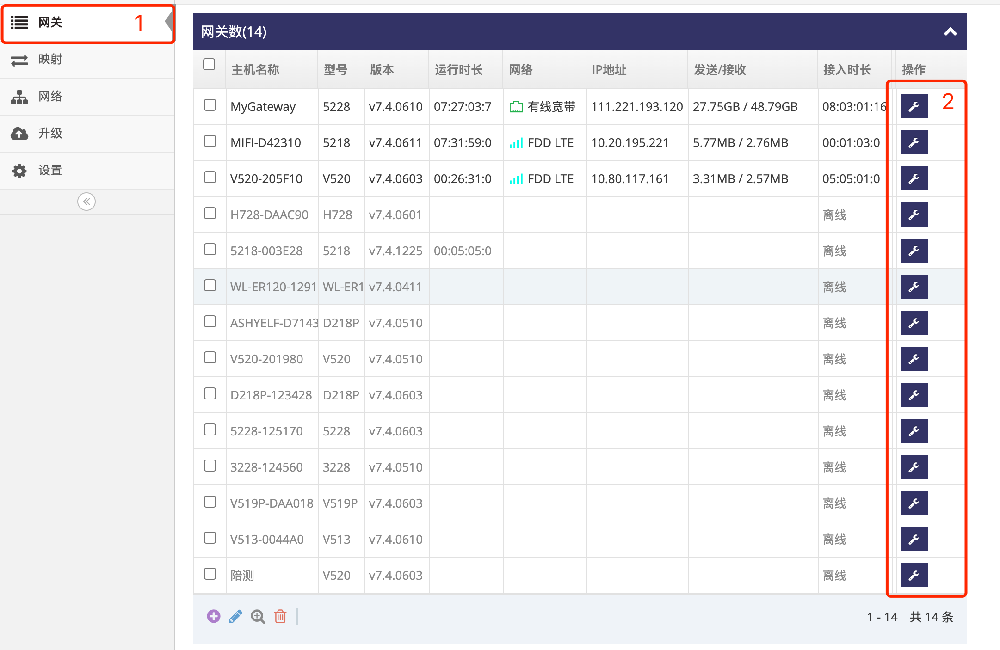
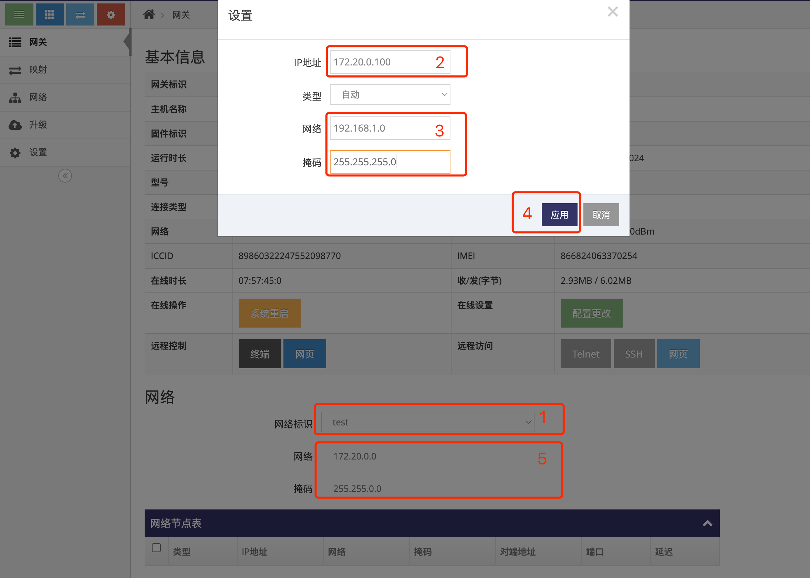
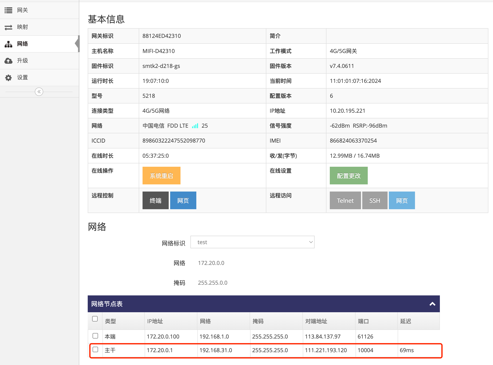
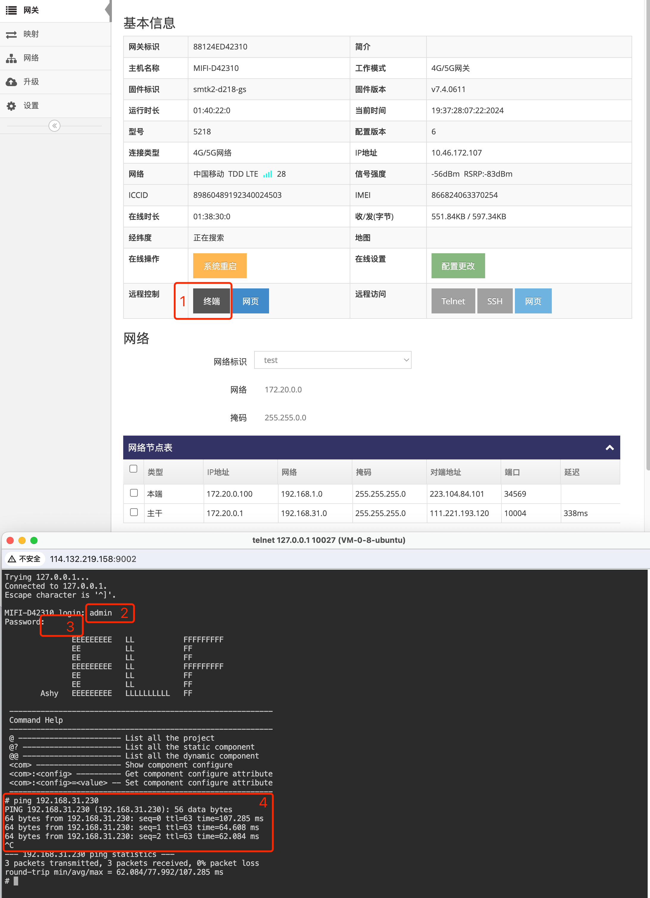

# 将网关添加到指定的自组网  

   
- 基于以上图示, 以下示例添加一台网关到自组网, 为其分配自组网的IP地址为 **172.20.0.1**, 并且其下的局域网为 **192.168.1.0/24**      

### 1. 登录网关管理平台的用户帐号网页界面   
使用IE访问 **网关管理平台**(Ubuntu) 地址的9000端口即可打开对应的登录界面   
   
- 输入用户帐号, 示列为: ashyelf, 及对应的密码, 点击 **红框4** 即可登录 **用户帐号网页界面**   

### 2. 进入指定网关的总览界面  
- 点击 **红框1** 的 **网关** 即可显示此用户帐号下所有在线或是未在线的网关   
   
- 点击需要添加的网关对应行的 **红框2** **小扳手** 进入对应的 **网关总览界面**  

### 3. 修改网关的网络标识为指定的自组网   
- 在 **红框1** 中点选对应的自组网的 **网络标识**, 点选后会弹出对话框, 并且会在 **红框5** 中显示对应自组网的网段   
- 在 **红框2** 中填写为此网关指定的自组网的IP地址, 此IP地址必须在自组网网段内, 基于以上图示填写 **172.20.0.100**   
- 在 **红框3** 中填写为此网关下的本地网络的网络地址, 基于以上图示填写 **192.168.1.0/255.255.255.0**   
- 点击 **红框4** 的 **应用** 即完成了一台网关的添加   
   
- 网关成功加入自组网后会在 **网络节点表** 中显示与自组网中所有 **主干** 的延迟   
   

### 4. 进入网关终端界面验证与自组网中其它网关下的设备是否可通信   
- 点击 **网关总览界面** 中的 **红框1** **终端** 弹出对应的 **网关终端界面**   
   
- **红框2** 输入终端登陆用户回, 默认为admin  
- **红框3** 输入终端登陆密码回车, 默认为admin, 弹出AshyELF的提示则表示成功登录到网关的终端界面      
- **红框4** 输入ping 192.168.31.230回车即可看到可ping通其它网关(主干)下的设备   
- 按CTRL+c可中断ping   

   

