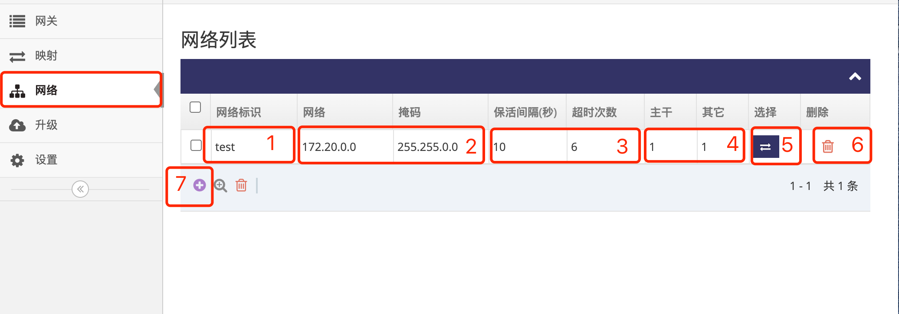

# 自组网状态介绍   

网关管理平台会自动检测接入网关的NAT类型, 区分出以下几种网关   
- **无限** 表示将会使用点对点与其它网关通信, 有公网IP的网关正常会被归类为此, 并在自组网中当作 **主干**  
- **限制** 表示通信端口固定但无法直接通信   
- **动态** 表示通信端口随机分配   

一个自组网中必须要有一个 **主干** 才可正常通信, 有以下三种方式获取 **主干**  
- 联系技术支持租用 **主干网关**   
- 联系运营商获取有公网地址的宽带, 切换网关工作模式为有线宽带通过此宽带上网   
- 在有公网地址的路由器下做个 **UDP:10004** 的端口映射到网关上, 让网关通过此路由器上网   

### 1. 登录网关管理平台的用户帐号网页界面   

使用IE访问 **网关管理平台**(Ubuntu) 地址的9000端口即可打开对应的登录界面   
   
- 输入用户帐号, 示列为: ashyelf, 及对应的密码, 点击 **红框4** 即可登录 **用户帐号网页界面**   

### 2. 进入自组网网络列表  

- 点击 **红框1** **网络** 进入 **网络管理界面**,  **网络管理界面** 会列出所有的自组网列表   
    
- **红框1** 列显示自组网的 **网络标识**   
- **红框2** 列显示自组网的 **网络段**, 各自组网间可以相同  
- **红框3** 列为保活参数, **保活间隔(秒)** 表示各自组网下的网关之间的保活间隔, **超时次数** 为保活失败次数达到此次数则重连   
- **红框4** 列显示自组网有多少个在线的 **主干** 及其它在线的 **网关**   
- 点击 **红框6** 回收桶可删除对应的自组网      
- 点击 **红框7** 的加号可添加自组网    
- 点击 **红框5** 列中的按键将进入对应 **自组网总览界面**   

### 3. 进入自组网总览界面  

- 进入 **自组网总览界面** 后可以看到所有在线跟未在线的网关及自组网的基本信息   
    
- **红框1** 为自组网的 **网络标识**   
- **红框2** 为自组网的 **网络段**   
- **红框3** 为自组网下网关的基本信息   
- **红框4** 为自组网下网关的 **NAT类型**   
- **红框5** 为自组网下网关的组网用的 **地址**   
- **红框6** 为自组网下网关的下 **本地网络** 的地址及掩码, **此本地网络如果填写则所有网关不允许相同**   
- 点击 **红框7** 的小扳手可进入对应的 **网关总览界面**   
- 点击 **红框8** 的加号可通过手动给出MAC地址来将网关添加至自组网   
- 点击 **红框9** 可删除点选的网关   
- 点击 **红框10** 修改网关的组网地址或本地网络地址等   

以上在线的网关间可以相互通信, 但 **网关管理平台** 无法通过自组网地址与网关通信  

